The LED Zeppelin is a custom gesture controlled sunrise alarm clock lamp, where all the electronics are contained within the ellipsoid diffuser, that can be placed on or inside various different kinds of separate stands. It works as a regular lamp by tapping it to turn it on or off and swiping towards either end to adjust its brightness either up or down. The alarm clock functionality works via a mobile app where you can choose an animation including a sound that will start and reach its peak at the times set. The app can also be used to change the color as well as fine tune the brightness.

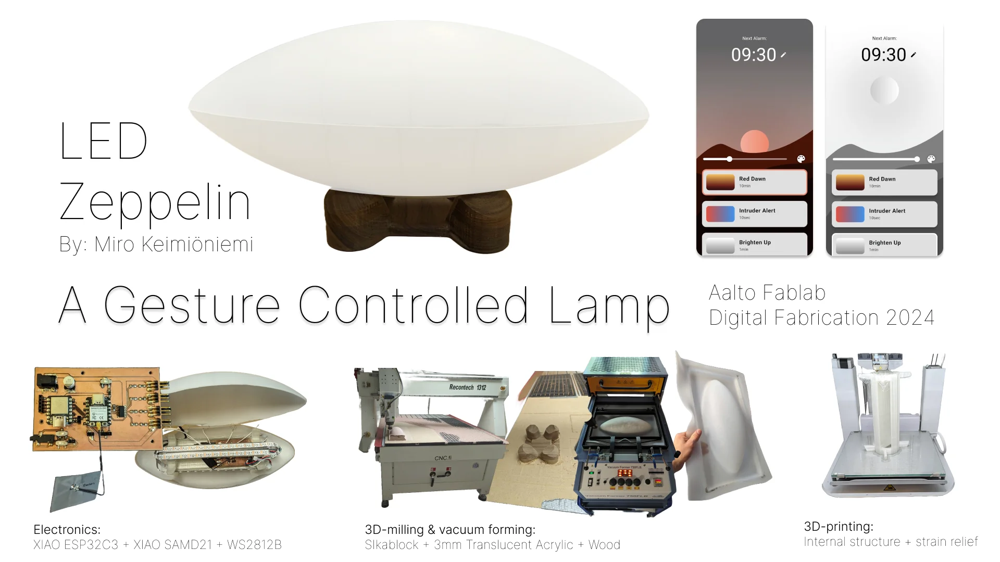

## Demo video



Watch a less compressed version of the demo video on [YouTube](https://www.youtube.com/watch?v=ouhtvRlAQOE). The music on the video is an old unfinished beat of mine, which I threw on it at 2am as I could not be bothered to start searching for royalty-free music at that point. 

## Hero shots

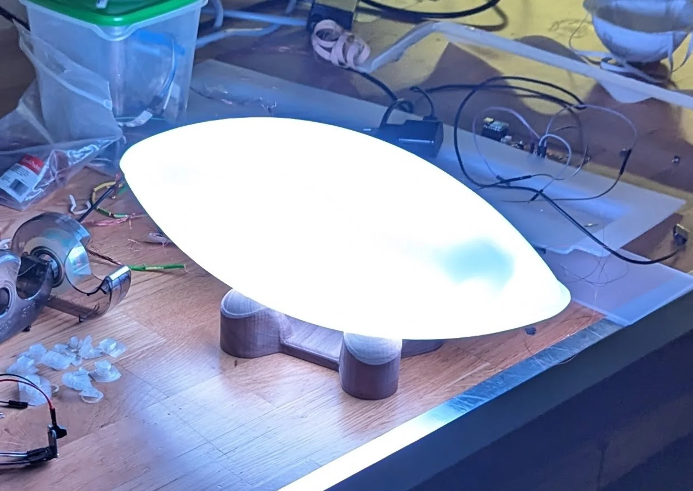
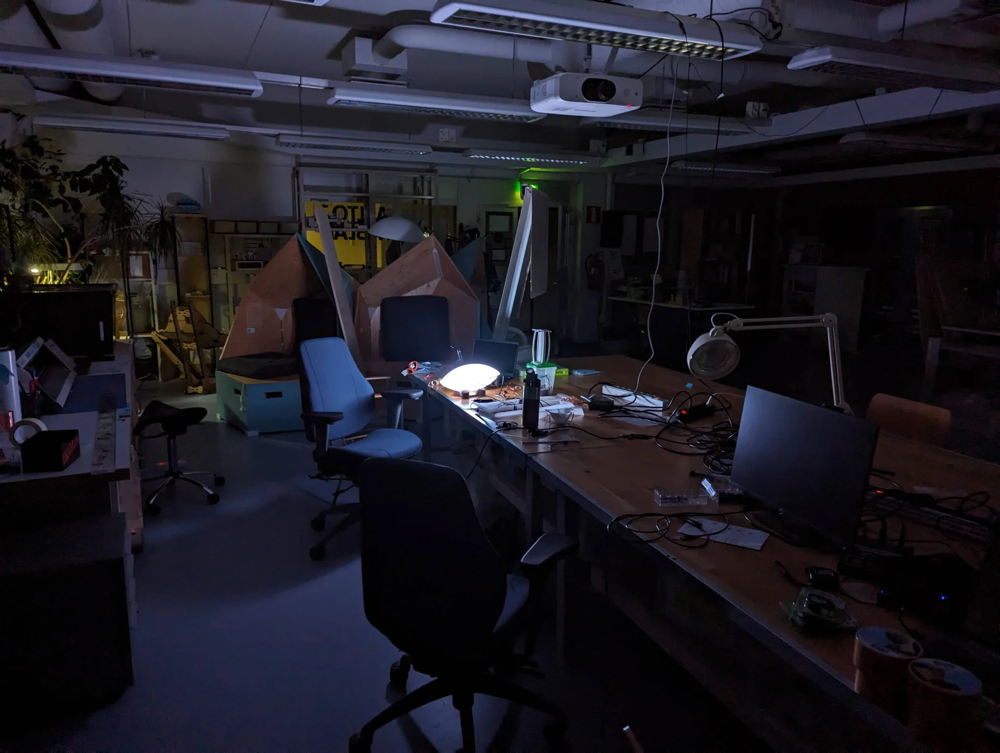

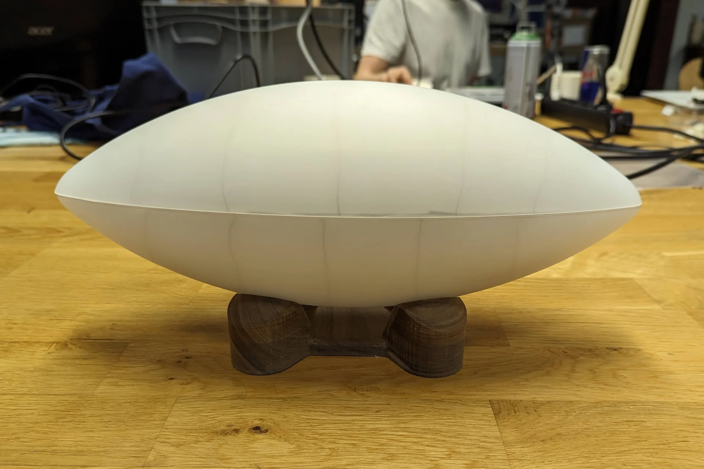
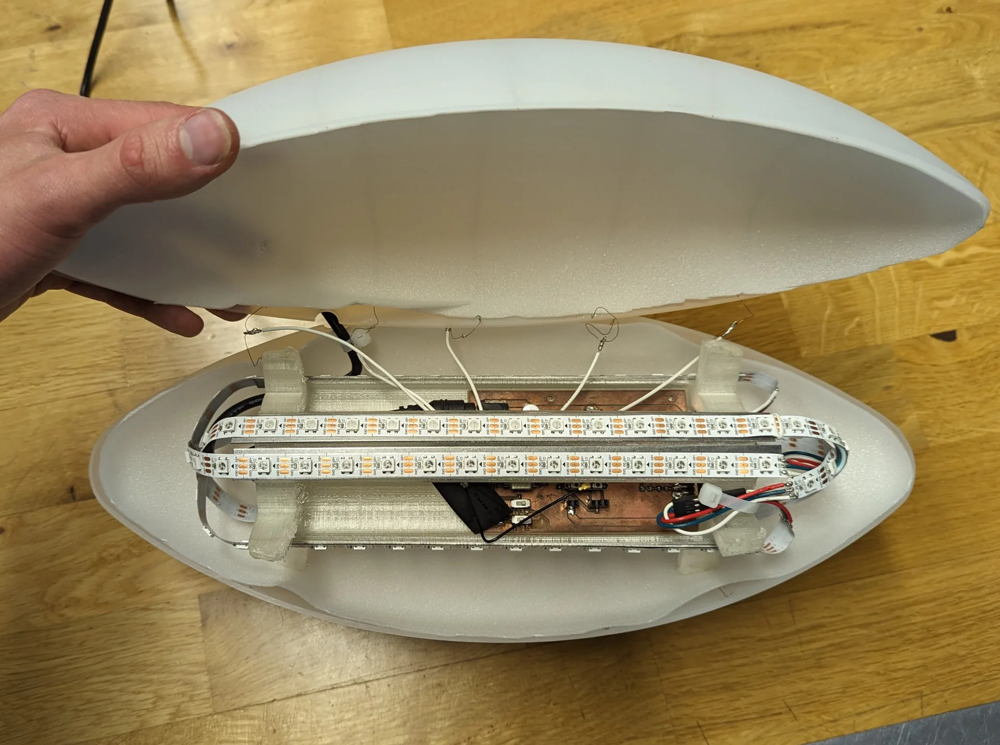

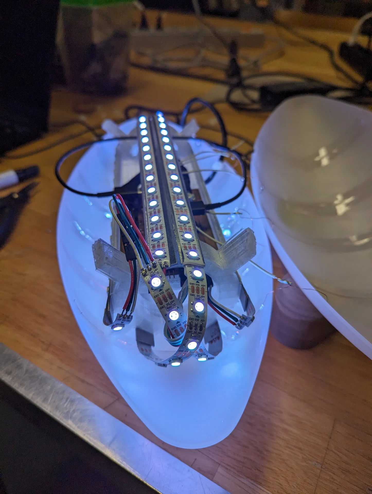
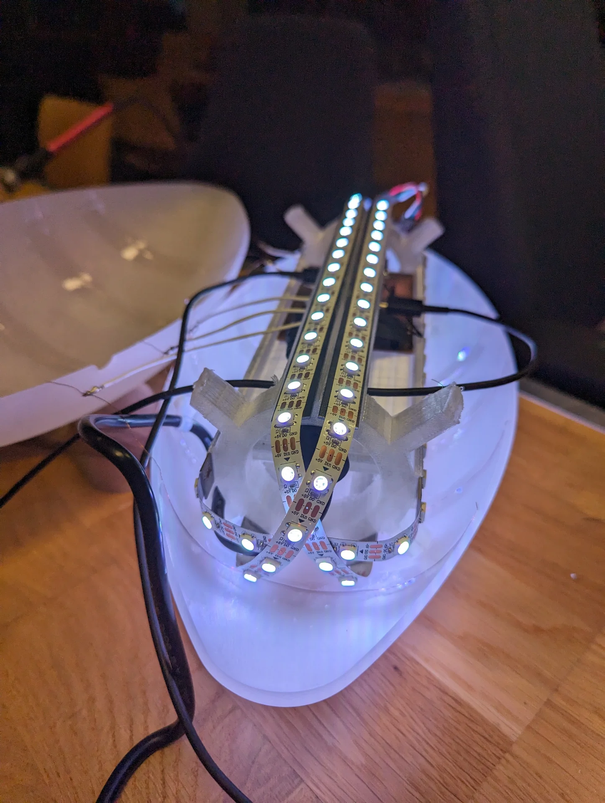

## Specs

### Bill of materials (BOM)

Below is a table of all the materials and components used along with their current price estimates:

| Item / material | Quantity | Price |
|-----------------|----------|-------|
| 3mm translucent acrylic | 1 large sheet | 15.09€ |
| Hard wood | 15 x 12 x 4.5 cm block | 15€ |
| FR2 copper | 1 sheet | 5€ |
| Transparent PLA | 240g | 5€ |
| PEAMD50-10-B2 power supply | 1 | 23.70€ |
| XIAO SAMD21 microcontroller | 1 | 4.99€ |
| XIAO ESP32C3 microcontroller | 1 | 4.61€ |
| TXB0104D level shifter | 1 | 1.26€ |
| PJ-002AH-SMT-TR power jack | 1 | 1.14€ |
| 220µF capacitor | 1 | 0.5€ |
| Slide top switch | 1 | 0.6€ |
| Schottky diode | 1 | 0.5€ |
| Resistor | 10 | 0.9€ |
| Pin socket | 5 pins | 0.5€ |
| Pin header | 12 pins | 0.5€ |
| Total | | 79.29€ |

The above table is only constructed from the items and materials that currently make up the lamp, excluding wires, dupont connectors, zip ties, adhesives and tape as well as the SikaBlock and the glue used for that and other materials and tools similarly used in the manufacturing process. Furthermore, many components were difficult to pin down exactly and thus all prices without two decimal numbers represent rather the orders of magnitudes for that quantity of the given component instead of exact prices.

All of the prices of the electronic components are taken from [DigiKey](https://www.digikey.fi/en) either as the exact prices or averaging over some reasonably similar components, whereas others are from the Fablab pricing or other sources from the internet. I noticed only afterwards that the prices from DigiKey are without VAT, so for regular consumers, 24% must be added to the prices of all electronics, hence bringing the total up to 88.7€. Accounting for wires, dupont connectors and everything else that was failed to be mentioned, it likely just exceeds 90€ and this of course does not include all the experimentation, failed attempts and intermediary material. Creating physical prototypes can get expensive very quickly - for a student anyway if we had to purchase everything ourselves. 

## Plan, progress and timeline

**TODO:**

| Task | Status | Deadline |
|----------|----------|----------|
| 1. Design the lamp and a stand  | [Done]()  | 29.5.2024 |
| 2. Design touch detection circuit  | [Done]()  | 10.4.2024  |
| 3. Program touch detection circuit  | [Done]()  | 27.4.2024  |
| 4. Implement gesture detection  | [Done]()  | 27.4.2024  |
| 5. Design output circuit  | [Done]()  | 11.5.2024  |
| 6. Program light animations  | [Done](https://gitlab.com/miro.keimioniemi/digital-fabrication-portfolio/-/blob/main/content/post/week-12/esp32c3-bluetooth/src/main.cpp?ref_type=heads)  | 6.6.2024  |
| 7. Program ambient sound output  | Omitted  | 21.5.2024  |
| 8. Program inter-board communication  | [Done]()  | 15.5.2024  |
| 9. Design power delivery circuit  | [Done]()  | 19.5.2024  |
| 10. Combine circuits and produce the result  | [Done]()  | 15.5.2024  |
| 11. Design mobile app  | [Done]()  | 8.5.2024  |
| 12. Implement mobile app with Flutter  | [Done]()  | 2.6.2024  |
| 13. Program wireless networking with mobile app  | [Done]()  | 6.6.2024  |
| 14. Design the internals and the ellipsoid lamp cover  | [Done]()  | 29.5.2024  |
| 15. Produce the lamp cover  | [Done]()  | 30.5.2024  |
| 16. Assemble the lamp  | [Done]()  | 4.6.2024  |
| 17. Produce the stand  | [Done]()  | 31.5.2024  |
| (18.) Design and produce an alternative stand  | Optional  | -  |
| (19.) Add long touch and double tap gestures  | Optional  | -  |
| (20.) Give the lamp a personality  | Optional  | -  |
| (21.) Proximity detection using e.g. Bluetooth  | Optional  | -  |
| 22. Make a presentation page and video  | [Done]()  | 7.6.2024  |

**Notes:**

<ol>
  <li value="5">Output circuit must be redesigned using level shifters in order to use 5V power for NeoPixels with 3.3V logic. 3.5mm audio socket pins must also be routed correctly. NeoPixels and level shifters are both already procured and available at the FabLab. </li>
   
  <li value="6">Light animations can be programmed among the last tasks when the lamp is already assembled so that they look as intended.</li>
   
  <li value="9">Likely need to purchase a 5V power source capable of 9A as I could not find one at the lab. ESP32C3 can be powere on from its 5V pin with a diode but SAMD21 must be considered separately.</li>
   
  <li value="15">3/4D mill a sikablock to produce half an ellipsoid diffuser by vacuum forming 3mm translucent (or white) acrylic already available at the lab. 
  
  Using Roland Modela MDX-40 might require a more elaborate design, where the piece to be vacuum formed might have to be produced in several layers. It, however, might not have sufficient length dimension either so 3D-axis milling with the larger CNC might be the best idea. It is a good idea to account for the fillet at the base of the mold by making it a bit higher than what the vacuum formed product should be. Remember to measure the height possible for a 3D-milled ellipsoid.
  </li>
   
  <li value="14">Design a separate 3D-printable framework that safely suspends the circuit in the middle of the lamp from supports whose lengths correspond to the exact radius of the ellipsoid at the given positions. The circuit board can be fastened to it with screws and it can be fastened to the lamp cover with some kind of adhesive. With good design and little transportation, it might not have to be fastened at all. It is also obviously highly important to leave a hole for the power cable.</li>
   
  <li value="16">Flexible copper strips soldered to jumper cables can be attached to the underside of the diffuser from their adhesive sides as seven looped stripes around the long axis. The internal frame can be fastened to one half with a strong adhesive and to the other with a slow one upon closing the ellipsoid. Alternatively, it does not have to be fastened to the other side at all. In this case, I could make the cover openable with some sort of a snapping mechanism, which is likely much harder to make but would make the lamp easily repairable.</li>
   
  <li value="17">3D mill a wood block.</li>
   
  <li value="20">Make it behave like a luminous pet or a spren (from The Stormlight Archive) that turns on dimly when detecting proximity and might occasionally want attention, which it communicates by changing its hue until acknowledged with, for example, a long touch to which it might respond with some different light pattern. It could be made to track, for example, a habit or whether one had a good day. It could also be linked with another similar lamp such that if it is being touched for long, the other lamp lights up the area that is being touched and one can thus, for example, say a personal good night with it. In the long run it could even be made to talk and listen with additional hardware capabilities but those are definitely beyond the current scope.</li>
</ol>

## Ideation

Having to come up with a final project idea as pretty much the first thing without knowing how everything works caught me a bit off guard but it does make sense in the context of the course as it is so intense, fast-paced and packed with both information and assignments. Having a final project thought out in the very beginning helps you orient your approach to each week and know what you most need to focus on. For example, as a result of the below brainstorming and committing to an idea, I knew that I needed to focus especially on LEDs and speakers on the [output week](). It was a long road to arrive at the idea, however, and what follows is a dump of some of the ideas I got, considered and eventually discarded.

The ideation phase is often very long for me as I always want to create something somehow meaningful, whether that is in a local or global context. For this project, it seems to make more sense to go local as that is, according to my understanding, in some sense the very ethos of the fab movement. I had a cool idea for remote chess boards but am a couple of years late, because those have already been producticed and commercialized by, for example, [ChessUp](https://playchessup.com/en-eu) (although I think I could make them nicer looking), which was both cool and a bit of a bummer. Maybe I will make them nicer looking and/or cheaper and compete that way one day.

After discovering this, I lost my appetite for the idea and tried turning to solving some personal problems instead. The only issue is that I currently cannot come up with too many problems I would have - how incredible is it to live in Finland and be in a modestly decent fiscal situation for a student? - so there were no obvious project ideas for this particular scope. I still do have many ideas but many of them were not directly suitable for this course. I kept on wondering about another remotely playable board game but after extensive research, I could not come up with any other the playing experience of which would be significantly improved over just a digital version. I would then have to create a new game myself, which I opened as a background tab in my mind and still keep there. However, here are the results of my further brainstorming within the bounds of the course:

- Luminous remote chess
- Remotely playable board game
- Connected, re-arrangeable statues that mirror each other's shapes. For example, a rigid string that can be folded to a shape, causing the other to take the same shape
- Remote drawing / writing inspired by spanreeds from [The Stormlight Archive](https://www.brandonsanderson.com/the-stormlight-archive-series/)
- 3D printer that scans the item put inside it and then replicates it
- Box that opens only when a task is completed (can be used for locking away one's phone or to keep a reward)
- Physical wave synthesizer that produces sound corresponding to the shape of a string (sine, saw, square etc.)
- Midi controller
- Mood lamp
- Wall clock
- Bright light alarm clock
- Something for a bookcase (physical reading challenge / art?)
- Weasley clock
- Lightsaber laser pointer
- Perpetual motion machine

Most interesting avenues:

- Action at a distance / "Magical items”
    - Remotely playable board game
    - Kinetic statues
    - Weasley clock
    - Spanreed
    - Lightsaber laser pointer
- Productivity boosters
    - Innovative alarm clock
    - Phone / reward locker
    - Year progress bar
    - Task / mortality visualization
- Midi controller / instrument / player

I ended up leaning toward creating some kind of an alarm clock / light that would wake me up to a simulated sunset. Many exist already, but they are kind of expensive and boring looking so the point here would prehaps be either the design or adding some cool feature that they do not have, at least in lower pricing points. With my non-existent drawing skills, I sketched a few ideas on Samsung Notes with my tablet. They look pretty horrendous due to being incredibly quick, not being drawn in an app made for it and being drawn by me, but perhaps they might still be somewhat representative of the general thought process.

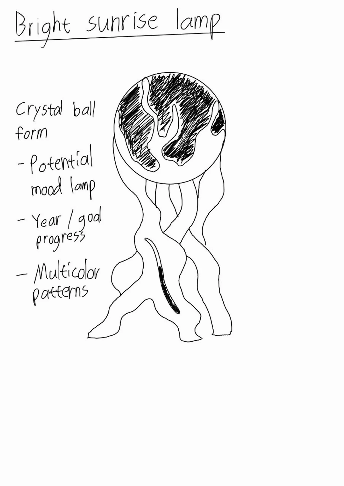
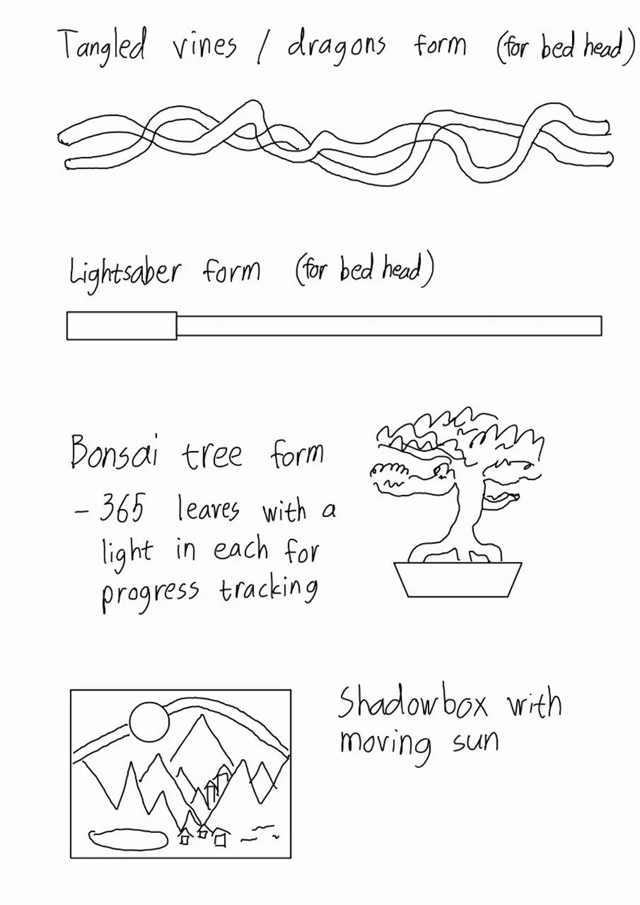
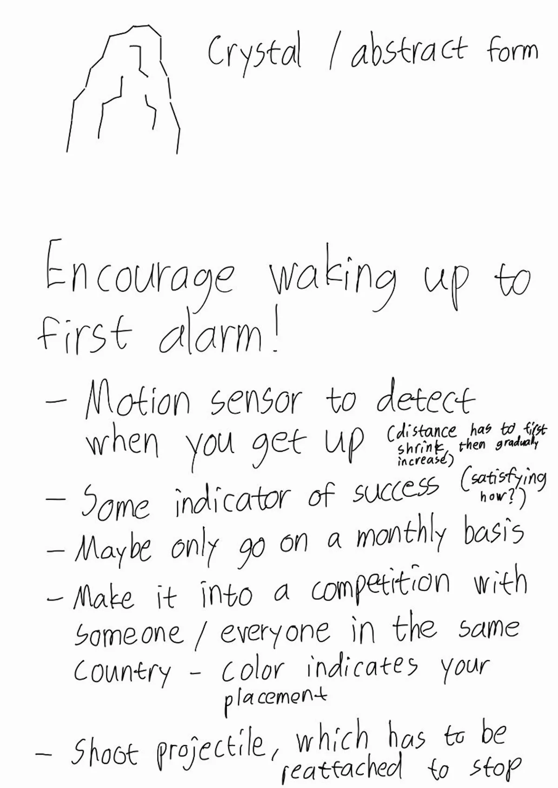
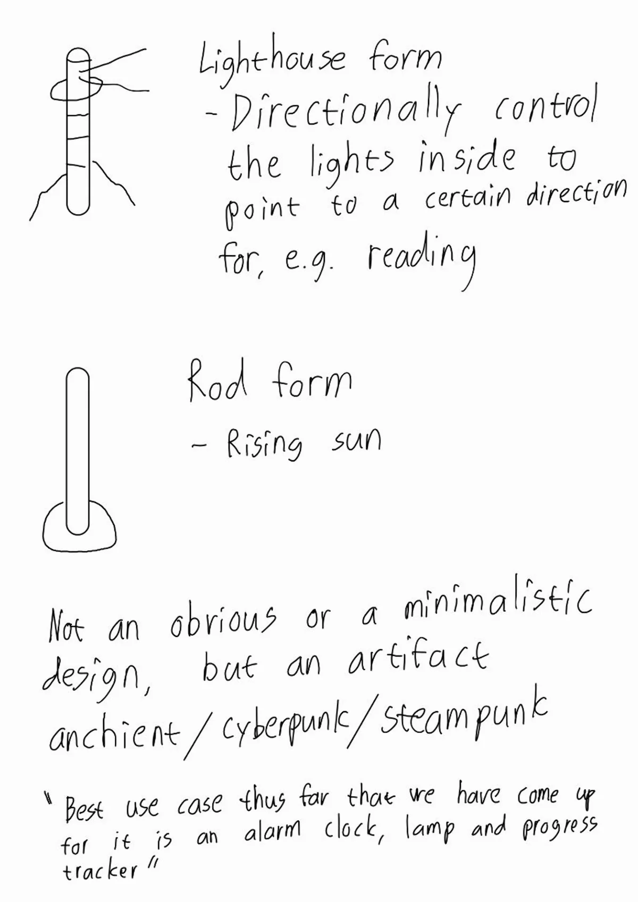

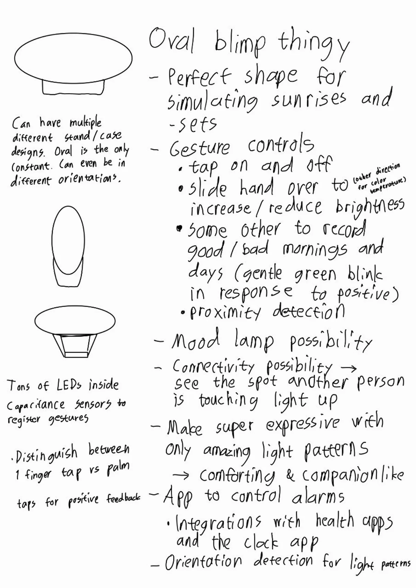

I grew very interested towards the last one "Oval blimp thingy" that I then renamed to "gesture controlled bright alarm lamp", which Rosa suggested should be called the "LED Zeppelin" due to its resemblance to a zeppelin and the resulting pun. It was actually a real shower thought stumbled upon when pondering possible interesting shapes for a sunrise alarm clock. I think I was drawn to it for its elegance, where the oval is the perfect shape for simulating sunrises and sunsets. All electronics would be packed inside of it so that the stands could be changeable and thus a bit more of a design element that can go anywhere from minimalist to elaborate. 





It also provides the perfect range of scaling challenge. Its primary function would be to function as an alarm clock that simulates a sunrise with independently controllable LEDs inside. The alarm would be set in a simple app that communicates with the lamp over Bluetooth to set the times for the alarm (integration with native clock apps is also an interesting potential avenue for exploration). A built-in speaker could also play some noise that increases in volume with the brightness. The secondary functions would be gesture controls, where a whole palm touch would turn it on and off and sliding one's hand over it would increase brightness in one way and reduce it in the other. The tertiary function would be to control the colors from the app in some unified way and make the brightness control dynamic such that lower brightness levels are warmer and higher are cooler.

An interesting addition would also be habit tracking, where, for example, a one fingered tap is a positive note, to which the lamp would react by a brief, gentle green blink and catalogue that in the app, where it could possibly be elaborated upon or just left as a positive mark. The ranking is based on which functionalities I would most need but it might be that 1 and 2 change places too. Achieving all of these would be perfect but there are also further expansion possibilites such as adding more long-distance proximity detection, adding mood lamp and connectivity functionality between other similar lamps, so that if two are connected and one is being touched, that is signaled to the other too. Also orientation detection for optimizing the light patterns based for each stand could be interesting. The possibilities are almost endless and the end product might be something like an expressive companion that would be similar to, for example, Alexa, but with light instead of voice.

## Documentation

I utilized the electronics design week and output devices week for getting acquinted with the [XIAO SAMD21](https://wiki.seeedstudio.com/Seeeduino-XIAO/) and [XIAO ESP32C3](https://wiki.seeedstudio.com/XIAO_ESP32C3_Getting_Started/) boards that I could use for gesture input and wireless communication respectively, although the latter capabilities I have not yet further explored. Below are the two boards I designed and used for testing the input and output capabilities during the electronics design, input and output weeks:

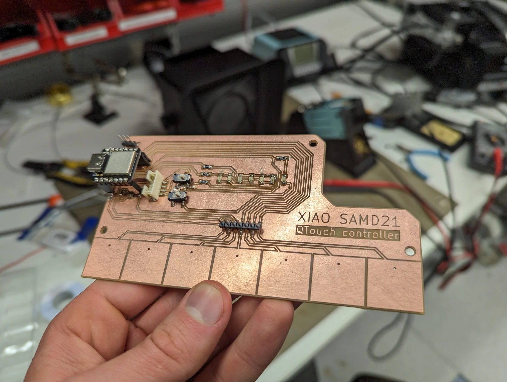

The XIAO SAMD21 QTouch controller board was designed and manufactured during the [electronics design week](), documentation for which can be found [here](). It was then programmed to sense changes in capacitance, i.e. touch, through various materials of varying thickness during the [input devices week](), documentation for which can be found [here](). It can reliably detect touch through over 4mm of transparent acrylic while still (barely) resolving the capacitance changes through 11mm of paper, i.e. 200 pages of a text book. It was also programmed to distinguish between tap and slide/swipe gestures, which control two state variables `power_on` and `brightness_level` respectively, such that the charlieplexed LED corresponding to the pad last touched during the swipe is on if the power is on. Tapping turns the LEDs corresponding to the latest state either on or off depending on its current state.

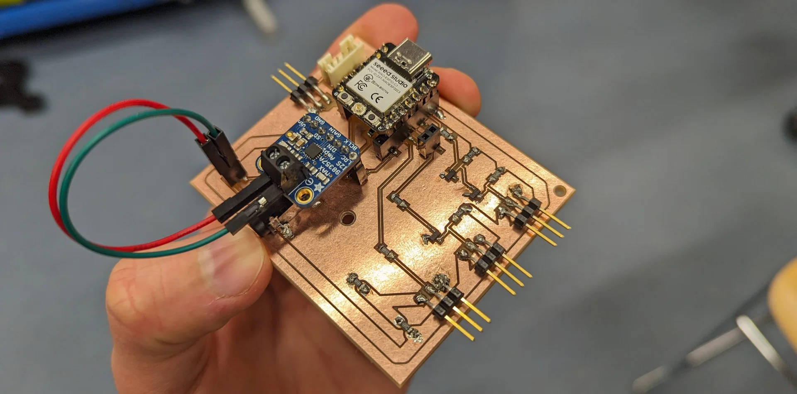

For the [XIAO ESP32C3-powered output board]() above, whose documentation can be found [here](), I tested four different ways of controlling WS2812B strips but only two of them lit up the LEDs in the first place. Furthermore, none of them displayed the right colors, likely because the strip was not what I thought it was. This issue was indeed solved for the final board by using a newly ordered LED strip with the exact same code.

The output board was really a major failure on its own. I could not make it work with 5V power input directly nor by using MOSFETs to try to step up the logic voltage and we had no level shifters in the lab. The only experiments that did power on the LEDs were directly through 3.3V and by using a voltage divider to reduce the voltage from 5V to around 4.5V so that it was well within the spec but could also be reliably controlled with 3.3V logic. However, this would likely not have endured higher currents necessary for running over a hundred NeoPixels at near full brightness. The board also has audio output but it was miswired such that the 3.5mm jack ground connection and right channel were the wrong way around. However, many important lessons were learned and incorporated to the final board design, which then worked mostly as expected. 

### Circuit board

#### Design

The final circuit board is a sort of combination but perhaps even more so a spiritual successor to the [input](()) and [output]() boards. It became a roughly 96mm x 64mm board with power delivery, inter-board communication, audio output and four outputs for NeoPixel led strips all on a single board with sockets for the microcontrollers and amplifier for repairability. It can be powered on with any 5V 5.5mm plug and supports up to 9 amps of total current for the LED strips. It also features a switch between the power circuit to the microcontrollers so that they can be powered on with the same power input when the project is ready but could also be programmed independently without having to worry about accidentally frying one's computer. Below are its schematic and PCB layout.

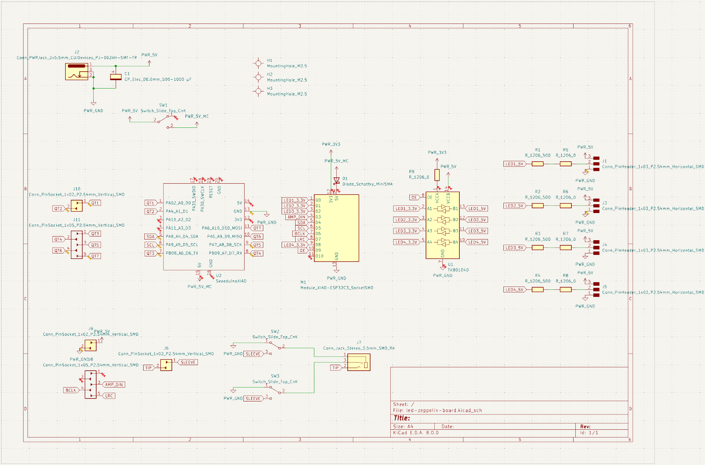
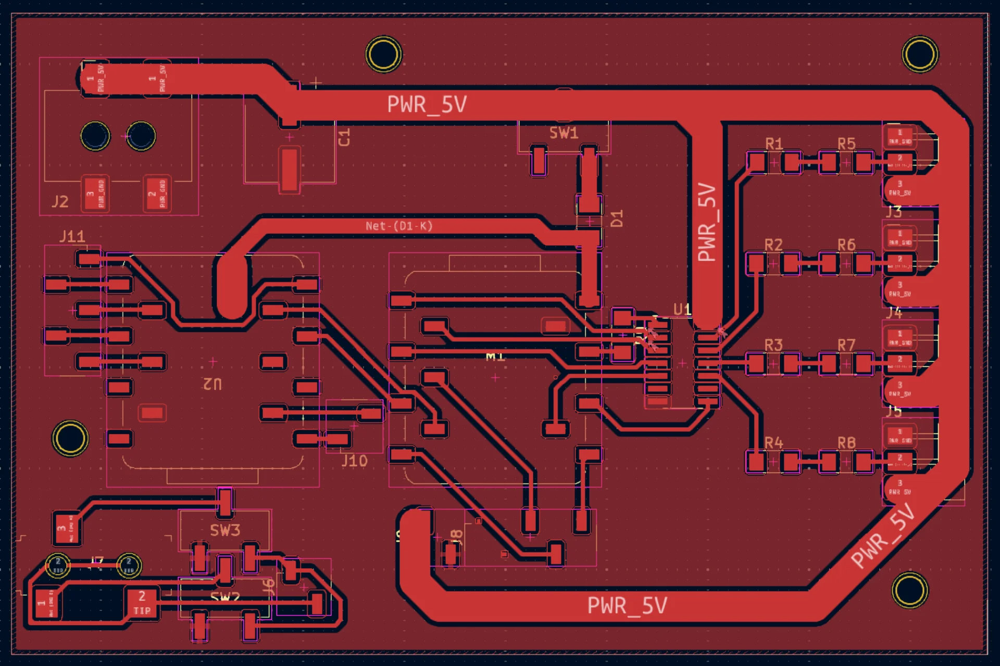

The schematic is roughly divided into four functions. Power delivery in the top left corner, gesture detection in the middle left side, light output in the middle right side and audio output on the bottom, which is identical to the [output board](), except for the two switches that can be used to switch which of the 3.5mm audio jack pin is ground and which is the other audio channel. The reason for this was that upon further research, it seemed like the original audio output design should have been correct, yet it did not work with my speaker - which I suspected has been miswired as a result. Since it was the only plug-and-play ready speaker I had, I needed to be able to plug it in for testing without losing support for correctly wired speakers.

Most notably, the final board has two XIAO microcontroller boards in similar functions as in the previous boards. The [XIAO SAMD21](https://wiki.seeedstudio.com/Seeeduino-XIAO/), also known as the Seeeduino XIAO, essentially acts as a 7-channel capacitive touch sensor that also implements gesture detection logic thanks to its QTouch pins, while the [XIAO ESP32C3](https://wiki.seeedstudio.com/XIAO_ESP32C3_Getting_Started/) acts as the main brain of the board handling all heavier logic, output and wireless networking due to its superior 400KB SRAM and 4MB onboard Flash memory and WiFi and Bluetooth 5 connectivity. These are then wired so that they share the power input and ground and are connected SDA to SDA and SCL to SCL to enable I2C communication with the XIAO ESP32C3 as the master, reading changes to the lamp's state as a result of the gestures processed by the SAMD21.

The majority of the board real estate is used for driving the NeoPixel LED strips, which has been done by attempting to follow all of the [best practices](https://learn.adafruit.com/adafruit-neopixel-uberguide/best-practices) detailed in the [Adafruit NeoPixel Überguide](https://learn.adafruit.com/adafruit-neopixel-uberguide). These include a 220µF capacitor (highest capacitance in a reasonably sized package available at the lab) connected from the positive terminal to the power supply and the negative terminal connected to ground, a 3mm wide power trace capable of delivering currents [up to 9 amps](https://www.multi-circuit-boards.eu/en/pcb-design-aid/surface/conductor-ampacity.html) to [power on up to 150 fully white NeoPixels at full brightness with 60mA each](https://www.temposlighting.com/guides/power-any-ws2812b-setup), 499 Ohm resistors between each XIAO pin and the first NeoPixel of each strip with the distance between all of these minimized while passing through a [TXB0104DR 4-Bit Bidirectional Voltage-Level Translator](https://www.digikey.fi/en/products/detail/texas-instruments/txb0104dr/1629101) to shift the input voltage level from 3.3V to 5V.

The level shifting had been my most major headache during the [output devices week]() as the NeoPixels powered with 5V could not be controlled with 3.3V logic due to belonging in the [CMOS](https://en.wikipedia.org/wiki/CMOS) logic family. This means that for a bit to be registered as a "1", it must be above 5 * 0.7 = 3.5, which is just above 3.3V. Our lab had no logic level shifters, my attempts at using MOSFETs instead did not work and using a voltage divider would have run the risk of breaking under higher currents, whereas powering on the LEDs with 3.3V would have resulted in running them [out of spec](https://cdn-shop.adafruit.com/datasheets/WS2812B.pdf). In response to my struggles, our instructor and the [Aalto FabLab](https://studios.aalto.fi/fablab/) Master [Krisjanis Rijnieks](https://studios.aalto.fi/people/krisjanis-rijnieks/) ordered some of the [TXB0104DR](https://www.digikey.fi/en/products/detail/texas-instruments/txb0104dr/1629101) level shifters, which immediately solved ALL of my problems. The lesson is: if you do not have any, buy some. It is really that much easier.

Integrating them to the board was also delightfully simple and straightforward. According to its [datasheet](https://www.ti.com/lit/ds/symlink/txb0104.pdf), the smaller voltage between 1.2V and 3.6V should be connected to port A and the larger voltage between 1.65V to 5.5V should be connected to port B. According to my reading, the OE pin controlling the output [impedances](https://en.wikipedia.org/wiki/Electrical_impedance) is optional, whereas ground is obviously mandatory. This leaves eight pins, with four of them on each side corresponding to the "4-Bit" component of the name. The ones on the A side input and output signals with the same voltage as is connected to port A and the ones on the B side do the same but with the higher B voltage. Hence, the 3.3V output of the XIAO is connected to port A along with the XIAO output pins on the same side and the 5V input power trace is connected to port B with the LED input pins on the same side. OE is connected to an otherwise unused XIAO pin and 0 Ohm resistors are used to jump over some traces or alternatively, the shared ground in order to match its thickness more closely with the input power trace.

In my [output board](), there was a thick trace for the power too in order to be able to tolerate high currents but ground was mostly ignored in terms of trying to match them. It was connected but much thinner, which Kris pointed out might cause problems. Hence, this time I paid attention to the thickness of the overall ground layer as well, adding some 0 Ohm resistors to increase its area especially near the LEDs. Additionally, a 220µF capacitor was added between the positive and negative terminals of the power jack to even out potential spikes. 

A switch controls whether or not the microcontrollers are powered from the same source and a Schottky diode after it ensures that current only flows towards the microcontrollers, which also enables the usage of the 5V pin of the XIAO ESP32C3 as a voltage input as explained [here](https://wiki.seeedstudio.com/XIAO_ESP32C3_Getting_Started/). The same capability was not explicitly listed for the XIAO SAMD21 and hence I just drew a large power trace beneath its VIN pin on the bottom, which was utilized in a bit of an unorthodox manner as shown below.

#### Assembly

I tried to mill the board in what had already become routine fashion but was stopped in my tracks by [CopperCAM](https://www.galaad.net/coppercam-eng.html) not importing the gerber files properly. Instead of rectangles with a margin, it interpreted the level shifter footprint (imported from the general [KiCad](https://www.kicad.org/) library instead of the [fab library](https://gitlab.fabcloud.org/pub/libraries/electronics/kicad) used for all other parts) as having connected circular pads, which obviously would not do, even though KiCad's gerber previewer opened them just fine. As CopperCAM is so poorly documented with few issues anywhere on the entire internet, I quit very soon and opted to just ask Kris the next Monday, who pointed out that the footprint had rounded rectangle pads instead of regular rectangles, which caused the issue. Changing them to rectangles solved it.

Otherwise, the milling went mostly well, except for the fact that the 0.8mm drilling tool had not drilled quite uniformly, so that board was more severely stuck to the stock than usual and all holes had not gone entirely through. This might also have something to do by me having accidentally picked the double sided material. It required significantly more force but I managed to carefully loosen it and I poked the holes through with a thin screwdriver, leaving me with a PCB that was not quite as crisp on the bottom but still looked great as any on the top. 

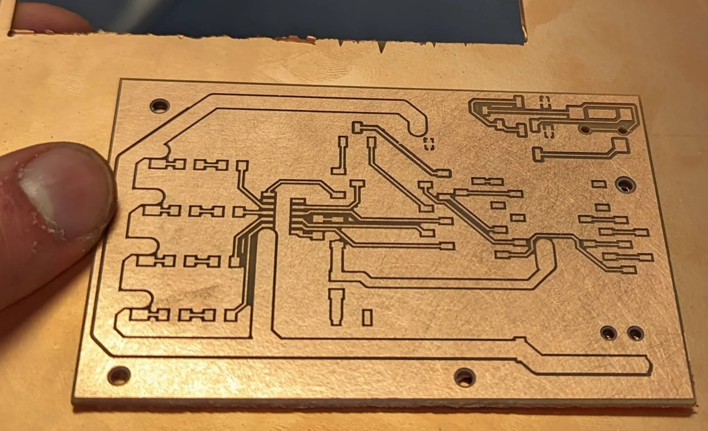

Comparing the above picture to the PCB layout, it can be observed that they do not quite match perfectly. This is because I changed the KiCad PCB layout depicted further above to what I originally intended it to be. In the board that I produced, the power and ground to the amplifier (close to the top in the above image) are the wrong way around, which I only realized much later.

It was also an effort to figure out which way around some of the components go, such as the capacitor, particularly when I could not find the specific capacitor model anywhere on the internet. Instead, I found [this datasheet](https://api.pim.na.industrial.panasonic.com/file_stream/main/fileversion/19806) for Panasonic capacitors, which indicated the dark streak on the wider side of the base to be the negative polarity marking. I then made the risky assumption of the markings being at least semi-standardized and soldered it accordingly, which worked delightfully.

This, however, was the simplest orientation to figure out. The small Schottky diode ensuring one-way power delivery to the microcontrollers had such small, dark markings that it took a long while of angling it below some light to find any asymmetries whatsoever that would indicate its polarity. Eventually, I discovered that one end seemed to have slight line that seemed to be carved. With a quick Google search I found [this page](https://www.pcbonline.com/blog/smd-polarity-led-capacitor-diode-inductor-ic.html) which listed how polarity is indicated in most common surface mounted devices (SMD). For components with two pins, the strip or a coloring seems to usually indicate the negative electrode for polarized capacitors, LEDs and diodes. 

This is not quite as straightforward for SMDs (or SMT - Surface-Mount Technology) with more than two pins. Generally pin 1 is indicated by a dot next to it but the TXB0104DR level shifter had none in sight. Instead, it had a thick line from the left to the right side as well. According to the [datasheet](https://www.ti.com/lit/ds/symlink/txb0104.pdf) it comes in 6 different packages, 3 of which seemed to have the indicator pin but the rest did not. The ones at our lab belonged to the latter category with 7 pins on two sides in a "D or PW Package, 14-Pin SOIC or TSSOP". I was quite clueless about this letter soup and with my (de)soldering skills there would be no second attempt on this board. 

After scrolling the [Texas Instruments package page](https://www.ti.com/packaging/docs/searchtipackages.tsp?packageName=SO) for a while with the help of `CTRL + F`, I found [this document](https://www.ti.com/lit/ml/mpds177g/mpds177g.pdf?ts=1715608756899&ref_url=https%253A%252F%252Fwww.ti.com%252Fpackaging%252Fdocs%252Fsearchtipackages.tsp%253FpackageName%253DSO), which seemed to match my footprint closely enough. A few other [similar ones](https://www.ti.com/lit/ml/mpds033b/mpds033b.pdf?ts=1715608720974&ref_url=https%253A%252F%252Fwww.ti.com%252Fpackaging%252Fdocs%252Fsearchtipackages.tsp%253FpackageName%253DSO) seemed to have the same design rules with the line stretching from the first pin to the last with an ever so slightly more prononunced fillet on the pin 1 side. I decided this was as far as I would likely get, soldered it on and thankfully found it to be working! The second to lowest pins on both sides were entirely disconnected and merely a part of the specific package.

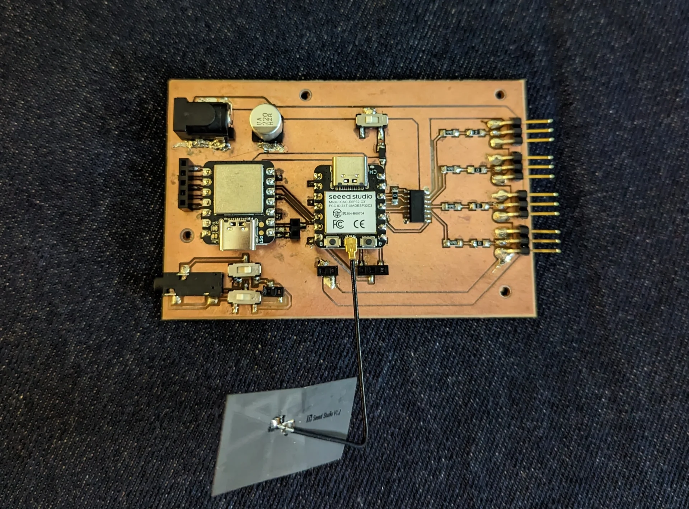

The bit of an unorthodox power delivery mechanism to the XIAO SAMD21 alluded to earlier in the design phase involved a bit of a riskier solder joint that is likely not quite as durable as many others but works just as well, provided it is not stressed too much at least. As can be seen in the below image, I soldered on a single male header to the XIAO's VIN pin perpendicularly to the rest of the board, which connects to a single female header soldered on the wider power trace on the board. This was done by first soldering the male header to the board whilst connected to the female header and then soldering the solitary female header to the board after soldering the corners of the longer headers. The result is perfectly stable and functional although I would avoid excessive stress to it. 

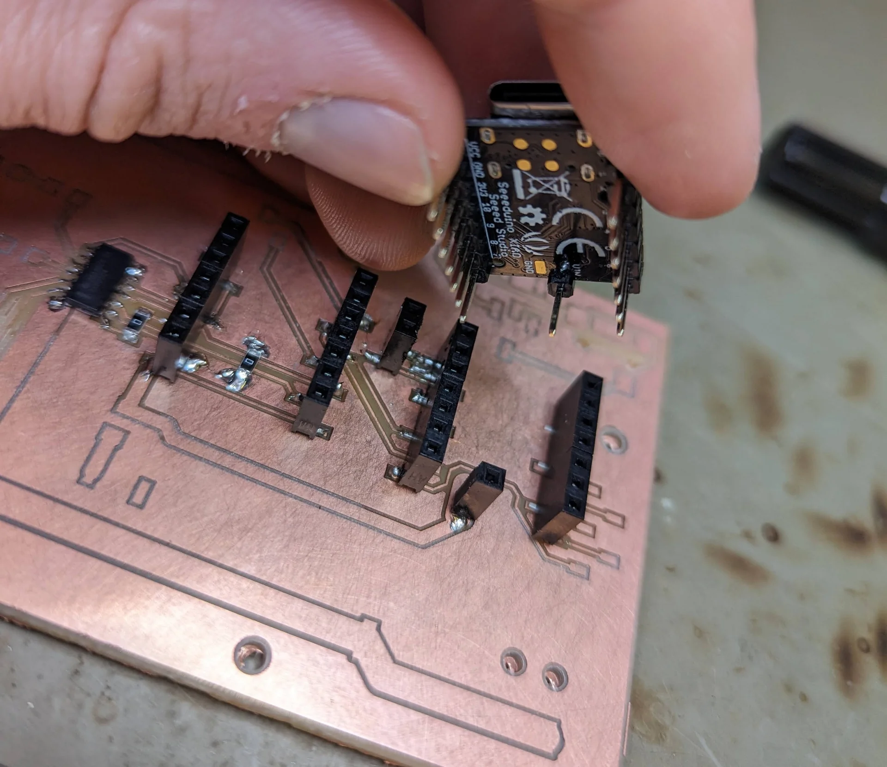

Upon testing it, the LEDs worked perfectly as did the mechanism of powering on the board and microcontrollers from both the same as well as two different sources. However, when trying to mount on the [MAX98357A Adafruit I2S 3W Class D Amplifier Breakout board](https://www.adafruit.com/product/3006), I noticed that I had accidentally connected the power and ground to its socket the wrong way. I did not have one near me when designing and KiCad obviously does not care about the orientation of components as long as they are wired correctly on a pin-to-pin level. 

This was incredibly unfortunate and I went to correct the mistake immediately in the board design, hence the difference between the layout diagram and the actual board. To get quickly around it, at least for testing purposes, I simply connected the amplifier with wires but even then it did not work. After a bit of poking with a multimeter's continuity checker, I noticed that the BCLK pin's solder was touching ground, the removal of which caused faint noise from speaker when plugged in and running the [output week's speaker test code](). The faintness of the sound was likely due to the very weak speaker and not the amplifier. It could also be made slightly louder by increasing the amplitude in the code but this was barely noticeable on the speaker. With wired earbuds, the difference was much more audible. The setup is unfortunately a bit ugly with all the extra wires as can be seen below but these could be made shorter and hidden inside the lamp if necessary.

Kris recommended potentially using Nail polish on the thick power traces to make them safer.

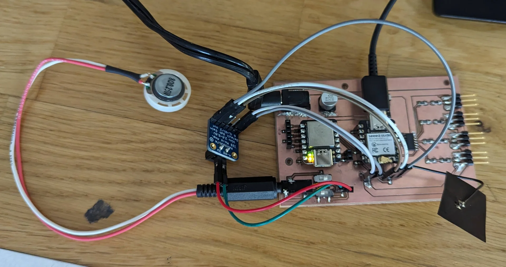

5V 7A power source was acquired. 3D milling toolpaths were produced but the sikablock glue took 5 hours to harden and hence the actual milling had to be postponed. Hoping to do it along with vacuum forming tomorrow at the latest. Space for a [speaker](https://www.digikey.com/en/products/detail/mallory-sonalert-products-inc/PSR-57N08A01-AQ/2071452) was also made in the internals. An example for the audio output: https://fabacademy.org/2020/labs/kochi/students/ranjit-menon/projects/final-project/

A lot of experimentation with diffusion and avoiding shadows was done. The minimum distance between the diffuser and the LEDs should be at least 1.5cm for the light to appear fully uniform. Some shadows seem to be inevitable regardless of the type and thickness of the conductive material but the thin copper strips making up the internals of a power cable glued to the internal side of the cover seem to be the most promising approach currently as they can detect touch through the acrylic while leaving almost no or very little shadow if placed right with respect to the LEDs. I would likely be using multiple of them spaced apart for each QTouch pin to enhance and enlargen the touch detection area but make it as invisible as possible. [Transparent conductive film](https://www.digikey.fi/en/products/filter/films/965?s=N4IgTCBcDaIC4CcCGA7AzgByQgpiuABAMYD2KAJgK5FwCWAbjgQGa0A2AtiALoC%20QA) apparently [exists](https://www.digikey.fi/en/products/detail/tdk-corporation/AG-SHEETSAMPLE-10/9634767) too and might be interesting for further development but perhaps a bit overkill, especially in terms of price for this project. 

The internal design currently has straight rails for the LEDs that do not quite account for all 30 LEDs with their length and I am going to test how it would integrate into the lamp cover but an alternative design might have the LED rails be spirals in order to distribute the light more evenly.

Inside connection is broken

It might be better to properly separate gestures and state but it was faster not to do so

wood block: 0 - 15€ depending on contacts

1. Create a new page for the assignment on your documentation website.
2. Answer the following questions related to your final project.

         What will it do?
         Who's done what beforehand?
         What will you design?
         What materials and components will be used?
         Where will come from?
         How much will they cost?
         What parts and systems will be made?
         What processes will be used?
         What questions need to be answered?
         How will it be evaluated?
3. Make sure that...

      Your project should incorporate 2D and 3D design,
         additive and subtractive fabrication processes,
         electronics design and production,
         embedded microcontroller interfacing and programming,
         system integration and packaging
      Where possible, you should make rather than buy
         the parts of your project
      Projects can be separate or joint, but need to show individual 
         mastery of the skills, and be independently operable 

- Describe what you plan to do with your final project in the future.
- Explore and compare 3 different open source licences.
- Add copyright notice to your documentation website with a licence of your choice.
- Prepare a 1 minute long video presenting your final project (1080p, 25fps, mp4, <10MB) and add it to your final project page as well as the root of your website.
- Prepare a 1920x1080 px slide representing your final project and add it to your final project page as well as the root of your website.
- Submit a link to your assignment page here.

Tuned gesture detection a little bit from input week

