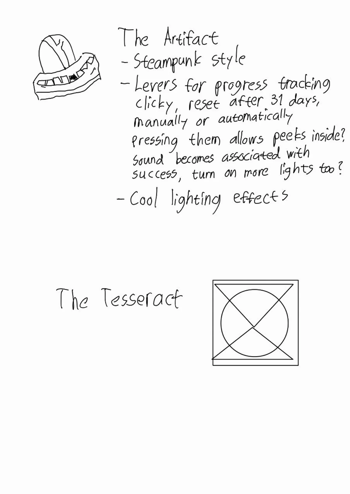

## Final Project idea dump

This will be organized, written and illustrated much better very soon, but right now it is merely a dump of ideas I got, considered and have already discarded during the ideation phase, which is often very long for me as I always want to create something somehow meaningful, whether that is in a local or global context. For this project, it seems to make more sense to go local as that is, according to my understanding, in some sense the very ethos of the fab movement. I had a cool idea for remote chess boards but am a couple of years late, because those have already been producticed and commercialized by, for example, [ChessUp](https://playchessup.com/en-eu) (although I think I could make them nicer looking), which was both cool and a bit of a bummer. Maybe I will make them nicer looking and/or cheaper and compete that way one day.

After discovering this, I lost my appetite for the idea and tried turning to solving some personal problems instead. The only issue is that I currently cannot come up with too many problems I would have - how incredible is it to live in Finland and be in a modestly decent fiscal situation for a student? - so there were no obvious project ideas for this particular scope. I still do have many ideas but many of them were not directly suitable for this course. I kept on wondering about another remotely playable board game but after extensive research, I could not come up with any other the playing experience of which would be significantly improved over just a digital version. I would then have to create a new game myself, which I opened as a background tab in my mind and still keep there. However, here are the results of my further brainstorming within the bounds of the course:

### Fab ideas
- Luminous remote chess
- Remotely playable board game
- Connected, re-arrangeable statues that mirror each other's shapes. For example, a rigid string that can be folded to a shape, causing the other to take the same shape
- Remote drawing / writing inspired by The Way of Kings spanreeds
- 3D printer that scans the item put inside it and then replicates it
- Luminous remote chess
- Box that opens only when a task is completed (can be used for locking away one's phone or to keep a reward)
- Physical wave synthesizer that produces sound corresponding to the shape of a string (sine, saw, square etc.)
- Midi controller
- Mood lamp
- Wall clock
- Bright light alarm clock
- Something for a bookcase (physical reading challenge / art?)
- Weasley clock
- Lightsaber laser pointer
- Perpetual motion machine

Most interesting avenues:

- Action at a distance / "Magical items”
    - Remotely playable board game
    - Kinetic statues
    - Weasley clock
    - Spanreed
    - Lightsaber laser pointer
- Productivity boosters
    - Innovative alarm clock
    - Phone / reward locker
    - Year progress bar
    - Task / mortality visualization
- Midi controller / instrument / player

Currently I am leaning toward creating some kind of an alarm clock / light that would wake me up to a simulated sunset. Many exist already, but they are kind of expensive and boring looking so the point here would prehaps be either the design or adding some cool feature that they do not have, at least in lower pricing points. With my non-existent drawing skills, I sketched a few ideas on Samsung Notes with my tablet. They look pretty horrendous due to being incredibly quick, not being drawn in an app made for it and being drawn by me, but perhaps they might still be somewhat representative.

I have grown very interested towards the last one "Oval blimp thingy" that I then renamed to "gesture controlled bright alarm lamp". It was actually a real shower thought stumbled upon when pondering possible interesting shapes for a sunrise alarm clock. I think I am drawn to it for its elegance, where the oval is the perfect shape for simulating sunrises and sunsets. All electronics would be packed inside of it so that the stands could be changeable and thus a bit more of a design elemnt that can go anywhere from minimalist to elaborate. 

It also provides the perfect range of scaling challenge. Its primary function would be to function as an alarm clock that simulates a sunrise with independently controllable LEDs inside. The alarm would be set in a simple app that communicates with the lamp over Bluetooth to set the times for the alarm (integration with native clock apps is also an interesting potential avenue for exploration). I built-in speaker could also play some noise that increases in volume with the brightness. The secondary functions would be gesture controls, where a whole palm touch would turn it on and off and sliding one's hand over it would increase brightness in one way and reduce it in the other. The tertiary function would be to control the colors from the app in some unified way and make the brightness control dynamic such that lower brightness levels are warmer and higher are cooler.

An interesting addition would also be habit tracking, where, for example, a one fingered tap is a positive note, to which the lamp would react by a brief, gentle green blink and catalogue that in the app, where it could possibly be elaborated upon or just left as a positive mark. The ranking is based on which functionalities I would most need but it might be that 1 and 2 change places too. Achieving all of these would be perfect but there are also further expansion possibilites such as adding more long-distance proximity detection, adding mood lamp and connectivity functionality between other similar lamps, so that if two are connected and one is being touched, that is signaled to the other too. Also orientation detection for optimizing the light patterns based for each stand could be interesting. The possibilities are almost endless and the end product might be something like an expressive companion that would be similar to, for example, Alexa, but with light instead of voice.

