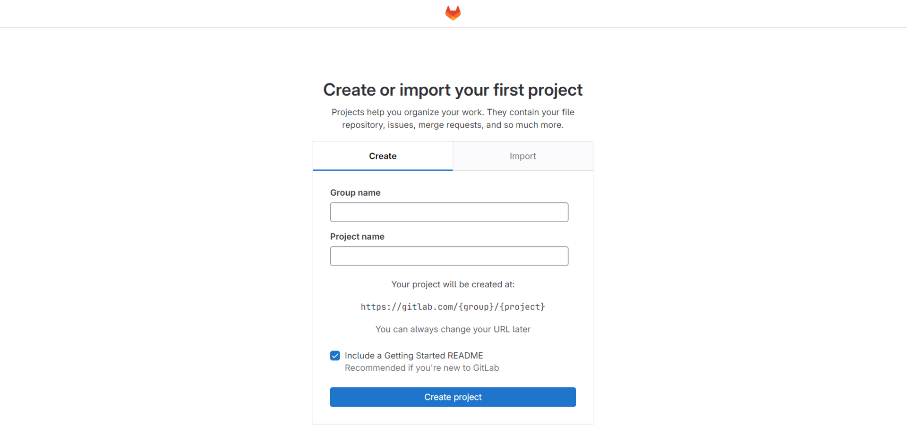
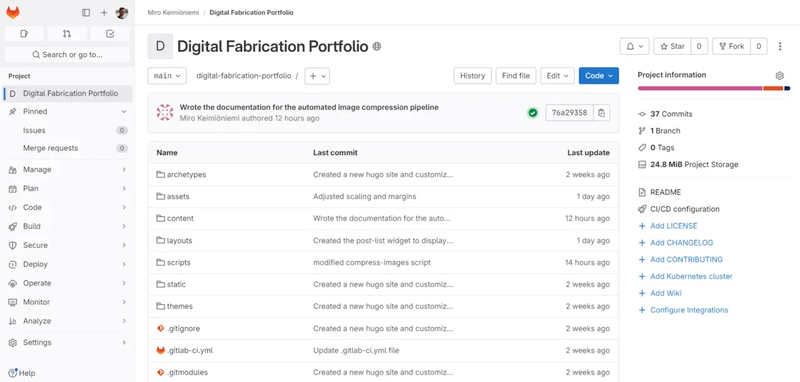
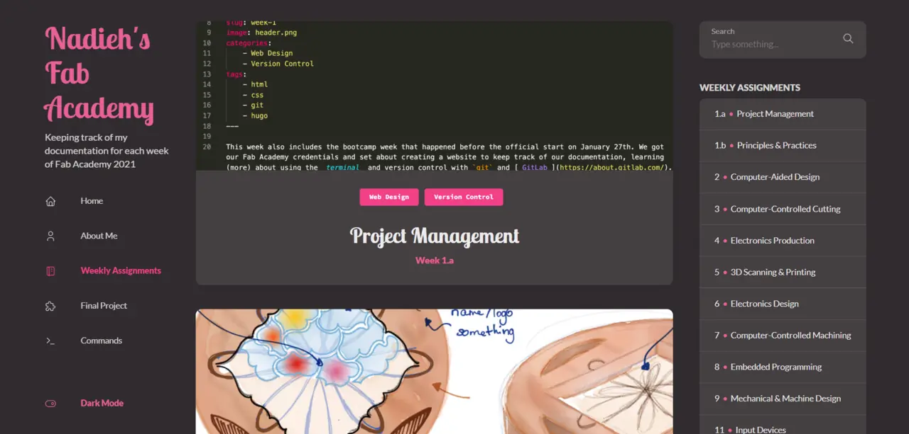
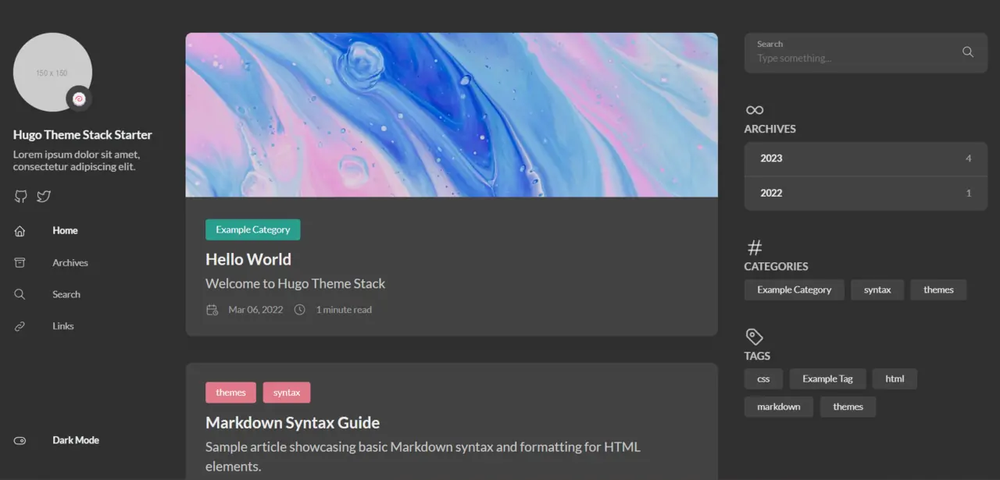
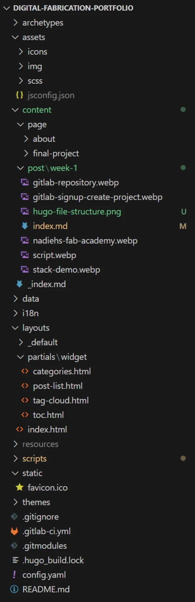
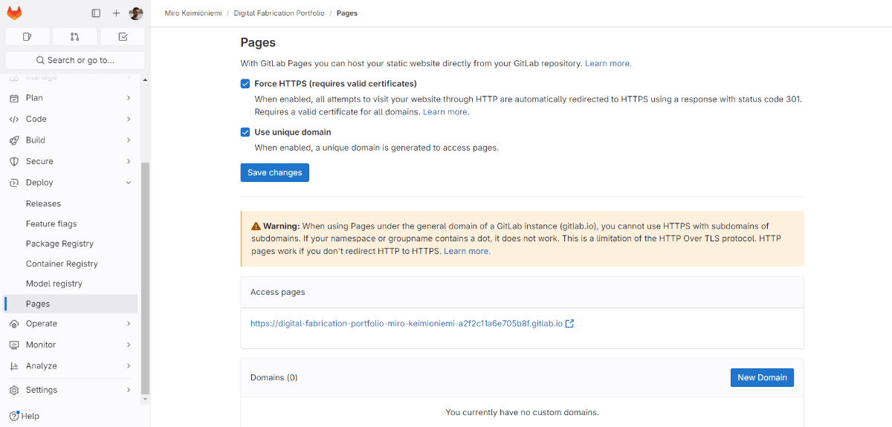
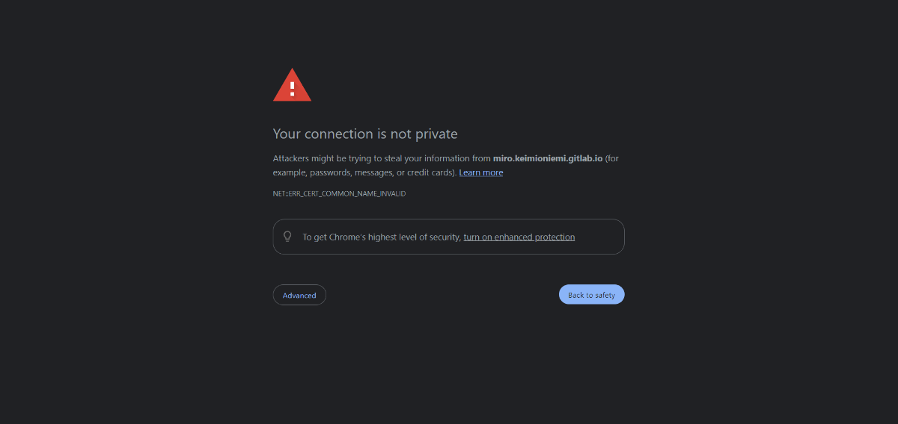

Here begins the documentation of my digital fabrication journey. It is produced in accordance to the
specifications and pace of the AXM-E7009 - Digital Fabrication I course at [Aalto University](https://aalto.my.site.com/courses/s/course/a057T0000043wLhQAI/digital-fabrication-i?language=en_US) / Aalto
Fablab that is an overlay for the worldwide [Fab Academy](https://fabacademy.org/), therefore following their curriculum and
schedule - only it is cheaper, but does not provide the Fab Academy certificate. Why I point this out,
however, is that there may also be other slight differences such as the actual start date of the course,
which, for us, was two weeks before the first global lecture, allowing for a very gentle start. The
explanation for why this covers weeks 1 - 3 instead of only the first one is that I am numbering them
according to the overlay course instead of the Fab Academy curriculum, although the topics are in the
same order.

## Assignments

### Introduction:
1. Link to your repository
2. Link to the published website
3. Add a picture and description of yourself. At least one paragraph of text.

### Principles and Practices:
1. Add a Final Project page on your website.
2. Add a visual sketch of your final project idea to the Final Project page.
3. Describe your final project. The description should be at least one paragraph long.
4. Submit a link to the Final Project page on your website.

### Project Management:
1. Create a page for the project management assignment on your website.
2. Describe how you created your website.
3. Describe how you use Git and GitLab to manage files in your repository.
4. Learn to capture screenshots and add a few to your documentation page.
5. Optimize the images (screenshots and photos) so that they fit into 1920x1920px rectangle, save it in JPG format with 60-80 percent quality. Use any tool you like, but document your process.

## Setting up

### GitLab

To immediately get many of us out of comfort zones, we were instructed to set up our repositories on
GitLab instead of GitHub, which was fine by me, having routinely used both. What was new to me,
however, was using the non-organization-hosted [GitLab](https://gitlab.com/), for which I had to make
an account separately. What was rather annoying, was that it immediately forced me to create a project
under a group as shown below event though I was in no need of one.



I was baffled about this and googled around for a while but in retrospect, it was easy enough to delete 
this repository and then create one just under my username, which made way more sense to me. I then created
an empty repository for the project, onto which I uploaded the hugo website created using the stack template
using the SSH protocol. The GitLab repository of this website can be found [here](https://gitlab.com/miro.keimioniemi/digital-fabrication-portfolio/-/commits/main/content/post/week-1/index.md?ref_type=heads).



### Hugo

I have made both static and dynamic websites in the past and wanted to challenge myself with something new this time.
Furthermore, due to the nature of this website - that being documentation - I wanted to automate the addition of new
content as far as possible as adding content to [my own static website](https://mirokeimioniemi.com) is quite annoying
and unsustainable in the long run as the number of interlinked pages grows. I have long thought about having to refactor
it at some point, so I decided to use this opportunity for experimenting how I should do it.

While preparing for this spring by googling workload estimates and alumni's experiences with the Fab Academy, I had
discovered Nadieh Bremer's [Nadieh's Fab Academy](https://fabacademy.org/2021/labs/waag/students/nadieh-bremer/)
documentation website from 2021 and I really liked how it looked. She had used [Hugo](https://gohugo.io/) and her
documentation was incredibly extensive, so I decided to give it a try following her comprehensive instructions.



#### Installation

Hugo is an open-source static site generator that claims to be "the world's fastest framework for building websites"
and thus it sounded like just the right tool for this. To install it on windows, I realize now in retrospect that I
could have used WSL, which I had installed for an old C course, but instead I used [chocolatey](https://chocolatey.org/), a package manager for
Windows, which could be installed according to the installation guide [here](https://chocolatey.org/install#individual)
by opening PowerShell as an administrator and running:

```powershell
Set-ExecutionPolicy Bypass -Scope Process -Force; [System.Net.ServicePointManager]::SecurityProtocol = [System.Net.ServicePointManager]::SecurityProtocol -bor 3072; iex ((New-Object System.Net.WebClient).DownloadString('https://community.chocolatey.org/install.ps1'))
```

After installing chocolatey, Hugo could be installed by simply running:

```powershell
choco install hugo-extended
```

#### Creating a website

I created a new hugo site in my digital fabrication project directory by running:

```powershell
hugo new site digital-fabrication-portfolio
```

This created a new `digital-fabrication-portfolio` directory with Hugo's directory structure. I initialized Git in the new directory
with `git init` as detailed in the [Git section](/p/project-management/#git) and added the [Stack](https://stack.jimmycai.com/) [Hugo theme](https://themes.gohugo.io/themes/hugo-theme-stack/)
by Jimmy Cai as a submodule by running:

```
cd digital-fabrication-portfolio
git submodule add https://github.com/CaiJimmy/hugo-theme-stack/ themes/hugo-theme-stack
```

Yes, to my surprise too, the whitespace in "`/ themes`" was actually necessary.

One would imagine, that using a template would be relatively simple and straightforward but in my opinion, Hugo's 
documentation did not make a clear enough distinction between the functions of Hugo itself and the themes built on 
top of it. The [Stack theme's documentation](https://stack.jimmycai.com/guide/) thus appeared insufficient to me, 
because it expected me to know these differences, which I did not quite fully comprehend on my first quick 
skim-through of the [Hugo documentation](https://gohugo.io/documentation/). It took me long to understand how
exactly to use the theme, which was certainly not helped by multiple different kinds of configuration files such
as the default `hugo.toml` and the `config.yaml` used by the Stack theme's example site. If you want to construct
the site additively from the ground up using the theme, make sure to add `theme = "hugo-theme-stack"` to the
`hugo.toml` file, but I would highly recommend the subtractive approach I ended up taking, where I started from
the demo website and carved it into my own.

I followed in Nadieh's footsteps and copied the files from `digital-fabrication-portfolio/themes/hugo-theme-stack/exampleSite`
to `digital-fabrication-portfolio`, replacing the pre-existing `content` directory. I also deleated the `hugo.toml` file
in order to use the theme's default `config.yaml` configuration file instead, which I modified to be more suitable for my purposes. 
Now running the following command:

```
hugo server -D -F
```
resulted in the following example site being deployed at `localhost:1313`, which can be accessed by merely typing
that to any browser and pressing enter. `hugo` starts the hugo program, `server` launches a local development server,
`-D` ensures that draft pages are included and `-F` does the same but for pages with dates in the future. 



#### Overview

Hugo works by using [Sass](https://sass-lang.com/)-styled and [Go](https://go.dev/)-powered HTML templates stored in the
`layouts` directory to render markdown files in ways specified by the templates. When using a theme as a git submodule, the
layouts under `themes/hugo-theme-stack/layouts` are used, unless overwritten in the project `layouts` directory. These layouts
can contain templates for both generic and specific pages as well as partials, analogous to [React](https://react.dev/)
components, and [shortcodes](https://gohugo.io/content-management/shortcodes/) that add additional functionality to markdown.



[Hugo's documentation](https://gohugo.io/getting-started/directory-structure/) goes into more depth on the file structure and
everything else. What was relevant to me were the icons, images and scss files under `assets` that provided styling for the different
pages and components as well as site-wide resources, the `content` directory that contains all the markdown files from which the site's
content is generated and the `layouts` directory, where theme layouts could be overwritten. The static pages are created based on a set
[lookup order](https://gohugo.io/templates/lookup-order/), which dictates which template is used for which page.

The `content` directory must be organized, in my case, into `page` and `post` directories. The `post` directory contains all the weekly
assignemnt documentation entries, which are paginated on the [Weekly Assignments]() page and the `page` directory 
contains folders for each page that appear in the left sidebar menu such as [Weekly Assignments](), 
[Final Project]() and [About Me](). <-- Those internal links
are an example of using the Hugo shortcodes by the way:

```markdown
[Final Project]()
```

Each page is represented as a folder that must contain a `index.md` file, which is the rendered file. They can also contain, for example,
images, which can be rendered with ``. Each page has a front matter that defines page-specific parameters such as this page's:

```yaml
---
author: "Miro Keimiöniemi"
title: "Project Management"
date: "2024-02-01"
description: "Weeks 1 - 3"
tags: 
  - "markdown"

  ...

  - "Windows"
categories: 
  - "Web Development"
  - "Documentation"
  - "DevOps"
series: 
  - "Weekly Assignments"
image: "script.webp"
---
```

Global site parameters are set and adjusted using the `config.yaml` file, which for me looks something like this:

```yaml
baseurl: https://digital-fabrication-portfolio-miro-keimioniemi-a2f2c11a6e705b8f.gitlab.io
languageCode: en-us
theme: hugo-theme-stack
paginate: 100
title: Miro's Digital Fabrication Portfolio
copyright: Miro Keimiöniemi

...

params:
    mainSections:
        - post
    featuredImageField: image
    rssFullContent: true
    favicon:  /favicon.ico

     footer:
        since: 2024
        customText:

    dateFormat:
        published: Jan 02, 2006
        lastUpdated: Jan 02, 2006 15:04 MST

    sidebar:
        # emoji: 👾
        subtitle: Documentation of my 2024 Digital Fabrication journey.
        avatar:
            enabled: true
            local: true
            src: img/Profile picture-min.png

    article:
        math: false
        toc: true
        readingTime: true
        license:
            enabled: false

    ...

    widgets:
        homepage:
            - type: search
            - type: post-list
            - type: categories
              params:
                  limit: 10
            - type: tag-cloud
              params:
                  limit: 10
        page:
            - type: toc

...

menu:
    main: []

    social:
        - identifier: portfolio
          name: Portfolio
          url: https://mirokeimioniemi.com/
          params:
              icon: world-www

        - identifier: linkedin
          name: LinkedIn
          url: https://www.linkedin.com/in/miro-keimi%C3%B6niemi/
          params:
              icon: brand-linkedin

        - identifier: github
          name: GitHub
          url: https://github.com/MiroKeimioniemi
          params:
              icon: brand-github

        - identifier: instagram
          name: Instagram
          url: https://www.instagram.com/m1r0k3/
          params:
              icon: brand-instagram

        - identifier: x
          name: X
          url: https://twitter.com/M1R0K3
          params:
              icon: brand-X

```

### Git

Git is a very versatile and robust, distributed version control system that can be used to save "snapshots" of your
repositories locally and sync them across multiple devices, most commonly done through hosting services such as [GitHub](https://github.com/) and [GitLab](https://gitlab.com/). Most often Git is used with code but it is especially well suited for almost
all kinds of text files as it enables tracking how the files evolve over time and what changes are made to them at
each point. [Here](https://gitlab.com/miro.keimioniemi/digital-fabrication-portfolio/-/commits/main/content/post/week-1/index.md?ref_type=heads) you can see the history of this very post for example.

I was already familiar with Git, as you can see from my previous projects on [GitHub](https://github.com/MiroKeimioniemi),
so I already had it installed but it is also very simple to download for free from the official website [git-scm.com](https://git-scm.com/downloads). Install and configure it using the following commands:

```git
$ git config --global user.name "YOUR_USERNAME_HERE"
$ git config --global user.email "your_email_here@email.com"
```

Git can get quite complex but everyday usage of it is quite straightforward. Essentially, when working solo
on a single machine, you only need 6 commands:

- `git init` initializes a repository in the currently open directory.
- `git clone` clones a remote repository into the currently open local directory.
- `git add` stages the selected changes made to the repository since the last commit to be committed with the next one.
- `git commit` saves all the staged changes to the repository into the permanent git record.
- `git push` uploads the locally committed changes to a remote repository.
- `git pull` downloads the changes from a remote repository to the local repository.

I would highly recommend running all the commands using either Git Bash that comes with the Git installation or using the [Windows Subsystem for Linux](https://learn.microsoft.com/en-us/windows/wsl/about), WSL,
as Windows' PowerShell / Command Prompt may have some quirks. How I initialized my git repository was by executing the 
following commands in Git Bash opened in my digital fabrication project directory on my laptop to navigate into my hugo
website directory and then initializing Git in it:

```git
cd digital-fabrication-portfolio
git init
```

There are a lot of great resources for learning Git on various levels of complexity (from simplest to most complex):

- [git - the simple guide](https://rogerdudler.github.io/git-guide/)
- [FreeCodeCamp](https://www.freecodecamp.org/news/learn-the-basics-of-git-in-under-10-minutes-da548267cc91/)
- [GitKraken](https://www.gitkraken.com/learn/git/tutorials)
- [Git documentation](https://git-scm.com/doc)

### SSH connection

I had an [SSH](https://www.ssh.com/) key pair already generated, so connecting my local Hugo website repository to the remote GitLab
repository was as easy as adding the public key to my SSH keys on GitLab (can be found by searching "SSH Keys" on the left sidebar of
GitLab and clicking the link under "Settings") and connecting with the following command ran in Git Bash in the local repository: 

```git
git remote add origin git@gitlab.com:miro.keimioniemi/digital-fabrication-portfolio.git
```

Then I could push my local repository to the remote one using:

```git
git push -u origin master
```

Now I was set and could stage all my changes, commit, sync (push and pull) and solve merge conflicts directly in [VS Code](https://code.visualstudio.com/), without
having to use the command line, which I feel is often faster as these basic operations are so well integrated to VS Code.

GitLab has very extensive documentation for generating, adding, verifying and using SSH keys, which can be found [here](https://docs.gitlab.com/ee/user/ssh.html).

### Automated image compression pipeline

Thus far, in all my [web projects](https://github.com/MiroKeimioniemi?tab=repositories) I had manually compressed
and converted all images using online tools such as [cloudconvert.com](https://cloudconvert.com/), [compresspng.com](https://compresspng.com/) and [compressjpeg.com](https://compressjpeg.com/),
but I had grown tired of that and decided to challenge myself to automate the process for this website, as I would
most likely be taking and uploading hundreds of pictures during this course and manually doing it might be even more
time consuming. And as with almost all small-scale automation tasks, that turned out to probably not be the case.



After those ~6 hours, however, I had something that actually works. We were introduced to [ImageMagick](https://imagemagick.org/index.php)
on one of our lectures, which is a powerful command line tool for image processing. Being a command line tool means that it is easy to
automate and thus, in collaboration with GitHub Copilot, integrated into VS Code and [available for free for all students](https://education.github.com/benefits),
I learned how to write PowerShell scripts on Windows to unleash ImageMagick's full potential. 

First, I created a script called `compress-images.ps1` under a new `scripts` folder to resize, compress and convert all images under 
`content/post` and all its subdirectories to `.webp` by finding all files ending with `.jpg`, `.jpeg` or `.png` and applying the same
ImageMagick command to each while also deleting the original image. Over the course of the first few weeks, it then evolved into the script below, which first converts
the image to `.webp` format losslessly, then checks if it is larger than 200kb and if this is the case, redos the conversion using the original image,
replacing the initial converted image, thus producing a smaller, lossy output this time. If the initial conversion produces an image
smaller than 200kb, it stays untouched. Initially, I had the resolution set to 1200x1920 but this in combination with the lossy compresison made some of the larger screenshots captured on my external 4k monitor borderline illegible and I wanted to also protect the future images of my projects.

```powershell
# Define the directory containing the images
$ImageDir = '.\content'

# Get all image files in the directory and its subdirectories
$ImageFiles = Get-ChildItem -Path $ImageDir -Recurse -Include *.jpg,*.jpeg,*.png

# Loop through each image file
foreach ($ImageFile in $ImageFiles) {
    # Define the output file name
    $OutputFile = $ImageFile.FullName -replace '\.[^.]*$', '.webp'
    
    # Define the ImageMagick command to run on the current image for lossless compression
    $ImageMagickCommandLossless = "magick convert `"$ImageFile`" -strip -adaptive-resize 1920x1920 -define webp:lossless=true `"$OutputFile`""
    
    # Run the ImageMagick command on the file for lossless compression
    Invoke-Expression -Command $ImageMagickCommandLossless

    # Check the file size of the output file
    $OutputFileSize = (Get-Item $OutputFile).Length / 1KB

    # If the file size is larger than 200KB, compress it lossily
    if ($OutputFileSize -gt 200) {
        $ImageMagickCommandLossy = "magick convert `"$ImageFile`" -strip -adaptive-resize 1920x1920 -define webp:lossless=false -quality 85 -define webp:alpha-quality=80 -define webp:auto-filter=true -define webp:method=6 `"$OutputFile`""
        Invoke-Expression -Command $ImageMagickCommandLossy
    }

    # Delete the original image
    Remove-Item -Path $ImageFile.FullName
}
```

This could be ran by navigating to the `scripts` folder and either typing `.\compress-images.ps1` when using the PowerShell terminal
or right-clicking and selecting "Run with PowerShell" when using file explorer (although using this method `$ImageDir` should be `..\content\post`).
After a lot of testing, I determined that the best ImageMagick command for achieving maximum compression with minimum quality loss was:

```powershell
magick convert `"$ImageFile`" -strip -adaptive-resize 1200x1920 -define webp:lossless=false -quality 85 -define webp:alpha-quality=80 -define webp:auto-filter=true -define webp:method=6 `"$OutputFile`"
```

This removes most of the image metadata and resizes it to fit a rectangle with dimensions 1200x1920 (a bit wider than the maximum width of the page so that
opening it still provides more detail) while retaining its original aspect-ratio. It converts it to a lossy webp format with 85% quality and 80% alpha-quality,
while also applying the most sophisticated compression methods that take little more time but produce smaller results.

Emboldened by how well this worked, I set out to automate the process fully. I asked copilot how to approach this and it enlightened me about
Git hooks, which can be used to run scripts before and after certain Git actions such as commit, push and pull. In order to use them, one must navigate
to `.git/hooks`, which can be `cd`'d right into from the root directory, where Git was originally initialized. I used `touch pre-commit` to create the
following script file called `pre-commit` (which can be edited in VS Code with `code pre-commit`):

```powershell
#!/bin/sh
powershell.exe -ExecutionPolicy Bypass -File ./scripts/compress-images.ps1
```

All Git hooks are ran from the Git root directory and thus the paths must be either absolute or relative to it. I saved the file and then typed 
`chmod +x pre-commit` to the terminal to change its mode (`chmod`) to executable (`+x`) and now it was ran as a program every time that a git commit
was made.

After having tried it, however, I realized that the modified images were not actually added with the commit, which was fixed with the addition of the
line: `git add ./content/post/*`. Once I got this working, I soon realized that these alone would not actually help me at all because I would either
have to anticipate the change to `.webp` when writing the markdown files and therefore not be able to preview the images with the `hugo server` or I
would have to convert them prior. Then a third, much easier option also occured to me, which was to write another script that would replace the file
extensions within the links and the front matter of the markdown files, which the following mostly copilot-generated `update-image-names.ps1` script
achieves:

```powershell
# Define the directory to search
$dirPath = './content'

# Define the extensions to replace
$extensions = @('.png', '.jpg', '.jpeg')

# Get all markdown files in the directory
$files = Get-ChildItem -Path $dirPath -Filter *.md -Recurse

# Process each file
foreach ($file in $files) {
    # Read the file content
    $content = Get-Content -Path $file.FullName -Raw

    # Find all image links
    $imageMatches = [regex]::Matches($content, '!\[.*?\]\((.*?)\)')

    # Process each match
    foreach ($match in $imageMatches) {
        # Only process links with the specified extensions
        if ($extensions -contains [System.IO.Path]::GetExtension($match.Groups[1].Value)) {
            # Replace the extension
            $newMatch = $match.Groups[1].Value -replace '\.png|\.jpeg|\.jpg', '.webp'
            # Update the content
            $content = $content -replace [regex]::Escape($match.Groups[1].Value), $newMatch
        }
    }

    # Find all front matter images
    $frontMatterMatches = [regex]::Matches($content, 'image = "(.*?)"')

    # Process each match
    foreach ($match in $frontMatterMatches) {
        # Only process links with the specified extensions
        if ($extensions -contains [System.IO.Path]::GetExtension($match.Groups[1].Value)) {
            # Replace the extension
            $newMatch = $match.Groups[1].Value -replace '\.png|\.jpeg|\.jpg', '.webp'
            # Update the content
            $content = $content -replace [regex]::Escape($match.Groups[1].Value), $newMatch
        }
    }

    # Write the updated content back to the file
    Set-Content -Path $file.FullName -Value $content
}
```

Finally, I added this to the pre-commit hook (not found on GitLab due to `.gitignore`), producing:

```powershell
#!/bin/sh
powershell.exe -ExecutionPolicy Bypass -File ./scripts/compress-images.ps1
powershell.exe -ExecutionPolicy Bypass -File ./scripts/update-image-names.ps1
git add ./content/post/*
```

Now, every time I make a git commit, these scripts are run before the commit is made, compressing, resizing and converting the images to `.webp`
and changing all image links accordingly, so that I can seamlessly work with the original images without having to worry about compression anymore
in the future.

Scripting can truly elevate your workflow to the next level! However, their power also merits a word of warning: do not run any scripts that you
do not fully understand. Be very careful about where and with what privileges you run them and if you ever use anything from external sources, be it
StackOverflow or GitHub Copilot, always study very carefully, whether it is doing exactly what you want it to be doing.

### GitLab Pages

To deploy the Hugo site, I followed a [tutorial](https://docs.gitlab.com/ee/tutorials/hugo/) by GitLab made specifically for Hugo. I must again
applaud GitLab for their thorough documentation, but in short, I added the `.gitlab-ci.yml` file with the following contents to the root directory:

```yml
image: registry.gitlab.com/pages/hugo/hugo_extended

variables:
  GIT_SUBMODULE_STRATEGY: recursive

test:
  script:
  - hugo
  except:
  - main

pages:
  script:
  - hugo -F
  artifacts:
    paths:
    - public
  only:
  - main
```

From the left side-panel, I navigated to Deploy > Pages and found the link where the website was deployed: [https://digital-fabrication-portfolio-miro-keimioniemi-a2f2c11a6e705b8f.gitlab.io/](https://digital-fabrication-portfolio-miro-keimioniemi-a2f2c11a6e705b8f.gitlab.io/).



It is generally a good practice to always use HTTPS whenever possible, so I checked "Force HTTPS". The unique domain is rather hideous, so I tried unchecking
the "Use unique domain" option, but when I then tried to open the link, I got the following warning:



This was rather bad PR for my site, so I opted for the unique domain instead, which prompts no such issues, even though it was quite ugly.

To finish the deployment gracefully, I then added the URL to the baseurl parameter in config.yaml and was done!

```yaml
baseurl: https://digital-fabrication-portfolio-miro-keimioniemi-a2f2c11a6e705b8f.gitlab.io
```

## Creating the website

Despite its complexities, Hugo seemed like just the tool I had been long looking for. I browsed through all its [themes](https://themes.gohugo.io/)
and still ended up with Stack - the same theme Nadieh had used. I thought to myself, why stray from perfection? So I took the same theme, but made
it my own.

Initially, I only changed the colors of the theme to match [my personal website](https://mirokeimioniemi.com/), modified the `config.yaml` to have the
right titles, descriptions, social media links etc. as shown in [2.2.3 Hugo Overview](/p/project-management/#overview) and added the [About Me]()
page with some quick stream of consciousness ramblings. This was enough for the first week as I was quite done with all the setting up at that point.

During the second week, I did not even touch the website as I had a lot of events to attend to and I was brainstorming what to make as my final project,
which I updated on the [Final Project]() page just now. Thank you Krisjanis Rijnieks for the single, uniform
deadline for all the assignments 🙏.

Now, during the third week, I have tried to systematically make sure that I have satisfied all the assignment requirements. I finalized the look of the
website by adjusting the scaling and margins of different HTML elements, styling the images to be more card-like, building the automatic image processing pipeline, organizing all pages
and writing this documentation. The most notable, non-sass changes are detailed below.

I added "Previous week" and "Next week" buttons to the weekly assignment posts, that only show up when there are other posts, by copying the `single.html`
file from `themes/hugo-theme-stack/layouts/_default` to `layouts/_default` and adding the following piece of code:

```html
<div style="display: flex; justify-content: space-around;">
        {{ if .PrevInSection }}
            <a href="{{ .PrevInSection.Permalink }}" class="prev-article-button">Previous week</a>
        {{ end }}

        {{ if .NextInSection }}
            <a href="{{ .NextInSection.Permalink }}" class="next-article-button">Next week</a>
        {{ end }}
    </div>
```

The most noticeable change is the `post-list` widget, inspired by Nadieh's similar weekly assignments list. 
I created the `post-list` widget layout under `layouts/partials/widget` with the help of [GitHub Copilot](https://github.com/features/copilot),
that lists the weekly assignments in the right sidebar on the [Weekly Assignments]() page:

```html
<div class="post-list">
    <section class="widget archives">
        <h2 class="widget-title section-title">Weekly Assignments</h2>
        <div class="widget-archive--list">
            {{ $posts := where .Context.Site.RegularPages "Section" "post" }}
            {{ range $posts }}
                <div class="post-item archives-year">
                    <a href="{{ .Permalink }}" style="display: grid; grid-template-columns: auto 1fr auto; align-items: center;">
                        <span class="year" style="white-space: wrap;">{{ .Title }}</span>
                        {{ with .Description }}
                            <span class="separator" style="text-align: center; margin-left: min(0.5rem, 1rem); margin-right: min(0.5rem, 1rem);">|</span>
                            <span class="count" style="white-space: wrap;">{{ . }}</span>
                        {{ end }}
                    </a>
                </div>
            {{ end }}
        </div>
    </section>
</div>
```

The widget could then be enabled by adding it to the config.yaml:

```yaml
widgets:
        homepage:
            - type: post-list
```

## Reflections

The start of the course was quite gentle, especially for someone already very familiar with web development, although I did stil manage to complicate it for myself
quite well by picking up yet another framework and learning scripting to automate image processing - something which we were really not expected to do. On yesterday's
global lecture, Neil Gershenfeld mentioned that PowerShell is probably not the best command line interface to use, because of some unique quirks and I might want to
keep that in mind for the future, especially considering that I have all the nicer tools installed already, but it works for now and so I will follow the programmer
ethos "if it works, don't touch it" for now.

I am used to writing very extensive documentation as can be seen, for example, [here](https://github.com/MiroKeimioniemi/probabilistic-strategy-game), but even though
I just finished the [Design Thinking and Electronic Prototyping](https://www.linkedin.com/posts/miro-keimi%C3%B6niemi_now-that-school-is-over-for-the-year-ill-activity-7143994838173089792-1WlC?utm_source=share&utm_medium=member_desktop)
course with weekly learning diaries and extensive project documentation, it still managed to surprise me just how long I was again able to spend on writing this. Easily
as long as everything thus far combined. And it did not help that I only took very barebones bulletpoint notes only during the most foreign phases to me, meaning that I
essentially had to re-study how everything worked so that I could write it down. This week's learning definitely is to then document as I go, which should not be a problem
now that I do not have the excuse of not having the documentation platform ready anymore.

Overall, I am quite proud of what I have achieved thus far and cannot wait for the new and undoubtedly plentiful challenges that the course will bring! But now (06:18), to sleep.


