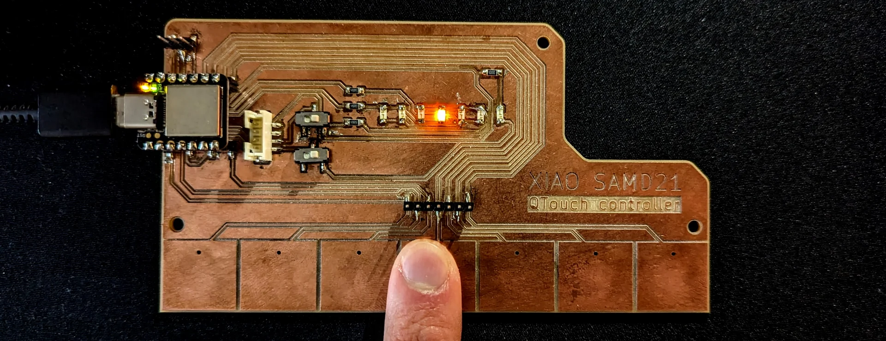
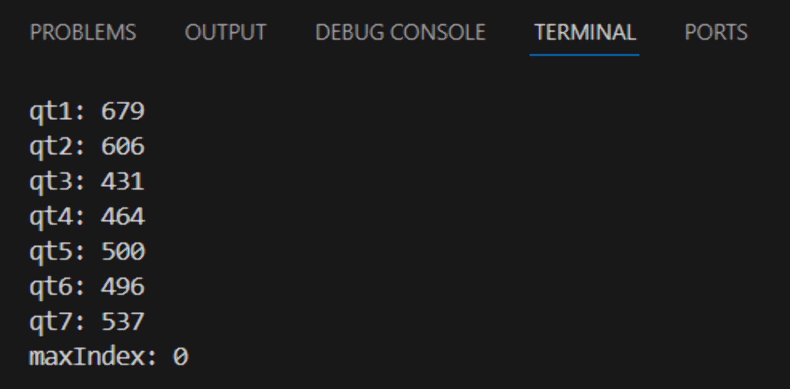
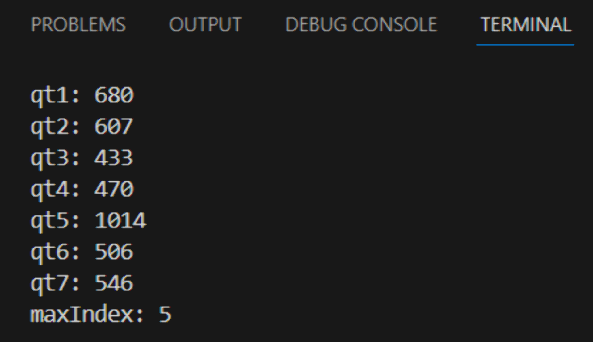
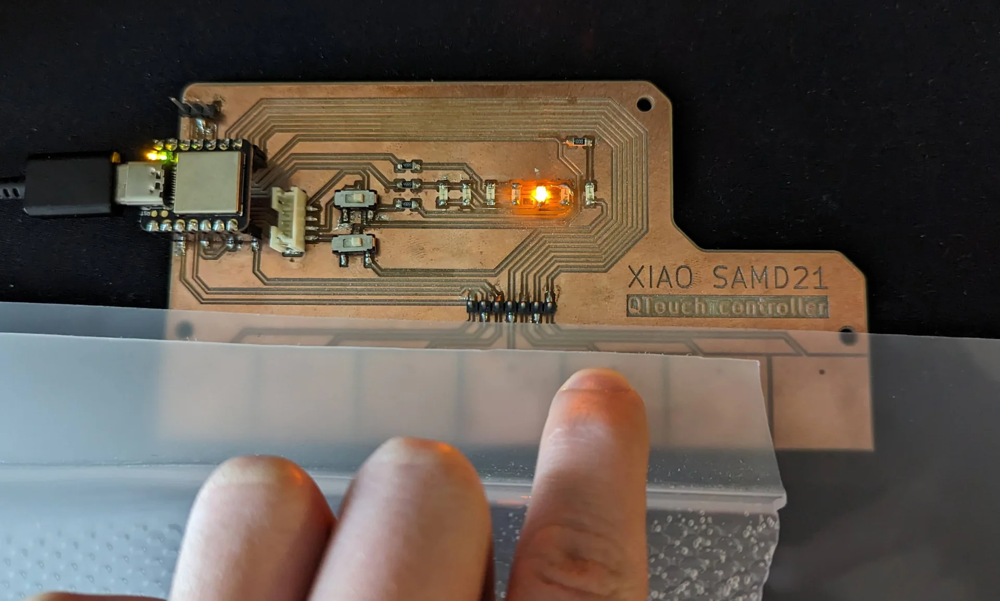
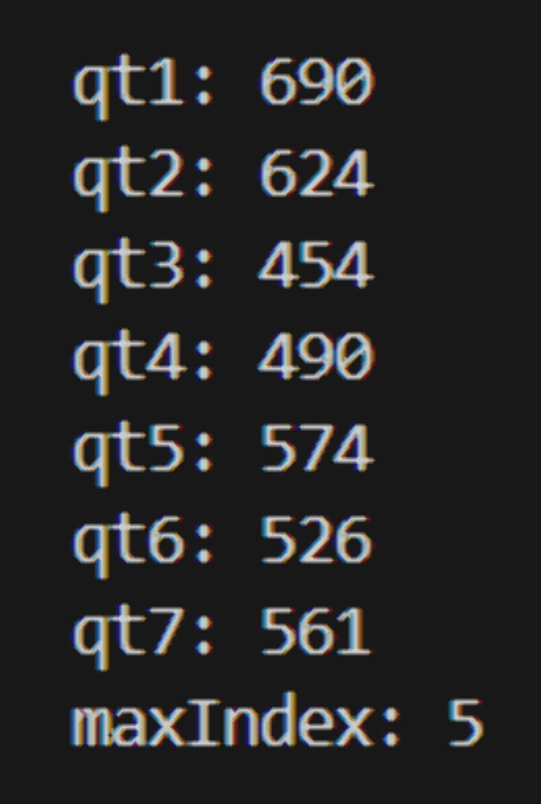
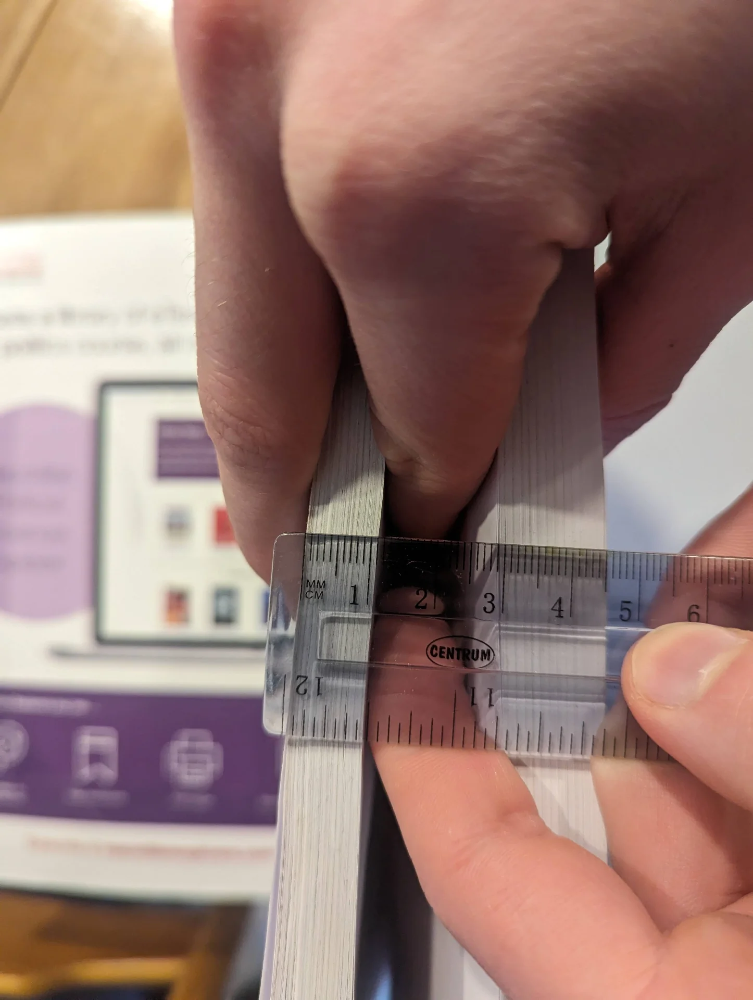

## Assignments

**Group assignment**
1. Join one of the introduction sessions on Mon, Tue or Wed and document the probing of several different input devices.
2. Pick a group leader who has to create and populate the group assignment page. 

**Individual assignment**
1. Link to the group assignment page and describe what you learned from the group assignment.
2. Add a sensor to a microcontroller board that you have designed and read it.

## Probing input devices

Our this week's group assignment was to probe several different input devices, which was documented by Vytautas Bikauska [here](https://public-df.gitlab.io/shared-documentation/inputdevices.html). We tested both one and three axis hall effect sensors as well as a [time of flight distance sensor](https://www.sparkfun.com/products/14722) and due to the latter being a [SparkFun](https://www.sparkfun.com/) breakout board, the I2C communication protocol as well as [Qwiic](https://www.sparkfun.com/qwiic) connectors became topics of conversation as well.

The distance sensor was particularly interesting, providing millimeter resolution up to 4 meters away, enabling all kinds of potentially interesting ideas. Seeing the logic analyzer at work again with multiple simultaneous channels and an analog input as well was quite fascinating too, although I hope I will not have to use it much personally. 

What we most laughed about, however, was the absurd number of different voltage acronyms with almost every circuit using a new one. Some of the most common ones are VCC, VDD, VSS, VEE, Vin and Vout, which, according to [this site](https://reversepcb.com/vcc-vdd-vee-vss-gnd/) roughly correspond to, analog (circuit) power supply, digital (chip) power supply, digital ground, negative power supply, voltage in and voltage out. 

## QTouch sensors

The [Seeed Studio XIAO SAMD21](https://wiki.seeedstudio.com/Seeeduino-XIAO/) features 7 QTouch pins, which can be read using the [Adafruit_FreeTouch library](https://github.com/adafruit/Adafruit_FreeTouch). They can be used to detect changes in capacitance, which occurs, for example, upon touching them with a finger. I made the board depicted below to test them during the [electronics design week]() but the code only tests whether the board functions or not, and cannot be used for the final project as is just yet.



As I already pretty much built my input board during the [electronics design week](), I decided to dedicate this input week to adapting it for my final project. The QTouch pads registered a change in capacitance exactly like I wanted, even through some thin materials, and all the charlieplexed indicator lights light up to correctly designate the pad that is being touched. However, the capacitance readings are different and the changes are smaller with a material on top. Hence, my goal for this week was to program a solution for correctly detecting touch through (bent) acrylic.  

### Testing input

I first tested the QTouch sensors by adding a 500ms delay to the [electronics design week code](https://gitlab.com/miro.keimioniemi/digital-fabrication-portfolio/-/blob/main/content/post/week-8/qtouch-test-code/qtouch-test-code/src/main.cpp) in order to be able to read the input values. When just resting on the table without being touched, the values measured by the individual QTouch pins ranged roughly from 430 to 680. The values measured by each pin, named in an increasing order from left to right, can be seen in the image of the serial output terminal below.




Interestingly, there seems to be a slight pattern. The pin connected to the leftmost pad, qt1, reads the highest value and the reading decreases until the lowest one read by qt3 after which they again mostly increase. Correspondingly, qt3 has by far the shortest path from pad to pin and the path lengths keep on increasing from qt4 up to qt7, although not proportionally as much as from qt2 to qt1. It is a bit peculiar that qt1 and qt2 measure the highest capacitances when it seems to be loosely correlated with the length of the path but they are not as long as the ones from the pads on the right. This might of course all be due to their internal routing or other differences between the pins themselves, but in terms of the PCB architecture, the only feature that would make those two stand out especially is that they feature the closest and longest zigzag patterns with themselves. 

The values tended to vary usually by approximately 1 and at most 2, except for qt2, which sometimes climbed from 606 all the way to 611 but only for single readings at a time. When touching a corresponding pad, the value ranged from 1014 to 1016 as seen above. One could thus set a threshold above the highest reading, say at 850, and thus the currently touched pad could be identified as the one exceeding it. However, if one touches a pad with something in between, such as in the image below where the pin recognizes a touch through over 4mm of layered acrylic with the code discussed below, the changes in the values are naturally much smaller. 




With a single 2mm sheet of acrylic in between, the baseline values increase approximately by 10 to 20 and the increases upon touch are significantly smaller at around 48 - 56 instead of hundreds up until the maximum readings. For two 2mm acrylic sheets, the increases are around 10 to 15. As can be seen in the serial output above, qt5 is correctly registered by the code to be discussed below, but it can no longer be distinguished as simply the largest value over some thershold. Instead, I had to first establish baseline values for the pins and then compare the changes to a change threshold that is low enough to detect touches through various materials but high enough not to be triggered the by random variation. Below is the modified code for doing so.

### Threshold code

```C
#include <Arduino.h>
#include "Adafruit_FreeTouch.h"

Adafruit_FreeTouch qt_1 = Adafruit_FreeTouch(A0, OVERSAMPLE_4, RESISTOR_50K, FREQ_MODE_NONE);
Adafruit_FreeTouch qt_2 = Adafruit_FreeTouch(A1, OVERSAMPLE_4, RESISTOR_50K, FREQ_MODE_NONE);
Adafruit_FreeTouch qt_3 = Adafruit_FreeTouch(A6, OVERSAMPLE_4, RESISTOR_50K, FREQ_MODE_NONE);
Adafruit_FreeTouch qt_4 = Adafruit_FreeTouch(A7, OVERSAMPLE_4, RESISTOR_50K, FREQ_MODE_NONE);
Adafruit_FreeTouch qt_5 = Adafruit_FreeTouch(A8, OVERSAMPLE_4, RESISTOR_50K, FREQ_MODE_NONE);
Adafruit_FreeTouch qt_6 = Adafruit_FreeTouch(A9, OVERSAMPLE_4, RESISTOR_50K, FREQ_MODE_NONE);
Adafruit_FreeTouch qt_7 = Adafruit_FreeTouch(A10, OVERSAMPLE_4, RESISTOR_50K, FREQ_MODE_NONE);

int qt1_baseline = 0;
int qt2_baseline = 0;
int qt3_baseline = 0;
int qt4_baseline = 0;
int qt5_baseline = 0;
int qt6_baseline = 0;
int qt7_baseline = 0;

void setup() {
  Serial.begin(115200);
  Serial.println("FreeTouch test");

  pinMode(PIN_LED_RXL, OUTPUT);
  pinMode(PIN_LED_TXL, OUTPUT);
  digitalWrite(PIN_LED_RXL, HIGH);
  digitalWrite(PIN_LED_TXL, HIGH);

  pinMode(2, INPUT);
  pinMode(3, INPUT);
  pinMode(4, INPUT);
  pinMode(5, OUTPUT);

  if (! qt_1.begin())
    Serial.println("Failed to begin qt");
  if (! qt_2.begin())
    Serial.println("Failed to begin qt");
  if (! qt_3.begin())
    Serial.println("Failed to begin qt");
  if (! qt_4.begin())
    Serial.println("Failed to begin qt");
  if (! qt_5.begin())
    Serial.println("Failed to begin qt");
  if (! qt_6.begin())
    Serial.println("Failed to begin qt");
  if (! qt_7.begin())
    Serial.println("Failed to begin qt");

  for (int i = 0; i < 100; i++) {
      qt1_baseline = max(qt1_baseline, qt_1.measure());
      qt2_baseline = max(qt2_baseline, qt_2.measure());
      qt3_baseline = max(qt3_baseline, qt_3.measure());
      qt4_baseline = max(qt4_baseline, qt_4.measure());
      qt5_baseline = max(qt5_baseline, qt_5.measure());
      qt6_baseline = max(qt6_baseline, qt_6.measure());
      qt7_baseline = max(qt7_baseline, qt_7.measure());
    }
}

int qt_threshold = 5;

void loop() {

  int qt1 = 0;
  int qt2 = 0;
  int qt3 = 0;
  int qt4 = 0;
  int qt5 = 0;
  int qt6 = 0;
  int qt7 = 0;

  digitalWrite(PIN_LED_RXL, HIGH);
  digitalWrite(PIN_LED_TXL, HIGH);

  qt1 = qt_1.measure();
  Serial.print("qt1: ");
  Serial.println(qt1);

  qt2 = qt_2.measure();
  Serial.print("qt2: ");
  Serial.println(qt2);

  qt3 = qt_3.measure();
  Serial.print("qt3: ");
  Serial.println(qt3);

  qt4 = qt_4.measure();
  Serial.print("qt4: ");
  Serial.println(qt4);

  qt5 = qt_5.measure();
  Serial.print("qt5: ");
  Serial.println(qt5);

  qt6 = qt_6.measure();
  Serial.print("qt6: ");
  Serial.println(qt6);

  qt7 = qt_7.measure();
  Serial.print("qt7: ");
  Serial.println(qt7);


  int qts[] = {qt_threshold, qt1 - qt1_baseline, qt2 - qt2_baseline, qt3 - qt3_baseline, qt4 - qt4_baseline, qt5 - qt5_baseline, qt6 - qt6_baseline, qt7 - qt7_baseline};
  int maxIndex = 0;

  for (int i = 0; i <= 7; i++) {
      if (qts[i] > qts[maxIndex]) {
          maxIndex = i;
      }
  }

  Serial.print("maxIndex: ");
  Serial.println(maxIndex);

  switch(maxIndex) {
    case 0:
      pinMode(2, INPUT);
      pinMode(3, INPUT);
      pinMode(4, INPUT);
      digitalWrite(5, LOW);
      break;
    case 1:
      pinMode(2, OUTPUT);
      pinMode(3, OUTPUT);
      pinMode(4, INPUT);
      digitalWrite(2, LOW);
      digitalWrite(3, HIGH);
      digitalWrite(5, LOW);
      break;
    case 2:
      pinMode(2, OUTPUT);
      pinMode(3, OUTPUT);
      pinMode(4, INPUT);
      digitalWrite(2, HIGH);
      digitalWrite(3, LOW);
      digitalWrite(5, LOW);
      break;
    case 3:
      pinMode(2, INPUT);
      pinMode(3, OUTPUT);
      pinMode(4, OUTPUT);
      digitalWrite(3, LOW);
      digitalWrite(4, HIGH);
      digitalWrite(5, LOW);
      break;
    case 4:
      pinMode(2, INPUT);
      pinMode(3, OUTPUT);
      pinMode(4, OUTPUT);
      digitalWrite(3, HIGH);
      digitalWrite(4, LOW);
      digitalWrite(5, LOW);
      break;
    case 5:
      pinMode(2, OUTPUT);
      pinMode(3, INPUT);
      pinMode(4, OUTPUT);
      digitalWrite(2, LOW);
      digitalWrite(4, HIGH);
      digitalWrite(5, LOW);
      break;
    case 6:
      pinMode(2, OUTPUT);
      pinMode(3, INPUT);
      pinMode(4, OUTPUT);
      digitalWrite(2, HIGH);
      digitalWrite(4, LOW);
      digitalWrite(5, LOW);
      break;
    case 7:
      pinMode(2, INPUT);
      pinMode(3, INPUT);
      pinMode(4, INPUT);
      digitalWrite(5, HIGH);
      break;
  }
}
```

Much of the general structure of the code is explained in the [electronics design week](https://digital-fabrication-portfolio-miro-keimioniemi-a2f2c11a6e705b8f.gitlab.io/p/electronics-design/#testing-the-board) documentation but in summary, it first initializes both the QTouch pins and the charlieplexed LED pins and then enters the main loop where each QTouch pin's value is printed. Then all of them are iterated through to determine if any of them are touched, which then determines which LED is turned on. 

The finished code differs from the original test code by introducing new baseline variables for each reading that are initialized by taking the maximum of a hundred samples for each in the setup phase every time the board is powered up in order to minimize the natural variablity. The loop is then made to iterate over a list of differences between the current readings of each pin and their established baselines and a lower difference threshold leading to the base case where none of the QTouch pins are touched. The qt_threshold was set to 5 as it is significantly larger than the standard deviation of the measurements so that false activations due to random variation are avoided but is also low enough so that the pins remain highly sensitive, even with something in between. I also modified the switch statement to make sure that only one LED is ever on at once and deleted everything related to the onboard indicator LED to clean it up a bit.

Below is a video about the sensitivity tests, which demonstrate perfect responsivity first without any material and then with 2mm acrylic and even 11mm of textbook paper in between, which, however, degrades the performance somewhat but still works surprisingly well! The signal is also nicely carried if not boosted by wires soldered to flexible copper strips, which can be glued onto the other side of the acrylic. This seems to be working even too well as I could levitate my hand quite far away and it would still pick up the signal. Occasionally the wires themselves also seemed quite sensitive as seen at the end of the video where I levitate my hand centimeters over the wire and the copper below the acrylic. This can, however, be corrected for by adjusting the threshold to be higher to decrease the sensitivity.





### Gestures code

I then implemented gesture detection as well with the below additions to the code, which can distinguish between taps and swipes. This allowed me to map separate gesture controls for turning the lamp on and off by tapping it and for adjusting brightness by sliding one's hand either left or right. 

```C
#include <Arduino.h>
#include "Adafruit_FreeTouch.h"

Adafruit_FreeTouch qt_1 = Adafruit_FreeTouch(A0, OVERSAMPLE_4, RESISTOR_50K, FREQ_MODE_NONE);
Adafruit_FreeTouch qt_2 = Adafruit_FreeTouch(A1, OVERSAMPLE_4, RESISTOR_50K, FREQ_MODE_NONE);
Adafruit_FreeTouch qt_3 = Adafruit_FreeTouch(A6, OVERSAMPLE_4, RESISTOR_50K, FREQ_MODE_NONE);
Adafruit_FreeTouch qt_4 = Adafruit_FreeTouch(A7, OVERSAMPLE_4, RESISTOR_50K, FREQ_MODE_NONE);
Adafruit_FreeTouch qt_5 = Adafruit_FreeTouch(A8, OVERSAMPLE_4, RESISTOR_50K, FREQ_MODE_NONE);
Adafruit_FreeTouch qt_6 = Adafruit_FreeTouch(A9, OVERSAMPLE_4, RESISTOR_50K, FREQ_MODE_NONE);
Adafruit_FreeTouch qt_7 = Adafruit_FreeTouch(A10, OVERSAMPLE_4, RESISTOR_50K, FREQ_MODE_NONE);

int qt1_baseline = 0;
int qt2_baseline = 0;
int qt3_baseline = 0;
int qt4_baseline = 0;
int qt5_baseline = 0;
int qt6_baseline = 0;
int qt7_baseline = 0;

int powerOn = true;
bool slide = false;
bool tap = false;

int brightness = 0;

void lightLED(int led);

void setup() {
  Serial.begin(115200);
  Serial.println("FreeTouch test");

  pinMode(LED_BUILTIN, OUTPUT);
  pinMode(PIN_LED_RXL, OUTPUT);
  pinMode(PIN_LED_TXL, OUTPUT);
  digitalWrite(LED_BUILTIN, LOW);
  digitalWrite(PIN_LED_RXL, HIGH);
  digitalWrite(PIN_LED_TXL, HIGH);

  pinMode(2, INPUT);
  pinMode(3, INPUT);
  pinMode(4, INPUT);
  pinMode(5, OUTPUT);

  if (! qt_1.begin())
    Serial.println("Failed to begin qt");
  if (! qt_2.begin())
    Serial.println("Failed to begin qt");
  if (! qt_3.begin())
    Serial.println("Failed to begin qt");
  if (! qt_4.begin())
    Serial.println("Failed to begin qt");
  if (! qt_5.begin())
    Serial.println("Failed to begin qt");
  if (! qt_6.begin())
    Serial.println("Failed to begin qt");
  if (! qt_7.begin())
    Serial.println("Failed to begin qt");

  for (int i = 0; i < 100; i++) {
      qt1_baseline = max(qt1_baseline, qt_1.measure());
      qt2_baseline = max(qt2_baseline, qt_2.measure());
      qt3_baseline = max(qt3_baseline, qt_3.measure());
      qt4_baseline = max(qt4_baseline, qt_4.measure());
      qt5_baseline = max(qt5_baseline, qt_5.measure());
      qt6_baseline = max(qt6_baseline, qt_6.measure());
      qt7_baseline = max(qt7_baseline, qt_7.measure());
    }
}

int qt_threshold = 8;
int maxIndex = 4;
unsigned long tapStart = 0;

void loop() {

  int qt1 = 0;
  int qt2 = 0;
  int qt3 = 0;
  int qt4 = 0;
  int qt5 = 0;
  int qt6 = 0;
  int qt7 = 0;

  digitalWrite(PIN_LED_RXL, HIGH);
  digitalWrite(PIN_LED_TXL, HIGH);

  qt1 = qt_1.measure();
  Serial.print("qt1: ");
  Serial.println(qt1);

  qt2 = qt_2.measure();
  Serial.print("qt2: ");
  Serial.println(qt2);

  qt3 = qt_3.measure();
  Serial.print("qt3: ");
  Serial.println(qt3);

  qt4 = qt_4.measure();
  Serial.print("qt4: ");
  Serial.println(qt4);
  
  qt5 = qt_5.measure();
  Serial.print("qt5: ");
  Serial.println(qt5);
  
  qt6 = qt_6.measure();
  Serial.print("qt6: ");
  Serial.println(qt6);
  
  qt7 = qt_7.measure();
  Serial.print("qt7: ");
  Serial.println(qt7);


  int qts[] = {qt_threshold, qt1 - qt1_baseline, qt2 - qt2_baseline, qt3 - qt3_baseline, qt4 - qt4_baseline, qt5 - qt5_baseline, qt6 - qt6_baseline, qt7 - qt7_baseline};
  int previousMaxIndex = maxIndex;
  maxIndex = 0;

  for (int i = 0; i <= 7; i++) {
      if (qts[i] > qts[maxIndex]) {
          maxIndex = i;
      }
  }

  Serial.print("maxIndex: ");
  Serial.println(maxIndex);
  
  // Detect a slide gesture
  if (previousMaxIndex != 0 && maxIndex != 0 && previousMaxIndex != maxIndex) {
    slide = true;
    tapStart = 0;
  }

  // Detect a tap gesture
  if (previousMaxIndex == 0 && maxIndex != 0) {
    tapStart = millis();
  }

  if (tapStart != 0 && ( maxIndex == 0 || ((millis() - tapStart) > 500))) {
    tap = true;
    tapStart = 0;
  }

  if (tap && powerOn) {
    digitalWrite(LED_BUILTIN, HIGH);
    powerOn = false;
    tap = false;
    pinMode(2, INPUT);
    pinMode(3, INPUT);
    pinMode(4, INPUT);
    digitalWrite(5, LOW);
  } else if ((tap || slide) && !powerOn) {
    digitalWrite(LED_BUILTIN, LOW);
    powerOn = true;
    tap = false;
    lightLED(brightness);
  }

  if (slide) {
    if (maxIndex != 0) {
      lightLED(maxIndex);
    } else {
      lightLED(brightness);
    }
    slide = false;
  }

  delay(10);
}

void lightLED(int led) {
  switch (led) {
    case 1:
      brightness = 1;
      pinMode(2, OUTPUT);
      pinMode(3, OUTPUT);
      pinMode(4, INPUT);
      digitalWrite(2, LOW);
      digitalWrite(3, HIGH);
      digitalWrite(5, LOW);
      break;
    case 2:
      brightness = 2;
      pinMode(2, OUTPUT);
      pinMode(3, OUTPUT);
      pinMode(4, INPUT);
      digitalWrite(2, HIGH);
      digitalWrite(3, LOW);
      digitalWrite(5, LOW);
      break;
    case 3:
      brightness = 3;
      pinMode(2, INPUT);
      pinMode(3, OUTPUT);
      pinMode(4, OUTPUT);
      digitalWrite(3, LOW);
      digitalWrite(4, HIGH);
      digitalWrite(5, LOW);
      break;
    case 4:
      brightness = 4;
      pinMode(2, INPUT);
      pinMode(3, OUTPUT);
      pinMode(4, OUTPUT);
      digitalWrite(3, HIGH);
      digitalWrite(4, LOW);
      digitalWrite(5, LOW);
      break;
    case 5:
      brightness = 5;
      pinMode(2, OUTPUT);
      pinMode(3, INPUT);
      pinMode(4, OUTPUT);
      digitalWrite(2, LOW);
      digitalWrite(4, HIGH);
      digitalWrite(5, LOW);
      break;
    case 6:
      brightness = 6;
      pinMode(2, OUTPUT);
      pinMode(3, INPUT);
      pinMode(4, OUTPUT);
      digitalWrite(2, HIGH);
      digitalWrite(4, LOW);
      digitalWrite(5, LOW);
      break;
    case 7:
      brightness = 7;
      pinMode(2, INPUT);
      pinMode(3, INPUT);
      pinMode(4, INPUT);
      digitalWrite(5, HIGH);
      break;
  }
}
```

In addition to the baseline variables, this code introduces three boolean variables `powerOn`, `slide` and `tap` and an integer variable `brightness` for keeping track of the state and for indicating which gesture is detected. The `qt_threshold` was raised slightly to reduce sensitivity to a sufficient level with less noise, `maxIndex` definition was moved out of the loop to give it a default value and a `tapStart` variable was introduced to keep track of the durations of contact. Within the loop, I also added a `previousMaxIndex` variable. Using these, I wrote if conditions to detect the different kinds of gestures as well as to bring about the desired effects for each. 

A slide is detected if the previous maximum index, corresponding to the n:th pad being touched, is different from the current maximum index and both are different from zero, that is, if the capacitance difference if noticed to be sliding from one pad to another. One could add a condition for the difference being equal to 1 in order to make sure that the swipes are continous but I assume one-handed usage and will not mind if the user wants to have fun with non-continuous swipes using multiple fingers/hands as this only provides one more fun way of interacting without introducing any additional problems.

Because of the conditions explained above, the detection of a slide requires two runs of the loop. Once one is detected, the `slide` indicator variable is toggled `true` and `tapStart` is set to `0` to override a potential tap gesture, the detection of which also takes multiple cycles. Once a slide is detected, the LED corresponding to the given pad is lit up using the lightLED function, which is the same switch statement as previously but refactored into its own function that also records the current brightness, i.e. number of pad touched.

The tap gesture is surprisingly a bit more involved. In order to properly distinguish it from a slide gesture, such that they are mutually exclusive, it has to be detected in multiple cycles as well. Once a new touch is registered such that there has been at least one cycle of the loop after the last time a capacitance above the change threshold was detected, it signifies the start of a new gesture, which can be either a tap or a swipe. To determine which it is, one has to consider either its endpoint or its behavior within a certain time interval, or both, which I did. 

A tap is characterized by a brief touch at a single point. Therefore one can be detected by observing whether the pad touched changed during the gesture - when any capacitance change above threshold is detected anywhere - or not. One cannot be sure which gesture was made until it has either ended or a certain time limit has been reached - effectively ending it. Thus any new gesture is interpreted as a tap until otherwise proven by recording the time the gesture started in `tapStart`. If it is not overwritten by a slide/swipe within, in this case, 500ms, this interpretation is finalized.

Hence the conditions `tapStart != 0` and `maxIndex == 0` in the second if statement of tap detection, which determine that a potential tap gesture has been initiated and recently ended at the same spot it was started in and hence, a tap is registered. As I wanted to detect long taps responsively in a way where the user lifts their hand only after the feedback, I decided to include the time limit of 500ms `((millis() - tapStart) > 500)` after which the gesture is automatically registered as a tap as well.

The behavior of the code upon registering a tap depends on whether it is "on" or "off", which is recorded in the `powerOn` state variable. I did some research on how I could use these to actually [put the board to sleep](https://forum.seeedstudio.com/t/seeeduino-xiao-deep-sleep-and-sleepwalk/255446) and [awaken it on interrupt](https://forum.arduino.cc/t/waking-up-arduino-using-pin-change-interrupt/688308) but after some [further research on the XIAO's power consumption](https://github.com/jnsbyr/arduino-lowpowertest230203) - that being around 8.1mA to 13mA with light load - and consulting [ChatGPT](https://chatgpt.com/) on standard idle power consumptions of various different household items, which range from 50mA to 500mA for items such as phones, TVs and reading lamps. Therefore I decided to forego this now as I was not using it for very low power applications and I had to rather spend my time on other parts of the final projects first.

Thus, if a tap is detected when the lamp is "on", it simply turns off all lights and records the state as "off" by assigning `powerOn` to be `false` along with `tap` in order to signal that the consequences of the gesture were executed. The second if statement in the same block on line 153 turns the board on upon any gesture, lighting up the built-in orange LED to signify this, assigning `true` to `powerOn`, acknowledging the tap and lighting up the same LED that was on before the it was shut off. Below is a video demonstrating the gesture detection.



As can be seen in the above video, the gestures are detected and behave as specified. A long and a short tap are interchangeable other than with respect to the time it takes for the board to react and when registering one, it toggles its lights on or off depending on its current state. It wakes up on both a tap and a swipe but only goes to sleep with a tap, while remembering which LED was last on. The last pad touched with a swipe determines which LED is turned on and a swipe can be initiated from whichever pad at any time. The board is fully responsive.

## Reflections

This was highly rewarding! A very major component of my final project was completed in a relatively short time and the board responds exactly as elegantly as I imagined with and without different materials in between. The gesture detection is very pleasant to use with a smooth and responsive feeling and I do not need to worry about material choice. The input component of the final project is effectively solved and implemented and only comes down to assembly and fine tuning. 

The code will require a bit of refactoring for the final project as the SAMD21 will not likely be controlling any lights directly but only acting as a sensor and so many parts of the current code having to do with the LEDs will not be needed. Instead, the XIAO SAMD21 will be detecting the gestures and managing the lamp's state in response to physical interactions by recording their results in the `powerOn` and `brightness` variables, which will then be communicated to the XIAO ESP32C3 via I2C. Furthermore, the sensitivity threshold will have to be tweaked once assembled but this is a trivial operation.


