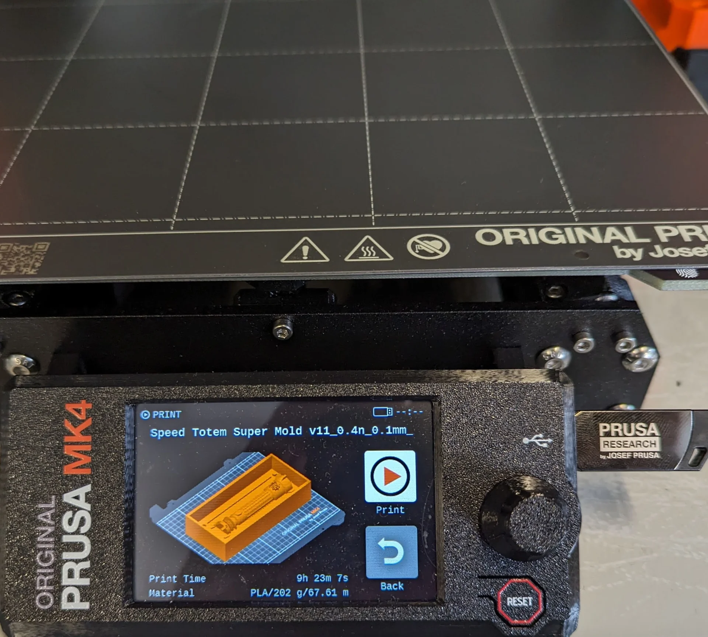

The last official entirely creative week! What I mean by this is that this was likely the last entirely self-contained project week - independent of the final project and not contributing to it - where I had to first learn a new process, then come up with an idea for what to do with it, design the project and use the process to create it - all within a single week. It's almost making me kind of nostalgic already but it is also a major relief as now I get to focus my efforts on the final project without having to be so all over the place. This is further helped by the fact that instead of having three other different courses in parallel, now I only have [linear algebra](https://www.aalto.fi/fi/avoimen-yliopiston-kurssit/linear-algebra). Being the last full project week puts a lot of pressure on keeping up the track record, however, and so I could not make just anything. Luckily, yet another shower thought struct and allowed me to do three things at once; make something cool for our absolutely amazing [Data Guild](https://dataguild.fi/), make something cool for this week and have it take the form of a lightsaber hilt, which I have wanted to design for ages.

## Assignments

- Review the safety data sheets for at least two of labs molding and casting materials.
- Make and compare test casts with each of them.
- Design a 3D mold around the stock and tooling that you'll be using.
- 3D print it using FDM printers
- Use it to cast parts.
- Include a hero shot and source files of your design in your documentation.

## Design

As already established, I would generally want everything I create to serve some kind of purpose in terms of being useful and preferably necessary or at least somewhat meaningful. Luckily we humans are great at ascribing meaning to anything and everything so the latter criteria is usally much easier to fulfill. I still found it difficult, however, as in terms of small plastic objects, I had already made a keychain and a cable holder during the [3D printing & scanning week]() and I could not figure out what else I would want to create at that scale.

Apparently one can mold and cast almost any types of material and of the rarer varieties, chocolate was mentioned as one of the explicit examples on the [global lecture](https://www.youtube.com/watch?v=ohZDPuDLI-c). I first considered making some funny shaped chocolate but I could not match my coursemate [Vytautas Bikauskas'](https://timeritualslabour.gitlab.io/digital-fabrication/week11.html) mean bar and austerity chocolate calendar, which I found hilarious! If you are reading this and want to ever commercialize it, hit me up! I can help with designing and making websites, doing market and customer research, pitching and branding as well as especially creating marketing and sales strategies ;D

I could not compete with that in the time I had and the process seemed a bit involved with special types of chocolates and warming it up etc. In order to catch up by next week, I have to do three weeks worth of work in one and thus I decided to follow the process as presented. This left me with plastic as the material. I considered creating a mold from the panther I 3D scanned in [week 5]() or making custom Chess pieces, which inspired me to think more about board games. This, on the other hand, led me to [Jungle Speed](https://en.wikipedia.org/wiki/Jungle_Speed), which became an enormous hit in our guild last autumn as we introduced it with Aawez and caused severe sleep deprivation to many due to multiple very long nights of continuous playing. 

It is a reflex-based pattern matching game where every time two or more people play the same shape, they must fight over a totem and the loser(s) who did not get it has to take their and the opponent's cards. First one to get rid of their cards wins and the game can be continued to arrive at a ranking. The totem is exactly in the right order of magnitude in terms of size and we just got a new guild room, which gives a great excuse for gifting DG a nice symbol capturing the spirit of this academic year - and it can be used for playing too, although you have to be more careful not to poke anyone in the eye with it than with the more rounded standard totem. Furthermore, we have been planning to have a Jungle Speed tournament for long and it might serve as a trophy for that too. Below is an image featuring some of the cards, the totem and its very approximate digital twin. 

I started by opening Fusion 360 and creating a new component for the totem, under which I created a closed sketch and made a body out of it using the "Revolve" operation around the Z-axis with the sketch selected as the profile. A 360° revolution around the Z-axis produced the above and below digital twin totem. This was very easy to edit with the points movable even in the 3D view with the correct component selected - allowing live sculpting. Another heavily utilized tool was the "Circular Pattern" tool, which duplicated objects symmetrically along the arc of a circle. These two in combination were everything extra one needs to create circular objects in addition to the basics tools discussed in [Computer-Aided Design]() in the context of Ondsel, which I was no longer confident using due to an incident in [week 9, Computer-Controlled Machining]().

I experimented with different side profiles and the idea of making it difficult to grab due to a weird, irregular shape or even spikes to make playing with it more interesting. Then I remembered that I had had a [lightsaber](https://en.wikipedia.org/wiki/Lightsaber) as a project idea for long. This was highly appropriate not only because I personally am a massive [Star Wars](https://en.wikipedia.org/wiki/Star_Wars) fan but because the majority of our guild is as well. In fact, our fuksi captain Pranav owns his own collection, one of which has been used as a prop and even a beacon in many events for this year's fuksis. Below are images of the final design in the design view and the render view. The coloring of the components is just a cool looking suggestion.

The design files can be found from the repository [here](https://gitlab.com/miro.keimioniemi/digital-fabrication-portfolio/-/tree/main/content/post/week-11) under [`content/post/week-11`](https://gitlab.com/miro.keimioniemi/digital-fabrication-portfolio/-/tree/main/content/post/week-11). Below is the 3D model of the custom Data Guild lightsaber Jungle Speed totem:



It is not the most impressive or elaborate design but it is what I had time for and regardless, it communicates the idea effectively by virtue of using many components and patterns inspired by various popular lightsabers. The grip stripes are inspired by all [Skywalker](https://starwars.fandom.com/wiki/Skywalker_lightsaber) and [Darth Vader lightsabers](https://starwars.fandom.com/wiki/Darth_Vader%27s_lightsaber) although they are perhaps closest in form to that of [Mace Windu's](https://starwars.fandom.com/wiki/Mace_Windu%27s_lightsaber), which is highly unique in every aspect - least because of how Samuel L. Jackson requested and got its blade to be purple in the movies. 

The end of the hilt is partially inspired by [Obi-Wan Kenobi's first two lightsabers](https://www.starwars.com/databank/obi-wan-kenobis-lightsabers) but was made with the purpose of maximizing flat surface area so that the totem could easily stand on its own in the middle of a table in a Jungle Speed game. The rings leading up to the nozzle were very common throughout Jedi lightsabers in general, with them being featured in, for example, [Luke Skywalker's](https://starwars.fandom.com/wiki/Luke_Skywalker%27s_lightsaber) and [Obi-Wan Kenobi's third lightsaber](https://starwars.fandom.com/wiki/Obi-Wan_Kenobi%27s_third_lightsaber). The protrusions on top are much less common and evoke perhaps more [Sith](https://starwars.fandom.com/wiki/Sith)-like associations within the Star Wars universe with a hint of [Barad-dûr](https://lotr.fandom.com/wiki/Barad-d%C3%BBr) as depicted in [The Lord of the Rings film series](https://en.wikipedia.org/wiki/The_Lord_of_the_Rings_(film_series)) beyond. This makes the DG lightsaber ambiguous in a very interesting way, such that its destiny may be decided entirely by its wielder.

The entire process started by me wanting to include the [Data Guild logo](https://dataguild.fi/wp-content/uploads/2023/07/dataguild_logo_raster_1280x1120_white_transparent.png) somewhere somehow already before I decided to make a lightsaber. Once I decided on the form, however, it was obvious that it would have to be at the bottom of the hilt if I wanted it to be large, which I did in order to guarantee its quality and highlight the lightsaber's identity. In fact, Data Guild could be something directly out of Star Wars too, which is pretty cool! 

As already mentioned, the bottom was made to be flat and wide to guarantee that it could easily stand on its own. Most of the hilt is also perfectly symmetrical 360° around the Z-axis, except for the details of the Data Guild logo and the button, which are only symmetrical over the ZY-plane. I wanted the DG logo to be visible from both sides but when adding the button, I realized that if I added it on both sides, I could get away with only printing a single master mold, out of which I could create two identical molds to create the lightsaber - saving a lot of time and material.

The end result is that the orientation of the lightsaber hilt does not matter and it looks just as good from all sides. Furthermore the double-sided button can be a symbol of intent and stability or their opposites as the lore might go so that both sides have to be pressed to activate the lightsaber, demanding more control and care from its user or that only one of them suffices so that which ever way the user grabs it, it lights up immediately. It might also be a sliding toggle, such that pushing it through onto one side activates one color and pushing it to the other activates another color, further adding to the ambivalence of the lightsaber.

## Making the mold

Below I document the entire mold making process from modeling to printing and molding, which is also documented by [Viktor Teodosin](https://teodosin.github.io/digital-fabrication/) for our this week's group assignment [here](https://teodosin.github.io/digital-fabrication/fablab-11-group).

### 3D modeling

After having a ready 3D model of the lightsaber, I then had to make both a negative and a positive mold so that I could 3D print the positive PLA master mold used to create the negative silicone mold, which would then be used to cast the plastic lightsaber. I did this by combining the base, handle and crown components along with buttons 1 & 2 and DG logos 1 & 2 to a new Saber component, which I duplicated by copying it and right clicking in the browser menu, from which I then chose the "Paste New" action to avoid linking them. I then created a new larger rectangle and extruded it a couple centimeters over half of the maximum diameter of the lightsaber. I used the combine tool to cut the former from the latter by selecting the rectangle as the target and all the bodies within the saber as the "Tool Bodies" as the boolean operator worked only on bodies and not on components. 

I then added a sketch onto the saber surface and drew two alignment pins, two holes, a rectangle and a rectangular hole, which can be seen as the blue highlights on the negative center mold in the middle in the above image. I extruded the ones on the left, except for the bottom one, which I moved onto the other side and inset the corresponding ones on opposite sides with an additional margin of 0.25 mm on both sides of all slots as recommended by our instructor. I then created another, yet larger 3D rectangle and subtracted the negative mold from it to acquire the positive mold on the right above. I made it with the dimensions of the [Ultimaker S3](https://ultimaker.com/3d-printers/s-series/ultimaker-s3/) in mind, those being 215mm width, 215mm depth and 200mm height. Thus, I limited the master mold size to 215mm in height, with around 100mm in width and 45mm in depth so that it would just fit lying on its back. I also added more space above to make it easier to remove the silicone mold from under the protrusions.

Due to approaching the modeling from a rapid prototyping angle, I had used only the bare minimum of the most essential constraints with both the original 3D model as well as the molds and the result is thus not parametric at all. This is not much of an issue, however, as it could still be done rather easily afterwards but also because the mold was made for an object of this exact size. Below is the positive master mold I 3D printed:



### 3D printing

I had made the mold design with the Ultimaker S3 in mind, which I had also reserved for Friday but once I got there, I heard it only had the BB core in use. There had also been some issues with many other printers as well. Kris recommended I use one of the [Prusa MK4](https://www.prusa3d.com/product/original-prusa-mk4-2/)s, which I had had no experience with yet thus far.

I was instantly won over. I really appreciate [their open-source ethos](https://www.prusa3d.com/en/page/open-source-at-prusa-research_236812/), like the look and really enjoy their [printing farm printing parts for their printers](https://www.youtube.com/watch?v=qqQzTvvrXo8). More importantly, however, I like the user experience and the degree of control they allow for - as well as the fact that they are much faster than the Ultimakers. In the below image one can see that the print is expected to take a bit over 9 hours, with the estimate beautifully broken down by part. Using the input shaper nozzle, the 9h 23min estimate with 0.1mm wipes the floor with that of Ultimakers' at over 19h at 0.15mm. Below are all the settings used, no others were touched.

The working printer at Aalto FabLab had ran out of filament but it was an easy process to change a new spool: navigate to "Settings" and make sure "Filament Sensor" is enabled, then navigate to "Filament" and press "Unload Filament" by pressing the navigation knob. Wait for the nozzle to heat up and then pull out the filament. Open the new roll, cut its end at a 45° angle, press "Load Filament" and gently push the end into the nozzle. It then purges a little bit of the filament to get rid of whatever might be left from the previous one and to make sure the nozzle works. If everything works as expected, you are done and may begin to 3D print, which works pretty much exactly like with Ultimakers as documented on [week 7](): slice, transfer file with a USB stick and print.

### Molding

## Casting

## Reflections

