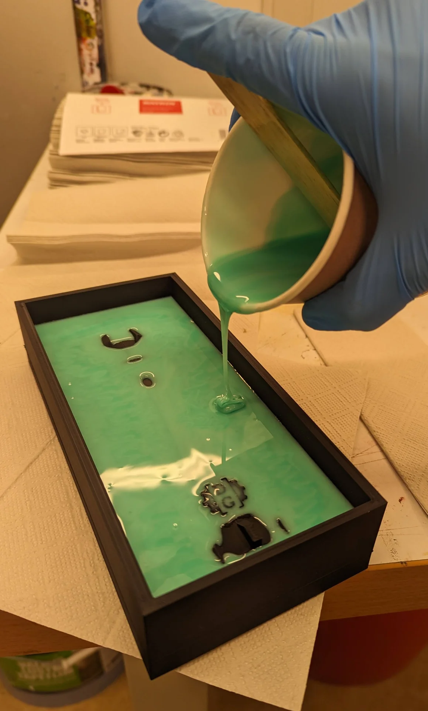
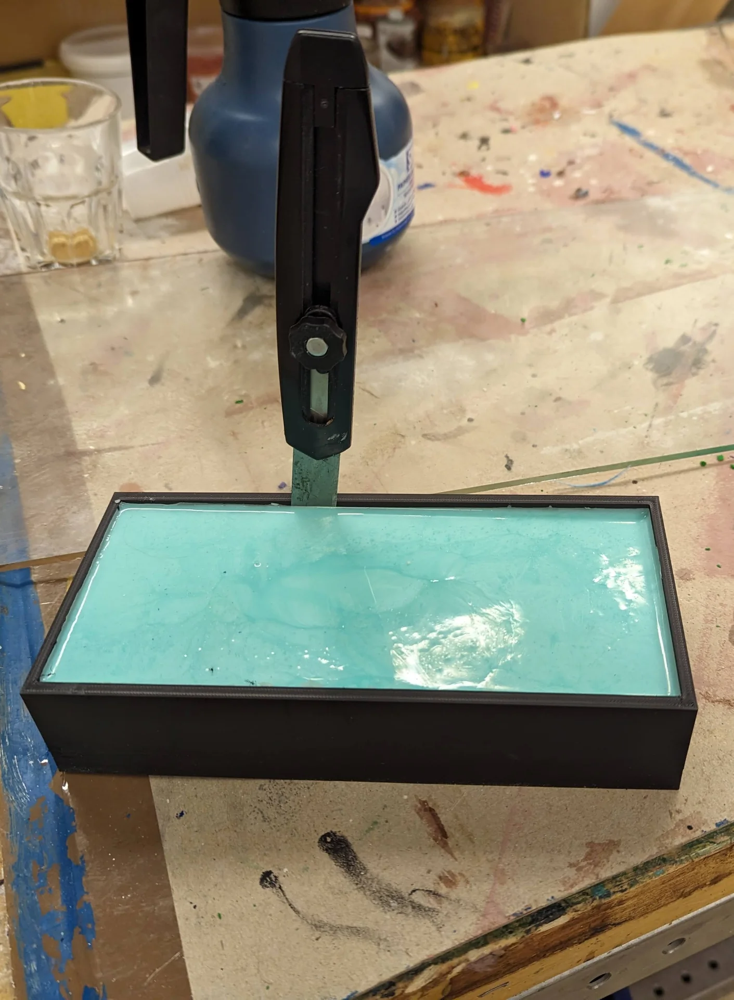
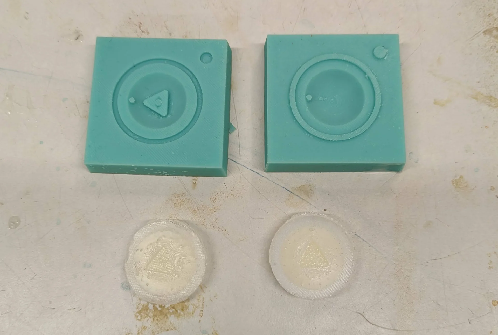
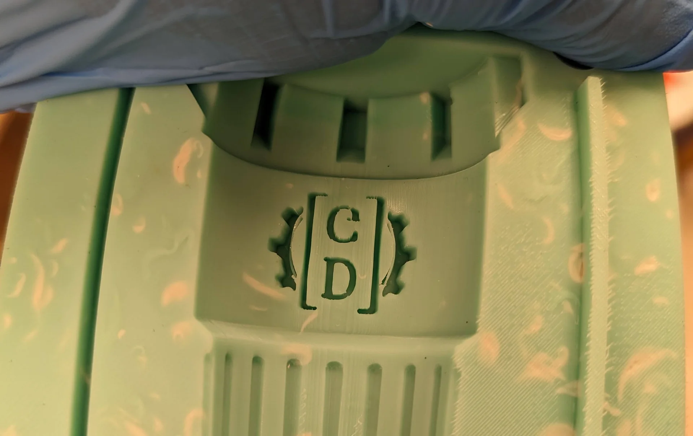
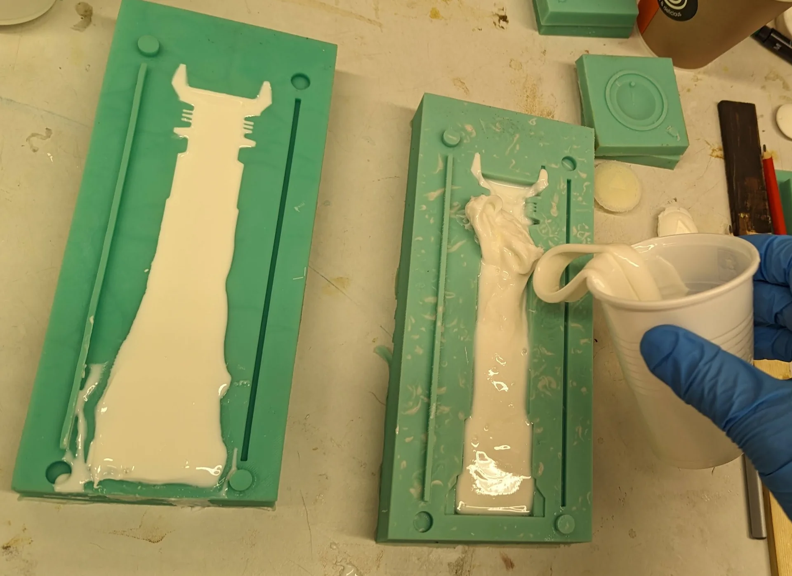

The last official entirely creative week! What I mean by this is that this was likely the last entirely self-contained project week - independent of the final project and not contributing to it - where I had to first learn a new process, then come up with an idea for what to do with it, design the project and use the process to create it - all within a single week. It's almost making me kind of nostalgic already but it is also a major relief as now I get to focus my efforts on the final project without having to be so all over the place. This is further helped by the fact that instead of having three other different courses in parallel, now I only have [linear algebra](https://www.aalto.fi/fi/avoimen-yliopiston-kurssit/linear-algebra). Being the last full project week puts a lot of pressure on keeping up the track record, however, and so I could not make just anything. Luckily, yet another shower thought struct and allowed me to do three things at once; make something cool for our absolutely amazing [Data Guild](https://dataguild.fi/), make something cool for this week and have it take the form of a lightsaber hilt, which I have wanted to design for ages.

## Assignments

- Review the safety data sheets for at least two of labs molding and casting materials.
- Make and compare test casts with each of them.
- Design a 3D mold around the stock and tooling that you'll be using.
- 3D print it using FDM printers
- Use it to cast parts.
- Include a hero shot and source files of your design in your documentation.

## Design

As already established, I would generally want everything I create to serve some kind of purpose in terms of being useful and preferably necessary or at least somewhat meaningful. Luckily we humans are great at ascribing meaning to anything and everything so the latter criteria is usally much easier to fulfill. I still found it difficult, however, as in terms of small plastic objects, I had already made a keychain and a cable holder during the [3D printing & scanning week]() and I could not figure out what else I would want to create at that scale.

Apparently one can mold and cast almost any types of material and of the rarer varieties, chocolate was mentioned as one of the explicit examples on the [global lecture](https://www.youtube.com/watch?v=ohZDPuDLI-c). I first considered making some funny shaped chocolate but I could not match my coursemate [Vytautas Bikauskas'](https://timeritualslabour.gitlab.io/digital-fabrication/week11.html) mean bar and austerity chocolate calendar, which I found hilarious! If you are reading this and want to ever commercialize it, hit me up! I can help with designing and making websites, doing market and customer research, pitching and branding as well as especially creating marketing and sales strategies ;D

I could not compete with that in the time I had and the process seemed a bit involved with special types of chocolates and warming it up etc. In order to catch up by next week, I have to do three weeks worth of work in one and thus I decided to follow the process as presented. This left me with plastic as the material. I considered creating a mold from the panther I 3D scanned in [week 5]() or making custom Chess pieces, which inspired me to think more about board games. This, on the other hand, led me to [Jungle Speed](https://en.wikipedia.org/wiki/Jungle_Speed), which became an enormous hit in our guild last autumn as we introduced it with Aawez and caused severe sleep deprivation to many due to multiple very long nights of continuous playing. 

It is a reflex-based pattern matching game where every time two or more people play the same shape, they must fight over a totem and the loser(s) who did not get it has to take their and the opponent's cards. First one to get rid of their cards wins and the game can be continued to arrive at a ranking. The totem is exactly in the right order of magnitude in terms of size and we just got a new guild room, which gives a great excuse for gifting DG a nice symbol capturing the spirit of this academic year - and it can be used for playing too, although you have to be more careful not to poke anyone in the eye with it than with the more rounded standard totem. Furthermore, we have been planning to have a Jungle Speed tournament for long and it might serve as a trophy for that too. Below is an image featuring some of the cards, the totem and its very approximate digital twin. 

I started by opening Fusion 360 and creating a new component for the totem, under which I created a closed sketch and made a body out of it using the "Revolve" operation around the Z-axis with the sketch selected as the profile. A 360° revolution around the Z-axis produced the above and below digital twin totem. This was very easy to edit with the points movable even in the 3D view with the correct component selected - allowing live sculpting. Another heavily utilized tool was the "Circular Pattern" tool, which duplicated objects symmetrically along the arc of a circle. These two in combination were everything extra one needs to create circular objects in addition to the basics tools discussed in [Computer-Aided Design]() in the context of Ondsel, which I was no longer confident using due to an incident in [week 9, Computer-Controlled Machining]().

I experimented with different side profiles and the idea of making it difficult to grab due to a weird, irregular shape or even spikes to make playing with it more interesting. Then I remembered that I had had a [lightsaber](https://en.wikipedia.org/wiki/Lightsaber) as a project idea for long. This was highly appropriate not only because I personally am a massive [Star Wars](https://en.wikipedia.org/wiki/Star_Wars) fan but because the majority of our guild is as well. In fact, our fuksi captain Pranav owns his own collection, one of which has been used as a prop and even a beacon in many events for this year's fuksis. Below are images of the final design in the design view and the render view. The coloring of the components is just a cool looking suggestion.

The design files can be found from the repository [here](https://gitlab.com/miro.keimioniemi/digital-fabrication-portfolio/-/tree/main/content/post/week-11) under [`content/post/week-11`](https://gitlab.com/miro.keimioniemi/digital-fabrication-portfolio/-/tree/main/content/post/week-11). Below is the 3D model of the custom Data Guild lightsaber Jungle Speed totem:



It is not the most impressive or elaborate design but it is what I had time for and regardless, it communicates the idea effectively by virtue of using many components and patterns inspired by various popular lightsabers. The grip stripes are inspired by all [Skywalker](https://starwars.fandom.com/wiki/Skywalker_lightsaber) and [Darth Vader lightsabers](https://starwars.fandom.com/wiki/Darth_Vader%27s_lightsaber) although they are perhaps closest in form to that of [Mace Windu's](https://starwars.fandom.com/wiki/Mace_Windu%27s_lightsaber), which is highly unique in every aspect - least because of how Samuel L. Jackson requested and got its blade to be purple in the movies. 

The end of the hilt is partially inspired by [Obi-Wan Kenobi's first two lightsabers](https://www.starwars.com/databank/obi-wan-kenobis-lightsabers) but was made with the purpose of maximizing flat surface area so that the totem could easily stand on its own in the middle of a table in a Jungle Speed game. The rings leading up to the nozzle were very common throughout Jedi lightsabers in general, with them being featured in, for example, [Luke Skywalker's](https://starwars.fandom.com/wiki/Luke_Skywalker%27s_lightsaber) and [Obi-Wan Kenobi's third lightsaber](https://starwars.fandom.com/wiki/Obi-Wan_Kenobi%27s_third_lightsaber). The protrusions on top are much less common and evoke perhaps more [Sith](https://starwars.fandom.com/wiki/Sith)-like associations within the Star Wars universe with a hint of [Barad-dûr](https://lotr.fandom.com/wiki/Barad-d%C3%BBr) as depicted in [The Lord of the Rings film series](https://en.wikipedia.org/wiki/The_Lord_of_the_Rings_(film_series)) beyond. This makes the DG lightsaber ambiguous in a very interesting way, such that its destiny may be decided entirely by its wielder.

The entire process started by me wanting to include the [Data Guild logo](https://dataguild.fi/wp-content/uploads/2023/07/dataguild_logo_raster_1280x1120_white_transparent.png) somewhere somehow already before I decided to make a lightsaber. Once I decided on the form, however, it was obvious that it would have to be at the bottom of the hilt if I wanted it to be large, which I did in order to guarantee its quality and highlight the lightsaber's identity. In fact, Data Guild could be something directly out of Star Wars too, which is pretty cool! 

As already mentioned, the bottom was made to be flat and wide to guarantee that it could easily stand on its own. Most of the hilt is also perfectly symmetrical 360° around the Z-axis, except for the details of the Data Guild logo and the button, which are only symmetrical over the ZY-plane. I wanted the DG logo to be visible from both sides but when adding the button, I realized that if I added it on both sides, I could get away with only printing a single master mold, out of which I could create two identical molds to create the lightsaber - saving a lot of time and material.

The end result is that the orientation of the lightsaber hilt does not matter and it looks just as good from all sides. Furthermore the double-sided button can be a symbol of intent and stability or their opposites as the lore might go so that both sides have to be pressed to activate the lightsaber, demanding more control and care from its user or that only one of them suffices so that which ever way the user grabs it, it lights up immediately. It might also be a sliding toggle, such that pushing it through onto one side activates one color and pushing it to the other activates another color, further adding to the ambivalence of the lightsaber.

## Making the mold

Below I document the entire mold making process from modeling to printing and molding, which is also documented by [Viktor Teodosin](https://teodosin.github.io/digital-fabrication/) for our this week's group assignment [here](https://teodosin.github.io/digital-fabrication/fablab-11-group).

### 3D modeling

After having a ready 3D model of the lightsaber, I then had to make both a negative and a positive mold so that I could 3D print the positive PLA master mold used to create the negative silicone mold, which would then be used to cast the plastic lightsaber. I did this by combining the base, handle and crown components along with buttons 1 & 2 and DG logos 1 & 2 to a new Saber component, which I duplicated by copying it and right clicking in the browser menu, from which I then chose the "Paste New" action to avoid linking them. I then created a new larger rectangle and extruded it a couple centimeters over half of the maximum diameter of the lightsaber. I used the combine tool to cut the former from the latter by selecting the rectangle as the target and all the bodies within the saber as the "Tool Bodies" as the boolean operator worked only on bodies and not on components. 

I then added a sketch onto the saber surface and drew two alignment pins, two holes, a rectangle and a rectangular hole, which can be seen as the blue highlights on the negative center mold in the middle in the above image. I extruded the ones on the left, except for the bottom one, which I moved onto the other side and inset the corresponding ones on opposite sides with an additional margin of 0.25 mm on both sides of all slots as recommended by our instructor. I then created another, yet larger 3D rectangle and subtracted the negative mold from it to acquire the positive mold on the right above. I made it with the dimensions of the [Ultimaker S3](https://ultimaker.com/3d-printers/s-series/ultimaker-s3/) in mind, those being 215mm width, 215mm depth and 200mm height. Thus, I limited the master mold size to 215mm in height, with around 100mm in width and 45mm in depth so that it would just fit lying on its back. I also added more space above to make it easier to remove the silicone mold from under the protrusions.

Due to approaching the modeling from a rapid prototyping angle, I had used only the bare minimum of the most essential constraints with both the original 3D model as well as the molds and the result is thus not parametric at all. This is not much of an issue, however, as it could still be done rather easily afterwards but also because the mold was made for an object of this exact size. Below is the positive master mold I 3D printed:



### 3D printing

I had made the mold design with the Ultimaker S3 in mind, which I had also reserved for Friday but once I got there, I heard it only had the BB core in use. There had also been some issues with many other printers as well. Kris recommended I use one of the [Prusa MK4](https://www.prusa3d.com/product/original-prusa-mk4-2/)s, which I had had no experience with yet thus far.

I was instantly won over. I really appreciate [their open-source ethos](https://www.prusa3d.com/en/page/open-source-at-prusa-research_236812/), like the look and really enjoy their [printing farm printing parts for their printers](https://www.youtube.com/watch?v=qqQzTvvrXo8). More importantly, however, I like the user experience and the degree of control they allow for - as well as the fact that they are much faster than the Ultimakers. In the below image one can see that the print is expected to take a bit over 9 hours, with the estimate beautifully broken down by part. Using the input shaper nozzle, the 9h 23min estimate with 0.1mm wipes the floor with that of Ultimakers' at over 19h at 0.15mm. Below are all the settings used, no others were touched.

The working printer at Aalto FabLab had ran out of filament but it was an easy process to change a new spool: navigate to "Settings" and make sure "Filament Sensor" is enabled, then navigate to "Filament" and press "Unload Filament" by pressing the navigation knob. Wait for the nozzle to heat up and then pull out the filament. Open the new roll, cut its end at a 45° angle, press "Load Filament" and gently push the end into the nozzle. It then purges a little bit of the filament to get rid of whatever might be left from the previous one and to make sure the nozzle works. If everything works as expected, you are done and may begin to 3D print, which works pretty much exactly like with Ultimakers as documented on [week 7](): slice, transfer file with a USB stick and print.

The 3D-printed suped mold came out very nicely, although, upon going to check its progress just before the fablab would close for the weekend, I heard from Solomon that it had had to be restarted. On the second attempt it came out quite beautifully and after sanding the backs of the protrusions that were printed as overhangs a bit to flatten them, it was ready for use as as the master mold.

### Molding

I filled the super mold with water to get a rough approximation of the volume / weight required to fill up the mold. As can be seen below, it took almost two of the largest single use cups available at the lab as the mold was rather large.

For making the negative silicone molds, I used [Mold Star 15 SLOW](https://www.smooth-on.com/products/mold-star-15-slow/), which has a 1:1 mixing ratio both by volume and by weight between its A and B components with a pot life of 50 minutes and a cure time of 4 hours. Pot life refers to the time beginning immediately upon mixing during which the mix remains lower viscosity and does not yet harden. Cure time on the other hand refers to the time it takes for the mold to harden after the pot life is over. Using Mold Star 15, one can thus create a fully functioning mold in approximately 5 hours.

Before using any chemical products, reading their [instructions](https://www.smooth-on.com/tb/files/MOLD_STAR_15_16_30_TB.pdf) and the [safety data sheet](https://www.smooth-on.com/msds/files/BD_DS_Eco_Equ_EZB_EZS_Psy_MS_OOMOO_Reb_ST_SS_Soma_Sol_Sorta.pdf) is of utmost importance and absolutely mandatory. In addition to the abovementioned properties and a lot of other data ranging from hardness to tensile strength and usable temperature range, the overview contains information on its safe and optimal use. The only safety note in that is that the material might be irritating to the eyes and should thus be used only in a properly ventilated area with safety glasses, long sleeves and vinyl rubber gloves to minimize contamination risk. 

The safety data sheet is much more extensive and so would make even water sound dangerous due to 15 sections of potential hazards, but reading through it reveals nothing more alarming than what was already discussed. Most points are merely common sense written down. As the substances and their mixture are not classified as hazardous, it is safe to assume this is the case for all the other points that are not detailed in the [overview](https://www.smooth-on.com/tb/files/MOLD_STAR_15_16_30_TB.pdf).

The process of creating the molds was initially a bit intimidating due to how much of the mixture I needed and how it could get really messy. There was a limited amount of the materials and I felt bad about using as much as I did already so I could not afford a failed attempt. I like to think that I really only used one set properly as the other that I supplemented the first with felt a lot more clumpy and high viscosity but was no problem for the non-detailed parts of my large mold.

Luckily the process was simple and straightforward and I succeeded perfectly on the first try. I put on a lab coat and some gloves and stirred both parts A and B separately using different wooden mixing sticks before checking the time and pouring both parts in the same cup, which I mixed thoroughly for about 5 minutes trying my best to avoid air bubbles by only moving the stick horizontally and occasionally scraping the bottom and sides. 

I then poured the mixture into the super mold, attempting to keep the stream uniform and small to avoid air bubbles in the pouring phase. Technically, one should apparently also start from the lowest point of the mold and pour it more or less in the same place but I wanted to make sure that all the details such as the alignment pins and especially the DG logo were properly filled and so I made sure to pour some on them with an extra fine stream to make sure they were fully filled before pouring more with a larger stream to really push the mixture into them. I also moved the stream around the lightsaber to make it rise in a more uniform matter. Once all the fine detail was covered, I poured the rest with a larger stream and scraped everything off with a wooden stick in order to get to the second cup, as I needed almost two to entirely cover it.

I then degassed the poured mixture by placing it in the vacuum chamber, turning on the compressor and occasionally removing the plug in the cover. This did not do much but then again there were not many air bubbles for me in the first place. I then lifted it up onto a shelf to cure for around 4.5h for the first mold.

The mold took a total of 600g of the material with 300g of parts A and B each. The first cup fit approximately 360g and a further 240g was needed to fill the mold pretty much perfectly. After 4.5h of [Wappu](https://wappu.fi/) activities I returnedd to the FabLab to remove the fully cured mold, which had overflowed a bit when lifting it up on the shelf but as the spill had also cured, it was quite satisfying to remove. 

I started loosening the mold by carefully pulling its sides and corners towards the center until I could slip one of the wooden sticks in there, which I could use as a lever to pull out enough for me to get a grip of the mold. I was careful to start removing it from the right end, that being the bottom as the protrusions were at the top. I could identify the ends by the spill and the very slight irregularities on the outside of the 3D print but it would have been a great idea to properly mark this down somehow too. 

I lifted the mold out slowly and carefully with one continuous move until was close to the top. Then I grabbed the buffer of the mold before the top part, bent it quite a bit and slid the mold out from under the protrusions, which, with a bit of force applied in the horizontal direction to overcome the friction, worked beautifully and gave me a nice mold without breaking either the 3D-printed master mold nor the new silicone mold. It looked really good too with barely noticable hints of the 3D-printed surface and mostly well produced details. Only the thin square brackets of the DG logo had closed up a bit during the removal, but these were easy to separate with a knife and a bit of careful courage.

I then repeated the process to create the second mold using the same master mold, which I then left to cure overnight. Coming back the next day, the removal process was not quite as smooth as it had hardened a lot more than the first one had. This was clearly noticeable by it being much harder to loosen even from the edges. Having pulled out the first one carefully and observed how quite a lot of bending, stretching and poking had not really damaged it at all, I adapted a much more aggressive technique for the second mold by first separating its sides from the master mold using a utility knife and then practically just ramming a wooden stick in there, again using it as a lever and pulling it out, but a lot less delicately than the first time. 

I tried to be just as careful with the protrusions as the first time but because of the additional stiffness of the mold, I had to use a bit more force to grab a hold of the buffer, which soon resulted in a crack sound. After getting the mold out, I noticed that the protrusions had indeed snapped and were stuck inside the mold. They were easy to pull out with some sharp pliers but the master mold was finished. Looking back on it now, it snapped kind of perfectly and it might actually be a perfectly valid strategy to glue it on with a very weak adhesive so that it is actually supposed to come out for every mold and then glued back. I do not know how good this would look mold-wise however... The bottom of the saber was not quite perfectly smooth either but this I decided to address in the post production phase of the casted sabers so as to not risk damage to the mold.

The positives of a much more rigid mold at the removal phase were that all details had been reproduced almost perfectly. The DG logo came out looking very good and did not require any restoration work. Even the tiny curves between the square brackets and the gears, the reproduction of which I did not dream about for the first model, came out perfectly on the left side - although not quite as perfectly on the right, but still better than in the first one. As can be seen below, the right side gear also had some extra material, which I just pulled out with some small, sharp pliers as these would be the make it or break it details. Below are the ready molds with the first one on the right and the second in the middle.

In addition to the level of detail, another curious detail is the difference in texture and color. Both of the molds are roughly as hardened - only the second finished its complete curing in the mold whereas the first did so outside - but the second is also a bit lighter with white spots. The only explanation I can come up with for his is that the second one was not as well mixed although I find that hard to believe as I was just as carefuly if not more so with it than with the first one. Another might have something to do with it being in the mold for so long that somehow whatever the white parts are, somehow settled on the bottom. These could have something to do with the quality of the material used for the second one as it was a mix of the then freshly opened bottles used for the first mold and older bottles with a higher viscosity.

## Casting

The making of the molds was highly successful but actually casting the lightsabers using the molds did not seem nearly as promising. We had been taught the process using [Smooth-Cast 305](https://www.smooth-on.com/products/smooth-cast-305/), which had a pot life of 7 minutes and a cure time of 30 minutes. However, there was only very little left of it so that I was not sure whether it would be enough for a full lightsaber. The second material available at the lab that there was more of, was [Smooth-Cast 325](https://www.smooth-on.com/products/smooth-cast-325/), which had a pot life of 2.5 minutes, a cure time of 10 minutes and was semi-translucent.

My entire design had assumed the white, opaque material and its size required a longer pot life. Regardless, I made few test casts with it to first try out the casting process in general and secondly to see how they would look. The upside of such short pot life and curing time was that it was very fast to make those few test casts with the instruction session molds but I had trouble with those already. The object was so small that the mold filled very fast so that it was hard to judge what was the right amount to pour in them as a millimeter too much made it impossible to close the mold whereas a millimeter too little might not fill up the entire mold. Below are the second and third test casts. The first one was so horrendous that I threw it away even before taking a picture.

Above are two of the test casts, which can be observed to be the ugliest and most opaque translucent I have seen, even when the rightmost one looks decent shapewise. Furthermore, they had a lot of air bubbles even though I tried to stir them as carefully and thoroughly as possible within the 2.5min pot life. 

I asked our instructor if there were any other materials remaining at the lab with a longer pot life, as I was certain that I could not cast an entire lightsaber with the Smooth-Cast 325 - and even if I could, it would look very ugly, defeating the point of having created a nice, elaborate design. He initially dismissed the inquiry with a no but seeing the molds in our review session mentioned that he would have to double check. Upon that second check, we discovered [Smooth-Cast 300](https://www.smooth-on.com/products/smooth-cast-300/), which had a pot life of 3 minutes. I decided that it would be my best bet as every second was precious. 

Smooth-Cast 300 has a pot life of 3 minutes and a curing time of 10 minutes and upon making a quick test cast, it was a nice, opaque bright white, which made all the details stand out nicely. These have a lot more elaborate [safety sheets](https://www.smooth-on.com/msds/files/SC_300_300Q_320_380_45D_60D_61D_65D_66D_ONYX.pdf) with hazards for skin corrosion/irritation, skin sensitization, eye damage/irritation, acute toxicity upoin inhalation, respiratory sensitization, carcinogenicity and a couple different types of "specific target organ toxicity" one of which is written with title capitalization. 

This does not really translate to any different usage instructions however - only to more severe consequences for failing to follow them. The protocol is to still use chemical-resistant gloves, safety glasses, a long sleeved lab coat while handling it in a very well ventilated room, which is very important to avoid breathing in the fumes, which can actually be dangerous in this case. The combination of the parts A and B can also heat up up to 100°C, which must be taken into account when handling it. 

As an additional general note on procedure, it is good practice to rather change gloves and mixing sticks rather too often than not often enough, as evident from me having to literally wrench open one of the Smooth-Cast 325 bottles for the previous test casts as a little bit of the material had presumably mixed in the lid. Below are test casts of the Smooth-Cast 300.

After having practiced a bit with the Smooth-Cast 325 first, the test cast for Smooth-Cast 300 came out very nicely on the first try with no bubbles whatsoever. Furthermore, the details and the surface finish are very visible and the color is very pleasant to look at as compared to the test casts on the left in the picture on the right above. An additional welcome feature was that the curing process is highly visible, with the mixture turning white from the center upon starting to cure. 

A many times larger, highly detailed object was still a daunting task but at least now it would look good should it prove to be successful. I pressed play on the recently bought and downloaded old episodes of one of my favorite podcasts - [Dan Carlin's Hardcore History](https://www.dancarlin.com/hardcore-history-series/) - and got to work with intense focus by first measuring the amount of Smooth-Cast 300 needed.

The mold held approximately 51 grams of water when filled but in terms of weight, it took a bit more Smooth-Cast at around 56g of the combined mixture. The mixing ratio of the parts A and B was by volume 1A:1B but 100A:90B by weight. Thus, eyeballing it on the spot, I aimed to pour approximately 29g of part A and 27g of part B but often went a bit over that due to trying to hurry up with the process. Then I just tried to make sure I had a tad more of part A before moving on to quickly stirring the mixture in a plastic cup, which was recommended by the [overview](https://www.smooth-on.com/tb/files/Smooth-Cast_300q,_300,_305___310.pdf), first aggressively - but level - and then more slowly and thoroughly before carefully pouring it into the mold, starting with the DG logo that required the highest quality detail and thus most care when pouring.

On my first failed attempt I bent the bottom of the mold over the table's edge with one hand while pouring with the other in order to open up the DG logo to ensure its proper filling but forgot to push the mold back on the table before it already started curing, which resulted in ugly overflow on the bottom as seen below. Due to the hassle I did not have time to do the same for the other side, the result of which can be seen in the rightmost picture, where the gears of the logo are as they should be but everything else is practically almost flat. On subsequent attempts, I employed a similar strategy but remembered to push the mold so that it is fully horizontal on the table. 

Timing-wise my strategy was to try finish filling up one mold in the 3-minute pot life time after which I immediately redo the process for the other mold with new cups and sticks waiting right next to me so that when I had poured the new mixture in the other mold, the first one was already halfway cured and could thus be lifted already on top of the second mold which only just started curing. This way I could complete the entire process in about 15 minutes still within the cure times of both, which I further enhanced by placing a lot of weight on top of the molds.

Below is a posthumous picture of my most spectacularly failed attempt, where I was just a little bit too slow and the mixture cured while I was still pouring it. Naturally, I do not have many pictures of the process due to the incredible time pressure but at least the fails could be nicely documented. 

I managed to turn these into wins too, however, by processing the first one to be representative enough to convey the idea while being a bit malformed still so as to it not being a terrible shame if it were to break. Thus it can be used for actually playing Jungle Speed, whereas the actually succesful, good looking one can be used as a trophy or a statue. The second failure was so severe that I could not even combine the sides into a single object. Thus I sawed off the clump at the back of the other and sanded them flat to use as columns to frame a quick makeshift shrine for our [adult friendship book](https://www.suomalainen.com/products/aikuiset-ystavani-1), which, on a quick glance, looks like its framed by columns of classical architecture that prove to be lightsabers upon a closer inspection.

Removing the freshly cured lightsaber jungle speed totem from the molds was as simple as opening the mold from the right (bottom) end and simultaneously lifting and horizontally sliding it off the below mold and then pulling the finished mold free.

I processed them by twisting off the excess material at the seams using pliers and sanding down what remained, which extra care applied to the bottom so that they would be as stable as possible. The front and back protrusions came out a bit shorter and irregular so I sanded them down too but as this fault was symmetric, it looks more like design rather than a mistake. 

Below are two of the processed whole casts and a 3D-print for reference.

## Reflections

This "week" that was really more like 3 was quite long, demanding and convoluted but ultimately highly rewarding! I am very happy with the outcome in terms of both design and how they turned out as real physical objects. In addition, I learned a tremendous amount of highly valuable information, both figuratively and literally as so much of modern production is molding and casting based.

The cast lightsabers are more weighty at around 110 grams than the 3D-printed one at around 60g with 20% infill density, making them feel a bit more premium with just the right amount of weight. They are also easier to process with a smoother surface partially thanks to the horizontally printed mold and the bright white looks great compared to the slightly pinkish 3D-print, which took between 4 and 5 hours to print with normal settings, where it took double to print the master mold but after which new sabers could be cast practically every 20 minutes, although their processing takes a bit of time too.

Overall, I am baffled by how all of this has been crammed into one week in the [Fab Academy](https://fabacademy.org/) with 3/4D milling on top of it too but I am also very grateful for the opportunity to do and learn all this and get a cool relic out of it too. I cannot wait to gift these to Data Guild at our guild room opening ceremony! 

