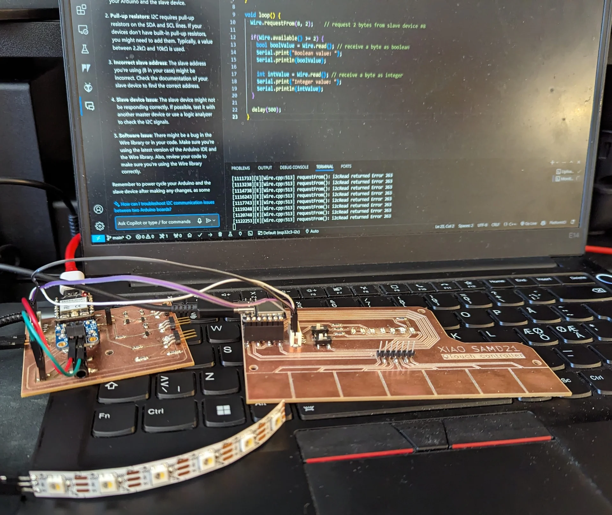

This and much of the documentation of the following weeks apart from system integration, is written retroactively after the major crunch necessary to finish the final project in time. As a result, the extensiveness, detailedness and particularly the story beats relating to the details of the ups and downs might be a bit lacking in terms of detail in comparison to previous weeks. 

As can be seen below, our assignment was to specifically explore the Wi-Fi capabilities of the XIAO ESP32C3 board, which I had already chosen to be the main microcontroller of my final project. I explored the Wi-Fi route for a moment but quickly determined that it would not be optimal for the wireless communication necessary for the [final project]() due to how it would either limit its usage into a single network and therefore space, or the connected device's internet access without significantly increasing the project's complexity. Instead, Bluetooth Low Energy was practically perfect for intermittently sending a few integers back and forth, which is why I chose that as the primary wireless communication protocol. 

I used the XIAO SAMD21 for detecting touch and recognizing gestures and hence I had to sync the internal state of the lamp between the two microcontrollers. This I chose to do via I2C mostly because of the pin configurations of the XIAOs but also due to its simplicity of use. 

## Assignments

**Group assignment**

- Join an introduction session to get an overview of networking possibilities with XIAO ESP32
- Pick a group leader who is going to populate the group assignment page
  
**Individual assignment**

- Link to the group assignment page and describe what did you learn individually.
- Explore the WiFi capabilities of the XIAO ESP32C3 board.
- Plug it into one of the boards you produced earlier.
- Program the XIAO board to spawn an Access Point and create a simple REST API.
- The REST API should have endpoints for controlling output device(s) of your board as well as reading input.
- Document as you go and publish content on a page on your documentation website.

## Inter-Integrated Circuit (I2C)

I started, in order of importance, with the Inter-Integrated Circuit (I2C) protocol to make the microcontrollers communicate with each other locally using the [Arduino Wire library](https://www.arduino.cc/reference/en/language/functions/communication/wire/). To begin, I studied the I2C protocol and its concrete implementation from [this article](https://docs.arduino.cc/learn/communication/wire/). In short, it is a relatively simple protocol for transferring data over short distances between microcontrollers and sensors on the same board or closely connected to it using only two pins: the serial clock pin (SCL) and the serial data pin (SDA). The SCL provides a steady clock signal by pulsing at a regular interval so that the data pin can be used to transmit data both ways and to multiple peripherals with different addresses. Therefore, multiple devices can be connected to a bus and they can all individually send and receive data from the master.

To implement I2C in practice, make sure that all devices share common ground and connect the SDA pin of the master to the SDA pins of the slaves and likewise the SCL pins to SCL pins. Between boards, this is typically done via [Qwiic](https://www.sparkfun.com/qwiic), [STEMMA QT](https://learn.adafruit.com/introducing-adafruit-stemma-qt/what-is-stemma-qt) or [Grove](https://wiki.seeedstudio.com/Grove_System/) connectors but as, for my final board, I had all the components on the same board, it sufficed to connect the XIAOs SDA to SDA and SCL to SCL via traces on the board as the whole board shared the same ground anyway.

The [example code](https://docs.arduino.cc/learn/communication/wire/#examples) in the article is very simple and worked immediately as expected. Adapting it for my code was not immediately successful, however, as I continued to bump into the following error message on the master device on my first attempt:

```
[1147793][E][Wire.cpp:513] requestFrom(): i2cRead returned Error 263
```



I never quite figured out what exactly the issue was as sit might have something to do with the poor connection due to our lab not having the correct 4-pin JST connectors and me imporvising with regular jumper cables in the too tight connector as shown above. It was unfortunate that the testing did not work but I proceeded to creating the final board anyway, on which it worked after a bit of adjusting.



The demo is not too impressive in terms of accuracy both because of the haphazard, quick random wiring and a lot of noise due to long wires and no calibration of sensitivity etc. but it clearly demonstrates the LED strip, which is connected to the XIAO ESP32C3 reacting to touch input from the XIAO SAMD21 which communicates with the ESP32C3 in real time over I2C.

This was accomplished after a while of debugging, during which I discovered a timing issue with the I2C Wire communication. Originally, the LEDs were being lit with a separate lightLED function iterating through the entire strip and turning on the LEDs with the given brightness and color. This contributed to the issue in a major way, likely due to blocking the loop during its execution but even when not calling it, the wire communication only worked for a while, until it started returning -1 for the rest of the time after a while. I then refactored and cleaned the code on both devices and initialized wire as the last thing in both setups, which got rid of the issue. 

### XIAO SAMD21

Below is a walkthrough of the parts of the final code running on the XIAO SAMD21 that are relevant to the I2C communication for a slave. The full code can be found from the repository [here](https://gitlab.com/miro.keimioniemi/digital-fabrication-portfolio/-/blob/main/content/post/week-12/samd21-i2c/src/main.cpp?ref_type=heads).

I2C communication can be handled seamlessly via the built-in [Arduino Wire library](https://www.arduino.cc/reference/en/language/functions/communication/wire/), which provides useful functions to begin and end communication and transmissions, read and write data and to control timeouts and the clock.

```C
#include <Wire.h>
```

In C, functions must be declared before use even if they are not defined as the files are compiled from top to bottom. 

```C
// Utility function declarations
void receiveEvent(int howMany);
void requestEvent();
```

Initialize the Wire class in slave mode by giving an address as an argument as the last task in setup and set the functions to handle data sent and requests made by the master device, which is the connected XIAO ESP32C3 in this case.

```C
void setup() {
  
  ...

  // Initialize the I2C communication in slave mode with address 8
  Wire.begin(8);         
  Wire.onReceive(receiveEvent);      
  Wire.onRequest(requestEvent);
}
```

Define the functions that handle incoming and outgoing data. Upon a request by the master device, write the values of the `power_on` and `brightness` variables to the I2C channel as unsigned 8-bit integers. `power_on` is of type `bool` ranging from 0 to 1 and `brightness` is of type `char` but only ranges betwen 0 and 255. Upon a transmission, read the new values to them sent by the master device while data is available in the channel. 

```C
// A function to send the power_on and brightness values via I2C upon request
void requestEvent() {
  Wire.write((uint8_t)power_on);
  Wire.write((uint8_t)brightness);
}

// A function to receive the power_on and brightness values via I2C
void receiveEvent(int howMany) {
  while (Wire.available()) { 
    power_on = Wire.read();
    brightness = Wire.read();
  }
}
```

This is all that is necessary for the peripheral device in slave configuration. Nothing needs to be written in the loop, because the Wire library automatically handles incoming data and requests according to the specifications above.

### XIAO ESP32C3

Below is a walkthrough of the parts of the final code running on the XIAO ESP32C3 that are relevant to the I2C communication for the master. The full code can be found from the repository [here](https://gitlab.com/miro.keimioniemi/digital-fabrication-portfolio/-/blob/main/content/post/week-12/esp32c3-bluetooth/src/main.cpp?ref_type=heads).

The [Arduino Wire](https://www.arduino.cc/reference/en/language/functions/communication/wire/) library must again be included. It handles both the master and slave roles.

```C
#include <Wire.h>
```

Initialize the Wire class in master mode by giving no arguments to the begin function. 

```C
void setup() {

  ...

  // Initialize I2C communication in master mode
  Wire.begin();

  ...

}
```

During each loop, request the latest values of the SAMD21 state variables and sync them with those of the ESP32C3 if they have changed. The `requestFrom()` function takes as parameters the address of the peripheral of interest and the number of bytes to be requested and returns the number of bytes returned from the peripheral device. `beginTransmission(address)` and `endTransmission()` signify the beginning and end of transmissions with, in this case, writes in between to send data to the peripheral device. 

```C
void loop() {

  ...

  // Check if there is data available on the I2C bus
  if (Wire.requestFrom(8, 2) == 2) {

    // Sync values from the conductance sensor via I2C
    while (Wire.available()) {
      int newIsOn = Wire.read();
      int newBrightness = Wire.read();

      // Update the values only if they have changed
      if (newIsOn != isOn) {
        isOn = newIsOn;

        Wire.beginTransmission(8);
        Wire.write(isOn);
        Wire.write(brightness);
        Wire.endTransmission();

        ...

        }

      if (newBrightness != brightness) {
        brightness = newBrightness;

        Wire.beginTransmission(8);
        Wire.write(isOn);
        Wire.write(brightness);
        Wire.endTransmission();

        ...

      }
    }
  }

  ...

}
```

## Wi-Fi & REST API

To explore the ESP32C3's Wi-Fi capabilities, I adapted [this example](https://gitlab.com/kriwkrow/networking-with-xiao-esp32-demo) simply by including the [FastLED library](https://fastled.io/) and defining the LED strip with some state variables to replace the previous ones. I then modified the loop to turn the LEDs on and off depending on the HTTP request made as shown below:

```C
// REST API with JSON Example (WiFi client version)
// Created 2024-04-24 by Krisjanis Rijnieks

// Include libraries used
#include <Arduino.h>
#include <WiFi.h>
#include <AsyncTCP.h>
#include <FastLED.h>
#include <ESPAsyncWebServer.h>
#include "ArduinoJson.h"

// Define the number of LEDs and the data pin and instantiate the LED array
#define NUM_LEDS 120
#define DATA_PIN D8
CRGB leds[NUM_LEDS];

// Define the WiFi SSID and password
const char* ssid = "ssid";
const char* password = "password";

// Define the state variables as server objects
bool powerOn = false;
char brightness = 10;
CRGB color = CRGB(255, 255, 255);
int nextAlarm = 11;
int currentTime = 10;
char selectedAnimation = 1;

// Initialize the server
AsyncWebServer server(80);

void setup() {
  // Initialize the LED strip
  FastLED.addLeds<NEOPIXEL, DATA_PIN>(leds, NUM_LEDS);
  FastLED.setBrightness(10);

  // Initialize the serial communication
  Serial.begin(115200);

  // Initialize the WiFi connection
  WiFi.begin(ssid, password);
  while (WiFi.status() != WL_CONNECTED) {
    delay(1000);
    Serial.println("Connecting to WiFi...");
  }

  Serial.println("Connected to WiFi\n");
  
  // Print the IP address of the server
  Serial.println("Access REST API: ");
  Serial.print("http://");
  Serial.println(WiFi.localIP());
  Serial.println();

  // Define the server endpoints
  server.on("/", HTTP_GET, [](AsyncWebServerRequest *request){
    request->send(
      200, "text/plain", 
      "Welcome to the LED Zeppelin REST API!\n\nAvailable endpoints are\n/toggle\n/on\n/off\n/json?data={\"state\":\"on|off\"}"
    );
  });

  server.on("/toggle", HTTP_GET, [](AsyncWebServerRequest *request) {
    powerOn = !powerOn;
    request->send(200, "application/json", "OK");
  });
  
  server.on("/on", HTTP_GET, [](AsyncWebServerRequest *request) {
    powerOn = true;
    request->send(200, "application/json", "OK");
  });

  server.on("/off", HTTP_GET, [](AsyncWebServerRequest *request) {
    powerOn = false;
    request->send(200, "application/json", "OK");
  });

  server.on("/json", HTTP_GET, [](AsyncWebServerRequest *request) 
  {
    if(request->hasParam("data")){
      String jsonInString = request->getParam("data")->value();
      Serial.print("Reveived data: ");
      Serial.println(jsonInString);

      char jsonInChar[jsonInString.length() + 1];
      jsonInString.toCharArray(jsonInChar, sizeof(jsonInChar));
      char* jsonInCharPtr = jsonInChar;
      
      JsonDocument jsonIn;
      deserializeJson(jsonIn, jsonInCharPtr);
      const char* state = jsonIn["state"];
      Serial.print("state: ");
      Serial.println(state);

      if (jsonIn["state"] == "on") {
        powerOn = true;
      } else if (jsonIn["state"] == "off") {
        powerOn = false;
      }
    }

    JsonDocument jsonOut;
    jsonOut["status"] = "OK";
    
    String jsonOutString;
    serializeJson(jsonOut, jsonOutString);
 
    request->send(200, "application/json", jsonOutString);
  });

  // Start the server
  server.begin();
}

void loop() {
  if (powerOn) {
    for (int i = 0; i < 10; i++) {
      leds[i] = CRGB::White;
    }
  } else {
    for (int i = 0; i < 10; i++) {
      leds[i] = CRGB::Black;
    }
  }
  FastLED.show();

  delay(1000);
}
```

Even though it was warned about that the [ESPAsyncWebServer library's](https://github.com/lacamera/ESPAsyncWebServer/) source code might have to be modified due to some minor errors in it to run the example properly, this seemed to have been fixed when I ran it as for me it worked immediately with no problem whatsoever. 

I did not bother to learn the example too thoroughly because I knew I would not be implementing the wireless connectivity via Wi-Fi for my project due to it not being a good fit due to its inflexibility when changing places, routers and networks. It would either limit the usage of the lamp into a single network and therefore space, or the connected device's internet access unless I wanted to first configure it via Bluetooth and then use the Wi-Fi, which made no sense as I had to only sync a few small values for which Bluetooth Low Energy (BLE) was specifically made. 

## Bluetooth Low Energy

[Bluetooth Low Energy](https://www.bluetooth.com/learn-about-bluetooth/tech-overview/) (BLE) is a modern wireless personal area network technology that utilizes 40 channels of the 2.4GHz [ISM Band](https://en.wikipedia.org/wiki/ISM_radio_band) to communicate with devices in close proximity, which in this case is usually less than or equal to about 10 meters. 

Even though it uses the same radio frequencies, Bluetooth Low Energy is entirely distinct from classic Bluetooth, which works more like a wireless serial port. Instead, Bluetooth LE works by peripheral devices creating and advertising one or multiple different services with characteristics, such as the lamp state variables, which can be accessed by the central device by connecting to the services and reading, writing or subscribing to certain characteristics in the service(s). One can use it so that the peripheral services work mostly as notification boards and the central device just reads them when necessary, or the central device can subscribe to some of the characteristics so that it is notified any time they change so that this is the only time data transfer occurs. 

This is highly energy efficient, making both devices consume very little energy, while also enabling them to stay connected to multiple devices at once. This, combined with relatively simple use makes it in every way superior to Wi-Fi for this use case, and is thus my choice for wireless connectivity for the project.

### XIAO ESP32C3

Below is a walkthrough of the parts of the final code running on the XIAO SAMD21 that are relevant to creating a Bluetooth Low Energy (BLE) service with the state variables as characteristics on the peripheral device. The full code can be found from the repository [here](https://gitlab.com/miro.keimioniemi/digital-fabrication-portfolio/-/blob/main/content/post/week-12/esp32c3-bluetooth/src/main.cpp?ref_type=heads).

Though relatively simple on a very high conceptual level, there is quite a bit of boilerplate that must be written, even when using the ESP32 compatible BLE libraries, documentation for which can be found [here](https://github.com/nkolban/esp32-snippets/blob/master/Documentation/BLE%20C%2B%2B%20Guide.pdf). Following [this](https://wiki.seeedstudio.com/XIAO_ESP32C3_Bluetooth_Usage/) tutorial to use the XIAO ESP32C3 as a Bluetooth server, include the following libraries:

```C
#include <BLEDevice.h>
#include <BLEUtils.h>
#include <BLEServer.h>
#include <BLE2902.h>
```

Define the Universally Unique Identifiers (UUID) for each service and characteristic using an online UUID generator such as [uuidgenerator.net](https://www.uuidgenerator.net/).

```C
// Define the UUIDs for the Bluetooth Low Energy (BLE) peripheral service and its characteristics
#define SERVICE_UUID        "6932598e-c4fe-4855-9701-240a78abc000"
#define ON_CHARACTERISTIC_UUID "dfc1a400-3523-4626-bd77-3469dbed8b74"
#define BRIGHTNESS_CHARACTERISTIC_UUID "05f52bf8-4823-42c6-8647-dc89b76ad4e4"
#define COLOR_CHARACTERISTIC_UUID "b2516e35-6917-43b7-8cad-c7065a9e0033"
#define ANIMATION_CHARACTERISTIC_UUID "0d72cbb7-742f-4030-b4ec-3aefb8c1eb1a"
#define NEXT_ALARM_CHARACTERISTIC_UUID "2b3e71d1-4c3e-418e-942b-67f28951c2d3"
```

Define the state variables to hold the values transmitted over BLE. 

```C
// Define lamp state variables and set defaults
int isOn = true;            // Boolean flag to indicate whether the LEDs should be on or off
int brightness = 100;       // Brightness level of the LEDs (0-255)
CRGB color = CRGB::White;   // Color of the LEDs as red, green and blue components (0-255)
int animation = 1;          // Animation mode for the LEDs (0-3) 0 = static, 1 = breathing, 2 = rainbow, 3 = brightening
time_t nextAlarm;           // Time for when to trigger the next alarm (in seconds since the Unix epoch)
time_t currentTime;         // Current time (in seconds since the Unix epoch)
```

Define callback classes for the BLE characteristics, which handle responses to reads and writes of the characteristic by the central device in an appropriate manner for the given data type. The data is sent over as a byte array and must therefore be interpreted the correct way, with which GitHub Copilot was quite helpful due to the operations being quite simple but a bit tedious to think through when sleep deprived. 

All integers received via `NumberCallback` are mapped betwen 0 and 255 so that they can be interpreted as standalone 8-bit (= 1-byte) integers, whereas color is sent and received as a little-endian 32-bit unsigned integer, where the 8 most significant bits are unused, while the remaining 24 bits represent the red, green and blue components in 8-bit increments respectively. `TimeCallback` can receive both the current time for syncing purposes as well as the next alarm depending on the 1-byte flag in front of the 32-bit integer timestamp representing the number of seconds since the "[Unix epoch](https://en.wikipedia.org/wiki/Unix_time)" 1970-01-01T00:00:00Z (UTC). Below, under the Flutter section, it can be seen how the data is sent from the app side.

```C
// Define the callback classes for the BLE characteristics

class ColorCallback: public BLECharacteristicCallbacks {
  void onWrite(BLECharacteristic *pCharacteristic) {    // Callback function for when the characteristic is written to

    uint8_t* data = pCharacteristic->getData();         // Get the data as a byte array
    int length = pCharacteristic->getValue().length();  // Get the length of the data

    if (length == 4) {  // Check if the data is a 32-bit integer (4 bytes)
      uint32_t value = *((uint32_t*)data);  // Interpret the data as a 32-bit integer
      color = CRGB((value >> 16) & 0xFF, (value >> 8) & 0xFF, value & 0xFF);  // Create a CRGB color from the integer and set it as the new color
    }
  }
};

class NumberCallback: public BLECharacteristicCallbacks {
  int *number;  // Pointer to the integer value that the characteristic represents

  public:
    NumberCallback(int *number): number(number) {}    // Constructor to set the pointer to the integer value

    void onRead(BLECharacteristic *pCharacteristic) { // Callback function for when the characteristic is read
      pCharacteristic->setValue(*number);             // Set the value of the characteristic to the integer value
      fromApp = true;
    }

    void onWrite(BLECharacteristic *pCharacteristic) {
      uint8_t* data = pCharacteristic->getData();
      int length = pCharacteristic->getValue().length();

      if (length == 1) {  // Check if the data is an 8-bit integer (1 byte)
        *number = *data;  // Interpret the data as an 8-bit integer

        Wire.beginTransmission(8);  // Begin the I2C transmission to the device with address 8
        Wire.write(isOn);           // Write the isOn value to the connected device
        Wire.write(brightness);     // Write the brightness value to the connected device
        Wire.endTransmission();     // End the I2C transmission

        fromApp = true;
      }
    }
};

// A helper function to convert a 4-byte data array to a 32-bit integer in little-endian order
time_t toLittleEndian(uint8_t* data) {
    time_t result = 0;
    for (int i = 0; i < 4; i++) {
        result |= ((time_t)data[i] << (8 * i));
    }
    return result;
};

class TimeCallback: public BLECharacteristicCallbacks {
    void onWrite(BLECharacteristic *pCharacteristic) {
        uint8_t* data = pCharacteristic->getData();
        int length = pCharacteristic->getValue().length();

        if (length == 5) {                            // Check if the length of the data is 5 (1 byte for the flag + 4 bytes for the timestamp)
            uint8_t flag = data[0];                   // Interpret the first byte as a flag
            time_t value = toLittleEndian(data + 1);  // Interpret the remaining 4 bytes as a 32-bit timestamp in little-endian order

            // Set the appropriate time variable based on the flag
            if (flag == 1) {
                nextAlarm = value;
            } else if (flag == 0) {
                currentTime = value;
            }
        }
    }
};
```

Define a server callback for tracking when the central device is connected.

```C
class ServerCallbacks: public BLEServerCallbacks {
  // Set the deviceConnected flag to true when a device connects to the server
  void onConnect(BLEServer* pServer) {
    deviceConnected = true;
  }
  // Set the deviceConnected flag to false when a device disconnects from the server
  void onDisconnect(BLEServer* pServer) {  
    deviceConnected = false;
  }
};
```

As the final step before setup, initialize the pointers to the characteristics and the server as null pointers outside the arduino functions, so that they are accessible in both the setup as well as the loop so that they can be updated at all times.

```C
// Initialize the BLE server and characteristics outside the setup to be globally accessible in the loop
BLEServer *pServer = nullptr;
BLECharacteristic *pOnCharacteristic = nullptr;
BLECharacteristic *pBrightnessCharacteristic = nullptr;
BLECharacteristic *pColorCharacteristic = nullptr;
BLECharacteristic *pAnimationCharacteristic = nullptr;
BLECharacteristic *pNextAlarmCharacteristic = nullptr;
```

In the Arduino setup function, initialize and name the device and create the server with its callbacks. Use the above pointers to create the service and characteristics with the desired properties, which allow the central device to read, write and subscribe to the characteristics. Set callbacks, initial values and descriptors for each, which enables the use of notifications so that the central device does not have to periodically read the characteristics but instead gets the latest updates in real time. Finally, start advertising the service so that it can be found by the central device.

```C
void setup() {
  
  ...

  // Initialize the BLE server and name the device
  BLEDevice::init("LED Zeppelin");
  pServer = BLEDevice::createServer();
  pServer->setCallbacks(new ServerCallbacks());

  // Create the BLE service
  BLEService *pService = pServer->createService(SERVICE_UUID);

  // Create the BLE characteristics for the service with read, write, notify and indicate properties
  pOnCharacteristic = pService->createCharacteristic(
                                          ON_CHARACTERISTIC_UUID,
                                          BLECharacteristic::PROPERTY_READ |
                                          BLECharacteristic::PROPERTY_WRITE |
                                          BLECharacteristic::PROPERTY_NOTIFY |
                                          BLECharacteristic::PROPERTY_INDICATE
                                        );
  pBrightnessCharacteristic = pService->createCharacteristic(
                                          BRIGHTNESS_CHARACTERISTIC_UUID,
                                          BLECharacteristic::PROPERTY_READ |
                                          BLECharacteristic::PROPERTY_WRITE |
                                          BLECharacteristic::PROPERTY_NOTIFY |
                                          BLECharacteristic::PROPERTY_INDICATE
                                        );
  pColorCharacteristic = pService->createCharacteristic(
                                          COLOR_CHARACTERISTIC_UUID,
                                          BLECharacteristic::PROPERTY_READ |
                                          BLECharacteristic::PROPERTY_WRITE |
                                          BLECharacteristic::PROPERTY_NOTIFY |
                                          BLECharacteristic::PROPERTY_INDICATE
                                        );
  pAnimationCharacteristic = pService->createCharacteristic(
                                          ANIMATION_CHARACTERISTIC_UUID,
                                          BLECharacteristic::PROPERTY_READ |
                                          BLECharacteristic::PROPERTY_WRITE |
                                          BLECharacteristic::PROPERTY_NOTIFY |
                                          BLECharacteristic::PROPERTY_INDICATE
                                        );
  pNextAlarmCharacteristic = pService->createCharacteristic(
                                          NEXT_ALARM_CHARACTERISTIC_UUID,
                                          BLECharacteristic::PROPERTY_READ |
                                          BLECharacteristic::PROPERTY_WRITE |
                                          BLECharacteristic::PROPERTY_NOTIFY |
                                          BLECharacteristic::PROPERTY_INDICATE
                                        );

  // Set the callbacks (event/request handlers) for the characteristics
  pOnCharacteristic->setCallbacks(new NumberCallback(&isOn));
  pBrightnessCharacteristic->setCallbacks(new NumberCallback(&brightness));
  pColorCharacteristic->setCallbacks(new ColorCallback());
  pAnimationCharacteristic->setCallbacks(new NumberCallback(&animation));
  pNextAlarmCharacteristic->setCallbacks(new TimeCallback());

  // Add BLE descriptors to the characteristics to enable notifications
  BLE2902 *pOnDescriptor = new BLE2902();
  // pOnDescriptor->setValue("On Characteristic");
  pOnCharacteristic->addDescriptor(pOnDescriptor);
  pOnDescriptor->setNotifications(true);

  BLE2902 *pBrightnessDescriptor = new BLE2902();
  // pBrightnessDescriptor->setValue("Brightness Characteristic");
  pBrightnessCharacteristic->addDescriptor(pBrightnessDescriptor);
 pBrightnessDescriptor->setNotifications(true);

  BLE2902 *pColorDescriptor = new BLE2902();
  // pColorDescriptor->setValue("Color Characteristic");
  pColorCharacteristic->addDescriptor(pColorDescriptor);
  pColorCharacteristic->setNotifyProperty(true);

  BLE2902 *pAnimationDescriptor = new BLE2902();
  // pAnimationDescriptor->setValue("Animation Characteristic");
  pAnimationCharacteristic->addDescriptor(pAnimationDescriptor);
  pAnimationCharacteristic->setNotifyProperty(true);

  BLE2902 *pNextAlarmDescriptor = new BLE2902();
  // pNextAlarmDescriptor->setValue("Next Alarm Characteristic");
  pNextAlarmCharacteristic->addDescriptor(pNextAlarmDescriptor);
  pNextAlarmCharacteristic->setNotifyProperty(true);

  // Set the initial values for the characteristics
  pOnCharacteristic->setValue((uint8_t*)&isOn, 1);
  pBrightnessCharacteristic->setValue((uint8_t*)&brightness, 1);
  pColorCharacteristic->setValue((uint8_t*)&color, 4);
  pAnimationCharacteristic->setValue((uint8_t*)&animation, 1);
  pNextAlarmCharacteristic->setValue((uint8_t*)&nextAlarm, 4);

  // Start the service
  pService->start();

  // Start advertising the server
  BLEAdvertising *pAdvertising = pServer->getAdvertising();
  pAdvertising->addServiceUUID(SERVICE_UUID);
  pAdvertising->setScanResponse(false);
  BLEDevice::startAdvertising();
  pAdvertising->start();
}
```

In the loop, it is important to start readvertising the service if the device gets disconnected as this is what enables the device to be found again. Otherwise, it can only be connected to once until the whole device is restarted. The lamp state can change from both the app, which is handled by the callbacks set in the setup already, as well as from the I2C communication, which updates them according to the gestures detected. 

If they change via callbacks, they can simply be read in the loop. If they change via the wire input, they must be explicitly updated via `pCharacteristic->setValue(pointer_to_data, size_of_data_in_bytes)` inside the loop with `pCharacteristic->notify()`, which notifies the central device about a change in the variable. Initially, I had a bit of issues with getting the notifications to work, but [this example](https://github.com/nkolban/ESP32_BLE_Arduino/blob/master/examples/BLE_notify/BLE_notify.ino) and [this video](https://www.youtube.com/watch?v=oCMOYS71NIU) helped with understanding the logic behind using the BLE2902 library necessary for it. 

```C
unsigned long lastSync = 0; // Initialize a variable to keep track of the last time the values were synced

void loop() {
  unsigned long currentTimeElapsed = millis();  // Get the current time

  // Restart advertising every 5 seconds so that the device stays discoverable after being disconnected
  if (currentTimeElapsed - lastAdvertisingTime >= 5000) {
    BLEAdvertising *pAdvertising = pServer->getAdvertising();
    pAdvertising->start();
  }

  // Check if there is data available on the I2C bus
  if (Wire.requestFrom(8, 2) == 2) {

    // Sync values from the conductance sensor via I2C
    while (Wire.available()) {
      int newIsOn = Wire.read();
      int newBrightness = Wire.read();

      // Update the values only if they have changed
      if (newIsOn != isOn) {
        isOn = newIsOn;

        Wire.beginTransmission(8);
        Wire.write(isOn);
        Wire.write(brightness);
        Wire.endTransmission();

        // Rewrite and notify of the BLE characteristic change if the value was set based on the conductivity sensor
        if (deviceConnected && !fromApp) {
          uint8_t isOnValue = (uint8_t)isOn;
          pOnCharacteristic->setValue(&isOnValue, 1);
          pOnCharacteristic->notify();
        }
      }

      if (newBrightness != brightness) {
        brightness = newBrightness;

        Wire.beginTransmission(8);
        Wire.write(isOn);
        Wire.write(brightness);
        Wire.endTransmission();

        if (deviceConnected && !fromApp) {
        uint8_t brightnessValue = (uint8_t)brightness;
          pBrightnessCharacteristic->setValue(&brightnessValue, 1);
          pBrightnessCharacteristic->notify();
        }
      }
    }
  }
  
  // Restart advertising if a device was connected and then disconnected
  if (!deviceConnected && oldDeviceConnected) {
      pServer->startAdvertising();
      Serial.println("start advertising");
      oldDeviceConnected = deviceConnected;
  }

  ...

}
```

There is a bit of redundancy with the periodical readvertising and doing so upon disconnecting the device and some other old code too, but as they say: "Don't touch it if it works" and hence they are still in there after the fully sleepless nigth, after which I did not touch the code anymore at all the moment after it finally worked. 

Below is a demo video of connecting to the XIAO ESP32C3 via the [LightBlue app](https://play.google.com/store/apps/details?id=com.punchthrough.lightblueexplorer&hl=en&pli=1) and using it to control the lamp's on/off state, brightness and color. 



### Flutter

For the lamp to be controllable from an app, it obviously does not suffice that the BLE capability is only implemented in one end. The functionalities of the central device thus have to be programmed in [Flutter](https://flutter.dev/) as well, which is Google's open source cross-platform framework for building applications on all devices from Android and iOS to Windows, macOS and the web, and my choice of framework for my Android application. More about Flutter in the [Interface and Application Programming]() documentation.

Below is a walkthrough of the parts of the final code running on my Pixel 6 that are relevant to interacting with the Bluetooth Low Energy (BLE) service using the central device. The full code can be found from the repository [here](https://gitlab.com/miro-keimioniemi/led-zeppelin-app).

Because I practically had only a single night to implement the Bluetooth functionality on the app end, I had to rely quite heavily on GitHub Copilot and ChatGPT but both have knowledge cutoffs around 2023, which is quite difficult for such rapidly evolving frameworks. Hence, based on [this blog post](https://www.linkedin.com/pulse/which-flutter-bluetooth-low-energy-library-choose-reinhold-quillen/) and the original publication dates of the potential BLE libraries, those being [FlutterBlue](https://pub.dev/packages/flutter_blue) (deprecated), [FlutterBluePlus](https://pub.dev/packages/flutter_blue_plus) (last year) and [Flutter reactive BLE](https://pub.dev/packages/flutter_reactive_ble) (a few years old), I chose Flutter reactive BLE as it was still recently maintained but old enough that the LLMs should know its basic functionality. However, even after hours of tired trial and error, I did not manage to get it work, even when using [their own example](https://github.com/PhilipsHue/flutter_reactive_ble/tree/master/example/lib/src). 

I switched to [FlutterBluePlus](https://pub.dev/packages/flutter_blue_plus) and tried my best to learn and apply it while heavily sleep deprived but I was still missing something. Eventually, [Thanh](https://0nitfans.com/) who also stayed up at the lab the whole night tried to help me in my frustration and managed to formulate the problem for ChatGPT in a way that I clearly had not been able to so that it came up with a working solution - well, almost. It seems that it wrote it using the no longer supported FlutterBlue library, but it was close enough such that I could migrate it to the well-supported FlutterBluePlus with the help of their [migration guide](https://github.com/boskokg/flutter_blue_plus/blob/master/MIGRATION.md). With that help at the very last moment when I was just about to give up, I managed to finally gain back momentum and implement the BLE functionality to the LampState class as follows. 

Again, there is likely quite a bit of redundancy especially with the device scanning due to hurried last-minute crunch development but it works and having started my summer job at [Nokia](https://www.nokia.com/) soon after along with continued development of [Miitti](https://www.miitti.app/) I did not have time to go back to refactor, although it should be relatively straightforward in this case. Below is the final BLE related code that was used.

Below libraries are used for implementing the `LampState` class. The most important ones are [FlutterBluePlus](https://pub.dev/packages/flutter_blue_plus) for implementing all the BLE functionality and provider, for which an example can be found [here](https://docs.flutter.dev/data-and-backend/state-mgmt/simple), for handling the app state, more about which is documented in [Interface and Application Programming](). 

```Dart
// Import the necessary libraries
import 'dart:async';                // Asynchronous functions such as await and Future
import 'dart:math';                 // Math functions such as sqrt and pow
import 'dart:typed_data';           // Typed data structures such as ByteData and Uint8List for handling binary data
import 'package:mutex/mutex.dart';  // Mutex for attempting the handling of concurrent access to shared resources

import 'package:flutter_blue_plus/flutter_blue_plus.dart';      // FlutterBluePlus for Bluetooth Low Energy (BLE) communication
import 'package:provider/provider.dart';                        // Provider for managing the state of the app
```

To use Bluetooth on the phone, permissions for it have to be configured first. Furthermore, FlutterBluePlus is only compatible with Android SDK 21 and above. Thus, according to the [documentation](https://pub.dev/packages/flutter_blue_plus), the following files have to be edited in the following ways:

Add the line `minSdkVersion = 21` to `android/app/build.gradle`.

```Java
android {
    
    ...

    defaultConfig {
        // TODO: Specify your own unique Application ID (https://developer.android.com/studio/build/application-id.html).
        applicationId = "com.example.led_zeppelin_app"
        // You can update the following values to match your application needs.
        // For more information, see: https://docs.flutter.dev/deployment/android#reviewing-the-gradle-build-configuration.
        minSdk = flutter.minSdkVersion
        minSdkVersion = 21
        targetSdk = flutter.targetSdkVersion
        versionCode = flutterVersionCode.toInteger()
        versionName = flutterVersionName
    }

    ...

}
```

Add the necessary permissions for using Bluetooth on Android in `android/app/src/main/AndroidManifest.xml`.

```xml
<manifest xmlns:android="http://schemas.android.com/apk/res/android">

    <!-- Tell Google Play Store that your app uses Bluetooth LE
     Set android:required="true" if bluetooth is necessary -->
    <uses-feature android:name="android.hardware.bluetooth_le" android:required="true" />

    <!-- New Bluetooth permissions in Android 12
    https://developer.android.com/about/versions/12/features/bluetooth-permissions -->
    <uses-permission android:name="android.permission.BLUETOOTH_SCAN" android:usesPermissionFlags="neverForLocation" />
    <uses-permission android:name="android.permission.BLUETOOTH_CONNECT" />

    <!-- legacy for Android 11 or lower -->
    <uses-permission android:name="android.permission.BLUETOOTH" android:maxSdkVersion="30" />
    <uses-permission android:name="android.permission.BLUETOOTH_ADMIN" android:maxSdkVersion="30" />
    <uses-permission android:name="android.permission.ACCESS_FINE_LOCATION" android:maxSdkVersion="30"/>

    <!-- legacy for Android 9 or lower -->
    <uses-permission android:name="android.permission.ACCESS_COARSE_LOCATION" android:maxSdkVersion="28" />

    ...

</manifest>
```

Finally, create the file `project/android/app/proguard-rules.pro` and add the following line:

```
-keep class com.lib.flutter_blue_plus.* { *; }
```

For cross-platform compatibility, Bluetooth permissions for iOS can be added as simply as by adding the topmost key-string pair in `ios/Runner/Info.plist`.

```xml
<?xml version="1.0" encoding="UTF-8"?>
<!DOCTYPE plist PUBLIC "-//Apple//DTD PLIST 1.0//EN" "http://www.apple.com/DTDs/PropertyList-1.0.dtd">
<plist version="1.0">
<dict>
    <key>NSBluetoothAlwaysUsageDescription</key>
    <string>This app needs Bluetooth to function</string>

    ...

</dict>
</plist>
```

Then, after configuring the Bluetooth permissions, create a `LampState` class to store the app state variables, modify them in the app and render the resulting changes as well as synchronize them with the lamp over Bluetooth Low Energy (BLE). All code that follows below will be inside the `LampState` class unless otherwise stated.

```Dart
// Class to manage and synchronize the state of the lamp both in the app as well as physically, accepting input from the app as well as the lamp itself via Bluetooth Low Energy (BLE)
class LampState extends ChangeNotifier {
  // Initialize the state variables with default values ('_' denotes private variables and '?' denotes nullable variables)
  bool _isOn = true;
  double _brightness = 0.5;
  Color _color = Colors.white;
  int _selectedAnimation = 1;
  DateTime? _nextAlarm;
  BluetoothDevice? _connectedDevice;
  bool? _isConnected;

  ...
```

Initialize variables that can be used to access the BLE characteristics. 

```Dart
  // Initialize the Bluetooth Low Energy (BLE) characteristics with null values 
  BluetoothCharacteristic? _isOnCharacteristic;
  BluetoothCharacteristic? _brightnessCharacteristic;
  BluetoothCharacteristic? _colorCharacteristic;
  BluetoothCharacteristic? _selectedAnimationCharacteristic;
  BluetoothCharacteristic? _nextAlarmCharacteristic;
```

Have the `LampState` start scanning for the lamp immediately upon instantiation. `startScanning()` function will be discussed below. 

```Dart
  // Constructor to initialize the state of the lamp, which starts immediately scanning for the LED Zeppelin device over BLE
  LampState() {
    startScanning();
  }
```

A helper function to be called after a device has been connected to, to start rescanning if the connection is lost.

```Dart
  // Monitor the device BLE connection and start scanning if the device is disconnected
  void monitorDeviceConnection() {
    if (_connectedDevice != null && !_connectedDevice!.isConnected) {
      startScanning();
    }
  }
```

A function to start scanning for a peripheral device named "LED Zeppelin" to be called upon app startup and every time the connection to the lamp is lost. Calls a different function to actually connect to the peripheral device.

```Dart
  // Start scanning for the LED Zeppelin device for 30 seconds or until the device is found and connected to
  void startScanning() {
    notifyListeners();
    // print("scanning");
    FlutterBluePlus.startScan(timeout: const Duration(seconds: 30));
    FlutterBluePlus.scanResults.listen((results) {
      for (ScanResult r in results) {
        if (r.device.platformName == 'LED Zeppelin') {
          FlutterBluePlus.stopScan();
          _connectToDevice(r.device);
          break;
        }
      }
    });
  }
```

A function to connect to the peripheral device, which keeps on attempting to connect until a connection is established. Once that is done, find the service corresponding to the lamp state variables, connect to it and assign each characteristic to the earlier declared variables so that they are accessible for further functions as well. Also call the helper function to subscribe to the characteristics and initialize the values of the state variables with those from the lamp.

```Dart
  // Connect to the LED Zeppelin device and discover the BLE services and characteristics it offers
  Future<void> _connectToDevice(BluetoothDevice device) async {
    _connectedDevice = device;
    bool connected = false;
    // Repeatedly attempt to connect to the device and start scanning again if the connection fails
    for (int attempt = 0; attempt < 10; attempt++) {
      try {
        await device.connect();
        connected = true;
        break;
      } catch (e) {
        if (attempt == 4) startScanning();
        await Future.delayed(const Duration(seconds: 1));
      }
    }

    if (!connected) {
      startScanning();
      return;
    }

    // Discover the services offered by the device or start scanning again if the discovery fails
    List<BluetoothService> services;
    try {
      services = await device.discoverServices();
    } catch (e) {
      startScanning();
      return;
    }

    // Find the target service with the characteristics corresponding to the lamp state variables
    BluetoothService? targetService;
    for (BluetoothService service in services) {
      if (service.uuid.toString() == '6932598e-c4fe-4855-9701-240a78abc000') {
        targetService = service;
        break;
      }
    }

    // Subscribe to the characteristics and read their values
    if (targetService != null) {
      for (BluetoothCharacteristic characteristic in targetService.characteristics) {
        switch (characteristic.uuid.toString()) {
          case 'dfc1a400-3523-4626-bd77-3469dbed8b74':
            _isOnCharacteristic = characteristic;
            _subscribeToCharacteristic(_isOnCharacteristic!, _onIsOnReceived);
            _isOnCharacteristic!.read().then(_onIsOnReceived);
            break;
          case '05f52bf8-4823-42c6-8647-dc89b76ad4e4':
            _brightnessCharacteristic = characteristic;
            // Skip subscribing to the brightness characteristic for now due to synchronization issues
            // _subscribeToCharacteristic(_brightnessCharacteristic!, _onBrightnessReceived);
            // _brightnessCharacteristic!.read().then(_onBrightnessReceived);
            break;
          case 'b2516e35-6917-43b7-8cad-c7065a9e0033':
            _colorCharacteristic = characteristic;
            _subscribeToCharacteristic(_colorCharacteristic!, _onColorReceived);
            _colorCharacteristic!.read().then(_onColorReceived);
            break;
          case '0d72cbb7-742f-4030-b4ec-3aefb8c1eb1a':
            _selectedAnimationCharacteristic = characteristic;
            _subscribeToCharacteristic(_selectedAnimationCharacteristic!, _onAnimationReceived);
            _selectedAnimationCharacteristic!.read().then(_onAnimationReceived);
            break;
          case '2b3e71d1-4c3e-418e-942b-67f28951c2d3':
            _nextAlarmCharacteristic = characteristic;
            _subscribeToCharacteristic(_nextAlarmCharacteristic!, _onNextAlarmReceived);
            _nextAlarmCharacteristic!.read().then(_onNextAlarmReceived);
            break;
        }
      }
    }

    // Set the connection state to true, start monitoring the device connection and notify the listeners about a state change
    _isConnected = true;
    monitorDeviceConnection();
    notifyListeners();
  }

```

A helper function for subscribing to the given characteristic by setting a listener callback function.

```Dart
  // Helper function for subscribing to the given characteristic and listening for data changes by setting the appropriate callback function
  void _subscribeToCharacteristic(BluetoothCharacteristic characteristic, Function(List<int>) onDataReceived) {
    final subscription = characteristic.lastValueStream.listen(onDataReceived);
    _connectedDevice?.cancelWhenDisconnected(subscription);
    characteristic.setNotifyValue(true);
  }
```

Callback functions for handling the data received via notifications from the BLE characteristics. They broadly follow a template of first converting the incoming byte data to the desired data type, setting that as the value of the appropriate state variable and notifying the state listeners of this change so that the relevant UI widgets will be redrawn automatically to reflect the latest values of the state variables.

`_onBrightnessReceived` is commented out because I could not quickly figure out how to properly synchronize the brightness value bidirectionally. Updating the brightness values works in either direction alone but makes the slider jumpy and laggy when updated both ways simultaneously. This likely results from the BLE updates getting buffered or queued at both ends so that a value sent out gets read in the peripheral with a delay of a few milliseconds and then sent back to the central in a similar manner, causing the slider to move on its own while waiting for the buffer/queue to empty. 

I tried various ways of addressing this, ranging from delays and different types of boolean flags and checks to the [mutual exclusion](https://en.wikipedia.org/wiki/Lock_(computer_science)) (mutex) approach, the aim of which is to lock down the resources for the duration of an asynchronous operation but none of these worked. Some remnants of these attempts, such as the use of mutex in the Flutter code and a few boolean flags in the Arduino code, still remain.

Ultimately, I decided to temporarily only have one-way brightness control and hence commented it out. A future fix would have to somehow avoid sending all the BLE updates and only send just enough for them to be smooth instead. 

```Dart
  // Functions for handling the received data from the BLE characteristics corresponding to the lamp state variables

  // Interpret the received data as a boolean value, update the isOn state variable with it and notify the listeners about the change
  void _onIsOnReceived(List<int> value) {
    _isOn = value.isNotEmpty && value[0] == 1;
    // print("isOn: $_isOn");
    notifyListeners();
  }


  // Interpret the received data as a double value, update the brightness state variable with it and notify the listeners about the change
  // Skip subscribing to the brightness characteristic for now due to synchronization issues
  // void _onBrightnessReceived(List<int> value) async {
  //   await _brightnessMutex.acquire();
  //   try {
  //     if (value.isNotEmpty) {
  //       double newBrightness = value[0] / 250.0;
  //       if (newBrightness != _brightness) {
  //         _brightness = newBrightness;
  //         print("brightness: $_brightness");
  //       }
  //     }
  //   } finally {
  //     _brightnessMutex.release();
  //     notifyListeners();
  //   }
  // }

  // Interpret the received data as a Color value, update the color state variable with it and notify the listeners about the change
  void _onColorReceived(List<int> value) async {
    await _colorMutex.acquire();
    try {
      if (value.length == 4) {
        int colorValue = ByteData.view(Uint8List.fromList(value).buffer).getUint32(0, Endian.little);
        _color = Color.fromARGB(255, (colorValue >> 16) & 0xFF, (colorValue >> 8) & 0xFF, colorValue & 0xFF);
        notifyListeners();
      }
    } finally {
      _colorMutex.release();
    }
  }

  // Interpret the received data as an integer, update the selectedAnimation state variable with it and notify the listeners about the change
  void _onAnimationReceived(List<int> value) {
    if (value.isNotEmpty) {
      _selectedAnimation = value[0];
      notifyListeners();
    }
  }

  // Interpret the received data as a DateTime value, update the nextAlarm state variable with it and notify the listeners about the change
  void _onNextAlarmReceived(List<int> value) {
    if (value.length == 5) {
      int flag = value[0];
      int timestamp = ByteData.view(Uint8List.fromList(value.sublist(1)).buffer).getUint32(0, Endian.little);
      if (flag == 1) {
        _nextAlarm = DateTime.fromMillisecondsSinceEpoch(timestamp * 1000);
      } else if (flag == 0) {
        // Update the current time if needed
      }
      notifyListeners();
    }
  }
```

Dart mandates the definition of getters for the variables for them to be accessible from the class instances. They are defined for the state variables as follows.

```Dart
  // Getters for the lamp state variables
  bool get isOn => _isOn;
  double get brightness => _brightness;
  Color get color => _color;
  int get selectedAnimation => _selectedAnimation;
  DateTime? get nextAlarm => _nextAlarm;
  bool get isConnected => _isConnected ?? false;
```

Functions for updating the state variables upon actions in the app. They broadly follow a template of first updating the state variable with the new value, then converting the data to a byte array either explicitly or implicitly, writing it to the BLE characteristic and finally notifying the state listeners of this change so that the relevant UI widgets will be redrawn automatically to reflect the latest values of the state variables.

For `brightness` and `color`, which can change continuously, helper threshold variables are introduced to achieve more responsive updates in the lamp. The likely buffering/queuing of tens, hundreds or even thousands of BLE data packets upon sliding the sliders causes a very noticeable delay in the lamp, where the brightness and color clearly lag behind the app. Introducing the thresholds significantly reduces the number of writes performed, reducing the lag noticeably. With the below values, it still exists but more as a nice effect rather than a jarring fault hampering the user experience. Regardless, there is plenty of room for further fine tuning still.

```Dart
  // Functions for updating the lamp state variables from the app

  // Toggle the isOn state variable, write the updated value to the BLE characteristic and notify the listeners about the change
  void toggle() {
    _isOn = !_isOn;
    if (_isOnCharacteristic != null && _connectedDevice != null && _connectedDevice!.isConnected) {
      _isOnCharacteristic!.write([_isOn ? 1 : 0]);
    } else {
      startScanning();
    }
    notifyListeners();
  }

  // Helper variables to achieve responsive brightness updates in the lamp by reducing redundant data sent to the BLE characteristics, which can otherwise cause delays due to buffering or something
  double _lastSentBrightness = -1.0;
  final double _brightnessThreshold = 0.05;

  // Set the brightness state variable, write the updated value to the BLE characteristic and notify the listeners about the change
  void setBrightness(double brightness) async {
    await _brightnessMutex.acquire();
    try {
      _brightness = brightness;
      if (_brightnessCharacteristic != null && _connectedDevice != null && _connectedDevice!.isConnected &&
          (brightness - _lastSentBrightness).abs() > _brightnessThreshold) {
        _brightnessCharacteristic!.write([(brightness * 250).toInt()]);
        _lastSentBrightness = brightness;
      }
    } finally {
      _brightnessMutex.release();
      notifyListeners();
    }
  }

  // Helper variables to achieve responsive color updates in the lamp by reducing redundant data sent to the BLE characteristics, which can otherwise cause delays due to buffering or something
  Color _lastSentColor = Colors.black;
  final double _colorThreshold = 16.0;

  // Set the color state variable, write the updated value to the BLE characteristic and notify the listeners about the change
  void setColor(Color color) async {
    await _colorMutex.acquire();
    try {
      _color = color;

      double colorDifference = sqrt(
        pow(color.red - _lastSentColor.red, 2) +
        pow(color.green - _lastSentColor.green, 2) +
        pow(color.blue - _lastSentColor.blue, 2)
      );

      if (_colorCharacteristic != null && _connectedDevice != null && _connectedDevice!.isConnected &&
          colorDifference > _colorThreshold) {
        int value = (color.red << 16) | (color.green << 8) | color.blue;
        Uint8List data = Uint8List(4);
        ByteData buffer = ByteData.view(data.buffer);
        buffer.setUint32(0, value, Endian.little);
        _colorCharacteristic!.write(data);
        _lastSentColor = color;
      } else {
        startScanning();
      }
      notifyListeners();
    } finally {
      _colorMutex.release();
    }
  }

  // Set the nextAlarm state variable, write the updated value to the BLE characteristic along with the current time for syncing and notify the listeners about the change
  void setNextAlarm(DateTime? nextAlarm) {
    _nextAlarm = nextAlarm;

    if (_nextAlarmCharacteristic != null && _connectedDevice != null && _connectedDevice!.isConnected) {
      // Sync the next alarm with the lamp signaled by the flag value 1
      if (nextAlarm != null) {
        int value = nextAlarm.millisecondsSinceEpoch ~/ 1000;
        Uint8List data = Uint8List(5);
        ByteData buffer = ByteData.view(data.buffer);
        buffer.setUint8(0, 1);
        buffer.setUint32(1, value, Endian.little);
        _nextAlarmCharacteristic!.write(data);
      } else {
        _nextAlarmCharacteristic!.write([0, 0, 0, 0, 0]);
      }

      // Sync the current time with the lamp signaled by the flag value 0
      DateTime now = DateTime.now();
      int nowValue = now.millisecondsSinceEpoch ~/ 1000;
      Uint8List nowData = Uint8List(5);
      ByteData nowBuffer = ByteData.view(nowData.buffer);
      nowBuffer.setUint8(0, 0);
      nowBuffer.setUint32(1, nowValue, Endian.little);
      _nextAlarmCharacteristic!.write(nowData);
    } else {
      startScanning();
    }
    notifyListeners();
  }

  // Bring up the time picker dialog to select the next alarm time or set it to null upon cancellation
  Future<void> selectTime(BuildContext context) async {
    final TimeOfDay? pickedTime = await showTimePicker(
      context: context,
      initialTime: TimeOfDay.now(),
    );
    if (pickedTime != null) {
      final DateTime now = DateTime.now();
      final DateTime pickedDateTime = DateTime(
        now.year,
        now.month,
        now.day,
        pickedTime.hour,
        pickedTime.minute,
      );
      if (pickedDateTime.isBefore(now)) {
        pickedDateTime.add(const Duration(days: 1));
      }
      setNextAlarm(pickedDateTime);
    } else {
      setNextAlarm(null);
    }
  }

  // Set the selectedAnimation state variable, write the updated value to the BLE characteristic and notify the listeners about the change
  void setSelectedAnimation(int selectedAnimation) {
    _selectedAnimation = selectedAnimation;
    if (_selectedAnimationCharacteristic != null && _connectedDevice != null && _connectedDevice!.isConnected) {
      _selectedAnimationCharacteristic!.write([selectedAnimation]);
    } else {
      startScanning();
    }
    notifyListeners();
  }
}
```
This concludes updating the application state variables, over BLE and otherwise. For documentation on how the user interface (UI) is built and redrawn based on the updates, see the documentation on [Interface and Application Programming](). A demo of the lamp being controlled via the Flutter app can be found on [YouTube](https://youtu.be/ouhtvRlAQOE?si=If1BKGss66gJotr-&t=50) or on the [final project page]().

## Reflections

My longest continuous stay at the lab was from Wednesday 10:00 to Thursday 18:00 totaling at 32 consecutive hours, the majority of which was spent programming the Flutter end of the Bluetooth Low Energy (BLE) communication. It was also the closest to quitting that I came in any task. It might have been justifiable for the final project presentation, where the demo could have some [Wizard of Oz elements](https://www.nngroup.com/articles/wizard-of-oz/) if absolutely necessary, particularly because I unfortunately missed the live event due to having a linear algebra exam on top of it, but I am very glad that I did not have to, thanks to [Thanh](https://0nitfans.com/)'s prompt engineering.

The [XIAO ESP32C3](https://wiki.seeedstudio.com/XIAO_ESP32C3_Getting_Started/) is an incredibly capable microcontroller, supporting all the necessary communication protocols and sporting plenty of memory for the code length never to be an issue, even though I did start getting a mysterious error: `A fatal error occurred: No serial data received. *** [upload] Error 2` as the code got more complex when I tried to implement the rest of the Bluetooth controls. This happening the morning of the day I was supposed to be done with the project in order to revise for the math exam was the deciding factor for not fully implementing the rest of the animations and their timely execution. This should be a relatively quick and straightforward addition as the values are already synchronized but changing the on/off state, brightness, color and immediately played animation suffices for the prototype demo.

Implementing I2C communication between two microcontrollers was delightfully simple and straightforward while the ESP32C3 peripheral end of the Bluetooth communication was also rather pleasant and gratifying. The Flutter end, however, was incredibly frustrating with all the asynchronicity and other additional complexity. It was not exactly possible for me due to other aspects taking so much time but in the future for projects with such leeway, it would certainly be highly advisable to start studying the necessary technologies and their practical implementations earlier already while programming the other parts. 


