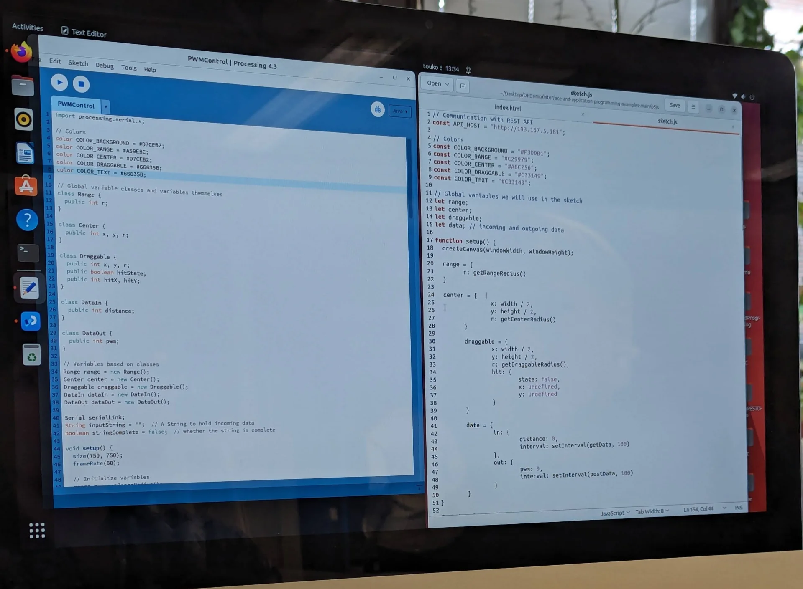
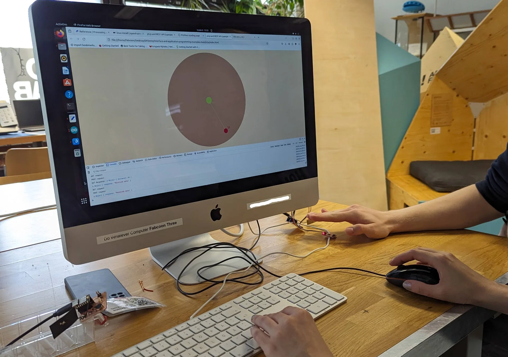
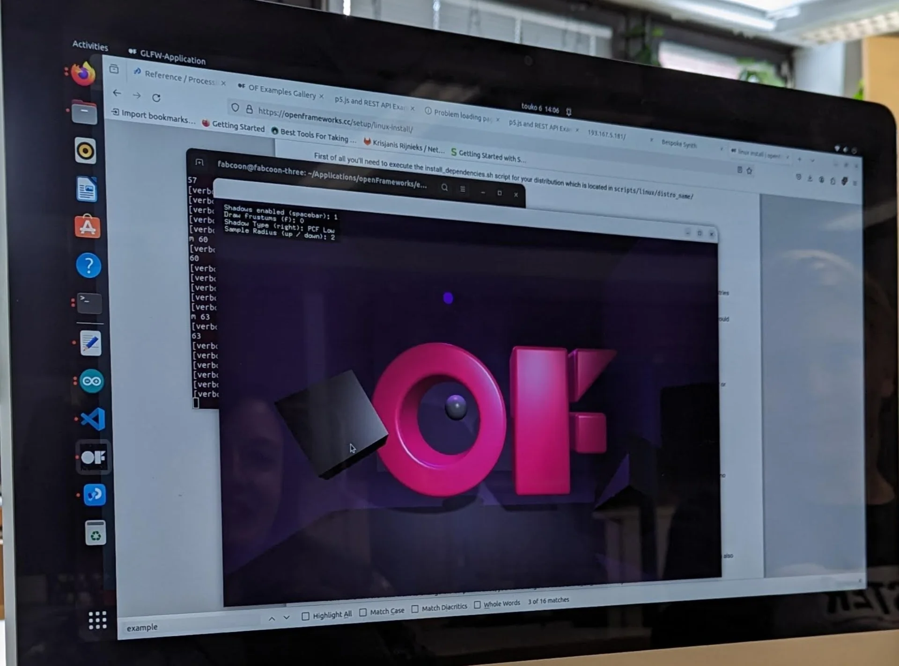

Again, this documentation is written weeks late as the final application was only programmed as part of the final stretch of creating the final project, due to how long the [wildcard week](), during which I created the lamp diffuser, stand and internal structure, ended up taking. The design was made weeks in advance, giving me a sense of security in being able to make it last minute, which turned out to work well, even though it required replacing a bit of sleep with work. 

[Figma](https://www.figma.com/) was a familiar design tool whose workflow I had already mastered and I had chosen [Flutter](https://flutter.dev/) well in advance for synergy as it was our framework of choice at [Miitti](https://www.miitti.app/), which now allowed me to kill two flies with one strike (much preferable Finnish alternative to killing two birds with one stone) with this assignment. This might have made me a non-optimal group leader as I was not really interested in any of the technologies showcased but it provided me with great results!

## Assignments

**Group assignment**

- Join one of the introduction sessions.
- Elect a group leader.
- Document hands-on exercise with available interface examples.
- Optionally discuss an additional example that you have used in the past or wish to explore.
  
**Individual assignment**

- Describe what you learned from the group assignment on your documentation page briefly.
- Write an application that interfaces a user with an input and/or output device that you made.
- Include a hero video and source files of the application in your documentation.

## Group Assignment

This week's group assignment mostly consisted of us just trying to install [Processing](https://processing.org/), [p5.js](https://p5js.org/) and [openFrameworks](https://openframeworks.cc/) and try to run some example code in each. It has been a good while since the session, but to be honest, I do not remember us doing much else. We struggled together with our instructor, who did not have overwhelming experience with the frameworks either but we did ultimately get all of the examples running.

A clear advantage of the JavaScript based p5.js was that it was relatively simple to use while remaining free and expressive, could be written anywhere and it ran on the web while seamlessly communicating with the XIAO via an API hosted on the device. Processing was quite similar but is primarily written in its own IDE, which originally served as the inspiration for the Arduino IDE, and runs as a desktop app. The C++ based openFrameworks was difficult and complicated to install so that we needed Kris' help for it but it supported full-on 3D-graphics and simulation, and certainly had the most impressive demo, although it was not in any way connected to the XIAO.





All of the frameworks focused on creative coding and could thus be interesting for artistic or data visualization projects along with simple interfaces with limited functionality but they did not appeal to me personally for quickly building entire Android applications, which I wanted to do, as I am not sure whether that is even possible in the first place and secondly, they seemed relatively low-level for such applications. 

## Design

As they say, well planned is half done - particularly in the domain of software, where it can often be tempting to jump right into prototyping without a wireframe due to how easy and fast it is. However, this can often result in directionless trial and error, which ultimately increases the development time exponentially as although many modern frameworks make it fast and easy to shuffle components around, modify them and make new ones, it is never as fast than dragging around some rectangles in design software first until they are arranged in a suitable manner.

I thus opened up [Figma](https://www.figma.com/) - a very capable design tool that I am very well acquinted with - and started playing around with a 360px x 800px "Android Large" frame, as I had a Google Pixel 6 on which primarily I wanted to run the app. I have a lot of experience with Figma, having designed [my personal website](https://mirokeimioniemi.com/), [the #BeatTheAlgorithm campaign website](https://beat-the-algorithm.netlify.app/) and the [UI of Vital App](https://github.com/MiroKeimioniemi/vital-app) - our awarded Junction 2023 hackathon entry - along with various other projects from websites and applications to anything graphical. It gives a lot of useful features for free and the user experience is seamless with easy but extensive collaboration tools with others as well. 

For the app, I wanted to create something relatively simple that could be made in a day or two, while also being somewhat unique and visually intriguing. More risks could be taken as the app was meant for demo purposes and not for widespread usage, where more universal design principles might have to be applied for ease of use. This eventually took the form of the single page application locked in portrait mode that is depicted below. The grid of frames depicts different colors on the vertical axis and increasing brightness on the horizontal axis, with the exception of the bottom-most row, which shows the color picker shelf, and the first frames on the left and the two last frames on the right, which depict the lamp being off regardless of brightness and show a screen for setting alarms. 


The design of the app allows for complete control of the lamp. In addition to on/off and brightness, the design allows for selecting the color of the light and setting independent, recurring alarms for each weekday with a unique animation for each of them. 

The Sun/Moon element shows the current color of the lamp independent of brightness or the on/off state. Tapping it or the background toggles the lamp on and off. The slider adjusts the lamp's brightness, while illustrating this by the sun/moon either rising or lowering and the lighting of the scene adapting by becoming more or less bright in response. Initially the idea was for the moon and sun to swap places as the slider is being moved but later I thought that I might want to have it be either one based on the time of day and have it be draggable in the vertical axis for another way of adjusting the brightness.

Next to the brightness slider is a color picker icon, the tapping of which brings out the color wheel that allows the user to change the color of the lamp. The chosen color along with current brightness fully determines the colors of all visual elements of the UI. Swiping down, left or right or tapping the icon again hides the color wheel. Below them is the animation menu, where the highlighted selection indicates which animation will be played with the next alarm. The user can browse them in place and change the animation of the next alarm regardless of what its animation has been set in the alarms section.

The alarms section can be accessed by tapping the displayed time or the pen icon next to it. It has seven slots, one for each weekday, which allows the user to set automatically recurring alarms at any time. Tapping the time in this view opens a time picker, whereas tapping the animation next to it opens the animations view, where the user can select the desired animation.

## Application

### Flutter

As mentioned already, I used [Flutter](https://flutter.dev/) to create the Android application with which I control the lamp. This was primarily because we use it at [Miitti](https://www.miitti.app/) and I wanted to learn it through and through in order to contribute to the app development. The best way to learn anything is usually a project and so this fit the goal perfectly.

However, there is a high a chance that I would have stumbled upon it independently and chosen it regardless due to its great developer experience, active and large developer community and extensive multi-platform capabilities that allow developing an application for multiple platforms using a single codebase while also enabling more low-level platform-specific extensions. 

Flutter is a declarative open source cross-platform UI framework for building applications on all devices from Android and iOS to Windows, macOS and the web, but most importantly, it is developed and supported by Google meaning that it has plenty of resources behind it and it works perfectly for Android, which was my main target platform. It is built on the client-optimized, multi-platform focused [Dart](https://dart.dev/) programming language, which is relatively similar to [JavaScript](https://developer.mozilla.org/en-US/docs/Web/JavaScript) by syntax and certain feel, while familiarly strictly type and null safe, which I have grown accustomed to with [Scala](https://www.scala-lang.org/) and so it was very quick to pick up for me.

#### Fundamentals

Flutter is perhaps most famous for its slogan: "[everything is a widget](https://docs.flutter.dev/resources/inside-flutter)", which refers to how almost every component and functionality in Flutter behaves predictably in the same way. The main idea is that the entire user interface is built by embedding widgets within widgets, which refer to anything from basic elements such as images and text to layout components such as columns, stacks and rows to even positioning defined by widgets such as `Positioned`, `Align`, `Centered` and `Padding`. Even the app state is often provided as a widget to be wrapped around the widget that requires access to the state variables. All these widgets are immutable but independently rebuilt at the lowest level necesssary upon changes to the application state, making it very performant.

The workflow for creating user interfaces (UI) with Flutter, includes composing high-level custom widgets from lower level widgets and sometimes from the many predefined high-level widgets with lots of customization options that can be configured by providing specific theme objects, functions and other appropriate values to the widget constructors. In the case of this application, these include, for example, the time and [color pickers](https://pub.dev/packages/flutter_colorpicker
). These can then be instatiated as children of the return widget of the main app class in its `build(buildContext)` function in the `main.dart` file, which runs the application in the `void main()` function.

#### Tips & tricks

I already had Flutter installed due to having explored it a little bit prior to this project but the continuously evolving platform-specific requirements and installation instructions can be found [here](https://docs.flutter.dev/get-started/install). They also include a tutorial for configuring an Android emulator, which I also had already due to having completed the [Android Basics with Compose](https://developer.android.com/courses/android-basics-compose/course) course the previous summer. However, I preferred to simply use my Google Pixel 6 for the majority of previewing and debugging. In VS Code, this could be done by installing the [Dart](https://marketplace.visualstudio.com/items?itemName=Dart-Code.dart-code) and [Flutter](https://marketplace.visualstudio.com/items?itemName=Dart-Code.flutter) VS Code extensions, hitting `CTRL + SHIFT + P` to bring up all available Flutter commands, selecting `Flutter: Select Device`, then selecting `Pixel 6` from the available devices after plugging it in and [allowing USB Debugging](https://developer.android.com/studio/debug/dev-options) and then starting debugging by pressing `F5`.

The Flutter and Dart extensions also provide other nice functionalities, such as `Toggle Debug Painting`, which shows the outlines and positioning of widgets in the debug version of the app, `Get Packages`, which automatically adds all imports as dependencies to `pubspec.yaml` and installs them for use and `Open DevTools`, which opens a rich window of various tools for monitoring and debugging anything from the relationships of different widgets to the performance of the app - all quickly accessible via `CTRL + SHIFT + P`. Other everyday productivity boosts include automatic document formatting with `SHIFT + ALT + F` and `CTRL + .` to wrap on widget with another, which is a very frequent operation. Finally `Extract Widget` and `Move 'ClassName' to file`, found by clicking the lamp next to the widget or class when your cursor is blinking on the same line, is incredibly convenient for quick and simple but powerful refactoring to keep the project structure sensible after you get carried away writing too much code in the same file.

### App code

To ensure that the demo was completed in a timely manner, some features of the initial design were left out for potential later implementation. These include the sun/moon element, which became only the sun, many of the additional animations that were left out along with, most noticeably, the separate alarms page, which allowed each weekday to have a separate timing and animation. In the final app, only the next alarm can be set and due to the Bluetooth functionality (documented in [Networking and Communications]()) taking so long to implement, only one of the animations was implemented on the XIAO ESP32C3 and that too was done in way where it starts immediately and loops indefinitely instead of according to the time set. 

The full Flutter app code can be found in [this repository](https://gitlab.com/miro-keimioniemi/led-zeppelin-app). Below is the commented code for creating the UI and managing its state using the `LampState` class, the Bluetooth functionality of which is covered in depth in [Networking and Communications](). 

The UI state management is implemented with [provider](https://pub.dev/packages/provider) following [this tutorial](https://docs.flutter.dev/data-and-backend/state-mgmt/simple). In essence, this is done by creating the `LampState` class by extending `ChangeNotifier`, which allows us to call `notifyListeners()` to force the relevant parts of the UI to redraw themselves when relevant state variables have changed. This is then provided as the `BuildContext` for the whole app via the `ChangeNotifierProvider` in the `main()` function, which allows all the appropriate widgets to access it via the `Consumer` widget that uses its `builder` function to redraw its child widgets with the updated values every time that the state changes. To optimize the app performance, it is good practice to have the `Consumers` wrap as few widgets as closely as possible. The [`LampState` class](https://gitlab.com/miro-keimioniemi/led-zeppelin-app/-/blob/master/lib/lamp_state.dart?ref_type=heads), which also defines all the functions to change the state variables, can be found fully explained in [Networking and Communications]() and the full code can be found in [this repository](https://gitlab.com/miro-keimioniemi/led-zeppelin-app).

The layout of the main screen is defined in `main.dart`, which is also used to run the app. If the lamp is not connected, show a persistent alert dialogue about requiring the connection, otherwise show the app as designed. 

```Dart
// Import the necessary libraries
import 'dart:async';                // Asynchronous functions such as await and Future

import 'package:flutter/material.dart';                         // Material design widgets such as Scaffold, Stack, Column, Row, Slider, IconButton, Icon, AlertDialog, etc.
import 'package:flutter/services.dart';                         // Services such as SystemChrome for setting the preferred orientation
import 'package:flutter_colorpicker/flutter_colorpicker.dart';  // Color picker widget
import 'package:provider/provider.dart';                        // Provider for managing the state of the app

import 'components/alarm_animations_list.dart';  // AlarmAnimationsList widget for displaying the list of animations
import 'components/celestial.dart';              // CelestialBody widget for displaying the sun element
import 'components/next_alarm.dart';             // NextAlarm widget for displaying the next alarm time
import 'components/gradient_background.dart';    // GradientBackground widget for displaying the background gradient
import 'components/midground.dart';
import 'lamp_state.dart';              // Midground widget for displaying the topmost background element

// Main function to run the flutter app
void main() {
  // Ensure that the app always runs in portrait mode by setting the preferred orientation after initializing the widgets
  WidgetsFlutterBinding.ensureInitialized();
  SystemChrome.setPreferredOrientations([DeviceOrientation.portraitUp])
      .then((value) => runApp(
            // Use the ChangeNotifierProvider to provide the LampState as the BuildContext to the entire app defined in the LEDZeppelinApp widget
            ChangeNotifierProvider(
              create: (context) => LampState(),
              child: const LEDZeppelinApp(),
            ),
          ));
}

// LEDZeppelinApp class to define the root widget of the application
class LEDZeppelinApp extends StatelessWidget {
  const LEDZeppelinApp({super.key});

  // Application root widget
  @override
  Widget build(BuildContext context) {
    return MaterialApp(
      title: 'LED Zeppelin App',
      theme: ThemeData(
        colorScheme: ColorScheme.fromSeed(seedColor: Colors.white),
        useMaterial3: true,
      ),
      home: const MyHomePage(title: 'LED Zeppelin App Home Page'),
    );
  }
}

// MyHomePage class to define the main page of the application
class MyHomePage extends StatefulWidget {
  const MyHomePage({super.key, required this.title});

  final String title;

  @override
  State<MyHomePage> createState() => _MyHomePageState();
}

// MyHomePageState class to manage the state of the main page
class _MyHomePageState extends State<MyHomePage> {
  // Function to bring up the color picker dialog to select the lamp color
  Future<void> _selectTime(BuildContext context) async {
    await Provider.of<LampState>(context, listen: false).selectTime(context);
  }

  // Main build function to define the layout of the main page
  @override
  Widget build(BuildContext context) {
    return Scaffold(
      resizeToAvoidBottomInset: false,
      // Stack widget to overlay the background elements with the foreground elements
      body: Stack(
        children: <Widget>[
          // The bottom-most background element
          // Consumer widget listens to the LampState changes and rebuilds the widget it wraps accordingly using its builder function
          Consumer<LampState>(
            // GestureDetector widget listens to the tap event and toggles the lamp state between on and off
            builder: (context, lampState, child) => GestureDetector(
              onTap: () {
                lampState.toggle();
              },
              child: GradientBackground(
                isOn: lampState.isOn,
                color: lampState.color,
                brightness: lampState.brightness,
              ),
            ),
          ),
          // CelestialBody widget is the sun element that indicates the brightness level and the selected color
          Consumer<LampState>(
            builder: (context, lampState, child) => GestureDetector(
              onTap: () {
                lampState.toggle();
              },
              child: CelestialBody(
                  isDay: true,
                  brightness: lampState.brightness,
                  color: lampState.color),
            ),
          ),
          // Midground widget is the topmost background element that also responds to the brightness level and color of the lamp
          Positioned(
            child: Align(
              alignment: FractionalOffset.bottomCenter,
              child: Consumer<LampState>(
                builder: (context, lampState, child) => Midground(
                  isOn: lampState.isOn,
                  color: lampState.color,
                  brightness: lampState.brightness,
                ),
              ),
            ),
          ),
          // Column widget to stack the foreground elements
          Column(
            children: [
              // SizedBox widget to provide vertical spacing between the foreground elements
              const SizedBox(height: 96),
              Consumer<LampState>(
                // The custom NextAlarm widget displays the next alarm time and allows the user to set a new alarm time
                builder: (context, lampState, child) => NextAlarm(
                  nextAlarm: lampState.nextAlarm,
                  brightness: lampState.brightness,
                  isOn: lampState.isOn,
                  onAlarmTap: () {
                    _selectTime(context);
                  },
                ),
              ),
              const SizedBox(height: 280),
              // Row widget to align the slider and color picker button horizontally
              Row(
                mainAxisAlignment: MainAxisAlignment.center,
                children: [
                  // Expanded widget to allow the slider to take up the remaining space
                  Expanded(
                    child: Consumer<LampState>(
                      // Slider widget to adjust the brightness level of the lamp
                      builder: (context, lampState, child) => SliderTheme(
                        data: SliderTheme.of(context).copyWith(
                          trackHeight: 6.0,
                          activeTrackColor: Colors.white,
                          inactiveTrackColor: Colors.white.withOpacity(0.5),
                          thumbColor: Colors.white,
                          thumbShape: const RoundSliderThumbShape(
                              enabledThumbRadius: 10.0),
                        ),
                        child: Slider(
                          value: lampState.brightness,
                          min: 0.0,
                          max: 1.0,
                          onChanged: (double value) {
                            lampState.setBrightness(value);
                          },
                        ),
                      ),
                    ),
                  ),
                  Consumer<LampState>(
                    builder: (context, lampState, child) => Padding(
                      padding: const EdgeInsets.only(right: 16.0),
                      // IconButton widget to bring up the color picker dialog
                      child: IconButton(
                        icon: const Icon(
                          Icons.color_lens,
                          shadows: [
                            Shadow(color: Colors.black38, blurRadius: 16.0)
                          ],
                        ),
                        color: Colors.white,
                        iconSize: 36,
                        // Function to bring up the color picker dialog
                        onPressed: () {
                          showModalBottomSheet(
                            context: context,
                            backgroundColor:
                                const Color.fromARGB(255, 20, 20, 20),
                            builder: (BuildContext context) {
                              return Padding(
                                padding: const EdgeInsets.all(32.0),
                                child: SingleChildScrollView(
                                    child: Theme(
                                  data: Theme.of(context).copyWith(
                                    textTheme:
                                        Theme.of(context).textTheme.apply(
                                              bodyColor: Colors.white,
                                              displayColor: Colors.white,
                                            ),
                                  ),
                                  child: HueRingPicker(
                                    pickerColor: lampState.color,
                                    hueRingStrokeWidth: 30,
                                    displayThumbColor: false,
                                    onColorChanged: (Color color) {
                                      if (color.red == color.green &&
                                          color.green == color.blue) {
                                        lampState.setColor(Colors.white);
                                      } else {
                                        lampState.setColor(
                                            HSLColor.fromColor(color)
                                                .withLightness(0.7)
                                                .withSaturation(1)
                                                .toColor());
                                      }
                                    },
                                  ),
                                )),
                              );
                            },
                          );
                        },
                      ),
                    ),
                  ),
                ],
              ),
              Expanded(
                child: Consumer<LampState>(
                  // AlarmAnimationsList widget displays the list of available animations
                  builder: (context, lampState, child) => AlarmAnimationsList(
                    selectedAnimation: lampState.selectedAnimation,
                    color: lampState.color,
                    onAnimationSelected: (int selectedAnimation) {
                      lampState.setSelectedAnimation(selectedAnimation);
                    },
                  ),
                ),
              ),
            ],
          ),
          Consumer<LampState>(
            builder: (context, lampState, child) {
              // AlertDialog widget to prompt the user to turn on the lamp and Bluetooth that persists until the lamp is connected
              if (!lampState.isConnected) {
                return const AlertDialog(
                  title: Text('Connection Required'),
                  content: Text(
                      'Please turn on the lamp and Bluetooth, and allow necessary permissions.'),
                );
              } else {
                return Container();
              }
            },
          ),
        ],
      ),
    );
  }
}
```

The `GradientBackground` widget implements the dynamic color gradient background that responds to the selected color and brightness level by illuminating more or less of the empty space with the chosen color, simulating a sunrise or sunset depending on the direction of change. 

```Dart
import 'dart:math';
import 'package:flutter/material.dart';

// GradientBackground widget consists of a solid color background with a gradient overlay,
// the colors of which change dynamically based on the brightness and isOn parameters.
class GradientBackground extends StatelessWidget {

  final Color color;
  final double brightness;
  final bool isOn;

  // GradientBackground widget constructor with color, brightness and isOn parameters.
  const GradientBackground(
      {super.key,
      required this.color,
      required this.brightness,
      required this.isOn});

  // A function to return a BoxDecoration with a gradient overlay of the specified colors and stops.
  BoxDecoration _simpleBox(List<Color> colors, List<double> stops) {

    // If the lamp is on, the gradient colors are the provided colors, otherwise they are shades of black.
    // The number of gradient stops must match the number of gradient colors.
    List<Color> gradientColors;
    List<double> gradientStops;
    if (isOn) {
      gradientColors = colors;
      gradientStops = stops;
    } else {
      gradientColors = [const Color.fromARGB(255, 55, 55, 55), Colors.black];
      gradientStops = [0.0, 0.75];
    }

    return BoxDecoration(
      gradient: LinearGradient(
        colors: gradientColors,
        stops: gradientStops,
        begin: Alignment.topCenter,
        end: Alignment.bottomCenter,
      ),
    );
  }

  // Build method for the GradientBackground widget
  @override
  Widget build(BuildContext context) {
    return Stack(
      children: [
        // Solid black background color to provide more contrast for low brightness values.
        Container(
          color: Colors.black.withOpacity(1 - max(0, brightness - 0.2)),
        ),
        // Gradient overlay with the specified colors and stops.
        // The brightness value reduces the opacity of the gradient overlay to simulate light intensity when the color changes to the white of the background.
        // The stops open up the gradient to the top and bottom of the screen as brighteness increases to simulate a sunrise effect.
        Container(
          decoration:
              _simpleBox([Colors.white.withOpacity(brightness), color.withOpacity(1 - max(0, brightness - 0.5))], [0.1 + ((1 - brightness) / 10), 1 - ((1 - brightness) / 10)]),
        ),
      ],
    );
  }
}
```

The `CelestialBody` widget implements the dynamic sun that responds to the selected color by setting the right end of its gradient to that color and the left end to a lighter version of it. Its height, on the other hand, is determined by the brightness.

```Dart
import 'dart:ui';
import 'package:flutter/material.dart';

// CelestialBody widget consists of a circular container with a gradient overlay
class CelestialBody extends StatelessWidget {

  final bool isDay;
  final double brightness;
  final Color color;

  // CelestialBody widget constructor with isDay, brightness and color parameters
  const CelestialBody({super.key, required this.isDay, required this.brightness, required this.color});

  @override
  Widget build(BuildContext context) {
    // Return an animated container with a gradient overlay that changes based on the brightness value to simulate a sunrise/sunset effect by adjusting the alignment of the container.
    return AnimatedContainer(
      duration: const Duration(seconds: 0),
      curve: Curves.easeInOut,
      // Change vertical alignment based on the brightness value by linearly interpolating between 0.35 and -0.35
      alignment: Alignment(0, lerpDouble(0.35, -0.35, brightness)!),
      // Sun
      child: Container(
        width: 100,
        height: 100,
        decoration: BoxDecoration(
          shape: BoxShape.circle,
          gradient: LinearGradient(
            begin: Alignment.centerLeft,
            end: Alignment.centerRight,
            colors: [HSLColor.fromColor(color).withLightness(0.8).toColor(), color],
          ),
          boxShadow: [
            BoxShadow(
              color: HSLColor.fromColor(color).withLightness(0.2).toColor().withOpacity(0.1),
              blurRadius: 100,
              spreadRadius: 100,
            ),
          ],
        ),
      ),
    );
  }
}
```

The `Midground` widget implements the topmost background element, which too dynamically responds to the selected color and brightness by adjusting those of the `SVG`s that imitate mountains or hills and provide the solid background to most of the control elements. 

```Dart
import 'dart:math';

import 'package:flutter/material.dart';
import 'package:flutter_svg/flutter_svg.dart';

// Midground widget consists of three stacked, predefined SVG images, the colors 
// of which are progressively darker shades of the color provided as a parameter
class Midground extends StatelessWidget {

  final Color color;
  final double brightness;
  final bool isOn;
  
  // Midground widget constructor with color, brightness and isOn parameters
  const Midground({super.key, required this.color, required this.brightness, required this.isOn});

  // SVG definitions
  // ViewBox represents the coordinate system of the SVG image, not necessarily the actual size of the image, which is defined using the SvgPicture parameters.
  final String svg1 = 
    '''<svg viewBox="0 0 360 374" fill="none" xmlns="http://www.w3.org/2000/svg">
       <path d="M82 43.0833C60.4 36.4833 18.3333 69.6667 0 87.0833V374H360V0C335.667 18.9444 271.4 58.85 209 66.9167C131 77 109 51.3333 82 43.0833Z" fill="#BFBFBF"/>
       </svg>''';
  final String svg2 = 
    '''<svg viewBox="0 0 360 282" fill="none" xmlns="http://www.w3.org/2000/svg">
       <path d="M170 36.0187C87 73.3659 39.3333 43.9252 0 31.6262V282H360V0C307.333 10.5421 267 -7.62799 170 36.0187Z" fill="#8B8B8B"/>
       </svg>''';
  final String svg3 = 
    '''<svg viewBox="0 0 360 233" fill="none" xmlns="http://www.w3.org/2000/svg">
       <path d="M144 49.6958C79.2 26.2329 21 85.5419 0 118.129V233H360V0C315 26.3415 208.8 73.1587 144 49.6958Z" fill="#545454"/>
       </svg>''';

  // Build method for the Midground widget
  @override
  Widget build(BuildContext context) {
    // Return a stack of the three SVG images with color filters applied.

    // The progressively darker shades are obtained by applying a color filter with the lightness of the color
    // adjusted as an HSL (Hue, Saturation, Lightness) value and then converting it back to the RGB color.

    // The SVG images are rendered from the string definitions with a width equal to the screen width.
    return Stack(
      alignment: Alignment.bottomCenter,
      children: <Widget>[
        ColorFiltered(
          colorFilter: ColorFilter.mode(isOn? HSLColor.fromColor(color).withLightness(max(0.1, brightness / 2)).toColor() : Color.fromARGB(255, 30, 30, 30), BlendMode.srcIn),
          child: SvgPicture.string(svg1, height: MediaQuery.of(context).size.height / 2, fit: BoxFit.fill,),
        ),
        ColorFiltered(
          colorFilter: ColorFilter.mode(isOn? HSLColor.fromColor(color).withLightness(max(0.07, brightness / 2 - 0.1)).toColor() : Color.fromARGB(255, 20, 20, 20), BlendMode.srcIn),
          child: SvgPicture.string(svg2, height: MediaQuery.of(context).size.height / 2.7, fit: BoxFit.fill,),
        ),
        ColorFiltered(
          colorFilter: ColorFilter.mode(isOn? HSLColor.fromColor(color).withLightness(max(0.03, brightness / 2 - 0.2)).toColor() : const Color.fromARGB(255, 10, 10, 10), BlendMode.srcIn),
          child: SvgPicture.string(svg3, height: MediaQuery.of(context).size.height / 3.2, fit: BoxFit.fill,),
        ),
      ],
    );
  }
}
```

The `NextAlarm` widget displays the time of the next alarm if one is selected or "--:--" if it is not. Next to it is a pencil icon, which opens a time picker for setting the next alarm. Tapping "Cancel" on this discards any previously selected time. This function is defined in the [`LampState` class](https://gitlab.com/miro-keimioniemi/led-zeppelin-app/-/blob/master/lib/lamp_state.dart?ref_type=heads), which is documented [here](https://digital-fabrication-portfolio-miro-keimioniemi-a2f2c11a6e705b8f.gitlab.io/p/networking-and-communications/).

```Dart
import 'package:flutter/material.dart';
import 'package:intl/intl.dart';

// NextAlarm widget displays the time of the next alarm and an edit button
class NextAlarm extends StatelessWidget {
  final DateTime? nextAlarm;
  final double brightness;
  final bool isOn;
  final VoidCallback onAlarmTap;

  // NextAlarm widget constructor with nextAlarm, brightness, isOn and onAlarmTap parameters
  const NextAlarm({
    Key? key,
    required this.nextAlarm,
    required this.brightness,
    required this.isOn,
    required this.onAlarmTap,
  }) : super(key: key);

  @override
  Widget build(BuildContext context) {
    // Return a centered column with the text 'Next Alarm:' and the time of the next alarm along with a pen icon button to edit the alarm to the right of it
    return Center(
      child: Padding(
        padding: const EdgeInsets.fromLTRB(16.0, 16.0, 16.0, 16.0),
        child: Column(
          mainAxisAlignment: MainAxisAlignment.center,
          children: [
            Text(
              'Next Alarm:',
              style: TextStyle(
                fontSize: 16,
                color: (brightness < 0.5 || !isOn)? Colors.white : Colors.black,
              ),
            ),
            Padding(
              padding: const EdgeInsets.only(left: 42.0),
              child: Row(
                mainAxisAlignment: MainAxisAlignment.center,
                children: [
                  Center(
                    child: Text(
                      // Ternary operator to check if nextAlarm is null and display '--:--' if it is, otherwise format the time using the DateFormat class
                      nextAlarm == null? '--:--' : DateFormat('HH:mm').format(nextAlarm!),
                      style: TextStyle(
                        fontSize: 64,
                        // If the brightness is less than 0.5 or the lamp is off, the text color is white, otherwise it is black so that there is enough contrast
                        color: (brightness < 0.5 || !isOn)? Colors.white : Colors.black,
                      ),
                    ),
                  ),
                  IconButton(
                    icon: Icon(Icons.edit),
                    color: (brightness < 0.5 || !isOn)? Colors.white : Colors.black,
                    onPressed: onAlarmTap,
                  ),
                ],
              ),
            ),
          ],
        ),
      ),
    );
  }
}
```

The `AlarmAnimationsList` widget displays all the available animations in a scrollable list with the selected one highlighted in the selected color. 

```Dart
import 'package:flutter/material.dart';
import 'package:flutter/rendering.dart';

// AlarmAnimationsList widget displays a scrollable list of the available alarm animations
class AlarmAnimationsList extends StatelessWidget {
  final int selectedAnimation;
  final Color color;
  final Function(int) onAnimationSelected;

  // AlarmAnimationsList widget constructor with selectedAnimation, color and onAnimationSelected parameters
  AlarmAnimationsList({
    super.key,
    required this.selectedAnimation,
    required this.color,
    required this.onAnimationSelected,
  });

  // Hardcoded list of predefined alarm animations with titles, durations and gradients for visualization
  final List<AlarmAnimation> alarmAnimations = [
    AlarmAnimation(
      title: 'Red Dawn',
      duration: '10min',
      gradient: const LinearGradient(
        colors: [Color(0xFFFFC047), Color(0xFF6F1515), Color(0xFF2C0D0D)],
        stops: [0, 0.74, 1.0],
        begin: Alignment.topCenter,
        end: Alignment.bottomCenter,
      ),
    ),
    AlarmAnimation(
      title: 'Intruder Alert',
      duration: '10sec',
      gradient: const LinearGradient(
        colors: [Colors.red, Colors.blue],
        begin: Alignment.centerLeft,
        end: Alignment.centerRight,
      ),
    ),
    AlarmAnimation(
      title: 'Brighten Up',
      duration: '1min',
      gradient: const LinearGradient(
        colors: [
          Color.fromARGB(255, 255, 255, 255),
          Color.fromARGB(255, 140, 140, 140)
        ],
        stops: [0, 1.0],
        begin: Alignment.topCenter,
        end: Alignment.bottomCenter,
      ),
    ),
  ];

  @override
  Widget build(BuildContext context) {
    const itemHeight =
        120.0;
    // ScrollController to control the scroll position of the list
    final controller = ScrollController();

    // Return a ListView of the alarm animations with a card for each animation
    return NotificationListener<UserScrollNotification>(
      // Listen for user scroll notifications to snap the list to the nearest item when the user stops scrolling
      onNotification: (notification) {
        if (notification.direction == ScrollDirection.idle &&
            !controller.position.isScrollingNotifier.value) {
          final index = (controller.offset / itemHeight).round();
          Future.delayed(Duration.zero, () {
            controller.animateTo(
              index * itemHeight,
              duration: const Duration(milliseconds: 100),
              curve: Curves.linear,
            );
          });
        }
        return true;
      },
      // ListView with a builder to create the list of alarm animations
      child: ListView.builder(
        controller: controller,
        physics: const BouncingScrollPhysics(),
        padding: const EdgeInsets.only(bottom: 20),
        itemCount: alarmAnimations.length,
        itemBuilder: (context, index) {
          final animation = alarmAnimations[index];
          return Card(
            color: Colors.grey[300],
            margin: const EdgeInsets.symmetric(vertical: 10, horizontal: 20),
            shape: RoundedRectangleBorder(
              borderRadius: BorderRadius.circular(15),
              side: BorderSide(
                color:
                    index == selectedAnimation - 1 ? color : Colors.transparent,
                width: 4.0,
              ),
            ),
            elevation: 10,
            // ListTile for creating the cards with the animation title, duration, gradient and leading container
            child: ListTile(
              contentPadding:
                  const EdgeInsets.symmetric(vertical: 10, horizontal: 15),
              title: Text(
                animation.title,
                style: const TextStyle(
                  fontWeight: FontWeight.bold,
                  fontSize: 20,
                ),
              ),
              subtitle: Text(animation.duration),
              leading: Container(
                width: 100,
                height: 100,
                decoration: BoxDecoration(
                  gradient: animation.gradient,
                  borderRadius: BorderRadius.circular(10),
                ),
              ),
              onTap: () {
                onAnimationSelected(index + 1);
              },
            ),
          );
        },
      ),
    );
  }
}

// AlarmAnimation class to store the title, duration and gradient of an alarm animation
class AlarmAnimation {
  final String title;
  final String duration;
  final Gradient gradient;

  AlarmAnimation({
    required this.title,
    required this.duration,
    required this.gradient,
  });
}
```

The full code can be found [here](https://gitlab.com/miro-keimioniemi/led-zeppelin-app/-/tree/master?ref_type=heads) and the `LampState` is documented in [Networking and Communications]() due to how closely it is intertwined with the Bluetooth Low Energy (BLE) communication. The demo video for the [final project](), where the app can be seen interacting with the lamp, can be found on the [final project page]() or on [YouTube](https://youtu.be/ouhtvRlAQOE?si=If1BKGss66gJotr-&t=50). Below is a demo of the app alone, without interaction with the lamp. 



## Reflections

[Flutter](https://flutter.dev/) is an absolutely fantastic framework with a great developer experience for declarative cross-platform UI development. It is fast and enjoyable to builld with and produces impressive results with ease in no time, even when used by beginners. I, of course, have the advantage of having had experience in [React](https://react.dev/) development, along with other web technologies and even [ScalaFX](https://www.scalafx.org/), with which I have built a whole [strategy game](https://github.com/MiroKeimioniemi/probabilistic-strategy-game) from scratch. Hence, I am in no way a stranger to declarative UI frameworks and could pick up Flutter very quickly as just one among many. Still, having been built around the simple idea of everything being a widget and consistently adhering to it made it stand out with its intuitive ease of use, which was helped even further by the powerful [Dart](https://marketplace.visualstudio.com/items?itemName=Dart-Code.dart-code) and [Flutter](https://marketplace.visualstudio.com/items?itemName=Dart-Code.flutter) VS Code extensions.

The app turned out great, even though I had to cut some of the features due to lack of time. The vast majority of that time was spent on trying to get the [Bluetooth Low Energy (BLE) communication](), whereas the next most time consuming part was fine tuning the brightness and colors of the background elements. Everything else was really fast. What is unfortunate about having to cut the page for selecting multiple different alarms, however, is that I did not get the excuse to learn [routing](https://docs.flutter.dev/ui/navigation) in Flutter yet. I am sure I will get to it in no time with [Miitti](https://www.miitti.app/) though, now that I have gained a lot of confidence and familiarity with Flutter. Cannot wait to get to build more with it!


