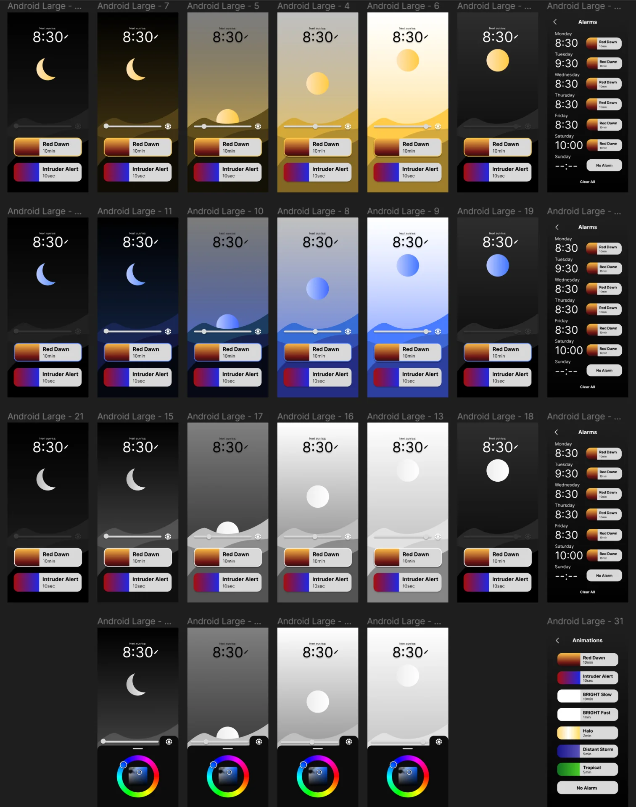

Again, this documentation is written weeks late as the final application was only programmed as part of the final stretch of creating the final project, due to how long the [wildcard week](), during which I created the lamp diffuser, stand and internal structure, ended up taking. The design was made weeks in advance, giving me a sense of security in being able to make it last minute, which turned out to work well, even though it required replacing a bit of sleep with work. 

[Figma](https://www.figma.com/) was a familiar design tool whose workflow I had already mastered and I had chosen [Flutter](https://flutter.dev/) well in advance for synergy as it was our framework of choice at [Miitti](https://www.miitti.app/), which now allowed me to kill two flies with one strike (much preferable Finnish alternative to killing two birds with one stone) with this assignment. This might have made me a non-optimal group leader as I was not really interested in any of the technologies showcased but it provided me with great results!

## Assignments

**Group assignment**

- Join one of the introduction sessions.
- Elect a group leader.
- Document hands-on exercise with available interface examples.
- Optionally discuss an additional example that you have used in the past or wish to explore.
  
**Individual assignment**

- Describe what you learned from the group assignment on your documentation page briefly.
- Write an application that interfaces a user with an input and/or output device that you made.
- Include a hero video and source files of the application in your documentation.

## Group Assignment

This week's group assignment mostly consisted of us just trying to install [Processing](https://processing.org/), [p5.js](https://p5js.org/) and [openFrameworks](https://openframeworks.cc/) and try to run some example code in each. It has been a good while since the session, but to be honest, I do not remember us doing much else. We struggled together with our instructor, who did not have overwhelming experience with the frameworks either but we did ultimately get all of the examples running.

A clear advantage of the JavaScript based p5.js was that it was relatively simple to use while remaining free and expressive, could be written anywhere and it ran on the web while seamlessly communicating with the XIAO via an API hosted on the device. Processing was quite similar but is primarily written in its own IDE, which originally served as the inspiration for the Arduino IDE, and runs as a desktop app. The C++ based openFrameworks was difficult and complicated to install so that we needed Kris' help for it but it supported full-on 3D-graphics and simulation, and certainly had the most impressive demo, although it was not in any way connected to the XIAO.

All of the frameworks focused on creative coding and could thus be interesting for artistic or data visualization projects along with simple interfaces with limited functionality but they did not appeal to me personally for quickly building entire Android applications, which I wanted to do, as I am not sure whether that is even possible in the first place and secondly, they seemed relatively low-level for such applications. 

## Design

As they say, well planned is half done - particularly in the domain of software, where it can often be tempting to jump right into prototyping without a wireframe due to how easy and fast it is. However, this can often result in directionless trial and error, which ultimately increases the development time exponentially as although many modern frameworks make it fast and easy to shuffle components around, modify them and make new ones, it is never as fast than dragging around some rectangles in design software first until they are arranged in a suitable manner.

I thus opened up [Figma](https://www.figma.com/) - a very capable design tool that I am very well acquinted with - and started playing around with a 360px x 800px "Android Large" frame, as I had a Google Pixel 6 on which primarily I wanted to run the app. I have a lot of experience with Figma, having designed [my personal website](https://mirokeimioniemi.com/), [the #BeatTheAlgorithm campaign website](https://beat-the-algorithm.netlify.app/) and the [UI of Vital App](https://github.com/MiroKeimioniemi/vital-app) - our awarded Junction 2023 hackathon entry - along with various other projects from websites and applications to anything graphical. It gives a lot of useful features for free and the user experience is seamless with easy but extensive collaboration tools with others as well. 

For the app, I wanted to create something relatively simple that could be made in a day or two, while also being somewhat unique and visually intriguing. More risks could be taken as the app was meant for demo purposes and not for widespread usage, where more universal design principles might have to be applied for ease of use. This eventually took the form of the single page application locked in portrait mode that is depicted below. The grid of frames depicts different colors on the vertical axis and increasing brightness on the horizontal axis, with the exception of the bottom-most row, which shows the color picker shelf, and the first frames on the left and the two last frames on the right, which depict the lamp being off regardless of brightness and show a screen for setting alarms. 

The design of the app allows for complete control of the lamp. In addition to on/off and brightness, the design allows for selecting the color of the light and setting independent, recurring alarms for each weekday with a unique animation for each of them. 

The Sun/Moon element shows the current color of the lamp independent of brightness or the on/off state. The slider adjusts the lamp's brightness, while illustrating this by the sun/moon either rising or lowering and the lighting of the scene adapting by becoming more or less bright in response. Initially the idea was for the moon and sun to swap places as the slider is being moved but later I thought that I might want to have it be either one based on the time of day and have it be draggable in the vertical axis for another way of adjusting the brightness.

Next to the brightness slider is a color picker icon, the tapping of which brings out the color wheel that allows the user to change the color of the lamp. The chosen color along with current brightness fully determines the colors of all visual elements of the UI. Swiping down, left or right or tapping the icon again hides the color wheel. Below them is the animation menu, where the highlighted selection indicates which animation will be played with the next alarm. The user can browse them in place and change the animation of the next alarm regardless of what its animation has been set in the alarms section.

The alarms section can be accessed by tapping the displayed time or the pen icon next to it. It has seven slots, one for each weekday, which allows the user to set automatically recurring alarms at any time. Tapping the time in this view opens a time picker, whereas tapping the animation next to it opens the animations view, where the user can select the desired animation.

## Application

As mentioned already, I used [Flutter](https://flutter.dev/) to create the Android application with which I control the lamp. This was primarily because we use it at [Miitti](https://www.miitti.app/) and I wanted to learn it through and through in order to contribute to the app development. The best way to learn anything is usually a project and so this fit the goal perfectly.

However, there is a high a chance that I would have stumbled upon it independently and chosen it regardless due to its great developer experience, active and large developer community and extensive multi-platform capabilities that allow developing an application for multiple platforms using a single codebase while also enabling more low-level platform-specific extensions. 

Flutter is an open source cross-platform framework for building applications on all devices from Android and iOS to Windows, macOS and the web, but most importantly, it is developed and supported by Google meaning that it has plenty of resources behind it and it works perfectly for Android, which was my main target platform. It is built on the client-optimized, multi-platform focused [Dart](https://dart.dev/) programming language, which is relatively similar to [JavaScript](https://developer.mozilla.org/en-US/docs/Web/JavaScript) by syntax and certain feel, while familiarly strictly type and null safe, which I have grown accustomed to with [Scala](https://www.scala-lang.org/) and so it was very quick to pick up for me.

Flutter is perhaps most famous for its slogan: "[everything is a widget](https://docs.flutter.dev/resources/inside-flutter)", which refers to how almost every component and functionality in Flutter behaves predictably in the same way. The main idea is that the entire user interface is built by embedding widgets within widgets, which refer to anything from basic elements such as images and text to layout components such as columns, stacks and rows to even positioning defined by widgets such as `Positioned`, `Align`, `Centered` and `Padding`. Even the app state is often provided as a widget to be wrapped around the widget that requires access to the state variables. All these widgets are immutable but independently rebuilt at the lowest level necesssary upon changes to the application state, making it very performant.

The workflow for creating user interfaces (UI) with Flutter, includes composing high-level custom widgets from lower level widgets and sometimes from the many predefined high-level widgets with lots of customization options that can be configured by providing specific theme objects, functions and other appropriate values to the widget constructors. In the case of this application, these include, for example, the color and time pickers. These can then be instatiated as children of the return widget of the main app class in its `build(buildContext)` function in the `main.dart` file, which runs the application in the `void main()` function.

I already had Flutter installed due to having explored it a little bit prior to this project but the continuously evolving platform-specific requirements and installation instructions can be found [here](https://docs.flutter.dev/get-started/install). They also include a tutorial for configuring an Android emulator, which I also had already due to having completed the [Android Basics with Compose](https://developer.android.com/courses/android-basics-compose/course) course the previous summer. However, I preferred to simply use my Google Pixel 6 for the majority of previewing and debugging. In VS Code, this could be done by installing the [Dart](https://marketplace.visualstudio.com/items?itemName=Dart-Code.dart-code) and [Flutter](https://marketplace.visualstudio.com/items?itemName=Dart-Code.flutter) VS Code extensions, hitting `CTRL + SHIFT + P` to bring up all available Flutter commands, selecting `Flutter: Select Device`, then selecting `Pixel 6` from the available devices after plugging it in and [allowing USB Debugging](https://developer.android.com/studio/debug/dev-options) and then starting debugging by pressing `F5`.

The Flutter and Dart extensions also provide other nice functionalities, such as `Toggle Debug Painting`, which shows the outlines and positioning of widgets in the debug version of the app, `Get Packages`, which automatically adds all imports as dependencies to `pubspec.yaml` and installs them for use and `Open DevTools`, which opens a rich window of various tools for monitoring and debugging anything from the relationships of different widgets to the performance of the app - all quickly accessible via `CTRL + SHIFT + P`. Other everyday productivity boosts include automatic document formatting with `SHIFT + ALT + F` and `CTRL + .` to wrap on widget with another, which is a very frequent operation. 

SVG viewbox has nothing to do with the actual size of the svg, it is merely a coordinate system

CTRL + . to wrap with widget (1000x faster than without)

Gradient appeared grey but it seems that debug painting added other overlay stuff too

https://greymag.medium.com/flutter-orientation-lock-portrait-only-c98910ebd769

There is likely a bit of redundancy due to tired coding but as they say, don't touch it if it works

https://pub.dev/packages/flutter_colorpicker
