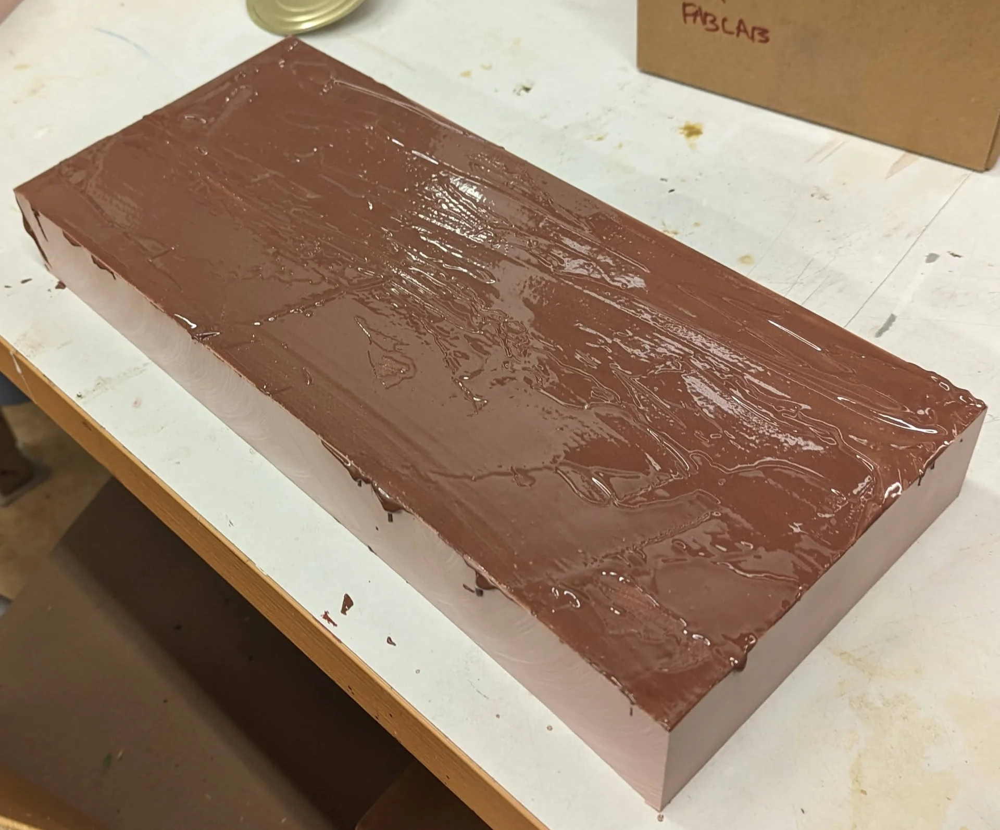
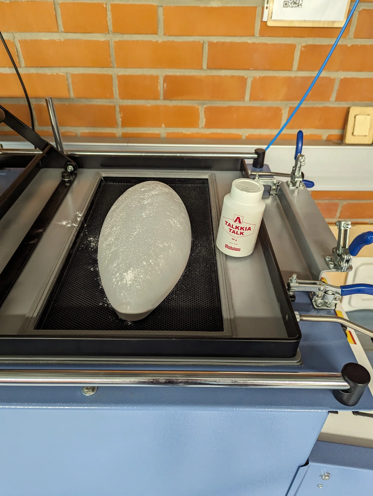
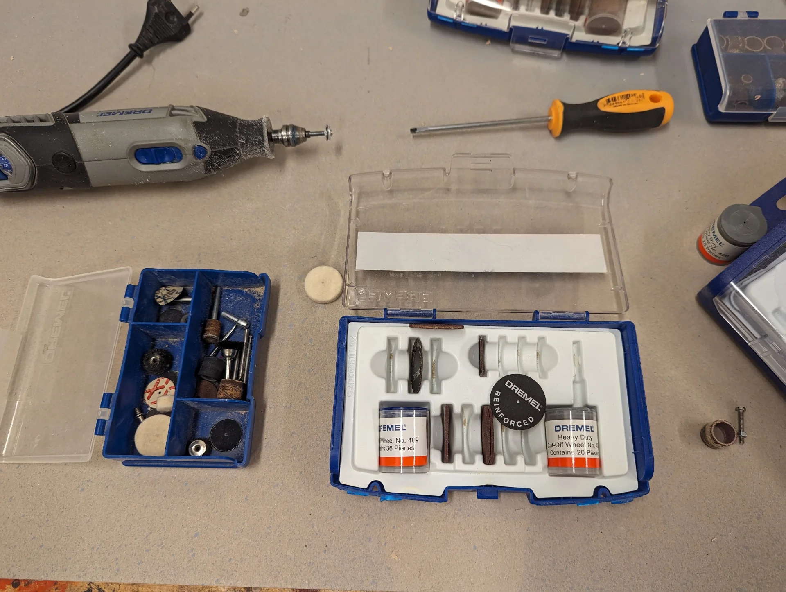

Wildcard week! This is one of the freest weeks as we got to pick one out of three manufacturing processes: waterjet, 3/4-axis milling or ultrasonic welding for producing inflatables, with which we could do an entirely free-form project. For me, this meant exploring the processes for building my lamp physically. The trickiest part of that had always been the large ellipsoid diffuser. The intuitively interesting processes for it at our lab were molding and casting, 3D-printing and vacuum forming. 

Molding and casting would have required a massive two-part mold and we did not have too much of the materials left - and those that we did have had way too short curing times and undesirable textures in being either entirely opaque or an ugly brownish transparent. 3D-printing had the same textural issues and was also constrained by the too-small print area, which would have required a vertical seam instead of the horizontal one that I much preferred. Once I found out about the large sheets of 3mm thick translucent acrylic and heard that they could be vacuum formed, I had made my decision on what I was to do. 

Vacuum forming seemed a reasonably easy and straightforward process, but it required a mold over which to form the vacuum and which to push through the material to be formed. Hence, out of the three options, 3-axis milling seemed the most reasonable, particularly in the context of the [Fab Academy](https://fabacademy.org/), where historically the mold for [molding and casting]() was already produced with the process in order to achieve as smooth of a surface finish as possible, which was required for smooth results from vacuum forming as I gathered from following [Vytautas Bikauskas' process](https://timeritualslabour.gitlab.io/digital-fabrication/week14.html) just before me. I figured I would not have to be quite as exact due to vacuum forming a larger piece of much thicker translucent material compared to his thin piece of transparent acrylic, but 3-axis milling seemed highly appropriate nevertheless as it could easily be applied to [SikaBlock](https://automotive.sika.com/en/solution-products/advanced-resins/sikablock.html), which could withstand the high temperatures of the acrylic when vacuum formed. Furthermore, it could be used for producing the stand as well.

## Assignments

Design and produce something with a digital process (incorporating computer-aided design and manufacturing) not covered in another assignment, documenting the requirements that your assignment meets, and including everything necessary to reproduce it.

- Choose one of the proposed digital manufacturing technologies.
- Create a digital design to be manufactured with the technology/machine of your choice.
- Work together with the workshop master and document the process.
- Publish the documentation on your course documentation page.
- Submit a link to your documentation page here.

## 3-axis milling

Both the larger [Recontech 1312](https://www.cnc.fi/recontech-1312.html) CNC machine and the [Roland Modela MDX-40](https://www.rolanddga.com/support/products/milling/modela-mdx-40-3d-milling-machine) milling machine are capable of 3-axis milling, with the latter supporting even 4-axis milling, where the tool can rotate around the object to be milled. As the design for my lamp diffuser was quite large at 36cm long, I had to use the Recontech 1312, the general usage of which is already documented in [Computer-Controlled Machining](). To determine the [semi-minor axis](https://en.wikipedia.org/wiki/Semi-major_and_semi-minor_axes), i.e. the maximum vertical radius of a horizontally lying ellipsoid (not a mathematically rigorous definition), I searched for the longest milling bits and defined it accordingly.

Our lab's CNC expert Jonas Tjepkema recommended that I should use 12mm thick milling bits as I did not need to do anything detailed. I thus measured the semi-minor axis accordingly and we prepared the tool paths with them before we were alerted by Aalto Fablab Manager Solomon about the 12mm collet being somehow unreliable and potentially wobbly. I had chosen the semi-minor axis to be 7.5cm with a 5mm platform to negate the effect of inevitable fillets from the vacuum forming process, giving the model a total heigh of 8cm based on the the 12mm milling bits but luckily found 6mm milling bits that were 8cm and 10cm long, both of which were fine as even though a couple centimeters had to be reserved for the collet, the shape of the ellipsoid is quite forgiving. 

### Preparing the SikaBlock

The heat-resistant SikaBlock came in large slabs with a thickness of 5cm, which meant that they had to be cut with a circular saw and glued together in order to make a thicker block from which to mill the model. To give a bit of a safety margin, we tried to cut the pieces to be approximately 40cm long and 17cm wide but as can be seen further below, they were not perfectly exact, airing on the side of rather a tiny bit too much than too little.

The [Prolab Glue](https://www.materialshop.fi/Prolab-Glue-levyliima) for gluing together the pieces of SikaBlock turned out to have a curing time of 5h, delaying the CNCing originally planned for Tuesday all the way to Friday when the next slot was available. It also turned out to be expired 6 months ago and its datasheet was no longer available anywhere on the internet due to its manufacturing having been stopped. Regardless, the chocolate pudding looking mixture that resulted from thoroughly mixing twice as much of component A to component B in a mixing ratio of 2A:1B by weight, turned out to hold perfectly well, especially when it had multiple days instead of that five hours due to the availability of the CNC machine.

### Tool configurations

3D-toolpaths can be generated in [VCarve Pro](https://www.vectric.com/products/vcarve/) analogously to 2D-toolpaths as documented in [Computer-Controlled Machining]() but this time I wanted to try [Fusion 360](https://www.autodesk.com/products/fusion-360/overview) as Jonas had mentioned it to be a lot more powerful. This, of course, required manually defining the tools to be used, which could be done by opening "Tool Library" on the "Manufacture" toolbench as shown below.

I created a new folder under `Local` called `Aalto Fablab`, where I created a new library for `Sikablock`, which contains both the 12mm and 6mm tool configurations in the below image. Later I also created another library called `Hard wood` for configuring the same 6mm end mills for milling the stand out of hard wood. The dimensions in both configurations are obviously the same but the feedrates differ as can be seen further below. 

The relevant tabs for configuring the tools are "General" where the tool can be named, "Cutter" where the tool dimensions can be configured as shown below, and Cutting data where the feedrates are adjusted. Most of the fields in "Cutter" are quite self evident: "Type" refers usually to the shape of the mill, the most common of which are "Flat end mill" for rough cutting and "Ball end mill" for finishing passes. "Unit" is wise to have be the same as on your measuring tool and "Clockwise spindle rotation" is usually correct when left checked. "Number of flutes" is the number of the twisting cutting edges of the tool - particularly easy to count as the distinct protrusions from the end of the flat end mill. "Material" I don't see having much of an effect on anyhting so that was left as the default "HSS" as well. 

"Diameter" refers to the maximum diameter of the cutting end of the tool where the flutes are, i.e. the distance from one cutting edge to another on the opposite side. "Shaft diameter" refers to the diameter of the end from which the tool is held in the collet. Overall length is the total length of the tool from end to end. "Length below holder" refers to how much of the tool comes out from the collet, such that the difference between it and the overall length of the tool is the part within the collet. It is generally a good practice to budget between 15mm to 25mm for this, with more being likely better up to that point for secure fastening of the tool. "Shoulder length" refers to that part of the tool which has a diameter corresponding to "Diameter", i.e. the length below holder that has a diameter different from "Shaft diameter". "Flute length", on the other hand, corresponds to the length of the cutting part that has sharp edges. It is thus usually a little bit less than the length of the overall spiral. 

The "Cutting data" parameters are set similarly to how it was done in the 2D case in [Computer-Controlled Machining]() by using [this reference](https://www.sorotec.de/webshop/Datenblaetter/fraeser/schnittwerte_en.pdf). In Fusion 360, the principles are the same. All the fields with fx next to them below are automatically computed from those without. Thus, the only really modifiable parameters are "Spindle speed", which is how fast the tool rotates and is recommended to be set at 16 000 for our machine and "Cutting feedrate", which determines the "Feed per tooth", which could be targeted to be quite high at 0.0875 for SikaBlock from Jonas' experience and around 0.055 for hard wood. "Ramp feedrate" and "Plunge feedrate" can be set to be equal usually at approximately one fifth (1/5) of the "Cutting feedrate" as a conservative rule of thumb. 

Then press "Accept" to add the tool configuration to the library and repeat the process for all tools to be used in the process. Below are the configurations used first for the 6mm flat end mill and then the 6mm ball end mill with cutting data first for SikaBlock and then for hard wood. No other tabs were touched so that they are all defaults.

### Creating toolpaths

The logic for creating the toolpaths is largely the same as with 2D-toolpaths, which were documented using VCarve Pro in [Computer-Controlled Machining](). To create 3D-toolpaths in Fusion 360, navigate to the "Manufacture" workbench from the top left corner and click on "Setup" to set up the material as shown below. Here all the options are pretty much self-explanatory and the visual preview shows the effect of each parameter. It is important to set the origin ("Stock Point") identically in both Fusion and the CNC machine controller (In this case [Mach3](https://www.machsupport.com/software/mach3/)) so do pay particular attention to that. Then I just set the dimensions of the stock to match the cut pieces, which had a couple of centimeters of margin and clicked "OK" without touching the "Post Process" tab. 

For the roughing pass, I used the adaptive clearing roughing strategy with the below settings. As the tools were already configured, I could simply select the 6mm flat end mill from the "Sikablock" library and proceed to the next parts of the setup, which was much more extensive and customizable than that of VCarve Pro.

In the "Geometry" tab you can define the "Machining Boundary", which defines the horizontal software limits for how far the toolpath can go. "Stock Definition" intelligently looks at previous operations to determine how much of the stock is left to avoid excess work. I left these to defaults if I remember correctly. "Heights" defines the vertical software limits for the toolpath whereas "Passes" allows for finer control of the parameters of the toolpath and the tool while cutting. For most operations it suffices to leave these to their defaults as well. "Maximum Roughing Stepdown" is usually good to be kept to half of the diameter of the tool and climb "Direction" usually provides desired results. "Stock to Leave" does what it says. "Linking" I also left in its default state.

Now clicking "OK" generates the toolpaths as seen below. On the left is the generated toolpath and on the right is a visualization of the result after running it. 

As the roughing toolpath leaves a bit of material, I added a "2D Contour" to cut the model shape out entirely. I left everything else as default except that I chose the contour to be the outline of the remaining model. 

Finally, I added a finishing toolpath using "Scallop" where most of the settings were again either the same or left as defaults.

For the stand, I went through the same exact steps with the only differences being the different tool configurations and a "Parallel" finishing toolpath instead of "Scallop". The stand was redesigned to be more sturdy and stable but primarily so that it would be easily producible via 3-axis milling. More about this in [system integration]().

### Exporting toolpaths

Exporting the toolpaths was initially the most confusing part. To export toolpaths, generate an "NC Program", which represents a single "job" to be run on the target machine, by clicking the button next to "Setup". The confusing part was then trying to figure out what "Post" under "Machine and post" means. Eventually, we figured out that I should select "Artsoft"'s "Mach3Mill" from the "Post Library" that can be opened by clicking the folder icon next to the "Post" field. Everything else can be left as default, although it is a good idea to specify a filename and make sure where to find the output. Then, in the "Operations" tab, select the toolpaths that share the same tool and post them. The resulting files correspond to those generated in [Computer-Controlled Machining]() but have the file extension `.tap` instead of `.txt`.

### CNC milling result

I first tested the toolpath with some foam as I was a bit anxious about only having 60mm of the tool showing out of the collet for an 80mm tall model but I could soon see that the curvature mitigated this problem entirely. I then taped the SikaBlock onto the sacrificial layer, placed it carefully so that the tool could run directly parallel to its edge and then executed the `.tap` toolpaths as already documented in [Computer-Controlled Machining](), producing the below results.

The 12mm toolpaths would have only taken a bit less than an hour combined but the 6mm tool took almost three hours for the roughing alone, even though I increased the feedrate slightly from Mach3 as it was running too. However, it was late on a Friday and I wagered that the result was already smooth enough for my purposes, thus deciding to forego the finishing pass entirely and only sand and coat it instead to make it smooth enough. As can be seen below, however, taping it to the sacrificial layer might have been a mistake after all as it was very difficult to separate. 

I wiped the sanded model with wet paper after air gunning it to really make sure that all of the dust was gone. Then, following in [Vytautas' footsteps](https://timeritualslabour.gitlab.io/digital-fabrication/week14.html), I coated it with a spraykit made for smoothening models and then sanded it once more to obtain the very smooth but still not quite perfect model below on the right. I figured it should be sufficient for my thick translucent acrylic though as I doubted that the details would propagate onto the surface - which turned out to be correct.

Later I also 3D-milled the newly designed stand, which required a lot less post processing. I noticedd only after it was ready, that for some reason the finishing pass had only touched the inside of the stand but I decided that it merely added an intriguing detail, sanded the outside a little bit and left it be as it was.

## Vacuum forming

The point of 3-axis milling the SikaBlock was to create the lamp cover halves by vacuum forming translucent 3mm thick acrylic. I first practiced with some cheap, white, opaque 0.5mm polystyrene to get the hang of it and then did a few tests with thicker throwaway material as the translucent stuff was a bit more expensive; first a transparent 2mm thick blue piece of acrylic and then some 3mm thick yellowish green transparent acrylic. 

Operating the [Vacuum Former 750FLB](https://www.crclarke.co.uk/products/vacuum-formers/vacuum-former-750flb#1485279920347-7622c1c1-71fc) is very simple. It can be used with three different material sizes by changing the model platform and the plate with a rectangular hole, over which the material to be formed is placed. It is usually advisable to choose the smallest one that still leaves a healthy margin between your model and the borders of the hole. Put the model platform inside and pin the plate into place with the larger clamp frame locking mechanism. For different suction characteristics, a fitted piece of plywood can be placed on the stand. 

Place the model onto the platform, which can be brought up by pulling down the large lever on the left side of the machine. Pin the sheet of material under the clamp frame of the plate and turn on the vacuum former from the white switch at the bottom left corner of its control panel. Turn the knobs to the right to the desired setting, which is usually full. The red areas on the yellow background show which heater elements it turns on but the convention is usually just to use all of them without thinking about it too much. The variable to be changed depending on the material is typically the time of how long it is heated up. This can be set at the bottom right corner, where each of the blue buttons corresponds to the digit under which they are placed.

Once you have set up the model and the material, set the appropriate time for the material used (listed above the timer for some typical materials - otherwise ask the staff if you do not know), pull the yellow heater over it and wait until the timer sounds an alarm when reaching the set time. Push away the heater and then, simultaneously, push down the lever to bring the model up to the material and flip the vacuum switch (labeled "VAC PUMP") next to the power switch on. Let the material form and set on the model and then use the black button between the temperature knobs and the timer to carefully pump a bit of air between the model and the material so that you can push the lever up and bring down the platform. Turn off the vacuum pump.

Wait for a minute or two before loosening the clamp frame and remove the model from the material by blowing some compressed air in between them. The process is simple but requires developing a bit of a feel because exact temperatures are not displayed and though the lights in the grid above the temperature knobs seem to indicate which heaters are on, we are not sure if they communicate readiness in any way. The motions have to also be done relatively quickly before the material has cooled back down and you should be careful with the air pump button in order to not accidentally ruin the shape. Hence, practice is key. 

[Aalto Fablab](https://studios.aalto.fi/fablab/)'s version of the documentation can be found [here](https://wiki.aalto.fi/display/AF/CR+Clarke+750FLB+Vacuum+Former). When designing for vacuum forming, do make sure to take into account the inevitable fillets. I accounted for 5mm fillets in my design by raising the start of the half ellipsoid by that much from the ground.  

### Forming 3mm acrylic

Vacuum forming 0.5mm - 1mm polystyrene is pretty easy but 3mm acrylic is a different beast entirely. It took us two days of experimentation to successfully vacuum form them. I started by preparing my model by sprinkling some talc on it so that it would be easier to pull free from the acrylic and then had my first test run with the 2mm thick sheet, which, after some hundreds of seconds of careful, gradual heating, failed abruptly during the actual vacuum forming as the acrylic got pulled out from underneath the clamp frame, getting rid of the vacuum.

My next attempts were with the 3mm acrylic that I cut into exactly the same size pieces as I had previously cut the translucent acrylic. However, it did not work, failing more catastrophically than the previous ones. With processes like these, just your average failure is never enough but some additional small annoyances always manage to creep in there as well. Here it was the fact that the wrappng of the green acrylic would not properly come off at certain spots and after trying everything from water to heat to sand paper, I asked Kris for his recommendation and he told me to just throw it on there as is. Absolved from the responsibility of accidentally gassing everyone, I did but to no avail. 

The diagnosis was simple: the sheets of material were not large enough. Another possibly contributing factor was a slight tear in the rubber around the hole. The size hypothesis led to rather awkward of a situation as the translucent acrylic was already cut into pieces of that exact size. We tried adjusting the clamp frame to be as tight and balanced as possible while very carefully placing the acrylic at the very center but it did not help. We tried to make the material as soft as possible by heating it up to 900 seconds at gradually increasing temperatures until the last 300 - 400 seconds were at maximum temperature. 

I even got the idea of adding a very thin sheet at the offending edge to try retain the vacuum even when the material got pulled but this we never actually tried. When we ran out of the scrap material, we decided to try with one of the three already cut translucent acrylic sheets as we did not have anything to lose. If it did not work, the rest would likely not either.



Particularly frustrating was how we had to wait up to 15 minutes for the results of each attempt. I saw the issue of the pieces not being large enough pretty early and likely so did Kris too, but he was feeling experimental and wanted to try it a few times. Ultimately, however, we had to give up and go for the larger pieces. In fact, he was feeling so experimental as to want to try to do it with a bigger sheet as well. The rationale behind this would be that with respect to its total area, forming to the new shape would require less material per unit area and would therefore pull it less from the edges. I personally thought that simply adding more material to the edges to be pulled would be sufficient and it turned out in the end that we were both correct, although I was very anxious about changing it up once again after my attempt had already produced a decent half. 

 I laser cut new, larger pieces from a new sheet but I accidentally cut it too large as it went beyond the outer clamp frame as well, which would not do. We then cut and sanded them with Solomon to make it just fit and lo and behold, it worked!

Kris got the idea to also use a heat gun on it to try to get rid of the fillets as much as possible. So we did that and attained a beautigul piece after having heated it up for 250 second on level 3, 250 seconds on level 4 and 300 seconds on maximum. 

For some reason that I cannot remember anymore, we tested vacuum forming the larger piece with a 3mm thick transparent acrylic sheet instead of the translucent one, but it started boiling at around 720 seconds so that it could be smelled. The vacuum forming was successful but it became all bubbly and pretty much opaque, which was surely a cool effect but not quite what was originally intended. To make sure the boiling was a property of the different material instead of somehow being related to the different size, we replicated the process with the smaller half of the sheet, attaining the same result. Interestingly though, this one had much tighter fillets. In the spirit of exploration, we also put the piece of plywood under and, though I do not exactly know if it did something due to the lack of a control case in that specific size, it came out quite neat so that I did it with the next ones too.

Finally I vacuum formed the larger piece of the translucent acrylic as well and it was a success, although I was very nervous about it as one of the edges had so little material because of a bolt coming up as the platform inside was being raised. With the other material, we had placed it partially on top of it and gotten lucky so that it had only cracked the edge and not further but I did not want to take the same risk here, which forced me to trade it to the other one. Luckily, however, it worked too.

Below are all, except one, of the attempts in chronological order of production from left to right. 

## Post-processing

The vacuum-formed acrylic finally came out looking really nice but it was not exactly usable immediately. Instead, it had to be cut out and then sanded and then sanded and then sanded and sanded and sanded...

I took out the [Dremel 4000](https://www.dremel.com/fi/fi/p/dremel-4000-f0134000ja) rotary tool and changed its tool to be a "Heavy Duty Cut-Off Wheel", of which I ended up destroying a few in the process as I figured out the speed, depth and angles I could do it in. I carefully cut out the diffuser, with a bit of room for sanding for the first one, which I did not give the second because of how done I was with it at that point already. 

I asked Solomon and Kris about using a belt sander on it but they did not think it that good of an idea due to it being a bit risky and due to it staining the belt. I then taped some rough sandpaper to the table and did it manually against the even, horizontal surface, though I regret not sneaking off to use the belt sander myself.

Having manually sanded for a couple of hours while listening to multiple episodes of [Hardcore History](https://www.dancarlin.com/hardcore-history-series/), I realized I could use the dremel to even out the roughest of rough spots a little bit. Then I also improvised a belt sander of my own by using one of the triangular detail sanders but it too was unfortunately ineffective. 

At some point I got the idea to watch some movies I had been tangentially interested in and would not likely otherwise watch but could now as I did not have anything better to do either. I sanded almost throughout the night, mostly manually and sometimes with the detail sander, finishing four or five movies during the time until finally the sides were even and I had the external components of my lamp ready as depicted below. As the very last thing, I carefully used the dremel to cut - or more like sand - a hole for the power cable at one end.

## Reflections

This week stretched and ballooned way beyond the original expected time due to a series of setbacks from unforeseen lengthy curing times to stubborn exploration, even when the sensible thing might have been to cut our losses and just go for a bigger sheet of acrylic immediately. Combine with that two days of waiting around, which was the vast majority of vacuum forming such thick materials and manually sanding for 10+ hours and it turns out to be quite a frustrating week - which in reality was more like two on top of that. 

Regardless, it was also highly rewarding as this is how the lamp came into existence as a physical object. Sure, it was not quite a lamp just yet, lacking the internal structure and lights but the form had finally become tangible. The key takeaways of the week include even more careful planning in order to make sure that parts of processes do not get stuck because of some other steps that must be taken prior. Changing variables enough to justifiably expect different outcomes, avoiding sunk cost fallacy and a tad more rebelliousness might also have sped everything along substantially.

