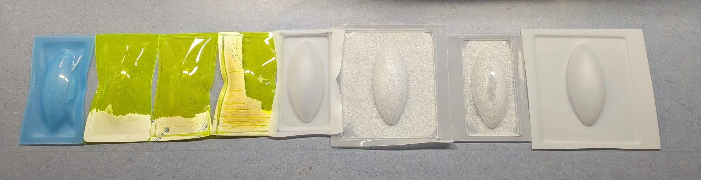

Wildcard week! This is one of the freest weeks as we got to pick one out of three manufacturing processes: waterjet, 3/4-axis milling or ultrasonic welding for producing inflatables, with which we could do an entirely free-form project. For me, this meant exploring the processes for building my lamp physically. The trickiest part of that had always been the large ellipsoid diffuser. The intuitively interesting processes for it at our lab were molding and casting, 3D-printing and vacuum forming. 

Molding and casting would have required a massive two-part mold and we did not have too much of the materials left - and those that we did have had way too short curing times and undesirable textures in being either entirely opaque or an ugly brownish transparent. 3D-printing had the same textural issues and was also constrained by the too-small print area, which would have required a vertical seam instead of the horizontal one that I much preferred. Once I found out about the large sheets of 3mm thick translucent acrylic and heard that they could be vacuum formed, I had made my decision on what I was to do. 

Vacuum forming seemed a reasonably easy and straightforward process, but it required a mold over which to form the vacuum and which to push through the material to be formed. Hence, out of the three options, 3-axis milling seemed the most reasonable, particularly in the context of the [Fab Academy](https://fabacademy.org/), where historically the mold for [molding and casting]() was already produced with the process in order to achieve as smooth of a surface finish as possible, which was required for smooth results from vacuum forming as I gathered from following [Vytautas Bikauskas' process](https://timeritualslabour.gitlab.io/digital-fabrication/week14.html) just before me. I figured I would not have to be quite as exact due to vacuum forming a larger piece of much thicker translucent material compared to his thin piece of transparent acrylic, but 3-axis milling seemed highly appropriate nevertheless as it could easily be applied to [SikaBlock](https://automotive.sika.com/en/solution-products/advanced-resins/sikablock.html), which could withstand the high temperatures of the acrylic when vacuum formed. Furthermore, it could be used for producing the stand as well.

## Assignments

Design and produce something with a digital process (incorporating computer-aided design and manufacturing) not covered in another assignment, documenting the requirements that your assignment meets, and including everything necessary to reproduce it.

- Choose one of the proposed digital manufacturing technologies.
- Create a digital design to be manufactured with the technology/machine of your choice.
- Work together with the workshop master and document the process.
- Publish the documentation on your course documentation page.
- Submit a link to your documentation page here.

## 3-axis milling

Both the larger [Recontech 1312](https://www.cnc.fi/recontech-1312.html) CNC machine and the [Roland Modela MDX-40](https://www.rolanddga.com/support/products/milling/modela-mdx-40-3d-milling-machine) milling machine are capable of 3-axis milling, with the latter supporting even 4-axis milling, where the tool can rotate around the object to be milled. As the design for my lamp diffuser was quite large at 36cm long, I had to use the Recontech 1312, the general usage of which is already documented in [Computer-Controlled Machining](). To determine the [semi-minor axis](https://en.wikipedia.org/wiki/Semi-major_and_semi-minor_axes), i.e. the maximum vertical radius of a horizontally lying ellipsoid (not a mathematically rigorous definition), I searched for the longest milling bits and defined it accordingly.

Our lab's CNC expert Jonas Tjepkema recommended that I should use 12mm thick milling bits as I did not need to do anything detailed. I thus measured the semi-minor axis accordingly and we prepared the tool paths with them before we were alerted by Aalto Fablab Manager Solomon about the 12mm collet being somehow unreliable and potentially wobbly. I had chosen the semi-minor axis to be 8cm based on the the 12mm milling bits but luckily found 6mm milling bits that were 8cm and 10cm long, both of which were fine as even though a couple centimeters had to be reserved for the collet, the shape of the ellipsoid is quite forgiving. 

### Preparing the SikaBlock

The heat-resistant SikaBlock came in large slabs with a thickness of 5cm, which meant that they had to be cut with a circular saw and glued together in order to make a thicker block from which to mill the model. To give a bit of a safety margin, we tried to cut the pieces to be approximately 40cm long and 17cm wide but as can be seen further below, they were not perfectly exact, airing on the side of rather a tiny bit too much than too little.

The [Prolab Glue](https://www.materialshop.fi/Prolab-Glue-levyliima) for gluing together the pieces of SikaBlock turned out to have a curing time of 5h, delaying the CNCing originally planned for Tuesday all the way to Friday when the next slot was available. It also turned out to be expired 6 months ago and its datasheet was no longer available anywhere on the internet due to its manufacturing having been stopped. Regardless, the chocolate pudding looking mixture that resulted from thoroughly mixing twice as much of component A to component B in a mixing ratio of 2A:1B by weight, turned out to hold perfectly well, especially when it had multiple days instead of that five hours due to the availability of the CNC machine.

### Tool configurations

3D-toolpaths can be generated in [VCarve Pro](https://www.vectric.com/products/vcarve/) analogously to 2D-toolpaths as documented in [Computer-Controlled Machining]() but this time I wanted to try [Fusion 360](https://www.autodesk.com/products/fusion-360/overview) as Jonas had mentioned it to be a lot more powerful. This, of course, required manually defining the tools to be used, which could be done by opening "Tool Library" on the "Manufacture" toolbench as shown below.

I created a new folder under `Local` called `Aalto Fablab`, where I created a new library for `Sikablock`, which contains both the 12mm and 6mm tool configurations in the below image. Later I also created another library called `Hard wood` for configuring the same 6mm end mills for milling the stand out of hard wood. The dimensions in both configurations are obviously the same but the feedrates differ as can be seen further below. 

The relevant tabs for configuring the tools are "General" where the tool can be named, "Cutter" where the tool dimensions can be configured as shown below, and Cutting data where the feedrates are adjusted. Most of the fields in "Cutter" are quite self evident: "Type" refers usually to the shape of the mill, the most common of which are "Flat end mill" for rough cutting and "Ball end mill" for finishing passes. "Unit" is wise to have be the same as on your measuring tool and "Clockwise spindle rotation" is usually correct when left checked. "Number of flutes" is the number of the twisting cutting edges of the tool - particularly easy to count as the distinct protrusions from the end of the flat end mill. "Material" I don't see having much of an effect on anyhting so that was left as the default "HSS" as well. 

"Diameter" refers to the maximum diameter of the cutting end of the tool where the flutes are, i.e. the distance from one cutting edge to another on the opposite side. "Shaft diameter" refers to the diameter of the end from which the tool is held in the collet. Overall length is the total length of the tool from end to end. "Length below holder" refers to how much of the tool comes out from the collet, such that the difference between it and the overall length of the tool is the part within the collet. It is generally a good practice to budget between 15mm to 25mm for this, with more being likely better up to that point for secure fastening of the tool. "Shoulder length" refers to that part of the tool which has a diameter corresponding to "Diameter", i.e. the length below holder that has a diameter different from "Shaft diameter". "Flute length", on the other hand, corresponds to the length of the cutting part that has sharp edges. It is thus usually a little bit less than the length of the overall spiral. 

The "Cutting data" parameters are set similarly to how it was done in the 2D case in [Computer-Controlled Machining]() by using [this reference](https://www.sorotec.de/webshop/Datenblaetter/fraeser/schnittwerte_en.pdf). In Fusion 360, the principles are the same. All the fields with fx next to them below are automatically computed from those without. Thus, the only really modifiable parameters are "Spindle speed", which is how fast the tool rotates and is recommended to be set at 16 000 for our machine and "Cutting feedrate", which determines the "Feed per tooth", which could be targeted to be quite high at 0.0875 for SikaBlock from Jonas' experience and around 0.055 for hard wood. "Ramp feedrate" and "Plunge feedrate" can be set to be equal usually at approximately one fifth (1/5) of the "Cutting feedrate" as a rule of thumb. 

Then press "Accept" to add the tool configuration to the library and repeat the process for all tools to be used in the process. Below are the configurations used first for the 6mm flat end mill and then the 6mm ball end mill with cutting data first for SikaBlock and then for hard wood. No other tabs were touched so that they are all defaults.

plunge rate = 1/5 cutting rate (conservatively)

Vacuum forming difficulties: 

The covering tape would not come off fully - put it in there anyway

The acrylic would get pulled out from underneath the frame so that the vacuum breaks and it forms into a dent instead of the shape

Toolpaths for stand as well

transparent stuff started boiling around 720 seconds.

