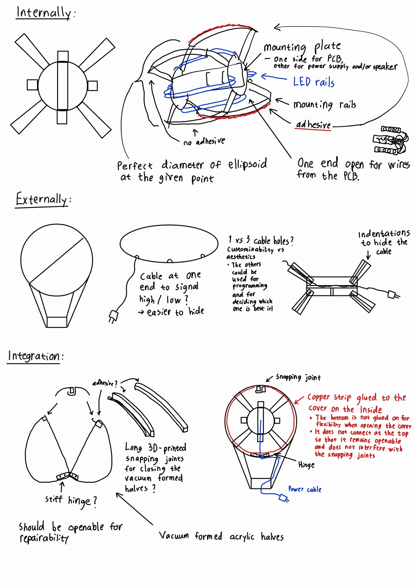
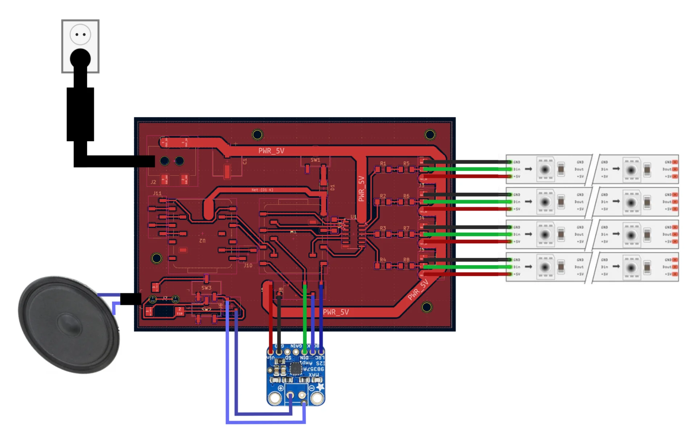
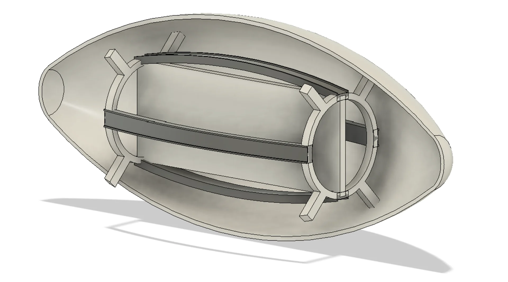
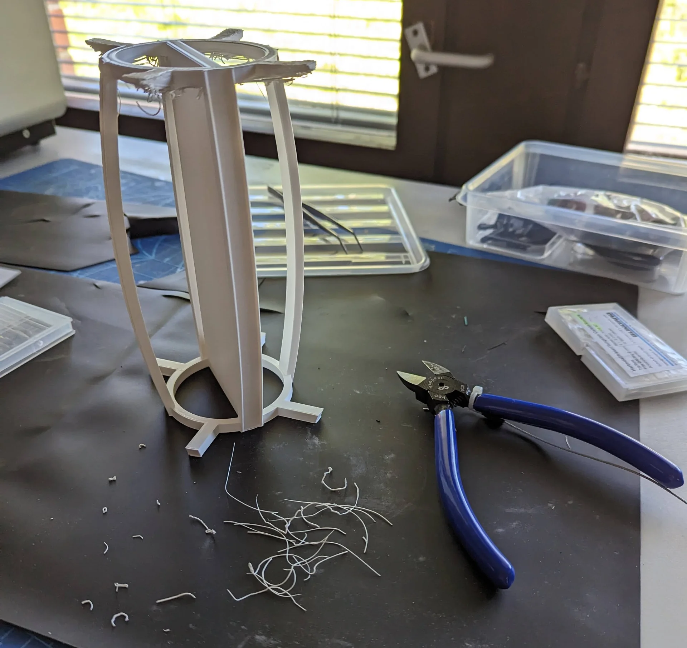
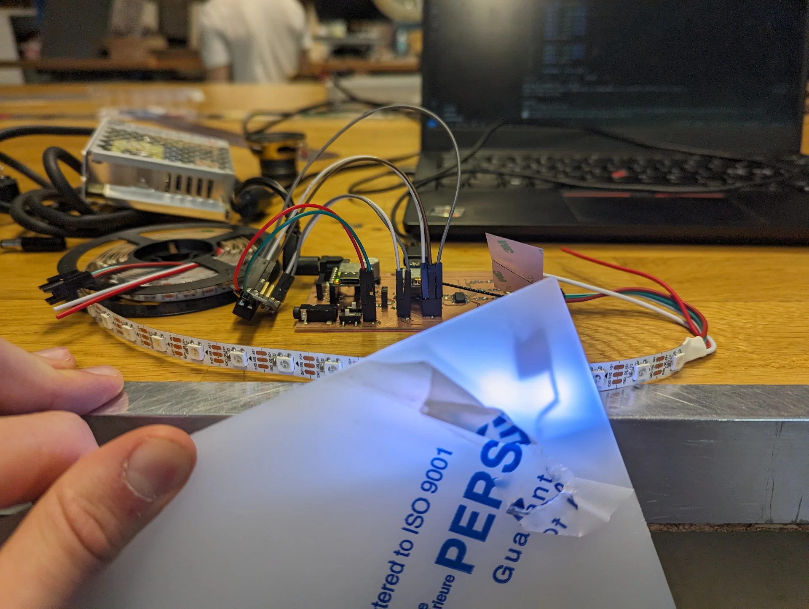
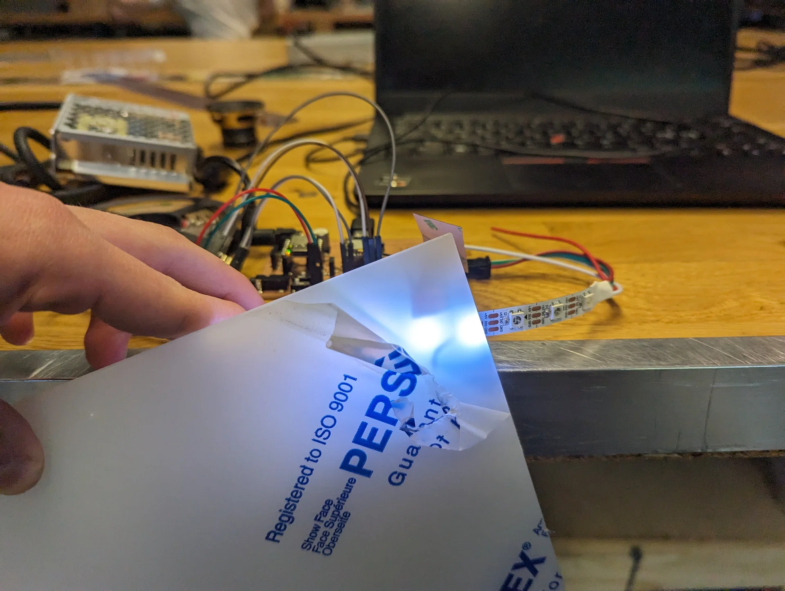
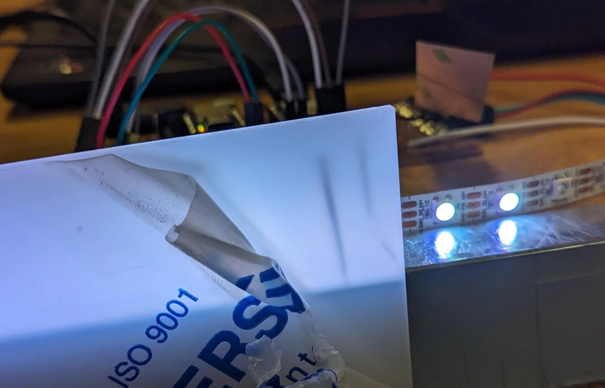
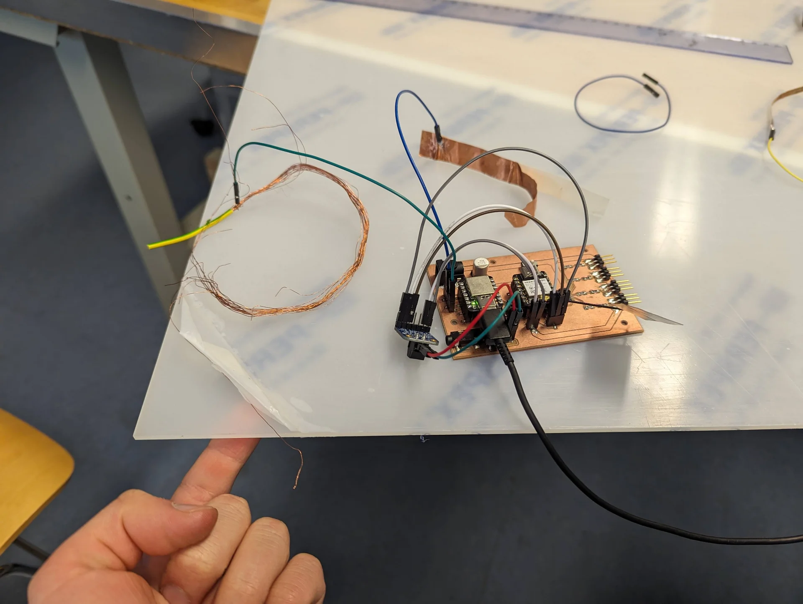
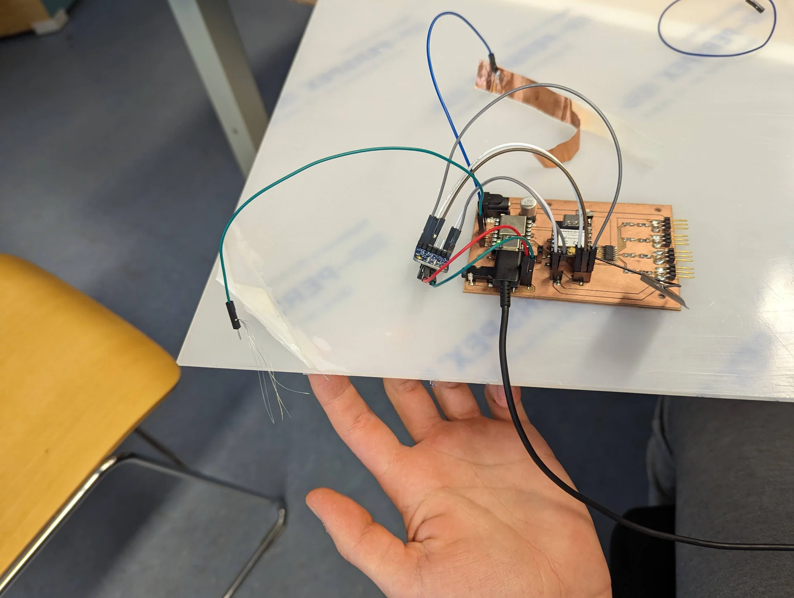
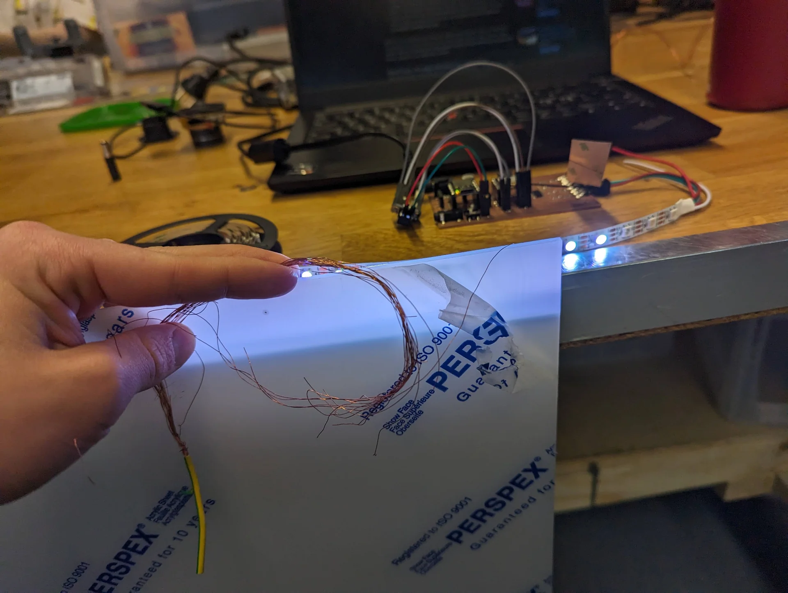

This was a very interesting and highly important week, albeit timed a bit peculiarly with respect to other weeks. I would personally have it swap places with the wildcard week at the very least as many including me, at least in our lab, tend to use that for making covers and other highly visible parts of their final projects. It could be pushed much further too as we have needed at least an idea of it for long having been doing it on the side for many weeks. Regardless, it is valuable to be forced to write it down too - even this late. 

## Assignments

- Draw a system diagram of your final project.
- Create a 3D design of how major components are going to fit together in your final project.
- Calculate power budget of your system and decide what power supply it will need and where it is going to enter the system.
- Decide what connectors you will use and how you will cut cables to size.
- Draw a cable management diagram.
- Decide what components will be made and what will be ready-made.

## Sketching of internals

I have made various sketches of the different components of the final project and their connections over the weeks trying to illustrate what the lamp would look like on the outside and on the inside. Below is a compilation of the latest ideas that I started the week with. 

The sketches are divided in three: internal, external and integration. The internal structure is intended to hold all the electronics including the circuit board, a speaker and the LEDs. It has a mounting plate through which the PCB can be drilled to hold it in place in the center with the speaker. It has rails for the LEDs close to the center so that the light gets distributed and diffused as evenly as possible and ones further out for mounting it on the lamp cover. The mounting rails follow the curved internal surface of the ellipsoid exactly so that they add up to the perfect diameter at all points. This makes it so that the electronics stay in the middle at all times so as to never disturb the light or risk mechanical damage  even if the adhesion were to wear off or never applied.

Externally, the lamp cover will be assembled from two halves of 3mm translucent acrylic, meaning that there will be a seam. It will hopefully not be incredibly obvious but it can be disturbing for especially swiping gestures and it would therefore be advisable to place it so that seam is not on the top. Near horizontal placement might be best for gestures but the cable hole must be made at the seam because it is much easier and the cable has a thicker part near its end which would require a really oversized hole for inserting it directly through. Therefore, depending on where the lamp was displayed, it would look a bit stupid for the cable to just protrude out of the side. Hence, placing it at approximately 35° - 40° likely makes the most sense. 

If I were to put the cable hole near one end of the stand, it would then make sense to carve indentations to in it to hide the cable as well as possible, so that it seems to come from the stand instead of the lamp. Having the cable hole in one end makes the stand unsymmetric though, which annoys me a little bit. Hence the thought of having 3 in the sketch but even that does not make any sense because one can always turn it around. The only place to attain symmetry would be in the middle but then it could not be properly hidden. Luckily the hole can be added with a rotary sanding tool later but having only one closer to either end probably makes the most sense in the end. 

I would prefer to have the cover be easily openable for maintenance and repairability but this seems very difficult to do. The best idea I could come up with for it would be to have a hinge at the bottom and some sort of 3D-printed snapping joints below the top but these likely be an issue due to creating shadows, as seen below, even if they were printed from a somewhat translucent material. 

## Cable management

Cable management will be quite minimal as can be seen from the below diagram. 

The power cable will be connected to 5.5mm power connector and will be suspended in air as much as possible between the hole and the board so that it obstructs light minimally. The speaker will be connected via a 3.5mm audio jack using the shortest possible wires fastened onto the mounting plate and the LED strips will be fastened onto their rails with zip ties, rubber bands or glue, whichever works best without obstructing the lights while also allowing for changing them should there be faults. The cables between them and the board will be cut short but otherwise likely suspended in air as well as both their ends are mounted.

There are standard 5.5mm and 3.5mm jack connectors for power and audio so that the speaker and power cable are easy to swap. The amplifier should be mounted on the board but has to be connected via short jumper cables in order to connect the power and ground properly. The LED strips are also connected with the standard connector that they come with as well as with jumper cables soldered onto them.

## Power budget

At my request, Kris acquired a [5V 7A 35W power supply](https://www.digikey.gr/en/products/detail/tt-electronics-power-partners-inc/PEAMD50-10-B2/15838859), giving me a power budget of 35 watts, which will be sufficient as long as I do not run the NeoPixels fully white at 100% full brightness, which would take 120 * 60mA = 7.2A. The [speaker's datasheet](https://www.mspindy.com/spec-sheets/PSR-57N08A01-AQ.pdf) rates it at 0.5W (max 1W) and the [MAX98357A Adafruit I2S 3W Class D Amplifier Breakout board](https://www.adafruit.com/product/3006) is said to be highly efficient so audio will not take any more than 1W. The XIAOs draw current in the order of magnitude of tens of milliamps, with the ESP32C consuming 74mA while using WiFi according to [this test](https://files.seeedstudio.com/wiki/XIAO_WiFi/Resources/Seeed_Studio_XIAO_ESP32C3_Power_Consumption_Tests.pdf). 

I can round up the XIAO ESP32C3's current consumption up to 100mA and multiply it by 2 to get 200mA for both XIAOs with a bit of a buffer too. Taking the maximum 1W of the speaker with the amplifier running at 5V gives another 200mA as power = voltage * current. I then have 6.6A (6600mA) left to use for the LEDs, giving me 6600 / 120 = 55mA per NeoPixel, which corresponds to 91.666...% which can be rounded down to 90% for ease and tiny bit of additional safety. Various sources online recommend at least 10-20% headroom, which would leave 43-49mA per NeoPixel, corresponding to 72-82% brightness when accounting for the XIAOs and the speaker with some headroom in those as well. 80% is then a great, fully safe absolute maximum brightness, which could potentially be stretched to 85% if absolutely necessary. 

## 3D design

## Components

The lamp cover diffuser and the stand as well as the internal framework will be produced via 3-axis milling and 3D-printing. The custom circuit board inside is milled from FR2 copper but all electronic components on it, which can be found on the [final project page](), are bought from [DigiKey](https://www.digikey.com/) along with the speaker, power supply and the WS2812B LED strip.

## Cover diffuser shadow tests

transparent PLA?

What kind of system diagram? UML of functions, electronics layout including but also beyond the PCB, 3D-design cross-section, above integration sketch?

