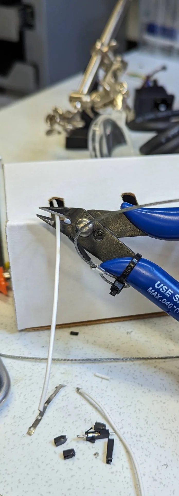
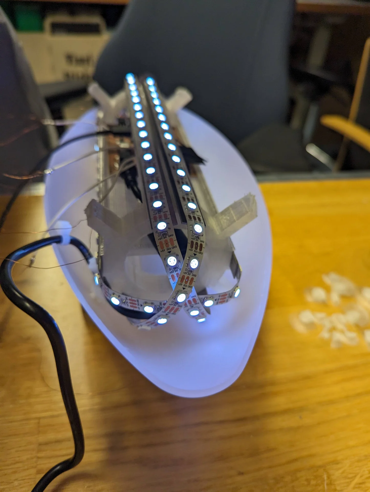

This was a very interesting and highly important week, albeit timed a bit peculiarly with respect to other weeks. I would personally have it swap places with the wildcard week at the very least as many including me, at least in our lab, tend to use that for making covers and other highly visible parts of their final projects. It could be pushed much further too as we have needed at least an idea of it for long having been doing it on the side for many weeks. Regardless, it is valuable to be forced to write it down too - even this late. 

Most of the assignments listed below, as well as the introductory paragraph above, were done before the wildcard week: [3-Axis Milling & Vacuum Forming](), where I created the parts from which the lamp would be assembled. Due to how closely linked the system integration planning is with the actual assembly, I decided to document the assembly here as well, although the assignments of the wildcard week were really done in between chronologically. This piece of documentation tries to then juggle between the original plan and the actual execution, written almost a month apart.

## Assignments

- Draw a system diagram of your final project.
- Create a 3D design of how major components are going to fit together in your final project.
- Calculate power budget of your system and decide what power supply it will need and where it is going to enter the system.
- Decide what connectors you will use and how you will cut cables to size.
- Draw a cable management diagram.
- Decide what components will be made and what will be ready-made.

## Sketching of internals

I had made various sketches of the different components of the final project and their connections over the weeks trying to illustrate what the lamp would look like on the outside and on the inside. Below is a compilation of the ideas that I started the week with. 

The sketches are divided in three: internal, external and integration. The internal structure is intended to hold all the electronics including the circuit board, a speaker and the LEDs. It has a mounting plate through which the PCB can be drilled to hold it in place in the center with the speaker. It has rails for the LEDs close to the center so that the light gets distributed and diffused as evenly as possible and ones further out for mounting it on the lamp cover. The mounting rails follow the curved internal surface of the ellipsoid exactly so that they add up to the perfect diameter at all points. This makes it so that the electronics stay in the middle at all times so as to never disturb the light or risk mechanical damage  even if the adhesion were to wear off or never applied.

Externally, the lamp cover will be assembled from two halves of 3mm translucent acrylic, meaning that there will be a seam. It will hopefully not be incredibly obvious but it can be disturbing for especially swiping gestures and it would therefore be advisable to place it so that seam is not on the top. Near horizontal placement might be best for gestures but the cable hole must be made at the seam because it is much easier and the cable has a thicker part near its end which would require a really oversized hole for inserting it directly through. Therefore, depending on where the lamp was displayed, it would look a bit stupid for the cable to just protrude out of the side. Hence, placing it at approximately 35° - 40° likely makes the most sense. 

If I were to put the cable hole near one end of the stand, it would then make sense to carve indentations to in it to hide the cable as well as possible, so that it seems to come from the stand instead of the lamp. Having the cable hole in one end makes the stand unsymmetric though, which annoys me a little bit. Hence the thought of having 3 in the sketch but even that does not make any sense because one can always turn it around. The only place to attain symmetry would be in the middle but then it could not be properly hidden. Luckily the hole can be added with a rotary sanding tool later but having only one closer to either end probably makes the most sense in the end. 

I would prefer to have the cover be easily openable for maintenance and repairability but this seems very difficult to do. The best idea I could come up with for it would be to have a hinge at the bottom and some sort of 3D-printed snapping joints below the top but these likely be an issue due to creating shadows, as seen below, even if they were printed from a somewhat translucent material. 

## Cable management

Cable management will be quite minimal as can be seen from the below diagram. 

The power cable will be connected to 5.5mm power connector and will be suspended in air as much as possible between the hole and the board so that it obstructs light minimally. The speaker will be connected via a 3.5mm audio jack using the shortest possible wires fastened onto the mounting plate and the LED strips will be fastened onto their rails with zip ties, rubber bands or glue, whichever works best without obstructing the lights while also allowing for changing them should there be faults. The cables between them and the board will be cut short but otherwise likely suspended in air as well as both their ends are mounted.

There are standard 5.5mm and 3.5mm jack connectors for power and audio so that the speaker and power cable are easy to swap. The amplifier should be mounted on the board but has to be connected via short jumper cables in order to connect the power and ground properly. The LED strips are also connected with the standard connector that they come with as well as with jumper cables soldered onto them.

## Power budget

At my request, Kris acquired a [5V 7A 35W power supply](https://www.digikey.gr/en/products/detail/tt-electronics-power-partners-inc/PEAMD50-10-B2/15838859), giving me a power budget of 35 watts, which will be sufficient as long as I do not run the NeoPixels fully white at 100% full brightness, which would take 120 * 60mA = 7.2A. The [speaker's datasheet](https://www.mspindy.com/spec-sheets/PSR-57N08A01-AQ.pdf) rates it at 0.5W (max 1W) and the [MAX98357A Adafruit I2S 3W Class D Amplifier Breakout board](https://www.adafruit.com/product/3006) is said to be highly efficient so audio will not take any more than 1W. The XIAOs draw current in the order of magnitude of tens of milliamps, with the ESP32C consuming 74mA while using WiFi according to [this test](https://files.seeedstudio.com/wiki/XIAO_WiFi/Resources/Seeed_Studio_XIAO_ESP32C3_Power_Consumption_Tests.pdf). 

I can round up the XIAO ESP32C3's current consumption up to 100mA and multiply it by 2 to get 200mA for both XIAOs with a bit of a buffer too. Taking the maximum 1W of the speaker with the amplifier running at 5V gives another 200mA as power = voltage * current. I then have 6.6A (6600mA) left to use for the LEDs, giving me 6600 / 120 = 55mA per NeoPixel, which corresponds to 91.666...% which can be rounded down to 90% for ease and tiny bit of additional safety. Various sources online recommend at least 10-20% headroom, which would leave 43-49mA per NeoPixel, corresponding to 72-82% brightness when accounting for the XIAOs and the speaker with some headroom in those as well. 80% is then a great, fully safe absolute maximum brightness, which could potentially be stretched to 85% if absolutely necessary. 

Due to factors discussed under Assembly, I ended up only using 110 LEDs and no speaker, hence having 61.8mA per pixel after all - or 55mA corresponding to 90% brightness with 11% of headroom. Ultimately, I ended up setting software limits for a minimum of 8% headroom for [gesture controls](https://gitlab.com/miro.keimioniemi/digital-fabrication-portfolio/-/blob/main/content/post/week-12/samd21-i2c/src/main.cpp?ref_type=heads) by setting the brightness increments to 47 ((1 - (47 * 5 / 255)) * 100 ≈ 8 ) and 2% for the [app slider](https://gitlab.com/miro-keimioniemi/led-zeppelin-app/-/blob/master/lib/lamp_state.dart?ref_type=heads) by multiplying the double value ranging between 0 and 1 by 250, with the slightly inaccurate assumption of 60mA per pixel. [This article](https://www.temposlighting.com/guides/power-any-ws2812b-setup) provides a graph for the true current consumption as a function of brightness, where the maximum current draw is 50mA, which would correspond to 20% headroom. Hence, I was comfortable pushing the software limits as even if the figure were slightly inaccurate, there would still be over 20% headroom.

## 3D design

Due to my falling out with [Ondsel](https://ondsel.com/) when I lost hours of work through tens of save files during the [Computer-Controlled Machining week](), I wanted to switch to [Fusion 360](https://www.autodesk.com/products/fusion-360/overview) for the redesign, which I felt was necessary in order to properly adapt the design from a concept to the real world so that it could be manufactured via the available processes. In addition to reliable dependability, Fusion 360 also offers robust toolpath creation functionality, which is documented in [3-Axis Milling & Vacuum Forming](). In the new version, the ellipsoid diffuser consisted of two separate halves, corresponding to how they would come out via vacuum forming. I also redesigned the stand to be sturdier and easier to manufacture via 3-axis milling, and created an internal structure for holding the PCB board and LED strips. The final design is shown below. 

Below is the first iteration of the internal structure, which had space only for 4 LED strips, did not account for heat sinks, was a little fragile and originally printed with white PLA. It's most pressing issue was, however, the poor diffusion that occurred with it as the LED rails were too close to the cover, even though the original idea behind the curvedness had been uniform diffusion. Furthermore, this was fully negated by there being too few of them with large distances and 90° angles in between. 

The final design is significantly sturdier and has much better diffusion characteristics due to the increased density and flatness of the LED rails, which are not placed perfectly symmetrically, however, in order for there to be space to slide the PCB in under them and to drill it on between them. It was also ultimately printed from transparent PLA, reducing shadows from the contact points and allowing for internal reflections to pass through ever so slightly more. The supports stick through and out of the diffuser ever so slightly because it is significantly easier to remove than to add material and the acrylic is actually vacuum formed over the solid model of the diffuser so that that should be the correct length.



## Components

The lamp cover diffuser was manufactured by producing a positive SikaBlock model via [3-axis milling]() and then [vacuum forming]() 3mm thick translucent acrylic over it and cutting it out accompanied with A LOT of sanding. The stand was also 3-axis milled but from a block of wood. The internal framework was 3D-printed, the metal heat sinks cut from steel and the custom circuit board inside was milled from FR2 copper but all electronic components on it, which can be found on the [final project page](), are bought from [DigiKey](https://www.digikey.com/) along with the speaker, power supply and the WS2812B LED strip.

## Assembly

After all the components were made, it was time to assemble them into the final form of the actual lamp. This took a bit of experimentation as well, as I had not really been able to commit to any particular approach in the design phase, both because I like play around with the tangible objects and because there was really no way to incorporate any additional design to the vacuum formed diffuser half because of the limitations of the process. 

Already before producing the parts, I had conducted some tests on how I could minimize shadows from the capacitive strips with which I woudld detect the gestures. My initial idea was to use very thin strips of the copper tape but, although it could almost disappear in optimal conditions, the strips would have been very difficult and time-consuming to cut particularly in the lengths in which I needed them.  

I then discovered a box of discarded cables, which had a few almost fully exposed wires, which gave me the idea to try out the thin copper wires. A single copper wire strand from a power cable was indeed enough to detect a touch through the acrylic. I found an even thinner variant, but those did not register touch anymore. Hence, the copper wire strands were the thinnest capacitance detectors that still sensed touch. I tested the shadows close to the LEDs and they ranged from non-existent to very faint, which was perfect. 

After my first iteration of the internal structure, Kris had reminded me about the importance of heat sinks in lamps, which I had entirely overlooked. It was good that he did! For the next and final iteration, I made the LED rails a bit wider and perfectly flat to better accomodate them. I printed it out using "transparent" PLA without worrying about supports as I could simply cut out the mess and hide the structure inside so that it did not make sense to waste the material and the time. 

We cut the metal so that the strips were a bit longer than the LED rails for better heat dissipation and I then glued them on the internal structure with universal glue. Picking out an adhesive from a box full of different varieties and many of them seemingly suitable for similar tasks was a very tricky task. I ended up then just taking a fresh one that had a reasonably large tube so that I would not waste too much.

The next step was to crimp some connectors to connect the capacitance sensing wires to the QTouch pins of the [XIAO SAMD21](https://wiki.seeedstudio.com/Seeeduino-XIAO/). The tricky part was that due to me trying to maximize the diffusion of the light, I had placed the LED rails very close to the mounting plate and thus the regular connectors were too tall to be slid in underneath the LED rails. Hence, I had to carefully cut them to be smaller.

I took out the Dupont connector kit and cut five wires of three different lengths such that just reach the seam between the diffuser halves from the PCB on the mounting plate. I peeled one end, took out a male connector, crimped it to the wire following [this tutorial](https://www.youtube.com/watch?v=jET1QTP1B7c), snapped the connector housing into place, cut a part of the wire side off and carefully bent it close to a 90° angle. I then peeled the other end, took two copper wires and spun them around it, and finally soldered them on, one for each half of the diffuser. 

I then cut out the protrusions on the sides of the LED strip connector to make it fit with the others, cut the LED strip to two 38 pixels long pieces that perfectly wrap around the internal structure each and two 17 pixels long pieces to perfectly cover the sides, then crimped some more triple connectors for them, soldering the other ends to the LED strips and gluing the LED strips to the heat sinks by ripping away the back tapes and carefully placing them on the heat sinks. I chose the lengths of the LED strips so that they would just cover the ends of the diffuser so that the light would be as uniform as possible from all sides of the lamp.

I turned off the ceiling lights at the lab and turned on the lamp at close to full brightness, creating quite a nice and gratifying scene. 

Next I conducted some testing on different types of adhesives for gluing the copper wires on the inside of the diffuser before I realized that I could just use transparent tape, saving me a lot of headache. This was just a prototype after all and the copper wires themselves cast much more noticeable shadows than the tape as can be seen below. So I taped them on at approximately equal intervals, leaving a bit of slack at the hinge point and cutting away the excess at the edges. 

The reason for there only being five sections is that I accidentally broke my PCB and ripped off the traces of the two now unused QTouch pins. I could not bother to remake the entire board as I was incredibly busy otherwise already and the proof-of-concept is in no way diminished by it. The speaker was cut in a similar manner as I accidentally ripped those traces as well. It had always been more of a secondary feature anyway and this was the universe clearly telling me to focus on the essentials then. The copper wires for sensing the capacitance ripped a couple of times too but I just soldered a bit more copper wire between the ripped ends to reconnect them and loosen the tension a little bit when the lamp is open.

One more issue that arose was that one of the LEDs was not working as could be seen in the "Output end of the PCB" image. After checking the code, the LEDs themselves and the connections of the board multiple times, I diagnosed that the only potential cause for the issue was that the connection was broken inside the level shifter. I could not do anything about this and although the PCB started to feel like it really had been through a lot, enough of it worked so that I could still miraculously use it. I thus made one more connector for the end of one of the working LED strips and soldered it on such that the four pieces of LED strip were now controlled with just three data pins.

As finishing touches, I fastened the loose connectors along with the power connector to the internal structure with zip ties in true prototyping spirit and made a loose strain relief for the optics. I had come to the conclusion that for the demo, I did not actually need to fasten the diffuser halves to each other at all. I got some diffusing foam from [Vytautas](https://timeritualslabour.gitlab.io/digital-fabrication/index.html)' connections to the [Design Factory](https://designfactory.aalto.fi/), which made the lamp diffuse light a bit more nicely and increased the friction between the halves so much that you could not really tell they were not fastened when operating it. To my delight, this too could be vacuum formed - even without warming it up much. - so that it could then just be placed inside and cut to perfectly fill the shape. 

## Reflections

System integration is very good to be focused on explicitly and is, in a way, what I most liked about this whole course in a way. Comparing to Design Thinking and Electronic Prototyping, where we got to build an electronics prototype as well, this felt a lot more serious and refined as the outcome is almost an actual product instead of just a one-dimensional prototype demoing a single feature. 

My lamp prototype could of course be taken a tiny bit further too by fastening the halves to each other and the strain relief to them. However, this would have required a lot more time to do in a way in which I could still open the lamp and continue developing, for example, its software and internals by one day possibly replacing the copper wires with [transparent conductor film](https://www.digikey.com/en/products/filter/films/965?s=N4IgTCBcDaIC4CcCGA7AzgByQgpiuABAMYD2KAJgK5FwkIEBmAlgDYC2IAugL5A). This would be significantly harder and riskier if I were to glue it closed. Hence, in order to preserve the development potential of the prototype, I chose to leave it unclosed, which does not even really affect its user experience in the end. In fact, this allows me to improve it by still being able to fine tune, for example, the capacitance thresholds. 

