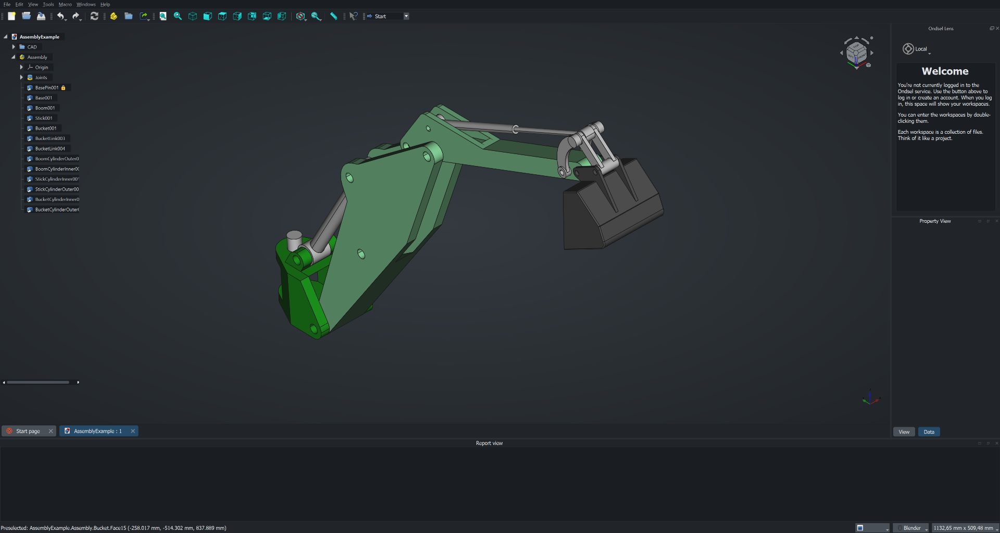

## Assignments

- Pick a simple object and design it using vector drawing software such as InkScape, Illustrator or Boxy SVG. The object could be something as simple as a nail, a hinge or a bolt or anything related to your final project. It could be a logo of a product that you are about to prototype.
- Use a raster graphics software of your choice, such as Gimp, Photoshop or Photopea, to edit, crop, resize and optimize an image of your choice.
- Explore a few 3D modelling tools (e.g. Blender, FreeCAD (Onsdel ES), SolveSpace, Fusion 360, Solidworks, Rhino) and pick one to make something for your final project.
- Create page containing the assignment documentation on your website.
- Document your process with screenshots and descriptions.
- Submit a link to that page here.

## 2D Modelling

### Vector - Inkscape

### Raster - Gimp

I have done most of my image processing with [Photoshop](https://www.adobe.com/products/photoshop.html) back in the day when I still had a license. At one point I could no longer justify the costs of a Creative Cloud subscription as I did not have much time to play around with it anymore and basic editing could be done on the phone or on the web with apps such as [Figma](https://www.figma.com/), [Canva](https://www.canva.com/), [Pixlr](https://pixlr.com/), [Adobe Express](https://www.adobe.com/express/feature/image/editor) and many others. Still, I found [Gimp](https://www.gimp.org/) installed on my laptop too so I will have to assume that I might have either edited a photo or intended to do so in the past but I have no recollection of this, as could be seen from my non-existent command of the software.

My first (second?) impressions are that on the surface it looks and seems like Photoshop, but immediately it can be seen - and especially felt - that the usabilty is quite different. I try to change the selected tool or hit `Ctrl + T` to enter transform mode and nothing happens. Scaling down a layer actually scales it down such that if it is scaled back up, it looks blurry. Coming from Photoshop, nothing works quite like you would expect it to and everything feels just a little bit clunkier and less streamlined. However, I must admit that I did not spend very long on this as I wanted to get to 3D as fast as possible and it might just be a configuration issue or not being used to it.

Last year, around this time, I started my journey developing a [probabilistic strategy game](https://github.com/MiroKeimioniemi/probabilistic-strategy-game) from scratch, for which I had long had the idea. I finished it as a semi-polished local 2-player conquest game, where each player assigns primary moves to all their units during their turn, which get executed based on the probability of success. If the primary move, such as "move a wide and heavy tank to a thick forest square" fails, a secondary move is attempted, which can be anything from retrying to engaging in a battle with the enemy at optimal or subotimal range, depending on the distance in between. Each unit type and territory have different attributes resulting in strengths and weaknesses for different kinds of positions, which can also change by, for example, a tank blasting a mountain range into flat gravel. 

The prototype of the ambitious game was finished slightly after Wappu (1.5.) after six days with a total of 8 hours of sleep but I am quite proud for the solo effort, building it from scratch using [Scala](https://www.scala-lang.org/) and [ScalaFX](https://www.scalafx.org/). However, it is not very approachable for the average person who might not have the correct [JVM](https://en.wikipedia.org/wiki/Java_virtual_machine) environment installed and configured and so I am planning to package it into some kind of an executable and for that purpose, I wanted an icon for the application. Something simple but distinct. 

I figured this would be the perfect opportunity and so, after studying the [how to make Windows icons](https://learn.microsoft.com/en-us/windows/win32/uxguide/vis-icons), I fired up Gimp and created a new 256x256 (maximum size for `.ico`) project with x- and y resolution of 72. I dragged and dropped in some of the crude custom assets I had made for the game using [Pixilart](https://www.pixilart.com/) and played around with potential arrangements a little until I ended up with placing the contrasting enemy tanks on contrasting terrain tiles in a logo that appears decent looking and recognizable in a very small form factor too. Gimp showing the current image in the taskbar is actually a super cool feature as it worked as a preview for exactly what I wanted to do here, even though it did have a small overlay. 

I scaled down the assets to 150px and 128px with `Shift + S` and rotated the blue one 180 degrees with `Shift + R`. I merged the layers by right clicking the top one and pressing "Merge Down" until they were all merged, which was faster that figuring out how to select multiple layers, as for some reason holding control or shift and clicking did not work. I then duplicated the layer and scaled it into different sizes: 256, 128, 96, 64, 48, 32, 24 and 16, which was what the 2021 updated [Windows guide](https://learn.microsoft.com/en-us/windows/win32/uxguide/vis-icons) recommended on the topic. I then exported them as `.ico`, which automatically recognized each layer as corresponding to a variant in the icon file. I selected compress for all of them to make it 33% smaller still and then I was done.

## 3D Modelling

I got my first experience with 3D modeling just last autumn on the [Design Thinking and Electronic Prototyping](https://courses.aalto.fi/s/course/a053X000012QyDfQAK/design-thinking-and-electronic-prototyping?language=en_US) course, where we got a similar task to design and 3D-print something. I decided to create a magnetic tray for our whiteboard as we had meant to get one for a while but had not found a suitable one. For this, I used Fusion 360 as Aalto students have a license for it and it seemed good to know in the industry. I largely liked it, although it fell severly short in one aspect: it did not have a dark theme. For a [Dark Reader](https://darkreader.org/) user like me, this rendered the application practically unusable. I must admit that my inexperience with general 3D modeling workflows might have contributed to that initially but it is a major shortcoming anyway. 

Below are my 3D model of the tray as well as the physical, printed version, which unfortunately did not reach its full potential as the filament ran out during the printing and thus the pocket never actually connected. Nevertheless, it was just tall enough to fit the magnets perfectly and although having them on the storage side does not look quite as elegant, it still works, even though the tray wall is twice the thickness of the outer pocket wall. 

I did enjoy using Fusion 360, although there would still be a lot to learn for me. However, we were supposed to try something new and as I would lose my licenses after graduating, I decided to learn to use free, open-source software instead.

### Ondsel

We were instructed to experiment with something new, so I chose [Ondsel ES](https://ondsel.com/) out of the free options listed as examples for us as it seemed to be the most advanced CAD program out of them due to being built on top of [FreeCAD](https://www.freecad.org/) but with additional features and UI/UX improvements, which I always really appreciate. It even came with a default dark theme! FreeCAD on the other hand looked more sophisticated, widely used and better documented than [SolveSpace](https://solvespace.com/index.pl) so this was a natural progression. By learning the basics of free, open-source software I could continue using them after university too when I have lost my student licenses.

#### Installation

The Ondsel installation really tripped me up. [Their site](https://ondsel.com/) had a big, orange download button, the clicking of which led to a page with the only download option for Windows being `x86_64.7z`, which already threw me off a little. I expected the zip file to contain the usual installer but was surprised to fnd no such thing after extracting the files using Windows 11's built-in "Extract all" function. There were no installation instructions on the website nor a README.md nor any text files with any instructions or guides on its usage either and so I was baffled as to how exactly would I run the program. 

I wasted over an hour trying to find such instructions. In fact, I was still a bit confused as to what exactly I had downloaded. Digging through the folder, I found a `FirstRun.py` python script which imported FreeCAD and I had read somewhere that Ondsel had or was an add-on, which got me thinking that I would have to download FreeCAD and then add it there somehow, even though that made no sense as this was suppposed to be a FreeCAD fork.

Visiting [FreeCAD's downloads page](https://www.freecad.org/downloads.php) was enlightening nevertheless, as there the `.7z` format was described as a "64-bit **_portable_**" for Windows, which gave me the crucial keyword to find the answers to my search. [Portable applications](https://en.wikipedia.org/wiki/Portable_application) are self-contained, standalone applications that do not always have to be installed in the same way as most applications are. I had to venture all the way out to [Reddit](https://www.reddit.com/r/software/comments/ce0aqu/portable_vs_installation/) to learn this. All of their files are stored and modified in a single directory and so they can be installed on, for example, usb sticks, which one to use the exact same piece of software on multiple devices, with all kinds of additional benefits but also some drawbacks as discussed [here](https://www.reddit.com/r/software/comments/ce0aqu/portable_vs_installation/). The takeaway was, however, that an `.exe` file should exists somewhere and so I kept on digging until I finally found it in the `Ondsel_ES_2024.1.0.35694-Windows-x86_64\bin` directory. For further confusion, there were multiple `.exe` files and none of them were named "Ondsel", but I deduced that it must be the `freecad.exe` as it was the one with the right logo along with `freecadcmd.exe`, which would be the command line version.

I created a shortcut to it by selecting it and then right-clicking on it, choosing "Show more options" (windows 11) and then choosing "create shortcut". I dragged the shortcut onto my desktop, double-clicked it to open the application and then opened the AssemblyExample.FCStd from the start page to capture the below screenshot (with navigation cube made movable and dragged to the upper right corner).

#### Usage

I started a new project by clicking "Empty File" from the start page and changed to the "Part Design" mode via View > Workbench > Part Design. Following the example of [this video](https://www.youtube.com/watch?v=V1P4bhulIaU), I created a spreadsheet with the following values for length, largest diameter, thickness and stand height based on my night stand and window stool dimensions, and saved the project as `lamp.FCStd` to this repository us.

| Dimensions       | Values|
|------------------|-------|
| Length           | 400 mm|
| Largest Diameter | 140 mm|
| Thickness        | 2 mm  |
| Stand Height     | 30 mm |

My currently strongest idea for the final project is to create a gesture controlled bright alarm lamp, more about which can be read [here](). Its design is very simple, as it takes the form of an ellipsoid, which can then be placed on different more or less elaborate stands.

I was already familiar with the revolution method from previous projects, in which a cross-section is first sketched and then rotated around the chosen axis to create the solid 3D object. I figured that this would be the easiest way to create the ellipsoid and to carefully control its outline.

I started out by clicking "Create sketch" and choosing the XZ-plane, where I sketched a B-spline with 3 knots (a bit similar in look and feel to Bézier curves for those familiar with, for example, [After Effects](https://www.adobe.com/products/aftereffects.html) but still different according to [Wikipedia](https://en.wikipedia.org/wiki/B-spline)), with the ends being level and the middle one being horizontally centered but vertically off. When I created the solid of revolution by selecting the current sketch and then "Revolution" with "Axis: Horizontal sketch axis" and "Angle: 360°", the result turned out almost comically pointy at the ends. 

I then started over with a 5-knot B-spline, which offered me more flexibility over the shape. I set the constraints using the values I defined in the spreadsheet by clicking the bluish icon in the "Length" field, which opens another dialogue, which allows mathematical expressions using variables as input. The values defined in the spreadsheet can be accessed by `{spreadsheet-name}.{value/cell-alias}`. After fully constraining the first B-spline, I drew another, which I constrained to be the distance specified by `Spreadsheet.thickness` inwards from the outer B-spline, whose lowest point was vertically constrained to the origin by `Spreadsheet.largest_diameter / 2` and whose ends were horizontally constrained with the origin by `Spreadsheet.length / 2`. 

## Reflections

