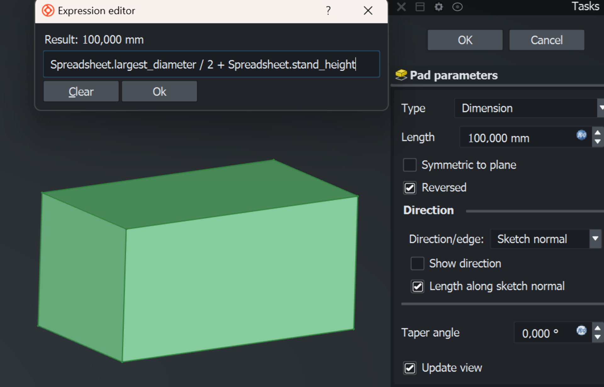
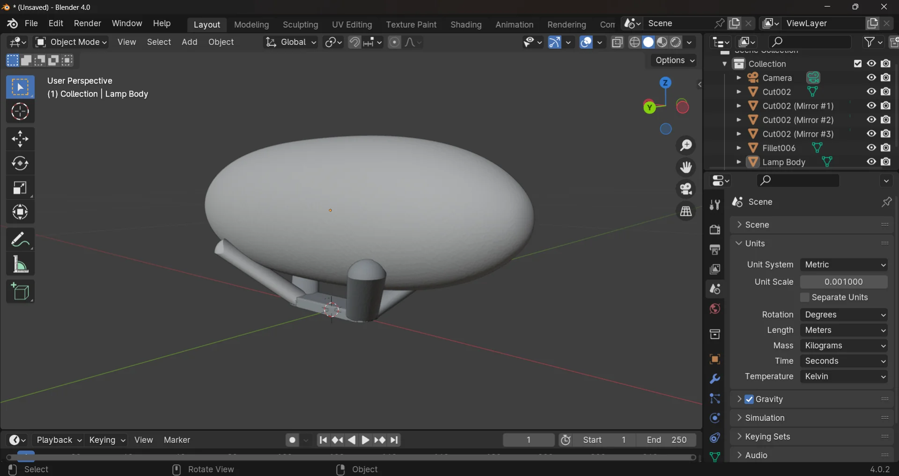

## Assignments

- Pick a simple object and design it using vector drawing software such as InkScape, Illustrator or Boxy SVG. The object could be something as simple as a nail, a hinge or a bolt or anything related to your final project. It could be a logo of a product that you are about to prototype.
- Use a raster graphics software of your choice, such as Gimp, Photoshop or Photopea, to edit, crop, resize and optimize an image of your choice.
- Explore a few 3D modelling tools (e.g. Blender, FreeCAD (Onsdel ES), SolveSpace, Fusion 360, Solidworks, Rhino) and pick one to make something for your final project.
- Create page containing the assignment documentation on your website.
- Document your process with screenshots and descriptions.
- Submit a link to that page here.

## 2D Modelling

### Vector - Inkscape

### Raster - Gimp

I have done most of my image processing with [Photoshop](https://www.adobe.com/products/photoshop.html) back in the day when I still had a license. At one point I could no longer justify the costs of a Creative Cloud subscription as I did not have much time to play around with it anymore and basic editing could be done on the phone or on the web with apps such as [Figma](https://www.figma.com/), [Canva](https://www.canva.com/), [Pixlr](https://pixlr.com/), [Adobe Express](https://www.adobe.com/express/feature/image/editor) and many others. Still, I found [Gimp](https://www.gimp.org/) installed on my laptop too so I will have to assume that I might have either edited a photo or intended to do so in the past but I have no recollection of this, as could be seen from my non-existent command of the software.

My first (second?) impressions are that on the surface it looks and seems like Photoshop, but immediately it can be seen - and especially felt - that the usabilty is quite different. I try to change the selected tool or hit `Ctrl + T` to enter transform mode and nothing happens. Scaling down a layer actually scales it down such that if it is scaled back up, it looks blurry. Coming from Photoshop, nothing works quite like you would expect it to and everything feels just a little bit clunkier and less streamlined. However, I must admit that I did not spend very long on this as I wanted to get to 3D as fast as possible and it might just be a configuration issue or not being used to it.

Last year, around this time, I started my journey developing a [probabilistic strategy game](https://github.com/MiroKeimioniemi/probabilistic-strategy-game) from scratch, for which I had long had the idea. I finished it as a semi-polished local 2-player conquest game, where each player assigns primary moves to all their units during their turn, which get executed based on the probability of success. If the primary move, such as "move a wide and heavy tank to a thick forest square" fails, a secondary move is attempted, which can be anything from retrying to engaging in a battle with the enemy at optimal or subotimal range, depending on the distance in between. Each unit type and territory have different attributes resulting in strengths and weaknesses for different kinds of positions, which can also change by, for example, a tank blasting a mountain range into flat gravel. 

The prototype of the ambitious game was finished slightly after Wappu (1.5.) after six days with a total of 8 hours of sleep but I am quite proud for the solo effort, building it from scratch using [Scala](https://www.scala-lang.org/) and [ScalaFX](https://www.scalafx.org/). However, it is not very approachable for the average person who might not have the correct [JVM](https://en.wikipedia.org/wiki/Java_virtual_machine) environment installed and configured and so I am planning to package it into some kind of an executable and for that purpose, I wanted an icon for the application. Something simple but distinct. 

I figured this would be the perfect opportunity and so, after studying the [how to make Windows icons](https://learn.microsoft.com/en-us/windows/win32/uxguide/vis-icons), I fired up Gimp and created a new 256x256 (maximum size for `.ico`) project with x- and y resolution of 72. I dragged and dropped in some of the crude custom assets I had made for the game using [Pixilart](https://www.pixilart.com/) and played around with potential arrangements a little until I ended up with placing the contrasting enemy tanks on contrasting terrain tiles in a logo that appears decent looking and recognizable in a very small form factor too. Gimp showing the current image in the taskbar is actually a super cool feature as it worked as a preview for exactly what I wanted to do here, even though it did have a small overlay. 

I scaled down the assets to 150px and 128px with `Shift + S` and rotated the blue one 180 degrees with `Shift + R`. I merged the layers by right clicking the top one and pressing "Merge Down" until they were all merged, which was faster that figuring out how to select multiple layers, as for some reason holding control or shift and clicking did not work. I then duplicated the layer and scaled it into different sizes: 256, 128, 96, 64, 48, 32, 24 and 16, which was what the 2021 updated [Windows guide](https://learn.microsoft.com/en-us/windows/win32/uxguide/vis-icons) recommended on the topic. I then exported them as `.ico`, which automatically recognized each layer as corresponding to a variant in the icon file. I selected compress for all of them to make it 33% smaller still and then I was done.

## 3D Modelling

I got my first experience with 3D modeling just last autumn on the [Design Thinking and Electronic Prototyping](https://courses.aalto.fi/s/course/a053X000012QyDfQAK/design-thinking-and-electronic-prototyping?language=en_US) course, where we got a similar task to design and 3D-print something. I decided to create a magnetic tray for our whiteboard as we had meant to get one for a while but had not found a suitable one. For this, I used Fusion 360 as Aalto students have a license for it and it seemed good to know in the industry. I largely liked it, although it fell severly short in one aspect: it did not have a dark theme. For a [Dark Reader](https://darkreader.org/) user like me, this rendered the application practically unusable. I must admit that my inexperience with general 3D modeling workflows might have contributed to that initially but it is a major shortcoming anyway. 

Below are my 3D model of the tray as well as the physical, printed version, which unfortunately did not reach its full potential as the filament ran out during the printing and thus the pocket never actually connected. Nevertheless, it was just tall enough to fit the magnets perfectly and although having them on the storage side does not look quite as elegant, it still works, even though the tray wall is twice the thickness of the outer pocket wall. 

I did enjoy using Fusion 360, although there would still be a lot to learn for me. However, we were supposed to try something new and as I would lose my licenses after graduating, I decided to learn to use free, open-source software instead.

### Ondsel

We were instructed to experiment with something new, so I chose [Ondsel ES](https://ondsel.com/) out of the free options listed as examples for us as it seemed to be the most advanced CAD program out of them due to being built on top of [FreeCAD](https://www.freecad.org/) but with additional features and UI/UX improvements, which I always really appreciate. It even came with a default dark theme! FreeCAD on the other hand looked more sophisticated, widely used and better documented than [SolveSpace](https://solvespace.com/index.pl) so this was a natural progression. By learning the basics of free, open-source software I could continue using them after university too when I have lost my student licenses.

#### Installation

The Ondsel installation really tripped me up. [Their site](https://ondsel.com/) had a big, orange download button, the clicking of which led to a page with the only download option for Windows being `x86_64.7z`, which already threw me off a little. I expected the zip file to contain the usual installer but was surprised to fnd no such thing after extracting the files using Windows 11's built-in "Extract all" function. There were no installation instructions on the website nor a README.md nor any text files with any instructions or guides on its usage either and so I was baffled as to how exactly would I run the program. 

I wasted over an hour trying to find such instructions. In fact, I was still a bit confused as to what exactly I had downloaded. Digging through the folder, I found a `FirstRun.py` python script which imported FreeCAD and I had read somewhere that Ondsel had or was an add-on, which got me thinking that I would have to download FreeCAD and then add it there somehow, even though that made no sense as this was suppposed to be a FreeCAD fork.

Visiting [FreeCAD's downloads page](https://www.freecad.org/downloads.php) was enlightening nevertheless, as there the `.7z` format was described as a "64-bit **_portable_**" for Windows, which gave me the crucial keyword to find the answers to my search. [Portable applications](https://en.wikipedia.org/wiki/Portable_application) are self-contained, standalone applications that do not always have to be installed in the same way as most applications are. I had to venture all the way out to [Reddit](https://www.reddit.com/r/software/comments/ce0aqu/portable_vs_installation/) to learn this. All of their files are stored and modified in a single directory and so they can be installed on, for example, usb sticks, which one to use the exact same piece of software on multiple devices, with all kinds of additional benefits but also some drawbacks as discussed [here](https://www.reddit.com/r/software/comments/ce0aqu/portable_vs_installation/). The takeaway was, however, that an `.exe` file should exists somewhere and so I kept on digging until I finally found it in the `Ondsel_ES_2024.1.0.35694-Windows-x86_64\bin` directory. For further confusion, there were multiple `.exe` files and none of them were named "Ondsel", but I deduced that it must be the `freecad.exe` as it was the one with the right logo along with `freecadcmd.exe`, which would be the command line version.

I created a shortcut to it by selecting it and then right-clicking on it, choosing "Show more options" (windows 11) and then choosing "create shortcut". I dragged the shortcut onto my desktop, double-clicked it to open the application and then opened the AssemblyExample.FCStd from the start page to capture the below screenshot (with navigation cube made movable and dragged to the upper right corner).

#### Usage

I started a new project by clicking "Empty File" from the start page and changed to the "Part Design" mode via View > Workbench > Part Design. Following the example of [this video](https://www.youtube.com/watch?v=V1P4bhulIaU), I created a spreadsheet with the following values for length, largest diameter, thickness and stand height based on my night stand and window stool dimensions, and saved the project as `lamp.FCStd` to this repository us.

| Dimensions       | Values|
|------------------|-------|
| Length           | 400 mm|
| Largest Diameter | 140 mm|
| Thickness        | 2 mm  |
| Stand Height     | 30 mm |

My currently strongest idea for the final project is to create a gesture controlled bright alarm lamp, more about which can be read [here](). Its design is very simple, as it takes the form of an ellipsoid, which can then be placed on different more or less elaborate stands.

I was already familiar with the revolution method from previous projects, in which a cross-section is first sketched and then rotated around the chosen axis to create the solid 3D object. I figured that this would be the easiest way to create the ellipsoid and to carefully control its outline.

I started out by clicking "Create sketch" and choosing the XZ-plane, where I sketched a B-spline with 3 knots (a bit similar in look and feel to Bézier curves for those familiar with, for example, [After Effects](https://www.adobe.com/products/aftereffects.html) but still different according to [Wikipedia](https://en.wikipedia.org/wiki/B-spline)), with the ends being level and the middle one being horizontally centered but vertically off. When I created the solid of revolution by selecting the current sketch and then "Revolution" with "Axis: Horizontal sketch axis" and "Angle: 360°", the result turned out almost comically pointy at the ends. 

I then started over with a 5-knot B-spline, which offered me more flexibility over the shape. I set the constraints using the values I defined in the spreadsheet by clicking the bluish icon in the "Length" field, which opens another dialogue, which allows mathematical expressions using variables as input. The values defined in the spreadsheet can be accessed by `{spreadsheet-name}.{value/cell-alias}`. After fully constraining the first B-spline, I drew another, which I constrained to be the distance specified by `Spreadsheet.thickness` inwards from the outer B-spline, whose lowest point was vertically constrained to the origin by `Spreadsheet.largest_diameter / 2` and whose ends were horizontally constrained with the origin by `Spreadsheet.length / 2`. 

I made the cover more rounded by further adjusting the constraints and then hid it from view by selecting it from the tree view on the left and pressing `space`. I then clicked "Create body" and with it selected, "Create sketch", where I drew a center-constrained rectangle with side lengths `Spreadsheet.length / 2` and `Spreadsheet.largest_diameter * 0.8` and extruded it with the "Pad" tool, where I input `Spreadsheet.largest_diameter / 2 + Spreadsheet.stand_height` as the padding length and applied it in reverse. This made it reach up to the widest part of the lamp while simultaneoustly lifting it off the ground by `stand_height`, which was initially set to be 30mm.

Now I had a cuboid that was partially inside and partially outside the lamp cover. In order to shape it to be compatible with the lamp, I tried to copy the the lamp body, which initially did not work because I had not yet exited the padding operation by pressing "OK". After I did and retried, it prompted the following dialogue:

Initially I had all automatically selected and I just pressed "OK", after which I pasted it with `Ctrl + V`. This, however, also copied the spreadsheet as `Spreasheet001` as can be seen in the picture below. This aroused suspicion in me and so I opened `Sketch002` under `Body002` to inspect its constrains, which validated my suspicion. The constraints were now linked to `Spreadsheet001`, which meant that the values in the orginal spreadsheet no longer affected them. This allows for entirely indpendent modification of the body but was undesirable to me as it meant that the stand created with a cut boolean operation would not automatically adjust to the dimensions. Thus, I deleted the object and copied the original again with the above settings. I unselected "Auto select depending objects" and "Spreadsheet", which gave me a new copy that was still dependent on the original spreadheet as it should be.

I then selected the cuboid and the copied lamp cover and attempted to cut the latter from the former using the "Boolean operation", but I got the following error: `Boolean: Result has multiple solids: that is not currently supported.` This occurred because should the boolean cut operation have been successfully executed, the body would have been split into two such that it would have contained two disjoint objects, which is not allowed as explained in [this useful video](https://youtu.be/StQlYt2HY_k?si=euU7TYR30mPhNzFz) covering some of the basic rules and logic of using FreeCAD.

I thus edited the sketch of the copied object to produce a solid ellipsoid instead of a hollow one by deleting the inner B-spline and replacing it with a straight line between the ends of the remaining B-spline. For some reason it complained about not being fully constrained, but then I realized I was accidentally drawing reference lines instead of construction geometry. The fix was as simple as pressing "Toggle construction geometry" but the lesson was forever important: always pay close attention to the state of the program, whether that is the settings of the tools currently in use or the entire workbench.

After modifying the copied lamp cover to be solid, it was easy to cut it from the stand by selecting both (latter first), selecting "Cut" from the resulting dialogue and pressing "OK", which created the simple stand below.

I then applied the "Fillet" tool to all the edges, which turned out to be an order-sensitive operation, where I had to first apply it to the longer edges before the shorter ones to accomodate them all. I then toggled the visibility of the lamp cover back on by selecting it from the tree on the left and pressing `space` to end up with the simple parametric 3D model below, which can easily be resized in all the dimensions defined in the spreadsheet by simply changing their values.

To create a bit more interesting stand next, I hid the simple stand and started exploring ways to create rounded cylinders as quickly and easily as possible. I first started a new sketch and drew a slot, which seemed like exactly what I was looking for. However, the constraints were difficult to figure out and I could not make out how to rotate it after drawing it.

 In fact, the search for the most convenient way to rotate objects turned out to be incredibly frustrating. The "Rotate" tool in "Draft" workbench would only rotate whatever was selected along the XY-plane or crash the entire program with the below error message incrementing the counter with every click on anything if I had, for example, "Revolution" selected inside a body instead of the body itself, which often occurred due to Ondsel autoselecting that instead of the body. 

An even more surefire way to crash the program entire was to use the "Ruler" tool. I would get the reading once, yes, but if I tried to do anything afterwards, such as right- or left-click anywhere on the application window, it would dependably go white and eventually display the "not responding" dialogue. Luckily their recovery feature works impressively well though! 

It can thus be said that I am not particulary impressed by the "Draft" workbench. I did eventually find a somewhat satisfying way to rotate and move the bodies in the form of the "Transform" tool, found by selecting a body, right-clicking and choosing "Transform", which brings about the below arrows and curves that enable easy moving and rotating. 

 In terms of creating a cylinder, what I was looking for was so simple that I thought that there must be a faster way to prototype something so simple. I discovered that you can add ready-made shapes in the "Part" workbench, where I then created a cylinder and experimented with the values, eventually arriving at the ones presented below. What was especially convenient was that the angles could be input into it upon creation.

The above cylinder was still not quite what I was looking for, however, as setting the angles only conserned its body, not the top and bottom faces. The bottom face was fine as I wanted it flat against the XY-plane anyway, but the top I wanted to round off. I tried some extreme fillet values and thought about extruding or insetting it somehow but could not come up with a way how. The only way I could come up with was the "Boolean cut" operation, which was a major hassle to set up. I created a sphere an lined it up with the cylinder with some careful camera work. I then duplicated it, decreased its radius and moved it more towards the cylinder by subtracting an equal amount from all of its coordinates. I then cut it from the bigger sphere using "Boolean cut", after which I carefully positioned the result to optimally cover the tip as shown below, and then cut that from the cylinder, using the same "Boolean cut" method.

I then mirrored the resulting cylinder first in the XZ-plane and then the result of that in the YZ-plane to produce the four
legs (or arms in this case?) of the slighlty less simple stand, which I bundled up into a part container by clicking "Create part" and dragging and dropping all parts of the stand to it. I boolean cut another copy of the lamp cover of the original cylinder, which propagated the cut to the three others upon refresh (`Ctrl + R`), and added a rectangle to connect them on the bottom and to act as a stable surface. It required a bit of fiddling with the numbers as well but inputting the same radius as on the cylinders made it nicely as round as them at the ends. Below are the resulting stand as well as the lamp, which my girlfriend coined "LED Zeppelin" and which I might now roll with, along with the treeview of all the tasks performed to arrive at it.

Ondsel does not yet have extensive documentation, but as it is a FreeCAD fork, almost everything one can do in FreeCAD applies to Ondsel as well - although I do wonder where the "Draft" workbench issues originate from. Only the tasks window is on the right and the UI does not feel quite as boxed in. Here are some very useful FreeCAD resources for learning the very basics of both FreeCAD and Ondsel:

- [FreeCAD Tutorial for Beginners 2024](https://youtu.be/t8nPF-qWyfE?si=q6U-c51pNgZR4zcp)
- [FreeCAD Basic Rules](https://youtu.be/StQlYt2HY_k?si=euU7TYR30mPhNzFz)
- [Design for CNC with FreeCAD](https://www.youtube.com/watch?v=V1P4bhulIaU)

### Blender

I was really excited to finally have a great excuse for playing with Blender. I have long been fascinated by visual effects, animation and 3D rendering, as is evident from my YouTube history being full of [Corridor Crew](https://www.youtube.com/channel/UCSpFnDQr88xCZ80N-X7t0nQ)'s [VFX Artists React](https://www.youtube.com/watch?v=_4WrKeoeZhk&list=PLwVUbPpIRn1QspuvMVVfQvO7RPWnMJ1aA&pp=iAQB) and [RocketJump](https://www.youtube.com/@rocketjump) who created one of my favorite internet shows [Video Game High School](https://www.youtube.com/watch?v=1JqR3GVqib4&list=PLsMtUWKCmBPRFzqglpk4YQlNFy8wzSXBN&pp=iAQB), which I last rewatched a couple of years ago and still found highly entertaining! I searched for some quick overviews for absolute beginners and stumbled upon the goldmine of content that is the [Blender Fast Track](https://www.youtube.com/watch?v=98qKfdJRzr0&list=PL8eKBkZzqDiV2xca_7QVNdG8LGBfZBCkI&pp=iAQB) series, which was 4.5h of extensive, in depth scene building in [Blender 4.0 ](https://www.blender.org/download/releases/4-0/) that I accidentally drank up at 2x speed during a single sitting.

I exported the model as a Wavefront OBJ - Arch module (*.obj) from Ondsel and imported it to Blender via "File > Import > Wavefront (.obj)". Now, the first thing that I immediately noticed was how much more responsive it is as compared to Ondsel/FreeCAD. Navigation is immediate and rotating and moving the view is very pleasant thanks to the automatic lock on origin, in addition to which, Blender's corresponding ruler "Measure" does not crash the application! I now had successfully imported `lamp.obj` but the scaling was off. This could, however, be adjusted in the right panel under Scene > Units by inputting 0.001 to "Unit Scale" to correspond to millimeters instead of meters. 

I headed over to the shading tab and experimented with the default Principled BSDF settings, but noticed something quite peculiar when turning "Metallic" to 1.000 and "Roughness" to 0.000. Observation #1 was that the surfaces were not smooth and observation #2 was that, for some reason, the orginial - non-mirrored - leg of the stand got the same shading. 

Problem #2 was easy to fix by clicking the dropdown with the sphere icon in the image and selecting the same material as the other parts of the stand. Somehow Blender had recognized that the lamp cover should be a different material from the stand but it had accidentally included one leg. Problem #1 was similarly easy to solve by selecting "Object > Shade Smooth".

I smoothened both the lamp as well as the stand. Then I headed back to the shading tab, where I set the "Emission Strength" to 6.900 instead of 0.000 and added a little bit of coating, by increasing "Coat Weight" from 0.000 to 0.343 and "Roughness from 0.040 to 0.066. This, in combination with enabling "Bloom" from the "Scene" settings on the right tab and decreasing the "Radius" a bit, created the look of controlled glowing light. I then followed [this tutorial](https://www.youtube.com/watch?v=Egd_BNAT3l8) to create a quick procedural wood texture for the stand. The video was a couple of years old and thus the "Principled BSDF" node looked a bit different but the following routing produced similar effects. The values of the parameters on the video were entirely different and these required a lot of tweaking, but even though it still looks a bit plasticy in these light conditions, it might just pass for lacquered wood in certain light. I also enabled "Ambient Occlusion" and changed the "Factor" from 1.00 to 2.00 to make it look a little more dramatic.

Now that the shading was done, I tried to figure out how to render an image of the lamp. I tried to position the camera for a good shot but there was only grey. I tried to mess with all possible settings and positions but nothing changed. I then just deleted the camera and created a new one from "Add > Camera", which worked perfectly out of the box. Then the question was, why does the point light not do anything? The answer was that for some reason, likely due to changing the "Unit Scale" from metres to millimeters, the default settings of the lights were negligibly low. 

I added a point light with more reasonable settings and realized that the scene is quite empty. I added a planar mesh with the intention to add a backdrop too. I tested what rendering would produce for this most simple case and the result was pretty horrible as can be seen below:

At that point it was already super late and I did not feel too enthusiastic about having create, construct and light the scene. I revisited the shading tab in between, which looked quite good with its global illumination and decided that it would do for now. I researched how to render that and found a solution in the form of "View > Viewport Render Image", which is supposed to render more or less what was currently on my screen. However, when I first rendered with it, in addition to the unnecessary overlay, the ambient occlusion that makes the lamp sit in the scene more nicely was missing. 

After a lot research and trial and error as this did not seem to be a common problem (or goal, which would explain the problem not arising for many), I found that toggling the overlays off somehow mysteriously brought back the ambient occlusion as well as got rid of the sphere as an added bonus. However, the image was more dimmer and more washed out so that the light did not clearly pop out of the background, which was baffling because it looked just perfect in the "Shading" view. As I did not have the time to build a proper scene nor conduct more troubleshooting and the quick renders fell short, I resorted to a good old screenshot with the overlays turned off and it clearly looks the best, which is kind of ironic for rendering software. This is most likely due to my settings, configurations etc. but I will dig into them more when I have time for a proper scene too!

With more shaders and lights stacking up, I could feel my laptop with integrated AMD Radeon graphics starting to be pushed outside of its comfort zone by the sound of the fans and the increased latency in moving around. Rotating the scene around immediately pushes the integrated GPU to 100% usage from which it then returns to idle 4-7% when staying still. I gotta say that the software is pretty well optimized considering the lack of graphical power in my machine, but this is definitely tempting me to grab one of those RTX 4080s that I have been eyeing for a while now. Perhaps this would finally be the viable excuse to do so...

## Reflections

Do not use default parts in Ondsel/FreeCAD. They are annoying to deal with and have bad customizability especially with respect to parameters.

