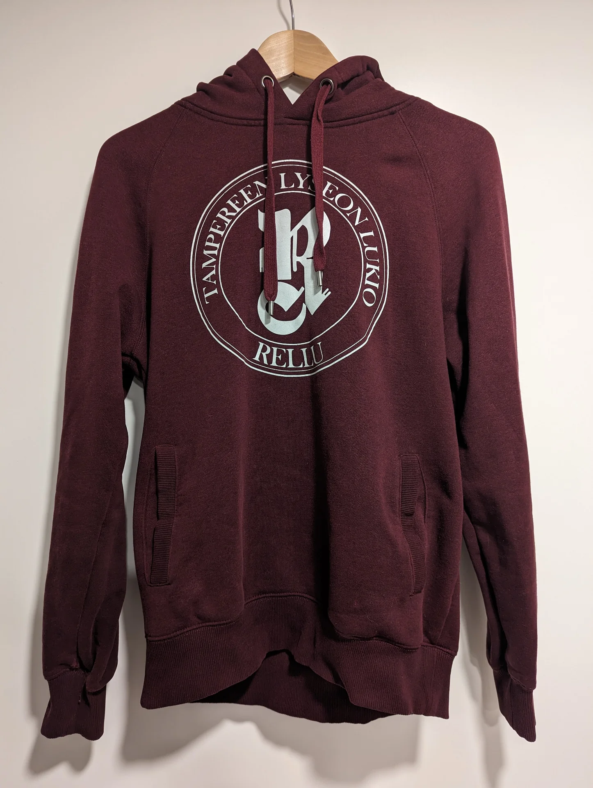
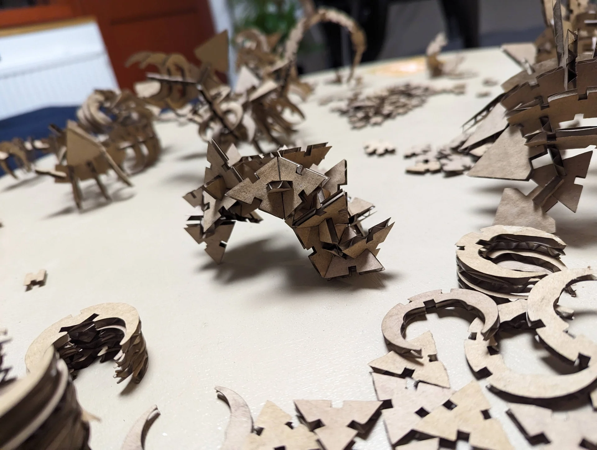

This week was super fun! The documentation, however, is not written entirely in chronological order because the threads of the different kinds of cutting were very interweaved due to introduction sessions and different velocities with ideation etc. It took me a while to come up with the idea for the parametric press-fit dragon construction kit, whereas the idea for vinyl cutting was almost immediate. Still, I got to test out laser cutting first for three pieces before being interrupted and moving on to the vinyl cutting. Nevertheless, I can confidently say that I easily spent the most time at the Fablab in the first few days of this week out of all my coursemates. Luckily the queue for the laser cutter was not usually too long when I was there.

## Assignments:

- Complete laser cutter introduction and safety training and document the process in a group assignment page. One person from each group will be responsible for creating the group documentation repository/page.
- Add link to your the group documentation page/repository to your individual documentation. 
- Design, laser cut a parametric press-fit kit. Please avoid making boxes with finger joints. It is going to be considered below minimum requirements. Material (cardboard, ~3.75mm thick) is provided. Material thickness should be a parameter for on-site adjustment.
- Use the vinyl cutter to cut something. It can be as simple as a sticker for your laptop to multi-color design for your t-shirt.
- Add a new page for the documentation of this week out your course documentation website.

## Vinyl cutting

I started with vinyl cutting, because I got the idea for it immediately from the suggestion of a design for a T-shirt, although I would change that to a hoodie.

In Finland, there is a tradition in many high schools to print custom hoodies for third-year students usually featuring the school's logo and a custom design made by the students. Below is mine for reference, with an overly large logo in the front as a result of a printing mistake and our [IB](https://www.ibo.org/) classes design on the back, the credit of which goes to [Viivi Kankaanpää](https://www.instagram.com/strokinghazard/) and [Rosa Linke](https://www.linkedin.com/in/rosa-linke/) with me witnessing and participating in the conversation. 




Rosa, however, experienced buyer's remorse about having ordered a yellow one instead of dark blue. The hoodies had obviously long since become unavailable as only a single batch was ever made and we are already deep into our second years in our respective universities, but I thought that this would be a great opportunity for purchasing a unicolor, dark blue hoodie and heat pressing the vinyl-cut logos on it to create one more in her desired color.

### Preparation

I got the original custom design from Viivi in `.png` form and found a variant of our old [high school's old logo](https://www.google.com/url?sa=i&url=https%3A%2F%2Feypfinland.org%2Ftapahtumat%2Ftampere-2018-regional-session%2F&psig=AOvVaw2i-WpHatMLkiDxJ5YoZ-1n&ust=1707558912216000&source=images&cd=vfe&opi=89978449&ved=0CBUQjhxqFwoTCIjThOX-nYQDFQAAAAAdAAAAABAF) from Google image search, also as a `.png`. I sent an email to [Tampereen lyseon lukio](https://www.tampere.fi/tampereen-lyseon-lukio)'s current principle and she authorized me to use and modify the logo for this purpose within 6 minutes of sending it.

I donwloaded the only available logo variant and opened it in Inkscape. I then used its "Trace Bitmap" functionality to convert the clean black-and-white png to a vector graphic, which worked flawlessly.

 

 I then selected and removed the text and replaced them with my own using the Times New Roman font by drawing two circles and using "Text > Put on Path" to make the text follow them. I centered the text between the circles by adjusting the radii of the invisible helper circles I made and adjusted the font sizes and letter spacing to 250 and 30 respectively, producing the SVG embedded below, but without the text. Exporting it as "Plain SVG" lost the text for some reason and after a while of searching why this would be, I chose to take the simplest route of simply selecting "Path --> Object to Path" and re-exporting it. I copy-pasted the contents of the `rellu-logo-tnr-optimized.svg` file below here in the markdown and set its width and height to 100% to adapt to container size and `fill` to `var(--pre-text-color)` to automatically adapt to the theme of the site.

<svg width="100%" height="100%" viewBox="0 0 3924.071 3924.516" xmlns="http://www.w3.org/2000/svg"><g style="display:inline"><path style="display:inline;fill:var(--pre-text-color);fill-opacity:1" d="M2439.5 4463.872c-458.04-13.35-897.972-188.438-1242-494.302-54.757-48.683-115.336-109.257-164.084-164.07-223.8-251.65-379.416-556.956-450.508-883.865-59.93-275.583-59.93-562.687 0-838.27C654 1756.456 809.615 1451.15 1033.416 1199.5c36.478-41.016 92.316-98.158 131.084-134.143 445.736-413.744 1049.424-596.49 1651-499.782 332.644 53.475 648.465 194.36 913 407.285 96.084 77.338 188.221 167.082 268.105 261.14 81.019 95.395 155.355 202.464 216.615 312 192.293 343.827 275.756 734.856 241.19 1130-38.244 437.21-221.615 846.31-523.98 1169-71.074 75.851-154.921 151.821-236.93 214.67-361.025 276.675-797.909 417.496-1254 404.202zm134.289-62.897c304.015-12.616 589.795-92.876 851.564-239.161 376.2-210.232 673.318-546.27 834.945-944.314 82.575-203.361 127.53-410.83 137.812-636 2.473-54.158 1.292-146.311-2.634-205.5-30.296-456.79-222.834-883.512-545.886-1209.845-170.572-172.304-371.51-310.13-592.59-406.464-200.442-87.342-417.028-139.58-635-153.157-78.816-4.91-165.184-4.91-244 0-173.705 10.82-346.281 46.08-511.5 104.51-344.867 121.96-649.901 343.9-874.064 635.956-180.598 235.298-302.574 506.764-358.336 797.5-17.242 89.898-27.697 180.439-32.215 279-2.48 54.114-1.299 146.133 2.639 205.5 30.297 456.807 222.822 883.5 545.886 1209.845 170.546 172.279 371.543 310.145 592.59 406.464 214.013 93.255 442.482 145.568 679.5 155.586 28.392 1.2 123.09 1.25 151.289.08zM2426 4320.905c-289.235-12.384-562.442-89.464-813-229.375-201.73-112.645-384.374-267.002-530.135-448.03-112.28-139.448-202.185-291.93-269.153-456.5-72.466-178.08-116.261-368.297-129.163-561-5.232-78.139-5.232-168.861 0-247 19.891-297.1 112.91-585.464 269.994-837 220.535-353.138 552.626-619.727 942.957-756.969 155.762-54.766 319.064-87.99 484-98.47 77.431-4.92 159.569-4.92 237 0 283.962 18.042 560.332 103.213 805.5 248.235 264.765 156.614 485.678 377.36 642.692 642.204 114.122 192.498 191.423 404.357 228.224 625.5 32.74 196.741 32.74 403.259 0 600-56.214 337.8-206.726 652.044-435.377 909-235.726 264.906-541.987 454.876-882.823 547.606-130.921 35.619-263.744 55.85-406.216 61.873-27.355 1.156-116.825 1.11-144.5-.075zm113.5-19.915c122.996-2.946 232.467-16.003 349-41.626 542.425-119.265 1003.061-488.185 1240.658-993.633 199.304-423.99 224.224-915.96 68.798-1358.231-110.941-315.689-308.201-594.75-569.456-805.603-331.387-267.456-744.451-408.011-1169.24-397.863-151.782 3.625-293.137 24.204-436.63 63.565C1501.777 910.47 1068.314 1286.14 851.023 1783c-157.277 359.63-191.979 763.414-98.602 1147.322 65.127 267.763 194.032 520.648 373.475 732.678 333.548 394.12 816.3 625.941 1328.437 637.924 17.692.414 34.867.82 38.167.9 3.3.082 24.45-.294 47-.834zm-92.5-498.586c-21.168-1.087-45.677-2.711-60.5-4.008-192.407-16.831-376.408-75.812-543.5-174.218-123.979-73.014-238.535-169.635-331.596-279.678-92.17-108.992-164.814-229.902-216.888-361-46.694-117.555-74.838-235.591-86.431-362.5-4.036-44.173-4.585-58.374-4.585-118.5s.55-74.326 4.585-118.5c11.593-126.909 39.737-244.945 86.431-362.5 110.493-278.17 314.163-510.205 576.484-656.773 24.724-13.814 80.738-41.787 105.5-52.686 132.073-58.131 268.681-93.228 410.5-105.463 43.033-3.712 53.167-4.078 113-4.078s69.967.366 113 4.078c191.886 16.555 376.9 75.806 543.884 174.179 141.652 83.45 269.542 196.456 369.778 326.743 142.06 184.649 231.673 401.75 260.277 630.566 7.7 61.593 9.561 93.602 9.561 164.434 0 60.01-.536 73.932-4.564 118.5-18.17 201.08-81.62 391.557-188.208 565-72.96 118.723-167.203 227.221-276.329 318.127-136.394 113.621-297.818 199.433-467.012 248.258-90.155 26.017-173.696 40.725-273.887 48.22-19.466 1.457-120.748 2.763-139.5 1.8zm117-21.464c305.817-14.582 597.746-141.104 819.88-355.338 223.583-215.63 359.783-499.633 387.545-808.102 6.663-74.042 6.663-155.958 0-230-21.377-237.522-106.72-460.575-249.276-651.5-139.356-186.64-328.5-333.015-543.149-420.33-131.76-53.597-268.081-83.705-415.5-91.768-44.895-2.455-117.356-1.298-167 2.666-231.989 18.526-454.81 101.075-644.5 238.769-103.329 75.005-197.597 168.078-274.139 270.663-196.53 263.4-283.104 585.805-245.834 915.5 18.545 164.05 71.442 328.202 152.743 474 147.048 263.7 383.814 468.587 664.23 574.795 135.251 51.227 275.72 78.42 424 82.084 18.455.456 67.537-.32 91-1.439zm-379.5-94.514-16.5-1.461c-74.86-6.638-146.88-33.054-204-74.826-25.08-18.34-56.617-48.514-75.4-72.139-10.169-12.789-25.063-34.327-32.85-47.5-23.618-39.958-41.938-87.056-52.315-134.5-14.62-66.839-16.137-128.274-4.987-202 15.146-100.157 50.051-184.929 103.942-252.44 8.61-10.787 33.57-38.493 38.264-42.474 1.565-1.328 5.89-5.265 9.612-8.748 32.203-30.141 76.217-59.943 121.573-82.317l15.161-7.478v-339.317l-25.25-.6c-13.887-.329-47.075-.836-73.75-1.127-26.675-.29-53.719-.8-60.098-1.133l-11.597-.605-.608 4.432c-.334 2.437-.887 24.654-1.228 49.37-.657 47.474-1.49 57.25-5.64 66.075-6.14 13.063-16.35 12.061-21.806-2.138-2.25-5.854-2.308-6.9-2.414-43l-.109-37-11.264-.283-11.265-.283.667 38.283c.72 41.438.234 48.156-4.113 56.734-2.956 5.833-4.467 7.098-9.236 7.734-5.043.673-8.747-2.27-12.102-9.613-2.43-5.316-2.563-6.56-2.91-27.072-.201-11.825.067-86.975.595-167 .828-125.4 1.177-146.605 2.53-153.5 4.772-24.333 13.152-41.117 27.233-54.547 8.36-7.974 11.182-9.983 20.461-14.568 8.727-4.313 16.44-6.898 28.404-9.518 8.369-1.833 15.314-2.041 99-2.965 49.5-.546 91.985-1.236 94.41-1.533l4.41-.54-.66-34.578c-.363-19.018-.66-83.278-.66-142.8V1831.23l-16.75-.6c-9.213-.33-41.05-1.07-70.75-1.645-81.924-1.584-101.949-2.991-120.967-8.502-26.538-7.69-38.643-20.963-44.673-48.982-1.715-7.973-2.036-15.507-2.812-66-1.36-88.539-2.06-284.952-.99-278 5.45 35.423 31.213 57.552 78.442 67.38 18.388 3.826 34.373 5.101 64.046 5.11 37.584.013 58.783-1.793 111.454-9.495 39.62-5.794 101.913-18.87 160-33.586 19.372-4.908 30.16-7.14 36.5-7.55 24.764-1.601 50.068 7.648 74.5 27.231 25.976 20.822 45.087 52.646 48.887 81.41.618 4.675 1.564 36.85 2.103 71.5 2.325 149.487 3.189 199.388 3.829 221.174l.681 23.175 17.708-19.175 20.017-21.674c1.27-1.375 15.573-16.9 31.784-34.5a96755.041 96755.041 0 0 1 95.489-103.5c8.892-9.625 48.746-52.825 88.564-96a621316.517 621316.517 0 0 1 125.464-136c29.187-31.625 54.413-59.009 56.057-60.852l2.989-3.353 9.464 7.825c41.902 34.647 84.798 77.101 119.103 117.88 20.686 24.589 49.337 65.55 65.4 93.5 26.979 46.943 47.577 97.609 57.933 142.5.889 3.85 2.237 9.7 2.998 13 1.857 8.064 6.104 35.304 7.717 49.5 1.945 17.121 1.62 69.57-.546 88-6.235 53.07-19.155 96.657-43.125 145.5-13.757 28.03-27.728 50.681-47.493 77-15.165 20.194-28.452 35.199-51.392 58.036-30.45 30.315-59.774 54.224-95.631 77.972-13.573 8.99-45.347 28.492-46.42 28.492-.213 0-3.244 1.623-6.734 3.606-20.609 11.712-64.957 32.489-92.747 43.452-10.76 4.244-12.98 5.441-11.272 6.074 1.17.433 8.326 2.413 15.9 4.4 7.575 1.987 16.923 4.446 20.773 5.464 3.85 1.018 12.4 3.27 19 5.004 6.6 1.734 15.15 3.984 19 5 3.85 1.016 12.4 3.266 19 5s15.15 3.984 19 5c3.85 1.016 12.4 3.267 19 5.002 18.761 4.93 30.4 7.994 38 10.003 3.85 1.018 13.3 3.49 21 5.492 39.5 10.274 65.808 22.911 88 42.27 28.646 24.99 46.06 62.569 50.468 108.911.514 5.402 1.417 103.197 2.008 217.322.59 114.125 1.34 216.275 1.668 227l.595 19.5 8.518-9 45.438-48c20.306-21.45 38.282-40.078 39.947-41.396 4.08-3.229 13.602-7.051 17.64-7.08 4.004-.03 9.142 2.043 11.375 4.588 2.965 3.378 4.132 10.001 2.778 15.758-2.447 10.405-3.429 11.838-34.156 49.867-12.326 15.255-23.44 29.798-24.7 32.318-2.806 5.62-3.685 11.445-2.156 14.3 1.545 2.889 7.564 2.866 13.77-.051 7.062-3.32 14.642-11.733 36.763-40.804 21.042-27.654 25.947-32.738 37.543-38.919 23.065-12.293 35.045 3.031 22.437 28.701-3.554 7.235-7.24 12.464-20.953 29.718-3.934 4.95-20.365 25.875-36.513 46.5-47.614 60.816-68.894 87.961-76.039 97-3.696 4.675-20.294 25.825-36.886 47a65271.048 65271.048 0 0 1-38.421 49c-11.103 14.123-67.47 85.97-85.514 109-33.965 43.349-32.224 41.343-34.122 39.317-.937-1-18.046-20.717-38.021-43.817s-39.727-45.849-43.893-50.553c-4.166-4.704-12.804-14.604-19.196-22-6.392-7.396-31.978-36.847-56.858-65.447l-45.237-52 .605-40c.332-22 .889-172.534 1.237-334.52.59-275.427.52-295.198-1.086-305-2.985-18.215-7.178-29.934-15.078-42.146-24.001-37.102-72.108-55.455-147.124-56.127-12.74-.114-23.386.018-23.657.293-.271.275-.59 25.925-.709 57-.213 55.833-.841 70.218-3.45 79-4.367 14.702-11.34 22-21.021 22-11.359 0-21.098-12.444-25.066-32.029-1.58-7.796-1.618-23.649-.575-238.91.615-126.809 1.384-256.533 1.71-288.277.325-31.744.32-58.154-.01-58.69-.519-.838-8.1 4.418-44.143 30.61l-6.085 4.42-.665 190.188c-.366 104.604-.965 272.26-1.332 372.572l-.666 182.383-26.084-.625c-14.346-.344-66.134-.856-115.084-1.138-48.95-.282-106.22-.778-127.267-1.103l-38.267-.591.267 25.345.267 25.345 21.5.676c70.57 2.217 132.842 13.89 187.5 35.144 10.531 4.095 32.824 14.222 40 18.17 2.75 1.514 7.475 4.112 10.5 5.775 42.904 23.584 83.83 59.463 117.185 102.735 9 11.676 25.063 36.051 33.28 50.5 3.753 6.6 6.903 12.107 7.001 12.239.183.245 26.462-26.275 51.025-51.494 18.651-19.149 29.263-26.391 42.781-29.198 10.202-2.118 18.268 1.621 22.334 10.353 4.619 9.92 2.691 28.374-4.862 46.548-2.57 6.186-14.2 22.292-68.6 95-112.064 149.78-150.07 200.606-194.46 260.052-23.614 31.625-43.232 57.831-43.596 58.236-.363.406-3.305-5.67-6.537-13.5-18.31-44.355-41.224-87.033-64.826-120.736-27.09-38.684-62.492-75.144-97.225-100.134-37.573-27.033-78.336-45.491-127-57.509-14.978-3.698-15.033-3.704-37.5-3.78-22.042-.075-29.608.622-42.56 3.924-29.613 7.55-52.095 25.686-65.701 52.999-14.061 28.226-21.589 75.153-17.325 108 7.547 58.132 26.175 104.328 58.045 143.949 55.498 68.995 151.32 112.139 287.541 129.464 44.06 5.603 83.757 6.088 124 1.514 156.642-17.803 249.446-115.02 282.973-296.427 1.575-8.525 3.197-17.975 3.603-21 .677-5.05.8-5.255 1.505-2.5 3.003 11.747 4.922 89.518 2.97 120.436-7.308 115.831-40.235 202.56-100.57 264.903-16.033 16.565-26.5 25.716-42.563 37.205-56.827 40.65-123.552 63.393-212.918 72.573-14.372 1.476-93.817 2.838-105.5 1.808zm420.055-1350.97c45.264-13.117 94.102-68.342 148.973-168.456 16.456-30.024 32.725-63.24 36.355-74.225 13.887-42.02 15.446-97.025 4.53-159.775-1.387-7.975-2.933-16.075-3.435-18-.502-1.925-2.315-9.087-4.029-15.916-15.118-60.244-41.46-101.552-81.949-128.508-31.132-20.727-52.484-24.175-84.057-13.576-35.546 11.932-61.272 36.223-81.092 76.564l-6.04 12.294-.866 65.32c-.477 35.927-1.346 103.347-1.932 149.822-.586 46.475-1.497 112.625-2.024 147-.527 34.375-.965 72.514-.974 84.754l-.015 22.254 8.217 6.093c22.607 16.762 44.305 21.32 68.338 14.355z" transform="translate(-537.96 -540.218)"/></g><g style="display:inline"><path style="font-weight:700;font-size:366.667px;font-family:&quot;Times New Roman&quot;;-inkscape-font-specification:&quot;Times New Roman, &quot;;letter-spacing:30px;fill:var(--pre-text-color);fill-opacity:1;fill-rule:nonzero;stroke:none;stroke-width:18.8976;stroke-linecap:round;stroke-opacity:1" d="m1949.856 3937.205-22.589 64.174q-6.538 18.577-6.067 24.247.7 5.561 5.431 10.453 4.732 4.892 20.438 10.42l-2.2 6.25-117.203-41.255 2.2-6.249q15.875 5.588 22.458 4.679 6.812-1.019 10.672-4.975 4.029-3.896 10.568-22.473l52.31-148.615q6.54-18.576 5.84-24.137-.472-5.67-5.204-10.563-4.731-4.892-20.437-10.42l2.2-6.248 106.394 37.45q41.544 14.622 58.776 27.141 17.231 12.518 23.921 32.336 6.75 19.648-.561 40.42-8.917 25.332-32.981 35.462-15.339 6.37-38.123 4.233l27.77 96.895q5.518 18.835 8.77 24.155 5.082 7.673 14.023 11.39l-2.2 6.248-72.111-25.383-37.065-130.345zm39.53-112.306-35.31 100.315 9.627 3.388q23.474 8.263 36.613 8.143 13.198-.29 23.708-9.117 10.738-8.937 17.098-27.008 9.214-26.176 1.285-43.012-7.76-16.778-34.95-26.348zm247.718 69.812-16.281 97.478 4.768.796q22.78 3.805 35.411-8.788 12.632-12.593 20.118-40.022l6.71 1.12-20.942 125.38-6.71-1.121q1.302-20.838-3.402-35.056-4.528-14.189-12.797-20.108-8.239-6.096-25.368-8.957l-11.267 67.458q-3.304 19.778-2.452 24.458 1.028 4.71 5.148 8.302 4.12 3.593 14.362 5.303l14.303 2.39q33.553 5.604 56.28-6.574 22.903-12.148 37.042-42.46l6.533 1.092-23.484 74.311-206.964-34.569 1.091-6.534 7.947 1.328q10.419 1.74 17.395-.907 5.005-1.705 8.48-7.296 2.65-3.914 5.659-21.926l26.31-157.518q2.713-16.247 2.45-20.103-.734-6.475-4.941-10.627-5.885-6.065-17.54-8.012l-7.946-1.327 1.09-6.534 200.43 33.477-11.827 70.813-6.71-1.12q-.785-26.815-8.257-39.68-7.295-12.835-23.363-20.965-9.358-4.83-36.553-9.372zm366.803 166.497-9.02 85.233-215.56.28-.01-6.624 8.057-.011q10.563-.014 17.003-3.782 4.652-2.513 7.15-8.603 1.964-4.3 1.94-22.561l-.207-159.7q-.024-18.62-2-23.273-1.975-4.652-8.067-8.046-5.913-3.573-16.118-3.56l-8.056.01-.01-6.624 129.443-.169.01 6.625-10.563.014q-10.563.014-17.004 3.782-4.652 2.512-7.33 8.603-1.963 4.3-1.94 22.561l.202 154.688q.024 18.62 2.18 23.809 2.154 5.01 8.424 7.508 4.478 1.606 21.665 1.583l20.231-.025q19.336-.026 32.218-6.846 12.882-6.82 22.173-21.513 9.47-14.693 17.847-43.35zm257.576-40.13 5.257 85.547-212.522 36.066-1.108-6.531 7.943-1.348q10.414-1.767 16.14-6.553 4.17-3.25 5.622-9.67 1.223-4.566-1.832-22.57l-26.72-157.45q-3.115-18.357-5.836-22.617-2.72-4.26-9.29-6.595-6.425-2.542-16.486-.835l-7.943 1.348-1.108-6.53 127.618-21.658 1.109 6.531-10.415 1.767q-10.414 1.768-16.14 6.553-4.17 3.25-5.798 9.7-1.223 4.566 1.832 22.57l25.881 152.508q3.115 18.357 6.102 23.117 2.957 4.583 9.554 6.005 4.683.84 21.628-2.036l19.946-3.384q19.063-3.236 30.634-12.1 11.57-8.864 18.293-24.896 6.899-16.061 10.402-45.711zm-16.127-156.693 118.108-41.918 2.215 6.243-5.905 2.096q-13.33 4.73-17.373 9.395-3.935 4.437-4.392 10.108-.288 5.612 6.659 25.184l39.762 112.033q10.899 30.708 18.987 39.046 8.258 8.278 21.223 11.086t29.163-2.941q18.56-6.587 28.617-19.466 10.166-13.107 11.368-30.062 1.37-17.014-11.564-53.459l-33.116-93.305q-5.449-15.354-10.99-20.796-5.541-5.443-11.333-6.237-8.97-1.186-22.805 3.724l-2.216-6.242 79.132-28.086 2.216 6.243-4.724 1.677q-9.618 3.413-14.652 9.57-5.034 6.156-5.148 14.935-.277 6.178 4.693 20.182l30.84 86.893q14.312 40.326 15.26 60.127 1.118 19.741-14.137 42.063-15.255 22.323-50.856 34.958-29.696 10.54-48.708 8.358-25.935-2.954-41.035-16.593-15.1-13.638-25.22-42.153l-39.762-112.033q-7.006-19.741-10.876-23.687-3.93-4.114-10.347-5.067-6.418-.952-20.868 4.367z" transform="translate(-548.46 -531.546)" aria-label="RELLU"/><path style="font-weight:700;font-size:366.667px;font-family:&quot;Times New Roman&quot;;-inkscape-font-specification:&quot;Times New Roman, &quot;;letter-spacing:30px;fill:var(--pre-text-color);fill-opacity:1;fill-rule:nonzero;stroke:none;stroke-width:18.8976;stroke-linecap:round;stroke-opacity:1" d="m892.989 2979.63 61.374-23.463 2.302 6.02q-19.193 13.471-25.897 23.51-6.872 10.102-8.043 23.583-.58 7.506 5.493 23.393l6.458 16.89 174.924-66.875q17.392-6.649 21.037-10.15 3.58-3.67 4.816-10.467 1.003-6.9-2.705-16.6l-2.877-7.526 6.188-2.365 45.393 118.734-6.188 2.366-2.877-7.525q-3.772-9.867-9.585-14.545-4.004-3.453-10.649-3.788-4.717-.305-21.774 6.217l-174.925 66.875 6.266 16.389q8.759 22.91 22.422 29.57 19.108 9.371 45.663 3.627l2.43 6.355-61.374 23.464zm126.386-240.51 15.158 84.408 25.064 5.868q12.517 2.845 20.094 1.484 10.045-1.803 13.347-10.764 1.965-5.264.02-24.196l6.52-1.171 14.272 79.474-6.52 1.17q-4.249-12.515-14.37-19.247-10.299-6.7-39.796-13.954l-206.016-51.225-.6-3.348 180.479-121.36q25.627-17.335 31.428-26.563 4.387-6.972 3.306-18.056l6.52-1.17 20.76 115.598-6.52 1.171-.855-4.758q-2.5-13.921-7.39-18.864-3.515-3.37-8.802-2.42-3.172.569-6.33 2.227-1.523.638-12.267 7.66zm-11.964 8.333-75.902 50.374 88.876 21.875zm-19.437-341.057-156.16-74.657 5.479-98.677 6.614.367-.437 7.866q-.595 10.726 2.801 17.37 2.255 4.607 8.005 7.616 4.181 2.205 22.236 3.207l159.813 8.873q18.59 1.032 23.348-.676 4.757-1.708 8.67-7.588 3.733-5.889 4.3-16.078l.436-7.866 6.614.367-7.027 126.563-6.614-.367.437-7.865q.595-10.726-2.802-17.37-2.254-4.608-8.183-7.627-4.181-2.204-22.415-3.216l-179.655-9.975 215.967 105.233-.238 4.29-224.76 82.198 170.717 9.479q17.877.992 22.038.327 9.067-1.828 15.214-9.197 5.978-7.558 6.901-24.183l6.614.367-4.605 82.946-6.614-.367.14-2.503q.624-8.034-1.67-15.155-2.473-7.13-6.922-10.964-4.45-3.833-12.742-6.266-1.947-.467-18.214-1.37l-153.377-8.515q-18.413-1.023-22.99.696-4.758 1.708-8.492 7.597-3.912 5.88-4.478 16.069l-.427 7.687-6.614-.367 5.498-99.034zm24.914-321.22 64.782 18.303q18.952 5.354 24.581 4.526 5.506-1.049 10.09-6.08 4.633-5.202 9.111-21.053l6.375 1.801-33.54 118.71-6.374-1.802q4.576-16.195 3.253-22.708-1.446-6.735-5.637-10.337-4.143-3.775-23.095-9.13l-151.617-42.837q-18.952-5.354-24.458-4.305-5.63.828-10.213 5.858-4.584 5.03-9.111 21.054l-6.375-1.801 28.768-101.825q14.215-50.31 38.315-67.128 24.1-16.818 50.978-9.224 22.743 6.425 34.946 25.129 12.204 18.703 11.053 45.169-.587 17.88-11.832 57.68zm-114.402-32.323 100.963 28.526q1.951-5.588 2.779-8.517 5.939-21.02-3.254-35.896-9.364-14.925-35.553-22.324-26.016-7.35-41.289.613-15.273 7.964-21.65 30.534zm103.67-278.116 88.542 43.901 2.147-4.33q10.26-20.692 1.88-36.438-8.38-15.745-32.45-30.878l3.022-6.095 113.885 56.468-3.022 6.095q-19.561-7.3-34.533-6.93-14.892.21-22.958 6.402-8.227 6.112-15.941 21.671l61.273 30.381q17.965 8.908 22.691 9.453 4.806.384 9.44-2.514 4.634-2.898 9.247-12.201l6.442-12.993q15.111-30.476 10.062-55.76-4.969-25.446-29.865-47.782l2.943-5.935 64.282 44.063-93.212 187.991-5.934-2.942 3.578-7.218q4.693-9.464 4.188-16.909-.178-5.284-4.518-10.233-2.975-3.674-19.336-11.786l-143.079-70.942q-14.757-7.317-18.523-8.186-6.41-1.18-11.604 1.64-7.514 3.869-12.763 14.455l-3.579 7.219-5.935-2.943 90.27-182.056 64.32 31.892-3.022 6.095q-25.885-7.04-40.366-3.628-14.402 3.25-26.849 16.263-7.34 7.551-19.589 32.253zm257.02-199.358 53.76 41.695q15.561 12.07 21.09 13.412 5.498 1.092 11.634-1.853 6.135-2.945 16.34-16.102l5.234 4.06-76.148 98.183-5.234-4.06q10.313-13.299 11.53-19.833 1.183-6.785-1.352-11.696-2.425-5.053-17.987-17.123l-124.497-96.556q-15.562-12.07-21.06-13.161-5.529-1.343-11.664 1.602-6.136 2.944-16.34 16.102l-5.235-4.06 69.126-89.129q26.992-34.803 44.31-47.2 17.32-12.397 38.235-12.489 20.774-.201 38.175 13.295 21.222 16.458 23.236 42.49 1.2 16.565-8.02 37.51l100.707 4.242q19.613.71 25.688-.695 8.884-2.4 15.234-9.71l5.235 4.06-46.852 60.41-135.38-5.985zm-94.081-72.966 84.035 65.175 6.255-8.064q15.251-19.665 19.285-32.17 3.893-12.614-1.165-25.373-5.09-13.01-20.228-24.75-21.928-17.008-40.407-14.8-18.37 2.067-36.035 24.844zm232.18-251.63 64.568 74.819 3.66-3.158q17.485-15.09 15.872-32.853-1.614-17.763-17.927-41.05l5.15-4.445 83.051 96.234-5.15 4.445q-15.196-14.319-29.138-19.787-13.806-5.585-23.643-3.008-9.954 2.441-23.102 13.788l44.684 51.777q13.1 15.18 17.245 17.516 4.28 2.219 9.675 1.346 5.396-.872 13.257-7.657l10.979-9.474q25.753-22.225 30.911-47.488 5.294-25.38-8.984-55.625l5.015-4.328 42.147 65.554-158.855 137.091-4.328-5.015 6.1-5.264q7.996-6.901 10.42-13.959 1.886-4.938-.194-11.184-1.316-4.54-13.247-18.365l-104.34-120.904q-10.76-12.47-13.895-14.731-5.45-3.574-11.331-2.991-8.426.65-17.372 8.37l-6.1 5.263-4.327-5.015 153.84-132.763 46.906 54.352-5.151 4.445q-21.126-16.533-35.796-19.008-14.534-2.592-31.055 4.571-9.696 4.111-30.57 22.125zm256.967-187.21 49.145 85.742 4.194-2.404q20.038-11.485 21.835-29.23 1.798-17.746-9.784-43.713l5.903-3.383 63.212 110.285-5.902 3.383q-12.192-16.95-24.838-24.972-12.491-8.111-22.639-7.454-10.236.502-25.303 9.138l34.01 59.336q9.971 17.397 13.595 20.48 3.779 2.992 9.242 3.163 5.463.17 14.472-4.994l12.582-7.211q29.513-16.916 39.386-40.735 10.028-23.908 1.769-56.319l5.747-3.294 28.897 72.379-182.047 104.344-3.294-5.747 6.99-4.006q9.164-5.253 12.887-11.72 2.792-4.49 1.94-11.017-.429-4.708-9.51-20.551l-79.416-138.555q-8.19-14.29-10.837-17.107-4.67-4.547-10.555-5.094-8.395-.966-18.647 4.91l-6.99 4.006-3.294-5.747 176.3-101.05 35.701 62.287-5.902 3.383q-17.592-20.251-31.523-25.474-13.775-5.311-31.358-1.424-10.3 2.19-34.222 15.9zm276.593-146.104 161.339 104.82-33.098-98.992q-6.926-20.716-15.31-26.03-11.443-7.123-30.517-.368l-2.1-6.283 76.069-25.433 2.1 6.282q-13.978 6.75-18.05 11.51-3.959 4.533-4.574 12.29-.503 7.53 4.947 23.83l64.095 191.701-5.773 1.93-219.8-139.64 48.938 146.365q6.643 19.866 17.97 23.819 11.496 3.896 23.212-.021l5.434-1.817 2.1 6.283-81.672 27.307-2.1-6.283q18.96-6.528 23.876-16.667 4.916-10.139-1.215-28.477l-54.33-162.495-6.968-4.467q-10.367-6.728-16.936-7.74-6.568-1.014-17.21 2.166l-2.1-6.282zm618.762 52.83-4.56 85.588-215.252 11.528-.355-6.615 8.045-.43q10.548-.566 16.784-4.665 4.514-2.752 6.691-8.964 1.737-4.396.76-22.632l-8.54-159.472q-.996-18.593-3.211-23.136-2.216-4.543-8.476-7.614-6.091-3.26-16.282-2.714l-8.045.43-.354-6.614 129.258-6.923.354 6.615-10.548.565q-10.548.565-16.783 4.664-4.514 2.752-6.87 8.974-1.737 4.396-.76 22.632l8.272 154.466q.996 18.593 3.419 23.663 2.413 4.89 8.804 7.059 4.556 1.37 21.719.45l20.202-1.082q19.308-1.034 31.817-8.517 12.508-7.483 21.02-22.64 8.69-15.168 15.56-44.223zm304.777-121.824-.863 6.568q-12.103.035-19.193 4.521-9.855 6.29-33.387 36.966l-63.638 80.302-7.65 58.223q-2.448 18.64-1.102 23.51 1.37 4.695 6.584 8.992 5.415 4.142 15 5.401l13.491 1.772-.863 6.568-135.086-17.746.863-6.568 12.603 1.656q10.651 1.399 17.354-1.513 4.941-1.878 8.397-7.564 2.512-4.004 4.89-22.11l6.344-48.283-43.077-110.573q-12.853-32.748-19.076-38.982-6.2-6.413-17.715-8.106l.863-6.568 115.382 15.158-.863 6.568-5.148-.676q-10.473-1.376-15.13 1.082-4.479 2.481-4.922 5.854-.84 6.39 9.98 33.995l33.02 85.416 52.85-66.912q19.652-24.505 20.795-33.203.63-4.793-3.566-8.594-5.453-5.23-21.49-8.24l.863-6.568zm241.813 67.139-22.95 77.627-6.986-2.252q4.395-30.561-9.375-54.374-13.544-23.928-36.037-31.178-17.381-5.602-30.626.475-13.02 5.962-16.92 18.06-2.47 7.669-.815 14.786 2.361 9.602 10.74 20.956 6.197 8.204 30.553 31.855 34.13 33.008 42.562 55.29 8.261 22.225.902 45.059-9.337 28.969-38.756 42.624-29.194 13.54-63.956 2.336-10.906-3.515-19.905-8.86-9-5.347-21.677-16.204-7.081-6.045-12.364-7.747-4.43-1.428-10.47.387-6.04 1.816-11.36 7.814l-6.304-2.033 28.12-87.247 6.304 2.032q-4.365 39.224 10.675 65.516 15.265 26.175 39.973 34.139 19.086 6.151 33.682-.619 14.768-6.715 19.216-20.518 2.637-8.179.677-17.275-1.788-9.041-8.452-18.713-6.61-9.843-25.533-28.169-26.527-25.667-36.815-41.022-10.288-15.354-13.447-31.233-2.989-15.823 2.229-32.012 8.897-27.605 35.436-40.496 26.54-12.89 57.383-2.95 11.246 3.625 20.933 9.757 7.35 4.626 16.954 13.929 9.83 9.188 14.431 10.67 4.431 1.428 7.866-.474 3.435-1.903 9-11.584zm177.961 100.59-46.134 87.4 4.275 2.256q20.425 10.781 36.378 2.804 15.953-7.978 31.692-31.657l6.016 3.176-59.338 112.416-6.017-3.176q7.795-19.37 7.804-34.346.168-14.892-5.817-23.113-5.902-8.379-21.26-16.486l-31.926 60.484q-9.361 17.733-10.025 22.443-.506 4.794 2.273 9.5 2.78 4.707 11.963 9.554l12.825 6.77q30.083 15.88 55.488 11.474 25.562-4.322 48.523-28.644l5.858 3.093-45.68 63.143-185.565-97.95 3.092-5.859 7.125 3.761q9.342 4.931 16.797 4.615 5.286-.044 10.345-4.257 3.747-2.88 12.272-19.03l74.55-141.233q7.688-14.567 8.651-18.31 1.342-6.377-1.345-11.642-3.676-7.61-14.126-13.125l-7.125-3.761 3.092-5.859 179.708 94.859-33.514 63.491-6.017-3.176q7.694-25.698 4.651-40.261-2.884-14.48-15.577-27.253-7.362-7.53-31.745-20.4zm313.6 184.807q46.201 35.143 51.324 85.904 5.262 50.875-29.042 92.668-29.306 35.705-72.466 45.677-57.211 13.263-107.723-28.197-50.65-41.573-50.159-98.612.398-45.071 30.954-82.298 34.304-41.794 85.505-46.324 51.453-4.555 91.607 31.182zm-5.609 10.22q-25.74-21.127-60.746-5.852-28.653 12.616-61.82 53.025-39.416 48.021-41.389 84.852-1.413 25.708 19.76 43.087 14.255 11.7 29.483 12.618 19.448 1.14 42.132-12.67 22.797-13.946 48.468-45.222 30.555-37.227 38.743-61.312 8.302-24.224 3.755-40.695-4.409-16.358-18.386-27.83zm228.031 213.577-42.766 187.586 81.51-65.198q17.058-13.644 19.155-23.346 2.742-13.198-10.175-28.773l5.173-4.138 50.101 62.636-5.173 4.138q-11.156-10.793-17.027-12.975-5.62-2.153-13.114-.057-7.242 2.125-20.664 12.86l-157.848 126.26-3.803-4.754 55.298-254.467-120.518 96.4q-16.358 13.084-16.163 25.08.306 12.134 8.023 21.781l3.578 4.474-5.173 4.138-53.791-67.25 5.173-4.138q12.665 15.547 23.877 16.667 11.212 1.12 26.312-10.959l133.8-107.024 1.79-8.08q2.742-12.051 1.428-18.566-1.313-6.515-7.967-15.407l5.173-4.138zm163.336 600.105-82.165 24.392-83.011-198.935 6.113-2.552 3.103 7.436q4.068 9.748 10.02 14.249 4.105 3.33 10.688 3.3 4.724.162 21.578-6.87l147.383-61.5q17.184-7.171 20.722-10.781 3.537-3.61 4.332-10.538 1.03-6.832-2.9-16.25l-3.103-7.435 6.114-2.55 49.848 119.46-6.114 2.55-4.067-9.748q-4.068-9.749-10.02-14.249-4.106-3.33-10.758-3.465-4.724-.163-21.577 6.87l-142.758 59.57q-17.183 7.17-21.148 11.152-3.799 3.913-3.699 10.662.237 4.751 6.856 20.613l7.79 18.67q7.447 17.845 18.69 27.122 11.243 9.276 28.377 12.215 17.203 3.103 46.88-.162zm176.067 34.544 24.72 122.864-6.494 1.306-1.236-6.143q-2.79-13.866-6.833-18.531-3.833-4.525-9.382-5.783-5.514-1.082-25.874 3.015l-116.544 23.449q-31.945 6.427-41.347 13.25-9.367 6.998-13.987 19.433-4.62 12.435-1.23 29.285 3.884 19.307 15.204 31.091 11.53 11.925 28.142 15.522 16.648 3.773 54.56-3.855l97.062-19.529q15.972-3.214 22.147-7.926 6.174-4.712 7.783-10.332 2.447-8.71-.448-23.103l6.494-1.306 16.562 82.318-6.494 1.307-.989-4.915q-2.013-10.004-7.392-15.862-5.378-5.857-14.053-7.217-6.075-1.152-20.643 1.78l-90.393 18.187q-41.949 8.44-61.684 6.567-19.7-1.698-39.63-19.968-19.93-18.27-27.38-55.305-6.216-30.891-1.357-49.401 6.607-25.253 22.252-38.263 15.645-13.01 45.308-18.977l116.545-23.45q20.535-4.131 24.99-7.402 4.632-3.306 6.486-9.523 1.853-6.217-1.36-21.276zm-35.68 484.485-108.01 83.974q-22.797 17.781-31.026 30.743-5.855 9.412-5.995 19.974l-6.624-.088 1.679-126.389 6.623.088q.915 12.01 3.555 15.446 2.638 3.616 6.577 3.669 7.518.1 28.504-16.095l70.736-54.746-7.4-9.05-66.238-.88q-18.976-.252-23.659 1.834-4.683 2.087-8.165 8.128-3.303 6.044-3.482 19.47l-6.624-.087 1.627-122.45 6.623.087-.107 8.056q-.14 10.562 3.534 17.057 2.445 4.688 8.498 7.275 4.27 2.026 22.53 2.269l159.687 2.12q18.618.248 23.299-1.66 4.68-1.907 8.163-7.948 3.659-5.86 3.794-16.065l.107-8.056 6.624.088-1.605 120.84-6.624-.089q.164-12.352-3.33-18.844-2.445-4.688-8.317-7.452-4.447-2.208-22.886-2.452l-75.547-1.004 71.666 91.015q14.967 19 24.097 19.12 6.803.09 10.844-7.554 2.021-3.913 2.765-19.48l6.624.088-1.258 94.702-6.624-.088q-.726-12.723-4.388-20.113-3.485-7.208-24.263-33.626zm-178.57 293.46-6.513-1.208 23.145-124.81 6.513 1.209-1.469 7.921q-1.926 10.386.596 17.41 1.615 5.033 7.144 8.608 3.865 2.72 21.82 6.05l157.024 29.119q18.308 3.395 23.244 2.307 4.936-1.087 9.39-6.452 4.599-5.157 6.46-15.19l1.469-7.922 6.513 1.208-23.146 124.809-6.513-1.208 1.47-7.922q1.925-10.386-.596-17.409-1.616-5.034-7.112-8.784-3.865-2.72-21.821-6.05l-157.023-29.12q-18.308-3.394-23.244-2.307-4.969 1.264-9.567 6.42-4.454 5.365-6.315 15.4zm171.556 256.23q-18.09 55.157-64.38 76.608-46.353 21.62-97.07 2.88-43.33-16.01-66.875-53.531-31.254-49.722-8.605-111.02 22.712-61.466 76.771-79.664 42.72-14.372 87.896 2.32 50.718 18.74 71.753 65.64 21.14 47.13.51 96.767zm-11.493-1.956q11.542-31.237-14.348-59.317-21.296-22.947-70.334-41.067-58.275-21.532-93.724-11.344-24.755 7.077-34.249 32.771-6.391 17.298-2.276 31.989 5.287 18.75 25.758 35.666 20.64 16.978 58.593 31.002 45.176 16.692 70.615 16.549 25.606-.082 39.683-9.769 14.015-9.518 20.282-26.48z" aria-label="TAMPEREEN LYSEON LUKIO" transform="translate(-537.96 -540.218)"/></g></svg>

Below is our IB classes custom graphic inspired by [Avengers: Infinity War](https://www.imdb.com/title/tt4154756/). It refers to "[The Snap](https://marvelcinematicuniverse.fandom.com/wiki/Snap)", with which Thanos erased half of the population of the [Marvel Cinematic Universe](https://en.wikipedia.org/wiki/Marvel_Cinematic_Universe) after having collected all six infinity stones to power his infinity gauntlet, and so plays on the relatively [high IB dropout rates](https://medium.com/age-of-awareness/is-the-ib-too-hard-8e72d115ce86). For some reason, "Trace Bitmap" did not work on the white `.png` file, even after applying a black color filter to it from "Filter -> Color -> Colorize". The most straightforward way was then to just save this as a black `.png`, open it in a new project and then use "Trace Bitmap", which worked just as expected.

<svg width="100%" height="100%" viewBox="0 0 577.139 668.94" xml:space="preserve" xmlns="http://www.w3.org/2000/svg"><path style="fill:var(--pre-text-color);fill-opacity:1" d="M361.654 752.794c-5.53-.674-9.491-3.063-11.175-6.741-1.295-2.828-1.317-3.592-.477-16.168l.77-11.523 2.786.172c1.532.095 3.466.244 4.298.33l1.511.157-.126 1.092c-.07.6-.429 5.54-.797 10.977-.787 11.61-.744 12.177 1.04 13.958.834.832 1.425 1.161 2.495 1.39 1.905.406 3.209.375 4.577-.107 1.492-.527 2.185-1.202 2.87-2.796.484-1.124.663-2.786 1.34-12.449.43-6.133.814-11.184.854-11.223.085-.086 8.235.451 8.35.55.044.037-.278 5.173-.715 11.413-.843 12.044-1.044 13.31-2.503 15.8-.822 1.402-2.704 3.117-4.226 3.85-2.641 1.271-6.96 1.795-10.872 1.318zm28.689-.097c-2.172-.48-4.844-1.24-5.061-1.441-.092-.085-.248-1.91-.347-4.057-.208-4.509-.274-4.417 2.119-2.976 3.36 2.023 6.869 2.89 10.962 2.705 2.997-.135 4.336-.535 5.421-1.62.716-.716.896-2.141.39-3.086-.452-.845-2.21-1.55-4.944-1.985-6.653-1.057-8.641-1.627-10.843-3.11-2.49-1.675-3.783-4.236-3.783-7.494 0-4.612 3.561-8.365 9.548-10.064 2.663-.756 10.612-.67 13.932.149 1.345.331 2.494.683 2.555.78.06.099.196 1.815.302 3.816.228 4.3.37 4.172-2.88 2.581-2.86-1.4-4.787-1.854-7.854-1.854-4.39 0-6.871 1.193-6.871 3.304 0 .53.115 1.18.256 1.444.41.765 2.243 1.346 6.358 2.013 7.709 1.25 10.827 2.792 12.475 6.165.498 1.021.601 1.676.61 3.875.012 3.13-.446 4.315-2.568 6.637-1.45 1.587-4.406 3.215-7.21 3.973-2.245.606-10.224.762-12.567.245zm44.63-20.489c-4.707-8.09-8.543-14.733-8.524-14.764.095-.158 8.15-2.214 8.376-2.138.147.049 2.638 4.61 5.536 10.137l5.27 10.049.071-11.642.071-11.642 3.969-1.097c2.971-.822 4.041-1.022 4.258-.794.16.167 2.648 4.53 5.531 9.697 2.883 5.165 5.407 9.57 5.608 9.79.313.34.345.19.225-1.06-.216-2.257-.753-21.44-.603-21.589.116-.116 7.71-2.223 8.014-2.223.065 0 .118 7.667.118 17.037v17.037l-2.183.58c-1.2.32-3.195.865-4.432 1.211-1.967.551-2.286.581-2.546.237-.163-.216-2.723-4.518-5.689-9.56l-5.39-9.168-.07 11.1-.069 11.099-4.49 1.206-4.491 1.206zm-129.262 10.283c-2.091-.561-3.826-1.056-3.855-1.1-.162-.242 7.997-31.545 8.245-31.628.295-.098 22.279 5.38 22.508 5.61.067.066-.206 1.435-.604 3.042-.533 2.148-.833 2.921-1.134 2.921-.226 0-3.437-.78-7.137-1.734-3.7-.954-6.86-1.69-7.022-1.635-.163.054-.615 1.37-1.005 2.923l-.708 2.824.96.249 6.812 1.752 5.851 1.503-.734 2.9c-.404 1.596-.797 2.964-.873 3.04-.077.078-3.114-.616-6.75-1.54-3.634-.925-6.69-1.6-6.79-1.5-.1.1-.919 3.128-1.82 6.729-.9 3.6-1.751 6.573-1.89 6.605-.139.033-1.963-.4-4.054-.961zm-24.906-7.671c-1.091-.281-3.219-1.12-4.728-1.864-4.58-2.26-7.62-5.805-8.623-10.057-1.395-5.921.94-13.575 5.522-18.1 4.546-4.49 10.419-5.487 17.215-2.923 5.5 2.074 9.027 5.392 10.675 10.04.849 2.395.938 6.446.202 9.245-1.925 7.33-6.23 12.253-12.073 13.808-2.025.539-5.78.47-8.19-.15zm5.83-7.032c2.47-1.344 4.593-4.462 5.83-8.56 1.545-5.112.301-9.123-3.427-11.053-1.41-.73-1.945-.861-3.502-.861-1.046 0-2.252.173-2.8.402-2.484 1.038-4.608 3.688-6.146 7.667-.836 2.163-.921 2.636-.932 5.16-.011 2.602.038 2.868.782 4.213 1.983 3.584 6.637 4.969 10.195 3.032zm199.382 5.36-1.05-2.477c-.383-.905-.697-1.758-.697-1.895s1.071-.693 2.381-1.236c1.31-.543 2.381-1.024 2.381-1.07 0-.25-8.023-19.065-8.216-19.266-.138-.144-1.16.152-2.536.734-1.268.537-2.392.884-2.497.77-.444-.472-2.108-4.928-1.913-5.12.31-.302 17.32-7.433 17.443-7.311.29.29 2.206 5.02 2.101 5.19-.067.108-1.14.605-2.382 1.104-1.243.498-2.261 1.012-2.262 1.14-.001.188 7.883 19.123 8.09 19.429.031.046 1.17-.39 2.53-.97 1.36-.58 2.49-1.035 2.509-1.01.144.183 2.201 5.303 2.15 5.349-.038.032-4.03 1.726-8.874 3.764l-8.806 3.706zm17.964-24.72c-4.22-7.816-7.673-14.315-7.673-14.443 0-.334 7.11-4.143 7.321-3.922.098.102 2.944 5.305 6.326 11.562 3.381 6.257 6.182 11.42 6.224 11.472.041.053 3.074-1.533 6.74-3.524 3.664-1.99 6.75-3.522 6.856-3.403.105.12.806 1.367 1.557 2.772l1.365 2.554-1.658.917c-6.694 3.699-18.93 10.244-19.134 10.236-.138-.006-3.704-6.405-7.924-14.221zm-278.076-1.8c-1.746-1.092-3.272-2.083-3.39-2.202-.186-.185 16-26.826 16.847-27.729.232-.248 2.503 1.037 9.958 5.64 5.311 3.278 9.803 6.045 9.982 6.15.231.133-.144.955-1.289 2.827a223.784 223.784 0 0 1-1.666 2.7c-.028.034-2.954-1.721-6.502-3.9-4.677-2.874-6.51-3.873-6.669-3.634-1.326 1.989-2.855 4.74-2.739 4.928.081.13 2.708 1.816 5.838 3.746 3.13 1.929 5.69 3.58 5.69 3.666 0 .368-3.136 5.182-3.347 5.14-.127-.024-2.77-1.608-5.873-3.52-3.102-1.91-5.754-3.437-5.892-3.39-.139.046-1.827 2.632-3.751 5.748-1.925 3.115-3.617 5.698-3.761 5.74-.144.041-1.69-.818-3.436-1.91zm311.477-.041c-1.71-2.364-17.658-25.685-17.658-25.822 0-.18 6.546-4.673 6.807-4.671.15.001 13.667 19.466 14.928 21.495.1.16 2.756-1.499 6.396-3.996 3.424-2.35 6.286-4.271 6.362-4.271.167 0 3.65 5.074 3.548 5.168-.09.082-18.968 13.043-19.263 13.225-.116.071-.62-.436-1.12-1.128zm-330.053-13.114c-5.123-3.957-9.318-7.253-9.321-7.326-.015-.296 19.897-25.797 20.143-25.797.478 0 6.536 4.754 6.439 5.054-.052.16-3.594 4.803-7.872 10.318-4.277 5.516-7.86 10.165-7.96 10.333-.115.192 2.04 2.023 5.76 4.895 3.27 2.524 5.95 4.663 5.954 4.752.008.152-2.883 3.956-3.534 4.65-.223.238-2.556-1.433-9.609-6.88zm-17.504-14.18c-3.453-3.284-3.329-2.64-1.31-6.762l1.3-2.656-4.445-4.276-4.445-4.275-3.11 1.627-3.11 1.628-3.029-3.04-3.029-3.041 15.89-7.512 15.89-7.513 3.454 3.455 3.455 3.455-7.113 15.898c-3.912 8.743-7.175 15.891-7.252 15.884-.077-.007-1.493-1.3-3.146-2.872zm5.348-20.702c1.41-2.932 2.514-5.38 2.454-5.44-.12-.12-10.749 5.15-10.749 5.33 0 .167 5.398 5.427 5.578 5.434.084.004 1.307-2.392 2.717-5.324zm375.683 17.517c-2.01-2.124-2.625-2.93-2.38-3.121.18-.142 1.102-.405 2.048-.584 3.96-.751 8.01-2.96 10.643-5.803 1.642-1.774 2.322-3.036 2.322-4.313 0-1.115-.533-1.897-1.591-2.335-1.205-.5-2.472-.025-6.207 2.322-8.164 5.13-12.035 5.546-16.261 1.746-5.205-4.68-3.226-13.088 4.62-19.627 2.445-2.038 5.97-4.308 7.541-4.856.827-.288.87-.26 3.455 2.316 2.103 2.096 2.552 2.673 2.284 2.94-.183.184-1.283.573-2.445.866-2.945.742-5.755 2.226-7.754 4.096-3.16 2.955-4.092 5.714-2.408 7.132.448.377 1.073.684 1.39.682.83-.004 2.84-1.003 5.866-2.917 7.817-4.943 11.94-5.31 15.818-1.413 5.841 5.873 2.286 15.679-8.22 22.67-1.273.848-5.666 3.129-5.928 3.078-.046-.009-1.302-1.304-2.793-2.879zm-408.702-25.397c-1.39-1.75-2.528-3.274-2.527-3.386 0-.112 2.5-2.16 5.556-4.552 3.055-2.392 5.555-4.416 5.555-4.498-.001-.12-7.136-9.36-7.536-9.76-.058-.057-2.614 1.873-5.68 4.29-3.066 2.416-5.665 4.394-5.777 4.394-.295 0-4.951-6.029-4.951-6.41 0-.34 25.276-20.347 25.57-20.242.156.056 2.193 2.552 4.402 5.393l.854 1.098-4.631 3.635c-2.547 1.999-4.632 3.74-4.632 3.871 0 .205 6.373 8.472 7.275 9.436.27.29 1.174-.31 5.04-3.352l4.708-3.706 2.346 2.955c1.29 1.626 2.454 3.144 2.585 3.372.194.336-2.057 2.22-11.697 9.79-6.565 5.155-12.385 9.706-12.934 10.113l-.998.74zm434.192.507c-2.503-.44-4.459-1.735-13.435-8.893-4.848-3.866-8.783-7.143-8.744-7.282.039-.14 1.207-1.67 2.597-3.4l2.526-3.148 8.629 6.9c4.746 3.794 9.113 7.12 9.706 7.388.592.27 1.679.492 2.414.496 2.1.009 4.17-1.54 5.471-4.096 1.061-2.083.794-3.885-.856-5.759-.582-.661-4.803-4.197-9.38-7.857l-8.321-6.655 2.567-3.28c1.412-1.804 2.627-3.286 2.7-3.292.371-.033 18.037 14.374 18.864 15.384.531.648 1.296 1.884 1.7 2.747.653 1.393.734 1.864.726 4.214-.008 2.355-.099 2.854-.82 4.529-1.614 3.752-5.13 8.11-8.14 10.088-2.556 1.682-5.554 2.382-8.204 1.916zM366 632.294c-2.547-.204-6.535-.666-8.863-1.025a468.95 468.95 0 0 0-7.409-1.08c-2.989-.402-10.28-1.715-14.67-2.643-1.084-.229-3.644-.704-5.689-1.056-2.051-.354-5.912-1.311-8.613-2.137-4.369-1.335-6.699-2.175-16.514-5.954-1.444-.555-2.935-1.24-3.315-1.52-.38-.281-1.922-1.127-3.428-1.879-3.655-1.827-4.753-2.614-7.586-5.438-3.867-3.855-7.11-8.943-7.934-12.451-.527-2.241-.389-7.757.261-10.447.229-.946.645-3.209.925-5.028.28-1.819.694-4.378.918-5.688 1.715-9.984 2.276-15.625 2.277-22.904 0-4.995-.19-6.559-1.22-9.99-.951-3.172-6.074-13.479-10.376-20.88-1.299-2.233-2.961-5.545-4.273-8.51l-2.061-4.656c-.58-1.31-2.99-6.429-5.353-11.377-2.364-4.947-5.473-11.674-6.907-14.949-1.435-3.274-3.158-7.003-3.83-8.286-.67-1.283-1.91-3.962-2.754-5.953a270.146 270.146 0 0 0-5.691-12.616c-.978-2.037-2.297-5.046-2.932-6.687-1.665-4.303-3.838-8.413-6.607-12.495-2.838-4.186-5.135-8.097-6.107-10.398-2.106-4.987-3.911-11.09-4.83-16.325-2.24-12.764-2.233-18.492.033-25.778.694-2.23 3.299-7.415 5.26-10.47 4.294-6.688 6.396-11.117 8.415-17.727 1.821-5.964 2.904-8.675 6.023-15.081 1.24-2.547 2.467-5.166 2.727-5.821 1.095-2.758 2.735-5.887 4.041-7.709a340.27 340.27 0 0 0 2.819-4.007c1.297-1.879 2.854-3.383 6.727-6.5.605-.486 1.928-1.37 2.94-1.961 1.012-.592 3.631-2.28 5.82-3.75 4.688-3.15 8.156-5.142 12.63-7.258 1.791-.848 4.103-2.09 5.135-2.76 1.033-.67 3.932-2.25 6.442-3.51 5.362-2.691 16.529-9.863 22.044-14.158.525-.409.527-.451.083-2.445-.248-1.116-.74-2.74-1.094-3.61-1.85-4.554-5.139-14.088-5.936-17.21-.965-3.776-3.952-18.018-4.344-20.711-1.098-7.54-1.597-16.114-1.225-21.05.786-10.448 3.775-24.207 8.086-37.216.978-2.951 4.155-10.43 9.329-21.96 4.093-9.123 8.034-15.845 10.73-18.304 2.715-2.477 6.082-4.002 10.427-4.721 2.367-.392 3.165-.409 6.334-.132 5.838.51 10.25 2.101 14.505 5.234 2.898 2.134 8.128 7.865 10.356 11.349 2.151 3.362 4.388 8.475 5.491 12.548 1.057 3.902 1.42 6.91 1.877 15.589.234 4.438.595 9.38.802 10.98.207 1.6.559 5.649.782 8.996.46 6.91.975 11.288 1.871 15.875 1.345 6.883 3.849 18.4 4.573 21.034 1.266 4.601 3.326 10.583 3.645 10.583.431 0 9.002-3.999 12.275-5.727 1.528-.806 3.909-2.276 5.291-3.266 1.383-.99 3.288-2.271 4.234-2.848 2.913-1.776 10.364-5.797 12.038-6.497 3.182-1.329 8.322-3.852 9.505-4.666.666-.459 2.432-1.42 3.923-2.138 1.492-.717 3.325-1.668 4.074-2.114 1.611-.958 9.014-2.895 11.091-2.902 4.36-.014 12.38 4.743 18.282 10.844 1.236 1.277 2.423 2.574 2.638 2.88.332.474.66.56 2.162.56 1.411.001 2.443.237 5.078 1.162 5.962 2.09 9.837 4.19 12.086 6.544 2.184 2.285 4.118 6.876 4.974 11.8 1.672 9.627 3.662 22.738 4.088 26.928.28 2.765.81 6.694 1.175 8.731.366 2.037.926 5.61 1.246 7.938.82 5.98 1.648 10.75 2.664 15.345.822 3.718.874 4.246.817 8.335-.033 2.4-.177 5.02-.32 5.82-.144.801-.497 3.48-.784 5.954-.87 7.491-2.221 15.566-3.568 21.317-.223.956-.822 4.076-1.33 6.932l-.922 5.195.245 7.355c.39 11.751.49 13.216 1.328 19.526.135 1.018.549 4.352.919 7.408 1.601 13.216 1.74 15.792 1.072 19.863-.214 1.3-.518 4.267-.676 6.595-.277 4.063-.498 5.666-1.421 10.32a235.768 235.768 0 0 0-.856 4.63c-.24 1.382-.606 2.99-.814 3.571-.208.582-.855 2.845-1.439 5.027-1.005 3.76-2.952 9.731-4.16 12.76-1.004 2.514-4.167 8.608-6.768 13.037-4.78 8.142-8.34 16.147-10.116 22.754-.723 2.688-.747 2.985-.741 9.128.005 5.28.108 7.019.614 10.32 1.252 8.164 2.063 11.003 6.124 21.431 1.932 4.963 2.855 7.771 3.695 11.245a646.08 646.08 0 0 0 2.01 8.07c.817 3.162 2.339 9.948 3.57 15.924.275 1.336.936 3.896 1.467 5.688 1.97 6.638 1.117 11.677-2.668 15.765-3.195 3.451-6.965 6.098-19.845 13.933-2.672 1.625-5.655 3.137-9.128 4.627-8.401 3.602-14.725 6.084-17.69 6.94-1.53.442-3.724 1.152-4.877 1.577-1.152.424-3.898 1.252-6.102 1.838-2.204.586-4.727 1.288-5.608 1.56-2.388.734-12.658 2.754-19.566 3.846-3.347.53-8.526 1.363-11.51 1.851-7.104 1.164-9.699 1.355-21.298 1.568-4.376.08-8.182-.005-11.245-.25zm23.407-16.802c9.366-.695 13.938-1.114 16.016-1.466 6.2-1.05 20.946-4.568 25.815-6.159 8.914-2.914 21.732-8.187 29.638-12.193 9.688-4.909 12.776-6.733 16.035-9.472 2.16-1.815 2.474-2.21 2.713-3.42.053-.266.347-1.117.654-1.89.535-1.351.54-1.47.135-3.043-.655-2.54-1.52-5.462-3.107-10.5-.802-2.547-2.075-7.19-2.83-10.319-1.296-5.38-3.366-13.483-5.948-23.283-.633-2.401-1.464-5.973-1.847-7.938-.993-5.084-1.844-9.118-2.79-13.229-.817-3.546-.822-3.61-.651-8.731.195-5.845.548-8.275 1.839-12.668 1.537-5.228 1.859-6.112 3.92-10.748 3.736-8.405 4.025-9.002 5.138-10.632 1.653-2.422 4.915-9.122 5.837-11.99 2.827-8.792 5.029-17.988 5.89-24.606.161-1.237.523-3.44.803-4.895.3-1.552.51-3.774.511-5.375 0-1.625.13-2.963.319-3.307.175-.318.462-2.364.638-4.547.336-4.157.107-14.957-.43-20.335-.144-1.434-.261-4.653-.261-7.154 0-2.776-.168-5.727-.43-7.579-.787-5.548-.178-23.02.964-27.638.144-.582.38-2.625.523-4.54.173-2.293.54-4.55 1.076-6.614 1.1-4.239 1.57-7.199 1.842-11.6.125-2.037.348-4.91.494-6.384.23-2.314.196-3.017-.246-5.16-.282-1.363-.514-3.056-.516-3.76-.002-.705-.237-2.432-.523-3.837a411.852 411.852 0 0 1-1.201-6.26c-.375-2.036-1.032-5.073-1.461-6.746-1.178-4.593-1.58-6.753-1.58-8.481 0-1.57-1.108-7.582-2.629-14.27-.538-2.367-.812-4.28-.813-5.688-.006-5.222-.83-10.974-1.989-13.894-1.31-3.298-1.49-3.607-2.739-4.683-1.998-1.72-4.77-2.23-9.293-1.706-1.492.173-2.053.415-4.233 1.824-4.615 2.981-7.214 5.313-9.953 8.93l-2.468 3.261c-1.755 2.319-4.023 5.96-5.278 8.472-1.016 2.034-3.371 9.301-3.7 11.418-1.166 7.494-1.173 7.595-.947 14.696.12 3.777.219 10.202.22 14.276.003 6.847-.052 7.74-.722 11.774-.787 4.733-3.21 14.512-5.115 20.638-.656 2.11-1.892 6.158-2.747 8.995-.854 2.838-2.223 7.005-3.042 9.26a319.896 319.896 0 0 0-2.104 5.954 241.349 241.349 0 0 1-1.419 4.101c-.965 2.705-1.619 6.266-1.62 8.832-.001 1.734-.066 1.952-.808 2.744-1.305 1.392-2.382.992-2.535-.943-.202-2.57-.646-5.855-1.022-7.559-.706-3.2-.884-4.205-1.058-5.955-.166-1.676-1.465-6.893-2.479-9.951-.29-.873-.822-2.54-1.185-3.704-.99-3.186-2.945-8.1-4.579-11.51-.801-1.673-1.911-4.233-2.467-5.688-1.755-4.6-5.329-11.576-7.861-15.346-.587-.873-1.808-2.897-2.715-4.498-.906-1.6-2.548-4.28-3.647-5.953-2.208-3.36-3.75-6.495-5.384-10.948-.594-1.618-1.41-3.717-1.811-4.663-2.384-5.612-6.284-15.234-9.009-22.225a135.122 135.122 0 0 0-1.794-4.365c-1.02-2.315-2.733-6.87-4.729-12.568-.325-.927-2.241-8.6-2.844-11.39-.361-1.666-.95-4.042-1.308-5.279a58.383 58.383 0 0 1-1.093-4.63c-.243-1.31-.907-4.167-1.476-6.35-1.737-6.662-2.203-9.538-3.03-18.724-.5-5.548-.542-19.4-.07-22.815.182-1.31.33-4.406.328-6.88-.003-5.136-.34-7.067-1.985-11.377-.555-1.455-1.21-3.36-1.454-4.233-.541-1.935-2.41-5.47-4.153-7.854-1.463-2-2.218-2.453-5.899-3.533-2.098-.616-2.697-.683-5.032-.561-1.458.075-3.45.338-4.427.583-2.75.691-3.682 1.891-5.44 7a200.645 200.645 0 0 1-2.524 6.786c-.812 2.059-1.902 5.155-2.422 6.879-.52 1.724-1.828 5.814-2.906 9.088-3.203 9.726-4.864 16.12-5.394 20.77a460.16 460.16 0 0 1-.739 5.953c-.38 2.91-.468 5.633-.476 14.685-.009 10.875.007 11.21.725 15.742 1.63 10.301 2.865 16.19 6.021 28.72 2.788 11.072 4.651 17.034 7.15 22.884 2.972 6.961 6.06 14.661 6.23 15.537.102.53.04 1.015-.161 1.257-.398.48-1.688.52-2.04.063-.14-.181-1.003-2.295-1.918-4.696-.914-2.401-2.017-5.14-2.45-6.085a187.52 187.52 0 0 1-2.104-4.895c-.723-1.746-1.395-3.258-1.493-3.358-.099-.1-1.905 1.19-4.015 2.868-6.223 4.95-9.232 6.938-15.964 10.549-3.867 2.074-5.962 3.743-10.76 8.572-4.563 4.59-6.487 7.23-8.889 12.193-3.064 6.332-5.964 11.998-6.357 12.422-.53.57-1.792.062-1.91-.77-.058-.409.843-2.574 2.477-5.949 1.412-2.918 3.023-6.262 3.58-7.43 1.276-2.677 3.13-5.523 5.237-8.035.902-1.077 1.583-2.014 1.513-2.084-.392-.392-7.87 3.893-17.69 10.138-6.43 4.088-8.462 5.627-11.727 8.884-2.982 2.974-3.361 3.576-7.935 12.588-2.816 5.548-3.7 7.944-5.398 14.632-.461 1.819-1.07 4.036-1.354 4.926-1.099 3.458-4.3 8.83-8.934 14.988-1.18 1.567-2.144 2.965-2.144 3.105 0 .141.7.61 1.553 1.04 1.617.817 2.969 2.163 4.933 4.913 1.8 2.52 5.038 12.487 6.79 20.902.511 2.45.608 3.725.61 8.07l.005 5.159-.976 2.052c-.536 1.128-1.399 2.568-1.916 3.2l-.941 1.148 1.554 3.547c.855 1.95 2.888 6.345 4.518 9.764 4.816 10.107 5.91 12.824 8.2 20.373 1.702 5.614 2.34 7.238 5.307 13.494 1.345 2.838 2.854 6.107 3.351 7.264.498 1.158 1.723 3.6 2.721 5.424.999 1.826 2.258 4.39 2.798 5.7 1.482 3.592 8.222 16.772 10.405 20.348 1.058 1.733 2.405 4.114 2.993 5.292.588 1.178 2.054 3.51 3.257 5.184 3.777 5.253 6.151 10.095 7.72 15.743.956 3.44 1.304 15.952.667 23.945-.191 2.401-.816 7.223-1.388 10.716-.573 3.492-1.16 7.54-1.304 8.995-.432 4.335-.789 6.484-1.486 8.96-.363 1.29-.624 2.368-.58 2.394.043.027.402.187.797.357.395.17 1.005.759 1.355 1.31.56.882 1.377 1.37 6.822 4.075 7.052 3.503 10.556 4.75 24.707 8.797 8.787 2.513 18.826 3.735 34.126 4.154 5.673.155 10.366.334 10.43.398.222.222 8.645.112 12.32-.16zm-48.713-92.353c-3.385-.302-8.56-1.392-11.927-2.512-3.556-1.182-10.065-4.346-13.038-6.336-16.612-11.12-25.92-29.668-24.402-48.63.73-9.117 3.589-17.578 8.465-25.047 8.222-12.597 20.854-20.707 35.473-22.775 3.337-.472 11.66-.171 14.964.541 14.786 3.186 27.299 12.807 34.978 26.895 7.862 14.424 9.352 32.475 3.895 47.197-1.339 3.612-3.514 7.836-5.704 11.077-2.652 3.924-8.07 9.328-11.927 11.895-6.736 4.483-14.172 7.06-22.244 7.71-3.782.304-4.987.302-8.533-.015zm10.712-2.483c5.12-.769 8.629-1.813 12.943-3.852 13.716-6.483 22.891-19.46 25.342-35.841.52-3.476.598-10.898.149-14.156-.565-4.1-1.667-8.93-2.656-11.641-3.348-9.178-7.627-15.904-13.995-22-4.672-4.471-9.743-7.784-15.35-10.027-2.72-1.088-8.264-2.634-9.447-2.634h-.618l.043 6.549c.027 4.195-.08 7.404-.3 8.93-1.203 8.336-2.895 14.387-5.844 20.886l-2.12 4.673.829 3.492 1.072 4.518.243 1.025.84-.808c3.397-3.265 6.436-4.93 10.536-5.775 1.925-.396 2.68-.428 4.768-.201 2.135.231 2.87.455 5.254 1.599 4.423 2.121 6.862 4.586 8.722 8.814 1.803 4.098 2.226 5.984 2.228 9.93 0 3.28-.04 3.538-.865 5.557-1.735 4.238-3.463 6.46-6.95 8.94-2.397 1.705-3.635 2.205-7.318 2.955-4.82.981-7.683 1.082-12.207.431-3.833-.551-7.727-1.556-8.507-2.194-.27-.22-.534-1.193-.742-2.724-.447-3.295-1.296-7.27-3.335-15.61-4.11-16.814-7.423-29.733-7.693-30.003-.066-.066-1.399.49-2.962 1.237-4.233 2.022-7.037 3.107-9.986 3.865-3.986 1.024-3.837.962-3.832 1.582.009 1.228.312 1.335 2.359.834 1.065-.261 2.248-.392 2.71-.3 1.209.242 2.6 1.19 2.907 1.982.438 1.133 1.437 4.724 2.18 7.838a584.95 584.95 0 0 0 1.88 7.54c.653 2.547 1.187 4.881 1.188 5.187.002 1.112-6.467 5.58-12.038 8.313-3.873 1.9-8.812 3.699-10.16 3.699-.434 0-.865.124-.96.276-.235.381 1.639 3.464 4.066 6.69 8.19 10.88 20.954 18.425 34.522 20.404 3.348.488 9.922.498 13.104.02zm5.344-21.307c3.075-.583 5.088-1.964 6.169-4.231.879-1.844.804-7-.16-11.113-2.595-11.055-5.493-15.07-10.883-15.078-3.207-.005-5.147.973-6.84 3.447-1.413 2.063-1.722 4.338-1.151 8.462.848 6.125 2.787 11.997 4.91 14.868 1.472 1.99 2.878 3.046 4.718 3.541 1.57.423 1.556.423 3.237.104zm-36.126-50.517c3.49-1.578 5.164-6.31 3.556-10.049-.652-1.516-2.622-3.494-4.09-4.108-1.233-.515-4.085-.534-5.28-.035-1.319.552-3.2 2.395-3.888 3.812-.845 1.74-.847 4.683-.004 6.527 1.76 3.849 5.996 5.53 9.706 3.853zm122.326 20.12c-.533-.111-1.273-.4-1.644-.644-.371-.243-.92-.442-1.22-.442-.781 0-4.361-1.859-6.22-3.23-.873-.644-2.508-2.064-3.632-3.156-2.591-2.518-3.101-3.649-4.38-9.712-.958-4.546-.984-4.819-.968-10.096.012-4.236.144-6.235.6-9.128 1.778-11.292 5.643-22.896 10.22-30.692 4.5-7.665 8.407-11.36 13.866-13.118 2.452-.79 2.687-.817 6.122-.702 4.364.147 4.887.308 10.848 3.354 3.251 1.66 4.836 3.732 5.85 7.647.645 2.485 1.175 14.917.925 21.685-.27 7.345-.755 10.351-3.037 18.846-.736 2.739-2.58 7.943-3.608 10.178-3.65 7.939-10.255 15.335-16.27 18.22-1.987.952-2.496 1.085-4.366 1.134-1.164.031-2.552-.034-3.086-.145zm-.056-5.522c1.033-.675 6.028-13.258 8.27-20.832a269.638 269.638 0 0 0 2.523-9.268c.655-2.624 1.363-5.183 1.574-5.689 1.036-2.487 2.377-9.194 3.2-16 .228-1.891.546-4.391.705-5.556.417-3.037.217-7.151-.41-8.424-.596-1.213-1.864-1.92-2.95-1.648-1.829.459-7.3 7.7-10.412 13.777-1.503 2.937-4.462 11.298-6.226 17.594-.632 2.256-1.868 6.566-2.747 9.578-1.886 6.463-2.868 11.03-3.28 15.26-.469 4.816-.442 5.442.239 5.539.706.1.756-.063 1.163-3.786.491-4.49 1.69-10.04 3.456-16 .885-2.987 1.82-6.18 2.08-7.097.258-.916.521-1.717.585-1.781.064-.064.524 0 1.023.144 2.23.64 8.45.113 10.891-.921.424-.18.43-.101.095 1.09-.2.705-.625 2.413-.947 3.795-1.93 8.283-6.535 21.852-9.23 27.19-.868 1.719-1.048 2.839-.494 3.062.475.192.561.19.892-.027zm-1.752-36.244c0-.988 4.633-14.092 5.824-16.47 2.521-5.037 8.288-12.965 9.431-12.965 1.006 0 1.534 4.602.902 7.858-.135.699-.436 2.997-.669 5.107-.5 4.546-1.054 8.03-1.765 11.112-.91 3.943-.852 3.845-2.69 4.575-2.467.981-4.112 1.246-7.74 1.246-2.959 0-3.293-.047-3.293-.463zm13.242 32.508c1.064-.647 3.82-4.397 5.194-7.065.982-1.908 2.497-6.827 3.253-10.56.617-3.05.757-7.839.49-16.727-.292-9.684-.18-11.673.842-14.974.598-1.932 2.065-3.886 2.918-3.886.742 0 1.28 2.29 1.334 5.689.06 3.721.539 4.998 1.324 3.53.504-.942.195-8.046-.404-9.294-.95-1.977-2.352-2.288-4.135-.917-1.4 1.078-2.457 2.938-3.204 5.641-.56 2.028-.58 2.552-.596 15.592-.02 14.77.077 13.66-1.757 20.27-.46 1.658-1.227 3.787-1.705 4.733-1.028 2.035-3.804 6.015-4.34 6.222-1.066.413-1.07-2.045-.009-5.824.7-2.49.756-2.919.427-3.248a.934.934 0 0 0-.91-.21c-.416.131-.71.813-1.353 3.135-.912 3.292-1.028 5.218-.41 6.765.626 1.562 1.683 1.954 3.042 1.128zm-24.031-10.548c.255-.292.472-1.294.587-2.712.661-8.2 5.194-29.203 7.366-34.13 1.114-2.529 5.281-12.35 5.609-13.218.395-1.05.257-1.661-.349-1.545-.56.108-1.884 2.48-3.81 6.825l-2.583 5.822c-2.346 5.28-5.22 16.833-7.111 28.587-1.288 7.997-1.452 10.18-.796 10.594.513.325.627.302 1.087-.223zm-162.711-36.694c-2.215-.712-2.735-1.018-4.125-2.427-3.352-3.397-5.437-8.45-6.54-15.846-1.158-7.755-1.235-13.556-.235-17.503.574-2.265 1.258-3.659 3.384-6.89.88-1.34 1.787-2.796 2.016-3.238a7.65 7.65 0 0 1 3.564-3.377c3.474-1.563 4.183-1.717 7.762-1.689 4.104.033 4.952.308 8.664 2.803 4.575 3.074 6.706 5.918 8.425 11.241a231.913 231.913 0 0 0 1.46 4.366c.886 2.527 1.315 6.902 1.161 11.824-.123 3.925-.16 4.137-1.17 6.829-1.393 3.714-3.602 7.002-6.228 9.272-2.31 1.998-4.348 3.153-7.583 4.298-1.986.702-2.706.819-5.463.881-2.727.062-3.445-.014-5.092-.544zm5.7-2.598c.376-.452-3.077-6.831-3.647-6.738-.677.111-.604.938.24 2.743.448.958.815 1.845.815 1.973 0 .483-3.092-1.159-4.17-2.215-3.37-3.297-6.942-14.6-6.942-21.962 0-2.817 1.431-7.334 2.248-7.096.146.043.503.749.794 1.57.562 1.583 1.277 2.065 1.867 1.258.3-.41.017-1.433-1.495-5.382-.523-1.367-1.652-.504-3.372 2.58-2.594 4.65-2.063 12.981 1.43 22.416 2.403 6.49 4.425 8.843 8.94 10.409 2.45.85 2.905.911 3.292.444zm3.56-1.704c-.035-.466-.618-2.132-1.294-3.704-1.497-3.482-3-7.695-3.003-8.42-.001-.293.294-.714.656-.934.363-.22 1.664-1.319 2.891-2.442 1.228-1.124 2.338-2.043 2.467-2.043.26 0 .652.76 2.346 4.554.632 1.413 1.554 3.14 2.05 3.836a24.445 24.445 0 0 1 1.6 2.657c.562 1.122.824 1.389 1.361 1.389.366 0 .734-.178.817-.396.166-.43-1.161-3.183-2.206-4.578-.36-.48-1.25-2.147-1.977-3.704-2.758-5.906-3.228-6.846-4.875-9.748-.931-1.64-1.693-3.042-1.693-3.116 0-.073-.674-1.24-1.497-2.591a418.776 418.776 0 0 1-3.422-5.765 493.197 493.197 0 0 0-2.525-4.298c-.974-1.612-1.814-1.606-3.06.021-1.092 1.428-.974 3.468.445 7.746 1.193 3.594 2.437 8.56 2.89 11.538.294 1.924 2.204 8.903 3.244 11.848.309.873 1.153 3.016 1.876 4.763a350.897 350.897 0 0 1 1.552 3.788c.168.434.41.589.83.529.49-.07.581-.232.527-.93zm-5.442-15.876c-.355-1.135-.849-3.19-1.098-4.569-.686-3.79-1.9-8.49-2.75-10.646-2.205-5.594-2.306-6.228-1.18-7.404l.706-.737 1.886 3.503a301.247 301.247 0 0 0 3.488 6.28 204.96 204.96 0 0 1 3.069 5.556 181.32 181.32 0 0 0 1.954 3.628l.489.85-1.19 1.223a71.043 71.043 0 0 1-2.96 2.801l-1.77 1.58zm19.21 3.424c1.117-1.011 1.37-1.922 1.373-4.958.004-3.215-.348-4.862-1.764-8.25-1.02-2.443-2.449-4-4.93-5.376-2.854-1.583-8.327-5.035-9.499-5.991-1.2-.98-1.839-2.524-1.538-3.72.206-.821 1.56-1.402 3.269-1.402 1.649 0 3.001.932 4.39 3.025.77 1.16 1.129 1.485 1.57 1.422 1.473-.21-.3-3.552-2.784-5.246-2.271-1.55-5.746-1.292-7.517.56-.688.72-.765.972-.724 2.368.057 1.969.73 3.192 2.556 4.65 1.397 1.117 6.015 3.996 9.267 5.778 2.38 1.305 3.578 2.571 4.474 4.727 1.2 2.889 1.626 4.867 1.615 7.5-.012 2.625-.444 3.791-1.407 3.791-1 0-2.814-2.584-6.036-8.599-1.155-2.156-1.692-2.91-2.069-2.91-.825 0-.533.992 1.478 5.027 1.98 3.97 4.081 7.024 5.4 7.846.93.58 2.073.484 2.876-.242zm16.593 1.54c-2.33-.222-4.377-.879-5.262-1.688-.347-.317-.924-1.232-1.282-2.032-.359-.8-.986-2.17-1.394-3.043-1.407-3.01-3.558-12.566-3.842-17.066-.087-1.382-.405-4.3-.707-6.482-.475-3.434-.526-4.736-.382-9.663.183-6.266.451-7.804 1.819-10.424 1.117-2.141 4.055-4.975 6.849-6.608 1.219-.712 2.524-1.505 2.9-1.762 1.456-.993 4.983-2.636 7.384-3.44 4.252-1.423 6.966-.923 10.285 1.893 1.362 1.156 1.902 1.864 2.828 3.706 1.078 2.147 3.342 9.306 4.257 13.466.208.946.66 2.791 1.006 4.1.345 1.31.89 3.81 1.21 5.557.321 1.746.818 4.068 1.104 5.16l1.145 4.374c1.484 5.678 1.384 10.59-.275 13.456-1.839 3.176-2.55 3.91-6.1 6.3-3.605 2.426-5.907 3.452-8.843 3.943-2.114.354-10.002.51-12.7.253zm5.133-5.733c.081-.211-.024-.827-.233-1.369-.209-.541-.693-2.28-1.075-3.863-.382-1.583-1.267-4.381-1.967-6.218-.7-1.836-2.11-5.958-3.135-9.16-1.653-5.162-2.3-7.621-4.52-17.197-.304-1.31-.793-2.708-1.088-3.107-.534-.722-.534-.73-.02-1.738.616-1.208 2.328-3.411 3.775-4.858 1.086-1.086 1.232-1.864.382-2.028-.58-.111-3.097 2.471-4.598 4.719-1.633 2.444-2.773 6.844-3.143 12.134-.235 3.353.556 7.975 1.365 7.975.657 0 .698-.512.251-3.113-.304-1.77-.388-3.196-.27-4.56.197-2.286.923-6.577 1.202-7.108.108-.204.387.716.644 2.117 1.568 8.568 4.082 17.563 7.324 26.204.855 2.28 1.798 5.198 2.094 6.482.758 3.289 1.292 4.808 1.786 5.084.516.289 1.027.124 1.226-.396zm9.79-2.682c2.138-1.508 2.75-3.367 2.102-6.38a162.91 162.91 0 0 1-.654-3.213c-.152-.8-.73-2.527-1.284-3.836-1.104-2.608-1.613-4.39-2.226-7.79-.29-1.61-.92-3.382-2.254-6.35-2.302-5.118-3.611-8.526-3.863-10.055-.293-1.776-2.12-6.609-2.73-7.219-.202-.201-.944.043-2.563.841-1.705.84-2.483 1.401-3.085 2.223-.784 1.07-.801 1.156-.661 3.347.12 1.89.5 3.325 2.39 9.01 1.237 3.719 2.746 8.065 3.353 9.657a176.922 176.922 0 0 1 2.154 6.056c.576 1.737 1.324 3.82 1.662 4.63.337.809.998 2.602 1.469 3.984 1.642 4.827 1.865 5.309 2.697 5.815.957.582 1.932.381 3.494-.72zm-2.992-1.457c-.124-.327-.77-2.17-1.437-4.096-.666-1.926-1.332-3.728-1.48-4.004-.147-.276-.854-2.213-1.57-4.304a391.421 391.421 0 0 0-2.622-7.373c-.726-1.965-1.627-4.525-2.001-5.689a449.488 449.488 0 0 0-1.852-5.556c-.644-1.892-1.322-4.297-1.507-5.344-.297-1.682-.286-1.98.095-2.562.566-.864 1.985-1.93 2.857-2.148.657-.164.737-.07 1.487 1.765.435 1.066.935 2.695 1.11 3.618.421 2.23 1.395 4.726 4.613 11.82.846 1.864 1.327 3.394 1.624 5.159.474 2.823 1.454 6.104 2.362 7.912.801 1.594 2.066 7.561 1.841 8.685-.187.938-1.22 2.115-2.173 2.479-.907.346-1.098.294-1.347-.362zm10.77-2.332c.043-.373-.469-2.219-1.138-4.101-.669-1.882-1.572-4.788-2.008-6.458-1.056-4.051-2.229-7.79-3.295-10.505-.83-2.115-.855-2.28-.49-3.153.212-.508.501-.851.643-.763.445.275 2.226 3.065 3.657 5.73.757 1.407 2.432 5.277 3.724 8.598 2.173 5.59 2.4 6.045 3.037 6.123 1.094.133 1.082-.509-.061-3.447-.583-1.497-1.614-4.151-2.29-5.898-2.023-5.213-5.13-10.552-7.03-12.08l-.955-.767-.334-8.654c-.184-4.759-.45-8.87-.593-9.136-.42-.786-.87-.365-1.093 1.026-.115.716-.135 4.873-.043 9.239.104 4.99.073 7.839-.084 7.672-.272-.287-1.852-5.445-2.837-9.26-.667-2.587-2.057-6.38-2.618-7.147-.431-.59-1.22-.354-1.22.366 0 .282.304 1.387.676 2.456.373 1.07 1.074 3.492 1.559 5.383 1.27 4.96 2.362 8.437 4.022 12.816 1.751 4.623 2.709 7.591 3.758 11.658.868 3.362 3.143 10.256 3.562 10.795.45.578 1.362.268 1.45-.493zm26.794-8.195c-1.733-.251-5.371-1.21-6.586-1.736-1.4-.606-5.86-4.107-7.532-5.912-1.726-1.865-2.779-3.808-4.45-8.217l-1.152-3.043.033-3.968c.045-5.324.577-8.292 2.04-11.367 1.684-3.54 4.106-6.998 6.157-8.786.974-.849 2.398-2.12 3.165-2.823 1.138-1.045 1.835-1.42 3.798-2.052 1.322-.425 3.145-.887 4.052-1.027.906-.14 2.719-.45 4.029-.69 4.631-.848 10.224-.003 13.391 2.022 1.81 1.158 4.618 3.511 5.82 4.879 2.11 2.397 3.344 4.668 4.031 7.414.953 3.81 1.407 9.623 1 12.826-.5 3.94-1.524 7.526-3.012 10.538-1.1 2.228-1.697 3.071-3.23 4.57-4.412 4.313-8.475 6.379-14.213 7.228-3 .444-5.002.483-7.341.144zm5.219-4.635c5.153-1.195 7.292-1.851 9.502-2.915 2.166-1.042 2.598-1.375 3.888-2.99 1.84-2.308 3.068-4.24 3.068-4.83 0-.595-.966-.9-1.485-.47-.22.183-.57.658-.775 1.055-.205.397-1.087 1.62-1.959 2.718-1.36 1.71-1.86 2.127-3.512 2.917-1.934.925-4.824 1.8-8.86 2.682-1.878.41-2.432.431-4.1.157-2.538-.417-5.939-1.602-7.781-2.71-1.618-.974-4.196-3.935-5.234-6.012-.833-1.666-1.523-4.652-1.573-6.81l-.042-1.78 3.175-.47a91.51 91.51 0 0 0 6.217-1.187c1.674-.393 3.507-.788 4.073-.876 1.123-.175 1.668-.752 1.391-1.475-.22-.572-1.1-.486-4.802.468-2.6.67-6.943 1.575-8.966 1.867l-1.027.149.151-1.278c.29-2.447 1.569-7.047 2.484-8.936.658-1.358 1.462-2.435 2.817-3.772 3.74-3.695 6.752-5.483 11.155-6.626 2.511-.652 3.043-.91 3.043-1.474 0-.632-.968-.668-3.395-.127-3.702.824-6.16 2.046-9.77 4.857-3.908 3.043-5.893 6.172-7.248 11.424-.683 2.647-.84 3.836-.944 7.144-.142 4.53.297 6.989 1.769 9.904.759 1.504 3.149 4.59 4.367 5.64.922.794 4.593 2.544 6.576 3.135 3.633 1.083 5.251 1.212 7.797.621zm11.751-13.887c1.108-.307 3.733-2.576 4.34-3.75.312-.604.331-.858.087-1.153-.518-.624-.883-.446-2.2 1.08-1.779 2.06-2.414 2.33-5.172 2.198-1.883-.09-2.511-.241-3.69-.883-.782-.426-1.71-1.153-2.062-1.615-.71-.931-1.786-4.33-1.47-4.645.278-.278 3.674-.788 6.54-.982 2.255-.152 2.386-.194 2.47-.792.05-.348-.067-.729-.26-.848-.454-.28-3.45-.064-6.391.462-1.281.229-2.387.358-2.457.288-.237-.237.723-4.262 1.275-5.343.887-1.74 3.388-3.954 5.253-4.652 1.476-.552 1.786-.58 3.464-.32 1.013.156 2.487.6 3.276.986 1.408.689 1.969.699 1.969.035 0-1.121-3.231-2.537-6.265-2.746-1.715-.118-2.069-.051-3.631.68-2.945 1.378-5.397 4.109-6.34 7.062-.715 2.238-.957 5.49-.553 7.421.693 3.312 1.808 5.08 4.03 6.39 2.142 1.263 5.531 1.754 7.787 1.127zm24.561-52.8c.786-.234 2.921-1.177 4.745-2.096 1.823-.918 4.03-1.967 4.902-2.33 2.702-1.12 14.956-7.411 17.39-8.927 6.279-3.907 13.534-9.036 14.81-10.47.248-.278 1.218-2.776 2.156-5.551.938-2.776 1.912-5.452 2.165-5.947 1.244-2.434 4.071-6.947 5.538-8.838.903-1.164 1.752-2.318 1.887-2.565 1.005-1.84 8.475-9.209 9.333-9.209.305 0 .81-2.733.66-3.571-.077-.437-.372-1.52-.655-2.405-.95-2.977-5-7.031-7.867-7.874-3.74-1.1-3.704-1.098-5.894-.246-4.07 1.583-9.67 5.39-14.888 10.12-2.293 2.08-7.204 5.751-11.67 8.725-4.568 3.042-5.383 3.495-8.763 4.875-4.46 1.82-30.266 10.23-31.372 10.223-.895-.005-.864.103 2.021 7.14 2.264 5.521 3.85 9.444 4.869 12.04.571 1.455 1.54 3.836 2.153 5.291a226.738 226.738 0 0 1 2.515 6.35c2.158 5.71 2.145 5.689 3.443 5.689.601 0 1.736-.191 2.522-.425zm210.669 311.09c-9.43-5.718-13.779-8.494-13.69-8.74.283-.775 7.954-13.235 9.18-14.91 2.248-3.071 5.102-4.706 8.213-4.706 2.24 0 4.482 1.069 6.518 3.107 1.888 1.889 2.673 3.906 2.673 6.866 0 1.063.09 1.93.199 1.926.109-.004 4.068-.47 8.797-1.033 4.73-.564 8.625-1 8.656-.971.031.029-1.121 2.017-2.561 4.418l-2.619 4.365-6.434.593c-9.468.871-8.49.616-9.616 2.507-1.14 1.912-1.65 1.328 4.24 4.864 2.328 1.398 4.4 2.695 4.604 2.882.314.288.053.875-1.684 3.797-1.13 1.9-2.19 3.447-2.356 3.435-.165-.011-6.519-3.792-14.12-8.4zm4.866-10.68c1.305-2.304 1.542-2.93 1.626-4.3.083-1.348 0-1.748-.528-2.524-1.771-2.608-5.197-2.78-6.988-.352-1.403 1.902-3.3 5.195-3.103 5.384.201.192 7.297 4.488 7.415 4.489.028 0 .738-1.214 1.578-2.697zm-487.513-9.07c-1.032-1.96-1.873-3.657-1.87-3.77.003-.113 2.446-1.453 5.428-2.977l5.423-2.771 6.267-10.149c5.442-8.81 6.312-10.089 6.598-9.697.182.249 1.197 2.15 2.255 4.226l1.925 3.775-4.028 6.048-4.028 6.048 7.152.155c3.934.085 7.253.263 7.376.396.123.133 1.145 2.006 2.27 4.161l2.047 3.92-2.213-.167c-1.218-.092-6.5-.444-11.739-.784l-9.525-.618-5.596 2.885c-3.078 1.586-5.657 2.884-5.731 2.884-.075 0-.98-1.604-2.011-3.565zm500.965-12.248c-9.313-.656-16.968-1.222-17.01-1.256-.043-.035.72-1.864 1.693-4.065 1.225-2.77 1.9-4 2.194-3.996.233.003 5.658.472 12.057 1.044 6.398.572 11.67 1.003 11.715.958.044-.045-3.91-3.801-8.79-8.347-4.879-4.546-8.87-8.283-8.87-8.305.005-.303 3.428-7.616 3.57-7.63.11-.01 5.787 5.378 12.617 11.974 10.206 9.855 12.394 12.091 12.28 12.547-.077.305-.932 2.306-1.901 4.446-1.263 2.79-1.884 3.881-2.192 3.858-.236-.019-8.05-.57-17.363-1.228zm-513.78-16.09c-2.307-6.047-4.153-11.036-4.102-11.087.144-.143 29.93-11.51 30.35-11.582.437-.076 3.37 7.434 3.027 7.751-.116.108-5.629 2.255-12.25 4.772-6.621 2.517-12.087 4.612-12.147 4.657-.059.044 1.058 3.148 2.484 6.896l2.703 7.113c.091.244-5.067 2.488-5.698 2.478-.096 0-2.061-4.95-4.368-10.998zm539.18-7.752a92.862 92.862 0 0 1-2.567-.886c-.411-.163-.382-.383.333-2.499.432-1.276.747-2.431.702-2.567-.046-.136-4.58-1.703-10.076-3.482-9.791-3.168-9.998-3.222-10.211-2.661-.12.315-.473 1.431-.786 2.48-.313 1.05-.706 1.91-.874 1.91-.495 0-4.81-1.35-5.052-1.58-.216-.207 5.227-17.65 5.647-18.095.16-.169 5.057 1.206 5.485 1.54.035.026-.306 1.148-.757 2.492-.45 1.344-.753 2.51-.673 2.59.177.177 19.507 6.427 19.896 6.433.15.002.616-1.132 1.033-2.521.613-2.042.84-2.496 1.182-2.365.232.09 1.464.48 2.737.867 1.274.388 2.312.827 2.308.976-.019.688-5.73 17.966-5.955 18.017-.14.032-1.208-.26-2.372-.649zm-547.615-16.635-.972-3.903 3.368-3.44c1.852-1.891 5.97-6.091 9.152-9.333 3.181-3.242 5.723-5.955 5.649-6.03-.074-.073-4.929 1.065-10.787 2.531-5.859 1.466-10.687 2.63-10.73 2.587-.043-.043-.493-1.722-1-3.731-.642-2.552-.828-3.686-.614-3.76 1.378-.482 31.285-7.793 31.514-7.705.165.063.813 2.265 1.443 4.893l1.143 4.779-7.592 7.974c-4.176 4.385-7.55 8.015-7.5 8.066.052.052 4.08-.905 8.952-2.125s8.931-2.135 9.02-2.034c.215.242 1.919 7.193 1.79 7.299-.162.132-31.153 7.834-31.525 7.834-.217 0-.69-1.407-1.311-3.902zm525.522-12.46c0-.63 1.622-8.115 1.79-8.258.107-.091 5.195-.793 11.307-1.559 6.112-.765 11.469-1.476 11.903-1.579.737-.174.388-.426-5.159-3.713-13.625-8.075-14.814-8.818-14.802-9.244.018-.681 1.492-7.707 1.65-7.865.078-.078 6.824 3.987 14.992 9.034 11.373 7.03 14.82 9.279 14.727 9.611-.067.239-.509 2.313-.981 4.608-.75 3.646-.928 4.19-1.408 4.295-.96.211-33.072 4.894-33.556 4.894-.254 0-.463-.102-.463-.225zm-522.731-22.01c-4.968-.895-9.135-3.99-11.183-8.304-1.177-2.478-1.626-4.493-1.789-8.02-.183-3.974.14-5.83 1.508-8.671 2.319-4.814 6.874-7.75 13.362-8.614 7.85-1.045 14.37 2.062 17.324 8.254 1.358 2.846 1.915 5.452 1.942 9.09.026 3.394-.32 5.084-1.594 7.777-1.867 3.946-5.991 7.002-10.924 8.093-2.406.533-6.775.732-8.646.395zm7.19-9.036c1.911-.393 4.53-1.704 5.658-2.83 1.944-1.945 2.593-4.717 1.768-7.554-1.178-4.052-5.637-6.173-11.484-5.462-3.907.475-6.454 1.592-8.223 3.606-1.258 1.434-1.683 2.623-1.695 4.747-.037 6.159 5.645 9.205 13.977 7.493zm537.238-2.388c-8.222-.721-14.971-1.334-15-1.362-.097-.098 1.972-23.48 2.089-23.596.097-.097 6.084.389 6.2.503.02.02-.26 3.407-.623 7.527-.362 4.12-.608 7.542-.546 7.604.18.18 5.303.666 5.451.518.074-.074.405-3.243.736-7.041.33-3.8.64-6.946.687-6.994.08-.08 6.105.405 6.21.5.024.022-.23 3.195-.564 7.05-.335 3.857-.583 7.042-.551 7.079.124.144 8.081.739 8.086.604.047-1.415 1.337-14.934 1.434-15.031.15-.15 5.904.316 6.08.492.08.079-1.818 22.952-1.946 23.458-.046.185-4.1-.115-17.743-1.311zM413.81 204.407c-.138-.25 3.312-10.125 4.832-13.829.626-1.525 1.946-5.096 2.934-7.933.987-2.838 1.987-5.61 2.221-6.162.474-1.112.99-1.099.805.02-.133.807-.779 5.649-1.208 9.052a281.609 281.609 0 0 1-.784 5.556c-.275 1.82-.813 5.45-1.195 8.07-.382 2.62-.817 4.912-.967 5.093-.302.366-6.44.489-6.638.133zm19.129-9.99c-.336-.404-.45-1.283-1.207-9.259-.773-8.156-.76-7.887-.353-7.76.45.14 1.289 1.806 2.228 4.429.387 1.078 1.645 3.924 2.796 6.324 1.151 2.4 2.093 4.504 2.093 4.677 0 .253-4.448 2.002-5.061 1.99-.091-.001-.315-.181-.496-.4zm-26.188-12.212c-1.824-.394-2.292-.658-2.001-1.129.377-.61 12.25-10.065 12.645-10.07.461-.006.115.7-1.212 2.476-2.195 2.934-4.81 6.8-5.438 8.038-.653 1.287-.965 1.34-3.994.685zm45.642-2.196c-.087-.14.311-2.077.885-4.305 1.334-5.185 1.55-6.553 1.034-6.553-.21 0-1.56.479-2.998 1.064-1.439.586-2.758 1.01-2.932.943-.327-.125-.292-.934.17-3.991.133-.873.313-2.266.401-3.096l.16-1.508-.744.224c-2.125.638-4.98 1.839-5.139 2.161-.098.202-.442 1.379-.762 2.616a240.714 240.714 0 0 1-.672 2.554c-.05.168-.484.39-.967.494-.483.103-.997.281-1.142.396-.369.289-4.317.926-4.515.729-.088-.09.154-1.171.538-2.406.663-2.124 1.787-7.088 1.64-7.235-.08-.08-4.535 1.26-6.23 1.873-1.446.524-2.05.53-2.244.024-.084-.217-.282-1.974-.44-3.902-.337-4.095-1-8.883-1.305-9.43-.253-.452-.343-.206-.812 2.218-.17.873-.543 2.48-.831 3.572-.288 1.091-.756 2.877-1.04 3.969-1.071 4.115-1.016 3.988-1.91 4.359-1.043.432-4.898 1.067-5.121.843-.09-.09.022-.672.249-1.294.227-.621.712-2.44 1.077-4.04.898-3.943 1.03-4.63.888-4.63-.067 0-.917.78-1.89 1.733-2.954 2.897-5.07 3.983-9.777 5.02-1.625.358-2.672.42-4.714.28-1.444-.1-2.929-.297-3.3-.438-.67-.255-.673-.269-.568-2.893.059-1.45.221-2.751.362-2.891.14-.14 1.646-.55 3.347-.91 3.498-.74 4.642-1.208 5.93-2.423.736-.694.9-1.044.9-1.921 0-.976-.078-1.099-.86-1.356-.473-.156-1.812-.404-2.977-.551-6.952-.878-9.124-1.651-10.034-3.569-1.257-2.65.569-7.163 4.584-11.332a25.165 25.165 0 0 1 7.176-5.169c3.412-1.641 5.09-2.135 8.896-2.618 3.977-.505 4.857-.347 4.857.877 0 .794-1.049 7.026-1.232 7.324-.068.11-.562.203-1.1.208-1.952.019-6.976 1.346-8.665 2.29-1.731.968-3.82 3.11-3.82 3.917 0 1.175 1.192 1.461 6.013 1.443 4.088-.015 5.1.129 8.444 1.201.496.16.617.023.974-1.098a18.47 18.47 0 0 0 .577-2.47c.282-1.972.34-2.044 2.724-3.343 1.266-.69 3.248-1.823 4.404-2.518 1.581-.95 2.187-1.192 2.447-.976.257.213.346 1.32.347 4.29.002 5.654.282 10.12.6 9.553.139-.248 1.117-2.968 2.175-6.044 2.586-7.523 2.684-7.745 3.527-8.048 2.6-.932 4.326-1.42 4.623-1.306.339.13-.253 3.571-2.847 16.554-.388 1.943-.657 3.58-.598 3.64.16.16 2.66-5.296 3.467-7.57.387-1.09 1.387-3.344 2.22-5.007l1.516-3.023 2.646-.715c1.455-.394 3.454-.864 4.442-1.044 1.65-.301 1.841-.288 2.348.167.525.47.544.667.381 4.067-.093 1.964-.287 4.702-.429 6.085-.142 1.382-.441 5.311-.665 8.731-.224 3.42-.479 6.694-.567 7.276-.204 1.356.125 1.046.774-.727.605-1.654 3.204-8.964 3.946-11.096.287-.827.67-1.626.848-1.774.78-.647 4.833-2.46 6.713-3.003 1.634-.471 2.701-.59 5.228-.58 3.517.014 4.555.344 6.178 1.967 2.12 2.12 1.684 6.581-1.04 10.63-1.448 2.153-5.48 6.303-7.52 7.74-2.46 1.735-3.414 2.08-6.214 2.249l-2.51.15-.443 2.144a65.424 65.424 0 0 1-.969 3.97c-.288 1.003-.6 2.181-.693 2.618-.153.72-.978 3.617-1.073 3.766-.054.085-3.719.79-5.08.977-.61.084-1.18.038-1.267-.103zm14.149-21.613c2.59-1.158 4.202-3.43 3.44-4.854-.6-1.122-4.074-.375-4.632.996-.512 1.257-1.454 4.167-1.454 4.49 0 .439.535.31 2.646-.632zm-18.521-2.879 1.72-.582.072-4.725c.044-2.887-.022-4.625-.171-4.468-.313.332-2.232 4.93-3.198 7.666-.411 1.165-.84 2.346-.954 2.626-.175.43-.128.475.302.287.28-.122 1.283-.484 2.229-.804zm-.732-31.808c.069-.255 1.191-1.951 2.494-3.77 1.304-1.82 4.308-6.195 6.677-9.724 2.37-3.529 4.35-6.416 4.4-6.416.596 0 6.21 2.256 6.21 2.496 0 .47-6.114 6.165-9.325 8.686-2.088 1.639-7.018 6.03-8.657 7.709-1.49 1.527-2.014 1.824-1.799 1.019zm-8.937-4.366c.346-4.965.699-9.497.954-12.237l.788-8.466c.64-6.893 1.283-12.87 1.424-13.258.2-.55 7.642-1.674 7.935-1.199.096.155-.418 2.28-1.141 4.723-3.01 10.163-3.728 12.544-4.772 15.8-1.13 3.524-2.516 8.28-3.994 13.711-.465 1.71-.958 3.109-1.096 3.109-.15 0-.189-.88-.098-2.183zm-11.16-4.233c-1.68-3.122-5.301-10.836-5.581-11.886-.226-.847-.187-1.035.31-1.47 1.439-1.261 4.266-2.834 4.658-2.592.11.068.272.752.36 1.52.088.769.475 4.017.859 7.218.922 7.69 1.032 9.128.698 9.128-.15 0-.737-.863-1.304-1.918z" transform="translate(-94.834 -84.069)"/></svg>

The markdown file with hundreds of lines of numbers between the `<svg>` tags looks pretty horrendous but they look great on the site!


It seems I had accidentally set Google Chrome as the default app to open `.svg` files and right-clicking in File Explorer caused it to crash... Not being willing to wait for a restart, I googled "svg viewer" and found [svgviewer.dev](https://www.svgviewer.dev/), which is a neat website for viewing `.svg` files by just dragging and dropping them in. It also works as a hub for uploading, viewing and downloading community-generated SVGs and allows you to edit and optimize them as well as convert them into React components, PNG files or Data URIs. I used it to optimize and copy the code for the above SVGs.

### Using Roland GX-24

For vinyl cutting, Aalto Fablab had the [Roland GX-24](https://www.rolanddga.com/support/products/cutting/camm-1-gx-24-24-vinyl-cutter) vinyl cutter, documentation for the usage of which can be found here on [Aalto wiki](https://wiki.aalto.fi/display/AF/Vinyl+Cutting+with+Roland+GX-24). I got a quick tutorial from [Burak Türköz](https://burakturkoz.gitlab.io/design-portfolio/) who with [Saskia Helinska](https://fabacademy.org/2023/labs/aalto/students/saskia-helinska/index.html) were incredibly helpful with the execution part of this week's assignment.

On paper, the process is rather simple. As detailed in [Aalto Wiki](https://wiki.aalto.fi/display/AF/Vinyl+Cutting+with+Roland+GX-24): turn on the machine, raise the rollers by pressing down the loading lever, insert material of 50 to 700 millimeters in width such that it covers the light sensor and adjust the pinch rollers from the back so that they are just outside the edges of the cutting area but such that they are under the white marks and lower them by lifting up the lever. Then, select the mode for loading the material based on its lenght and press enter. In my case, this was "Piece" for loading a small amount of material from the front.


**!!! VERY IMPORTANT TIPS FOR LOADING THE MATERIAL !!!**

Make sure you know what you are doing with the materials. Ask people in the lab if you don't or make sure to carefully read someone else's documentation who has done something similar. In the above picture, there are a total of three things wrong, even though they cannot be seen. First, the heat transfer vinyl is shiny side up, even though it should be the other way around to cut the correct side. From this side, the material was not properly cut and could not be successfully weeded. Even if it would have, heat pressing would likely not have worked. Second, the logo was not mirrored over the vertical axis, even though it should have when cutting the heat transfer vinyl the right way around. Third, **_most importantly_**, the piece of material was not large enough and the logo got cut off at the top. The rollers are what move the material back and forth and the blade is a bit in front of them. That means that there must be enough excess material above the area to be cut so that the rollers can roll it far enough to cut the entire length. The cutting area is shown in the display after setup, so do make sure that it is greater than whatever is to be cut.

On the computer sitting next to the machine, the workflow was theoretically very straightforward. Simply open up the vector file to be printed in [Adobe Illustrator](https://www.adobe.com/products/illustrator.html), adjust it to be the correct size if necessary, make sure the shapes are closed and filled with color and send it to [Roland CutStudio](https://www.rolanddga.com/products/software/roland-cutstudio-software) via "Window > Extensions > Roland CutStudio". However, Illustrator had apparently been updated the day before I got there and CutStudio had dissappeared from the menu due to not having yet been updated. Luckily [Krisjanis Rijnieks](https://rijnieks.com/), our "Fablab Master" luckily came up with the following workaround: go to "File > Save as > Save on your computer", choose "Format: Illustrator EPS" and choose "Version: Illustrator 3 EPS". This can them be imported to CutStudio by just clicking "Import" and selecting the correct file, which is then loaded to the application as shown below. The next day, I noticed a coursemate sitting in the same chair looking frustrated and so I got to quickly pass on my knowledge, which then worked for him too.


In the picture, I mirrored the Tampereen Lyseon Lukio vector logo by selecting "Object > Mirror", so that it would be the correct way around for heat pressing as that requires cutting the other side of the material. This, as I already mentioned, I also first did wrong, wasting the only white piece of scrap material, forcing me to use another color for the final test.

Before that, however, I wanted to make sure that the small and thin Times New Roman letters would be properly cut. I experimentally cut a few of what I thought to be the most difficult letters (this eventually turned out to be "E") to see if the cut was accurate enough and if I could peel off the excess vinyl. This weeding process turned out to be very delicate, especially with the weak adhesive between the back and front sides of the material. I did, however, succeed to peel of the excess - even though "A" moved around a little - and to stick it to my laser-cut prototype pieces using transfer tape as shown below


Luckily, the adhesive in the heat transfer vinyl was a lot stronger, so that the weeding process was a lot easier and faster. After having failed with the white scrap piece, I made sure to pick a large enough next, place it the right way and to mirror the logo. This resulted in the following:


I ordered the hoodie a few days ago already but it has not arrived yet. I will update a heat pressing section here when I have cut both designs and heat pressed them onto it.


## Laser cutting

### Safety and documentation

Graham Featherstone was appointed our group leader / secretary and thus wrote our group's this week's documentation on the use of the [Epilog Fusion Pro 48](https://www.epiloglaser.com/laser-machines/fusion-pro-laser-series/) laser cutter, which can be found [here](https://grahamfeatherstone.gitlab.io/digital-fabrication/Projects/LaserTraining/Laser.html). Aalto Fablab also has extensive step-by-step documentation about its everyday use on the [Aalto University Wiki](https://wiki.aalto.fi/display/AF/Laser+Cutting+with+Epilog+Fusion+Pro+48).

To briefly summarize the process: turn on ventilation to the max, register your presence (periodically every 5 minutes) by tapping the card reader with the card next to it, open the laser cutter lid, insert your material and close the lid, turn the key (available during 9 - 16 from staff) to turn on the laser cutter, open designs in Illustrator, choose "File > Print", position them in the Epilog software, adjust speed and power, set "Auto Focus" to "Plunger", click "Print" on the computer and then press the play/pause button on the machine after which, enjoy the satisfying show. When finished, wait a moment for the air to clear out inside the machine before opening the lid. In case of small trouble, press the play/pause button on the machine to pause the cutting. In case of big trouble, press the big red button. In case of software issues, turning it off and on again seems to work here too.




Video was lazily cut with [Clipchamp](https://clipchamp.com/en/), compressed with the [first online compressor resulting from the google search "compress mp4"](https://www.freeconvert.com/video-compressor) because Clipchamp does not seem to have any export settings on a fast glimpse and embedded with the following shortcode, where "loop" and "muted" unfortunately do not seem to be doing anything:

```

```

### Project ideation

Such wonderful opportunities as this course bring with them a sense of pressure to create cool, inspiring and preferably useful projects and thus the ideation phase is always the toughest. This was made even more so by the free material of choice being cardboard, which is not exactly the strongest, most durable and stable material out there. I thought about creating some kind of stationary holders or organizers but these might have fallen into the "boxes with finger joints" category a bit too easily. Other ideas included a bed-mountable stand for our portable projector but instead of trying to engineer structurally sound cardboard structures, I then turned to the domain of decoration. I wanted it to be something that would be easy to integrate into our apartment. Others have made, for example, [lamp shades](https://darrenbratten.gitlab.io/digital-fabrication_2022/wk5_computer-controlled-cutting.html) but we had no need for such currently.

I then got the idea that skeletons would probably be quite well suited for a parametric press-fit construction kit as they often appear modular and always have pieces of bone jutting out anyway. Furthermore, I was always absolutely fascinated with dinosaurs and dragons as a kid. I therefore got the idea for the dragon construction kit, as it could be easily integrated into the environment, would look somewhat natural and was just a cool idea. Below is a bit of a spoilery sneak peek into what I was thinking and how the dragons could be created around objects.


### 3D modeling

This time I chose to go with [Fusion 360](https://www.autodesk.com/products/fusion-360/overview?term=1-YEAR&tab=subscription) as I needed more reliablility and a more robust assembly feature with better documentation than what [Ondsel](https://ondsel.com/) currently has. It was not without its issues either as at one point I got a weird glitch, in which everything to the negative Y-direction got clipped at an arbitrary point such that if I tried to rotate a component, any part beyond the Y-plane just dissappeared. I wrestled with this a bit but eventually a simple restart fixed the issue, further permeating the old wisdom of always trying a restart first.

Quite a significant portion of the modeling and assembly occured entirely in my head. I spent an evening envisioning and assembling the minimal set of components required to build what I wanted to create in my head, drawing the following sketches as a byproduct:


I then opened Fusion 360 and sketched my first dragon spine component as follows. To make it truly parametric, I researched and found that in Fusion 360, the parameters are accessed via "Modify > Change Parameters" and they appear to be global, unlike in Ondsel/FreeCAD where one can simply point to whichever spreadsheet file, which to me is actually more intuitive. 

Below are also the final global parameters used for the kit. By Krisjanis' recommendation, I added the Kerf (width of the cut produced by the laser) to the parameters and defined all dimensions of the sketch with functions that either added (for outer edges) or reduced (inner edges) either half or the entire kerf value, depending on whether the distance measured concerned inner or outer edges and whether the distance touched two edges or only one. In the demo session, the kerf was measured to be 0.28mm and the thickness of the cardboard as 3.5mm. The width of the spine was chosen to be 15mm to enable the full use of two opposing joints, which would take 4 * 3.5mm = 14mm. I now also notice that everywhere else I dealt with the kerf correctly, except that in the depths of joints, I accidentally added it instead of subtracting it but this one could characterize as a happy accident as it only produces an ever so slightly tighter fit and it still fits within that 15mm safe margin. The length and curvature, on the other hand, were initially entirely made up.


Here the mirror function was key part in the design of all components, where I only ever drew and constrained half a sketch and then mirrored it about the Z-axis. Another essential tip is to long-press left-click on top of lines and points in the sketch to bring about a context menu that shows all stacked drawings and allows for the selection of any of the layers. This was often the fastest way to find missing constraints and other sources of unexpected behavior. It is also a good idea to get acquainted with the [shortcuts](https://www.autodesk.com/shortcuts/fusion-360) to significantly speed up the workflow.


 Along with the spine, I also modeled the ribs component, with which I then went to the lab on Monday to experiment with how well they would fit together. In order to prepare the necessary vector files for cutting, I downloaded and installed the [DXF for Laser](https://apps.autodesk.com/FUSION/en/Detail/Index?id=7634902334100976871&appLang=en&os=Win64&autostart=true) add-in for Fusion 360, with which I could create the cutting instructions compatible with the laser cutter. I was initially surprised that it did not work quite as I expected. One cannot select a sketch and export that. Instead, you have to be in the 3D view, select a face of the object and then save it as a `.dxf` via "Utilities > Add-Ins > Save DXF for Laser Cutting". As I had already accounted for the kerf in the parameters of the design, I set "Laser Kerf" to 0mm and clicked okay to save it. The `.dxf` files could then be opened in Inkscape with default import settings and saved in `.svg` format with no trouble. What was important, however, was to set the stroke width to 0.01mm and to have the document units in millimeters as well before sending it for cutting.

 

 ### Cutting
 
 We had already measured the kerf and tried different power and speed settings during our introduction session back on Friday but, as the materials we created were still there on the table, I decided to make confirm our measurements once more. The kerf could be calculated by creating, for example, five 20mm * 20mm cubes, measuring their total width and dividng whatever was missing from 100mm by 5. In our case, this was (100mm - 98.6mm) / 5mm = 0.28mm.From the power and speed settings, I chose 75 and 40 respectively for a margin of safety. Before the second laser cutting introduction for the next group, I had just enough time to cut three pieces for experimentation, which turned out perfect cutting-wise on the very first attempt! This has probably never happened to me in my prior 20 years of life before so I was thoroughly elated.


The settings produced nice, well-cut skeleton spine pieces that fit together snuggly, but I realized that they were too long and not steep enough in terms of their curvature for the application I had in mind. What is so amazing about parametric design is that to create an alternative version of the spine part, I merely had to change a couple of values (and sometimes, depending on their extremity, make only small adjustments to accomodate them). I changed their curvature to a mathematically more mutually compatible 30° (which refers to half-curvature, meaning that the entire piece is 60°) and reduced their length from 80mm to 60mm. The length parameters were named as such, but I noticed upon cutting that I had forgotten to divide them by two in my half-models leading to the double length, which was actually better in the end. The names still remain but they really only mean half a length.

I also created an isosceles triangle connector and cut a few samples of them along with the ribs and the new, shorter and steeper spine parts. Below is what I had created by the end of Monday. I had plans for creating a separate piece to make the dragon head but this would have the difficulty of either being 2D or requiring a lot of detailed design work to make it coherently 3D. In the evening I just played around a bit with what I currently had, and even though this particular version looks a bit like a moose head currently, I much prefer a more abstract head, which is created from the same pieces, than a ready-made one. It saves me work and makes the kit as well as its users more expressive and versatile.


As can be seen in the first cut pieces picture, just a single type of ribs piece was not sufficient for smooth turns when two spine pieces were directly connected to each other. It looked better with a connector in between that made the curve less striking but I wanted more versatility. I thus created a variant on the ribs, which had two angular joints on the inside instead of one in the center, so that they could be placed at a less steep angle. I also created simple H-connectors for connecting spines together without turning, of which I also created a couple more variants for the possibility of tighter turns and different applications with even shorter spine parts and one even at a 45° angle. I also made the triangle connectors equilateral and created a seprate triangle-shaped fin component that would fit on top of the ribcages even when there were multiple in a row. The potential for different types of dragons was becoming exponentially more interesting with each component and then it was mass manufacturing time. 


Thus far, I had been using a coursemates cardboard for my tests as he did not need it anymore and I had not dared to take an entirely unused one. By the end of the day, I had cut it up fully and I went home with a pile of dragon construction pieces with which we played with Rosa almost the entire evening. She made abstract art out the triangle connectors, which made me realize that those alone might already have been enough and plenty interesting for this week, and wings for the [Chinese dragon](https://en.wikipedia.org/wiki/Chinese_dragon) whose spiral form I was trying to create in the meantime.





This culminated in the dragon in the cover image that now sits on my shelf but we did not manage to finish the larger, spiraling dragon. This was because I finally came up with a nice form for it as depicted in a barebones manner below. However, in my haste, I had not realized the the midsized spine (made by just scaling down the proper spine and removing the center joint) part had its two slits ever so slightly too near the ends as can be seen below if one looks closely. This meant that this was the only component whose all joints could not be used simultaneously, which had been a key design principle for all others.


I fixed the midsized spine component by adjusting the constraints of the sketch and went back to cut them. Because I had to now actually take my own cardboard out and the one cut corner looked so lonely, I had to cut more pieces of everything else too. After all, I was on the global lecture with my phone next to me and I had nothing better to do while listening to it and there was no queue to the cutter. I then proceeded to cut a whole another kit from a bit less than half of the approximately 700mm x 1000mm piece of cardboard. Connectors I already had so many that I only made just a few more just for making it look nicer. Then I realized, however, that I had again cut the component with the wrong dimensions so then I had to start a new corner and cut what I originally had come in there for and finally all the components fit together perfectly.


Cutting this entire set with speed of around 30-35% took approximately 55 minutes. What was highly peculiar about our laser cutter was that it was at its most efficient at the upper left corner and the further away from there it got, the less efficient it became and the more the pieces had to be separated from the cardboard manually. Whereas initially, with lower numbers of parts cut at once, I had been more careful about doing so, with this large of a batch, I realized that it was much faster, easier and probably neater too to just forcibly poke them out, which created just as good - if not better - results than trying to separate them overly carefully.



The effect of this radius of efficiency was so strong that 40% speed and 75% power were just fine say, on a 15 centimeter radius but outside of it, power had to be increased and speed decreased. I eventually ended up using 30% speed and 100% power as my default setting if I was at all further from the corner and even then I often had to poke the remaining pieces out. In the picture below, these settings can be seen with "Auto Focus" set to "Plunger" and an estimated run time (which is very accurate) of 4 minutes and 12 seconds for the pieces highlighted in blue. Perhaps because of everywhere reading "Print" I had to go throuhg this text multiple times to go replace me talking about printing with cutting but here too "Print" button is what sends it to the machine, where just pressing play makes it go.


### The Dragon Kit

The final parametric press-fit dragon construction kit consists of eight different pieces portrayed below. There are three spine variants in total, two of which with curvature 30° and lengths 60mm and 40mm and one with curvature 45° and length 30mm, each with a different number of slits from 4 through 6 and up to 8. There are two ribcage variants, which, when placed on spine parts directly connected to each other, form approximately a 45° angle with each other for improved continuity in turns and spirals. Applications in the context of dragons or dinosaurs can also include, for example, horns, claws, nails and teeth. Then there are fins and two types of connectors, namely equilateral triangles, which alone can be used for all kinds of interesting constructions and the simple H-connectors to enable connectivity between pieces such that they lie on the same plane.


The design of the kit intentionally avoids straight connections and sharp angles and while its primary use case thus far may be dragons, it is very well suited for almost anything organic whether that is dragons, dinosaurs or palm trees. It could be the perfect gift for crafty builders or archeology enthusiasts although it must be warned that at least the cardboard version smells a bit and really dirties ones hands when handled on the same day that they were cut. In fact, I plan on still building the other dragon spiraling up our shelf but what remains after that, I might give as a gift to my little brothers and see what kind of dragons they will build or if they will go for something else entirely.


The files for cutting and modifying the pieces can be found in the repository [here](https://gitlab.com/miro.keimioniemi/digital-fabrication-portfolio/-/tree/main?ref_type=heads) under "content > post > week-3" in `.f3d`, `.step`, `.dxf` and `.svg` formats, first two of which are for parametric 3D modeling and the latter two being suited for cutting. Feel free to cut your own kit for personal use and share your creations with me on any of the platforms found from the column on the left if you do!

I have not yet had the time to fully assemble the Chinese Dragon, but I will update it here when I do. In the meantime, do enjoy the more western variant below! By the way, it is also assembled entirely without any glue and has stood firm for a couple of days already with no sign of anything going against that in the future either. If it gets boring or we move, we'll just dissassemble it and create something new out of the versatile pieces.


## Reflections

This was an amazing week! Not the least because I got to play with construction sets again - and not only any sets but self made! I have missed my legos, most of which I left home at Tampere when moving to Otaniemi, and building my dragon reminded me just how much. I do have a [Lego Mindstorms EV3](https://www.lego.com/fi-fi/product/lego-mindstorms-ev3-31313) here that I should tend to when I finally get the time but that's it. Even so, I think this was even more fun and amazingly gratifying! 

It was a lot of work too and a lot was learned. Mainly about double-checking things perhaps. Make sure that the vinyl is the right way around and the cutting area is large enough. Make sure that the pieces always fit. Constantly make and test samples. Ask others how they tackled similar issues. Be creative and most importantly, have fun!

Creativity is tough when you have to summon it on a tight schedule but pressure also makes diamonds. The opportunity cost of brainstorming, which sometimes results in gold and other times in gravel, is difficult to compare against more linear courses, where you just have to solve a set amount of problems and are then ready. In a way, I am thus looking forward to next week's electronics production, where Neil Gershenfeld warned that there will be almost no creativity as then I get to catch up a little on my three other courses and maybe catch my breath a bit otherwise too. 

Too much freedom often leads me to overshoot my projects a little bit but on the other hand, it always feels fantastic to be on the other side of them afterwards. But I would definitely say that this alternating pace of highly creative work every other week and learning a new skill on more solid guardrails every other week sounds pretty good. It is like a scrum sprint with a two-week period but where you immediately switch projects instead of iterating. All in all, it might take a little while but I already can't wait to build my next dragon and a laser cutter will definitely be something found from my garage one day!


