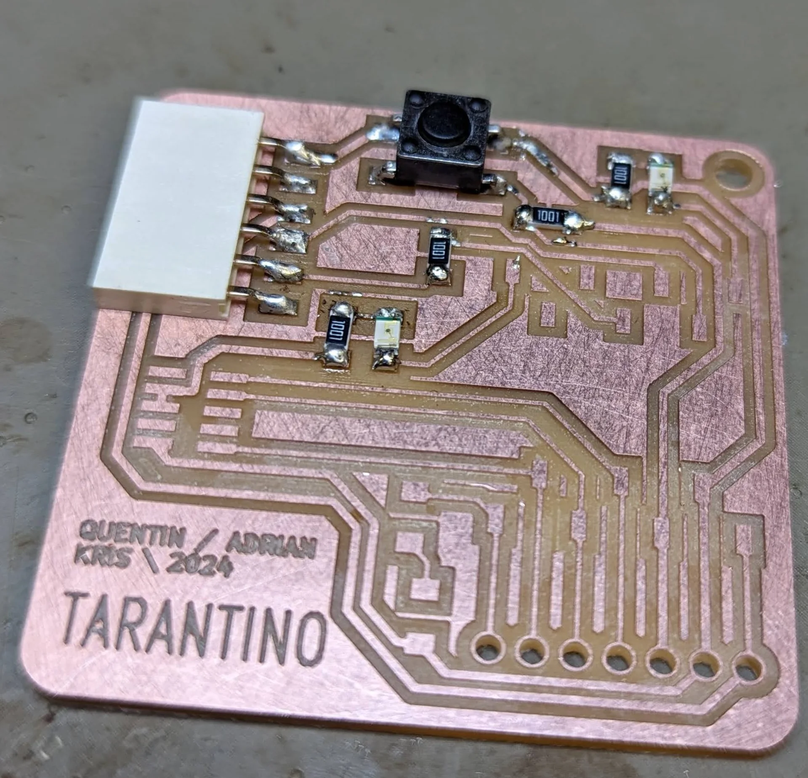

This week was a lot less creative in terms of coming up with what to make and thus only took me a single day from 13:15 to 23:45 minus writing the documentation. The day was a lot more formulaic with our group being shown the process and us more or less following it until we had something that worked. Milling the PCB was straightforward enough as long as one follows the instructions meticulously, but soldering for a complete novice like me was tough as that required quite a bit more work and precision than merely copying configuration settings from instructions and pressing play. Nevertheless, it was quite fun and highly rewarding when the self-made board came to life and responded to button presses. 

I was responsible for this week's group documentation, which can be found below, but as this week's solo project was pretty much following those instructions pretty much in lockstep, the documentation of both parts might be a bit interweaved. Overall, however, the group assignment documentation focuses more on the general setting up of the files and using the Roland Modela MDX-40 machine to mill the printed circuit board (PCB), whereas the solo assignment focuses more on soldering and my personal discoveries.

## Assignments

- Demonstrate understanding of PCB production technology by completing the group assignment.
- Mill a circuit board from existing design using Fablab equipment.
- Populate the board you made, solder all the parts using electronics workbenches at the Fablab.
- Upload basic code to the attached XIAO board to make sure if you can blink LED on your PCB and detect button pushes.
- Document your process on your documentation website with photos and screenshots.

## Group Assignment

In Tuesday's introduction session, we were shown how to use the [Roland Modela MDX-40 3D milling machine](https://www.rolanddga.com/support/products/milling/modela-mdx-40-3d-milling-machine) (see below) to engrave and cut the ["Tarantino"](https://gitlab.fabcloud.org/pub/programmers/tarantino) printed circuit board, that descends from the [Quentorres Hello World PCB and SWG UPDI Programmer](https://gitlab.fabcloud.org/pub/programmers/quentorres), which further descends from [Quentin's XIAO-Based SWG UPDI Programmer](https://gitlab.fabcloud.org/pub/programmers/swd-uart-adapter-xiao-rp2040), eventually evolving to having [Quentin Tarantino](https://en.wikipedia.org/wiki/Quentin_Tarantino)'s face on the back as a result of an elaborate wordplay - which I found pretty amazing! Too bad we did not get double-sided materials and so could not mill his face onto the back too. For source material, we used a copper-covered [FR2](https://www.raypcb.com/pcb-fr4-material/) (flame retardant 2) sheet. [Here](https://l-lu-u.gitlab.io/2024-digital-fabrication/weekly-assignments/week-06--group/) is excellent documentation for the [Roland SRM-20](https://www.rolanddga.com/products/3d/srm-20-fresadora-compacta), which was covered in Monday's session.


### Process summary

1. Download / create `.gbr` files
2. Import and align `.gbr` files on [CopperCAM](https://www.galaad.net/coppercam-eng.html)
3. Configure board dimensions and tools and set contours
4. Export `.nc` files
5. Clean the platform inside of the machine
6. Install the 0.2-0.5mm 60deg V-bit
7. Prepare material to be milled
8. Turn on the machine and open the file ending with "`-T1.nc`" in [Roland VPanel for MDX-40A](https://downloadcenter.rolanddg.com/MDX-40A) in "NC Code" command set mode and set coordinate systems to "G54"
9. Set the XY-origin according to the `.nc` file (South-West corner by default) using the arrow controls
10. Set the Z-origin to be a paper's thickness above the material
11. Engrave the material
12. Vacuum the dust
13. Change the tool to a 1.0mm router
14. Repeat steps from 8 to 12 with the file for drilling
15. Solder components

### Setting up using CopperCAM

As this week was mostly about learning a new, more complex process and the associated skillset, we were provided the PCB source files for the Tarantino board, which can be found [here](https://gitlab.fabcloud.org/pub/programmers/tarantino). For milling a single-sided board, the relevant files were [`Tarantino-F_Cu.gbr`](https://gitlab.fabcloud.org/pub/programmers/tarantino/-/blob/main/Gerbers/Tarantino-F_Cu.gbr), which specifies the circuit to be engraved, and [`Tarantino-PTH-drl.gbr`](https://gitlab.fabcloud.org/pub/programmers/tarantino/-/blob/main/Gerbers/Tarantino-PTH-drl.gbr), which specifies the holes to be drilled. These can be found under the "Gerbers" folder on [the GitLab page](https://gitlab.fabcloud.org/pub/programmers/tarantino).

To create the toolpaths for the machine needed for isolation engraving, open [CopperCAM](https://www.galaad.net/coppercam-eng.html) and import `Tarantino-F_Cu.gbr` from "File > Open > New circuit" and import `Tarantino-PTH.drl.gbr` on top of it from "File > Open > Drills" and click "yes" to all dialogues.


If the files do not line up perfectly, right-click a pad on the front layer, set it as a reference pad, select the drill layer, right-click on the corresponding pad and select "Adjust to reference pad" as instructed [here](https://wiki.aalto.fi/display/AF/Creating+Tool+Paths+with+CopperCAM) with images. 

To correctly engrave text, right-click on it and select "Engrave tracks as centerlines" and click "Yes" to all dialogues.


Configure the board dimensions from "File > Dimensions". Set the Z-thickness to the thickness of the material, which in this case was 1.6mm, and set the margin to 1mm. Click "yes" to the following dialogue, which asks you to change the tool's depth values.


Verify that the tools are configured correctly. For us, the defaults shown below were correct. "Tool library" (Parameters > Tool library) shows the name, number and settings for the individual tools and "Selected tools" (Parameters > Selected tools) shows which tool is going to be used for which task. Our Fablab was apparently running out of the 0.8mm cutters, so we used the 1mm cutter, which was used for everything else except the engraving, for which a more high-precision 02-05mm engraver was utilized.


After configuring the tools, calculate contours by clicking minigolf putting green looking icon highlighted below, which opens the "Set contours" dialogue. We used values 4 and 1 for "Number of successive contours" and "Extra contours around pads" respectively, which effectively specify the number of passes the machine makes and thus, the width of the isolation engraving. Keep both checkboxes checked and click "OK", which produces the below result showing a preview of what the milled PCB will look like.


To export the toolpaths, click the "Mill" icon with lightning and a drill bit on it (highlighted below). It opens the "Output" dialogue, where the different processes and their order is displayed. Make sure all are selected to export them all but ensure that "Mirror X" is not selected. Select "South-West corner" as the XY zero point or make sure to remember the origin for correctly configuring the machine. Click "OK" and navigate to where the files were saved to discover two files named (by default) `CopperCAM-T1.nc` and `CopperCAM-T3.nc`, which correspond to tools 1 (0.2-0.5mm 60deg V-bit) and 3 (1mm router) in the "Tool library" as denoted by `T1` and `T3`.


Aalto wiki has an excellent article on this topic called "[Creating Tool Paths with CopperCAM](https://wiki.aalto.fi/display/AF/Creating+Tool+Paths+with+CopperCAM)".

### Milling with Roland MDX-40

Depending on the previous user, there might be more or less setting up required. Begin by vacuuming the platform inside machine to avoid unevenness due to dust or particles from previous jobs. Then, as the MDX-40 is not made exclusively for PCB milling, there might be different tools and collets (the part that holds the tool) installed. If this is the case, install the correct 3.175mm collet for PCB milling using the wrenches found in the drawer immediately below the table labeled "MILLING BITS". Finally install the 60° V-bit to the 3.175mm collet such that the stopper ring touches the base and tighten using the hex key held by a magnet onto the left side of the front of the machine.


In addition to wrenches, the "MILLING BITS" drawer also contains the collets, bits, scrapers and scissors for cutting the two-sided tape, which can be found between the machine and the wall. The milling bits are, from left to right: 0.8mm router (orange), 1mm router (yellow) and 0.2-0.5mm 60deg V-bit (brown).


Next, we were instructed to roughen up the copper a bit to remove its coating by sanding it with wire wool so that it has more friction and the components later stay on it better. Then, the pre-cut piece of copper-coated FR2 material was taped onto the platform inside the machine using special double-sided tape on the backside, so that it is parallel to the platform's edges as the machine's coordinate system is also parallel to them.


After this much of setting up, the machine can finally be turned on via the power button after closing it of course. Make sure possible connector cables are also switched on. The control button has a big red emergency stop button, a power button, a view button, which lifts up the tool and brings the platform to the very front for convenient viewing and manipulation, and simple up and down controls for the tool.


Now open the [Roland VPanel for MDX-40A](https://downloadcenter.rolanddg.com/MDX-40A) application. Make sure its "Command Set" is set to "NC Code" (accessible via "Setup") and set the coordinate system to "G54" in both the upper left corner and in the "Set Origin Point" section.

![Roland VPanel for MDX-40A [NC Code]](roland-vpanel.webp)


The green up and down arrows can be used to move the platform inside the machine backwards and forwards along the Y-axis, the red left and right arrows can be used for moving the tool left and right along the X-axis and the blue up and down arrows can be used to move the tool up and down along the Z-axis. Assuming that the `.nc` files were exported using the default XY-zero point "South-West corner", move the platform and the tool to the corresponding lower left corner of the material using the red and green arrows. 

"Low Speed" and "High Speed" can be used for faster or slower continuous movement, whereas steps of 1, 10 and 100 determine how many hundreths of a millimeter the tool or platform will move with one click. Select a cautious setting such as "Low Speed" or "10 Step" and lower the tool a few millimeters above the material to see better where it is relative to it. Leaving a bit of a margin of safety is recommended, but once a good origin point is found, select "Set XY Origin" and click "Apply" and witness the X and Y coordinates in the upper left corner become "0.00mm" to denote successful setting of a new origin. 

Carefully lower the tool to be a couple millimeters above the material, put a piece of paper under it and carefully lower it manually by gripping it, loosening the collet, lowering it on top of the paper and fastening the collet again. Now select "Set Z Origin" and click "Apply". Now that all coordinates are "0.00mm", lift the tool up using the software and remove the paper.


**How to break a tool bit (AVOID):**
- Drop it
- Use it manually
- Store it improperly
- Fasten it insufficiently
- Use it with the wrong collet
- Use it with the wrong material
- Start milling without lifting above Z-origin
- Pulling anything from directly underneath it
- Adjust maximum depth without expertise / research
- Adjust rpm, cutting- or spindle speed without expertise / research

The tool bits are very delicate instruments as can be seen from the above pictures and they might cost between 10-30€ each, so handle them with care. Perhaps the most common way to break them is to start milling without lifting the tool up first. The Z-origin must be quite exactly just on top of the material but the milling must never be started with the tool lowered onto that level so always lift it up first as shown above.

To finally mill the board, click "Cut..." and "Delete All" to clear all possible previous jobs and open the file ending with "`-T1.nc`" via "Add" and then click "Output", which immediately starts the engraving with the 0.2-0.5mm 60deg V-bit as specified by the `CopperCAM-T1.nc` file, resulting in the very satisfying looking process below.



Vacuum the result before starting the next phase of milling. To drill and cut the PCB, change the tool bit to the 1.00mm cutter identified by the yellow stopper ring with "1.00" on it similarly as above. Following the same process, carefully lower it onto a thin piece of paper, tighten it and reset Z-Origin as now the bit is differet. Lift it up using the software, clear previous jobs, import the file ending with "`-T3.nc`" and start milling by clicking "Output".


Aalto wiki has an excellent article on this topic too, called "[PCB Milling with Roland MDX-40](https://wiki.aalto.fi/display/AF/PCB+Milling+with+Roland+MDX-40)".

## Making a Tarantino board

To make my own "Tarantino" board as specified [here](https://gitlab.fabcloud.org/pub/programmers/tarantino), I followed the process above exactly. In fact, the majority of the pictures are from my own attempt and success, whereas only the ones with [Burak](https://burakturkoz.gitlab.io/design-portfolio/)'s red hoodie in them are from the actual (very helpful!) instruction session.

### Milling

I downloaded the `Tarantino-F_Cu.gbr` and `Tarantino-PTH-drl.gbr` files, imported them to CopperCAM where they were immediately nicely aligned without the need to do anything. Really, this course has thus far gone suspiciously smoothly as I have somehow managed to avoid finding every single potential problem this time, now I have only had many. I configured the dimensions to have 1mm margin and 1.6mm thickness for the material, checked that tools were correctly configured and set the contours with 4 passes + 1 extra for pads. I exported the `.nc` files and was a bit confused for a second as it felt like exporting a single file, but upon checking all that was necessary was there.

I vacuumed the platform inside the machine, installed the 0.2-0.5mm 60deg V-bit, sanded the copper side of my material and covered the bottom with the double-sided tape fully to ensure maximum stability, with which I then attached it to the most level-seeming spot on the platform, parallel to its edges. I turned on the machine, configured VPanel and set the XY-origin a couple millimeters inward from the bottom-left corner for safety. I set the Z-origin there as well with the paper trick, making sure I was as careful with the bit as possible. I lifted the bit, imported the `CopperCAM-T1.nc` file and watched it engrave for approximately 12 minutes with the given settings, the results of which can be seen below as first entirely fresh and then vacuumed.


At this point I realized that copper is a pretty difficult material to photograph, especially from close up. My Google Pixel 6 has an absolutely fantastic camera for every day point-and-shoot photography but the limits of its focus for macro shots became quite apparent pretty quickly this week. Furthermore, the light has to hit the surface just right for proper contrast.

I then changed the tool bit to the 1.00mm one and executed the `CopperCAM-T3.nc` file to cut and drill the PCB, which only took approximately 2 minutes, the results of which can be seen below. I was initially a bit hesitant about the thickness of the copper around the holes but it was the same for the example pieces so I thought it fine.


In total, the milling process alone took a bit under 15 minutes for a board of this size and complexity with the given settings. However, the setup took much longer, especially because I tried (and seemingly succeeded) to be very meticulous with the process in order to not require any retries. As they say in the SEALS: "slow is smooth, and smooth is fast" and this proved itself yet again!

I vacuumed and scraped off the freshly milled PCB and admired the steampunkish creation for a while after peeling off the double-sided tape, which was a surprisingly satisfying process as it was very sticky but peeled off beautifully in one piece nevertheless. This was the easy part. Sure, there were a lot of things to remember but no actual skill needed. Then to soldering, with which I spent most of my time - apart from documentation.

### Soldering

I grabbed my box of components and headed to a soldering workstation. I was among the last people left at the lab and so I got to also take the example board with me, which was very helpful for verifying that my interpretations of the schematics were correct before soldering something wrong and having to go far back. I know relatively well how to read the circuit diagram below on the left but I must admit that I did not really know how to use the one on the right in the soldering process.


I sat down and turned on both the solder fume extractor and the solder iron and while I waited for the iron to get hot (which really did not take long) I tried the connectivity of my board using a multimeter with the setting shown below. This made it beep continuously while detecting continuity, and having probably annoyed the entire lab for taking the below picture with it, I could enjoy the fact that everything that should be connected seemed to be so.


I cut myself some solder wire, the length of which I estimated almost perfectly, and got down to soldering, which I think was pretty much new to me. I might have tried to do it like back in elementary school or middle school but if I did, I don't remember anything about it and the result is ultimately the same.


During the instruction session, I had written down the following steps:
1. Use flux pen on the pad you are about to solder on
2. Heat the pad with the soldering iron
3. Add a bit of solder on the pad
4. Place the component to be soldered on the pad and push it down gently while heating up the solder
5. Solder the other end for two-sided components or the opposite end for ones with more connections
6. Solder the original end again


I tried my best to follow these instructions and the accompanying demonstration as captured above and ended up with my first six joints looking as depicted below.


As can be seen, they are almost all, except for the furthest one, very pointy and rather sharply so. This resulted from pulling away the soldering iron, but as this was so tied to such a necessary physical action that had to be performed every time in one way or another, I was left quite baffled as to how exactly I should handle them. I tried following the curves of the connectors and to make more circular, arc-like movements but it felt like a game of luck every time. It also took a really long time for the solder wire to melt and so, out of curiosity, I tried to change the soldering iron, which suddenly made it work really well for a while until it felt like it was again not satisfactorily melting.

The hour started to be very late and I just wanted to get it done so that I could go sleep so I have to admit that I did not try to innovate too much but advanced very incrementally bit by bit whenever something just worked. At one point, at a particularly tough spot, I tried one other solder wire that was a lot thinner but contained lead. The joint worked nicely but I could smell it and even the non-lead wire pretty strongly upon soldering, even when doing so right in front of the fume extrctor and thus I did not dare use it more even though it was a lot easier. The thick wire felt really clumsy afterwards, but I could not find any thinner non-lead wire and I did not have the time to research how to solder safely with the lead wire so I just pressed forward however clumsy it may have been.

There was one more issue in that the wire also folded onto itself in some scenarios, even if I had used the flux pen generously on the pad that I was trying to apply it to, which did not make the job any easier as now, instead of a thick wire, there was a whole large sphere in the end. I could usually turn around the wire and apply the extra-thick end on a larger, unpopulated pad later but it was still very inconvenient and annoying. It also feels like there should be a certain rhythm to soldering but somehow, that was so unpredictable to me as sometimes holding the soldering iron to the solder would not do anything after tens of seconds, whereas sometimes it just melts and takes the desired shape immediately. I wonder if that is a temperature thing or some non-uniformities in the solder wire. Most likely it is of course my skill - or the lack thereof - but it felt like doing exactly the same thing one after another, offset by just a few millimeters could provide wildly inconsistent results.




Nevertheless, I managed to eventually solder all the small surface components. Even though the resistors and LEDs were incredibly small, they were actually surprisingly easy to solder on with the help of tweezers due to their simple geometry. The button was particularly difficult as by default, its connectors went over the pads. I squeezed and folded them to fit but then the soldering got very difficult as they were still simultaneously barely on the pads but also covered them almost fully. I just threw the dice and re-melted solders for as long as it took for them to become somewhat smooth. The 10-pin connector was particularly funny as the density of the connectors was pretty much more than the thickness of the solder wire but somehow magically that worked semi-smoothly. However, even my eyesight started to be at its limit and I had to try the magnifying glass / lamp instead, which felt a bit awkward as it covered a lot of the area I had otherwise used for working thus far.


Eventually, I managed to improve my joints a bit, as seen above, in terms of being more round but they still overflowed a bit and were somewhat bulky, which I partly blame on the thick solder wire. The corner of the white component can also be seen to be a bit damaged by me accidentally touching it with the soldering iron. The joints do seem mostly reasonable for a first timer though. There is still definitely a lot to do with soldering for me and while I didn't quite reach a meditative flow state yet, because of the constant joint-by-joint setbacks, I could see myself enjoying it eventually when my skills have become more stable. Now I just need a lot of practice to build up the intuition and muscle-memory. Now the only thing that was left, was adding the rivets.


This turned out to be perhaps the most annoying part. The rivets are ridiculously small and bit hard to handle. Eventually, I realized to just stand them up on the table and push the board so that they came through. Molding them into the shape they needed to be was surprisingly hard. I wrapped my hand into my sleeve to get a bit of a cushion in between and did manage to push them flat against the board but it took quite a bit of force and a slip could have possibly been fatal for the board. In fact, I already scratched one part a tiny bit but luckily this was not enough to affect anything yet. 

I thought I had finally just completed the final sprint until I turned around the board and noticed that two of the rivets were actually touching each other. I could not understand how that happened. It could not have been my fault as I did not really have control over the positioning and size of the holes beyond aligning them and so it must have been two particularly large rivets withing their natural variation next to each other or something similar. This obviously would not do as it might mess up all the connections. I then supported the board against the table and scratched hard with the tweezers, leaving a nasty mark and sometimes worrying a bit for the board as a whole but I managed to scrape a gap between them. Then it was only a matter of soldering them. And lo and behold, I managed to solder one of the rivets shut.


It took me a while of brainstorming and trial and error but eventually I managed to push the solder out by heating it up and pushing with a pin connector. Of course I then managed to resolder it shut a couple more times and got to even try desoldering when it accidentally spread way too far. Desoldering with a strip like below should theoretically be as simple as placing it on the solder to be removed, heating it up and removing the strip with the excess solder but it did not go quite so smoothly.


As can be seen in the above picture, the situation was close to catastrophic. I ran out of hands and the desoldering strip got stucks. Heating it up for long times did not seem to work and when trying to rip it away, it actually caught some of the copper layer with it. Luckily it was not a connection but it was pretty much 50/50 in that situation. Turns out the rivets were easily the hardest to solder, partially due to the risk of soldering them shut but also because they had to be soldered on the same plane and the shapes were harder too. Thus, it is not exactly a pretty row but it works in that headers fit through and they conduct.


### Testing

Having finally finished soldering, I connected the board to my laptop via a USB-C (very respectable!) cable and uploaded the `hello_tarantino.ino` code below onto it, which can be found from [here](https://gitlab.fabcloud.org/pub/programmers/tarantino/-/blob/main/Arduino/hello_tarantino/hello_tarantino.ino). What it does is as simple as detecting button presses and toggling an LED on and off.


```C
#define LED D0
#define BTN D1

bool ledState = HIGH; // HIGH, true and 1 mean the same
bool btnState = HIGH; // button is high as it is connected to 3.3V via a pull-up resistor

void setup() {
  pinMode(LED, OUTPUT);
  pinMode(BTN, INPUT);

  // set initial state of our LED
  digitalWrite(LED, ledState);
}

void loop() {
  bool btnReading = digitalRead(BTN);

  // we want to do something only if the reading and the state are different
  // in this case they are the same and we exit the loop immediatly
  if(btnReading == btnState){
    return; 
  }
 
  if(btnReading == LOW){ // LOW means button is pressed on Tarantino
    btnState = LOW;
    ledState = !ledState; // Flip led state by using negation operator
  }else{
    btnState = HIGH;
  }

  digitalWrite(LED, ledState);
  delay(10);
}

```

I already had [Arduino IDE](https://www.arduino.cc/en/software) installed from the Design Thinking and Electronic Prototyping course but it can be found [here](https://www.arduino.cc/en/software) as a basic, straightforward installer. I then followed the [Seeed Studio XIAO RP2040 with Arduino documentation](https://wiki.seeedstudio.com/XIAO-RP2040-with-Arduino/) to add the XIAO RP2040 board and upload the code onto it. This was as simple as adding the URL [https://github.com/earlephilhower/arduino-pico/releases/download/global/package_rp2040_index.json](https://github.com/earlephilhower/arduino-pico/releases/download/global/package_rp2040_index.json) onto a new row "File > Preferences > Additional Board Manager URLs", navigating to "Tools > Board > Boards Manager", typing "rp2040" and installing the "Raspberry Pi Pico/RP2040" package, choosing the correct board from "Tools > Board" and uploading the code with "Upload" button with a rightward arrow icon.




## Reflections

I definitely learned a lot this week. A whole new process for creating embedded electronics that feels more serious and a lot more powerful than playing around with breadboards, even though for me they are still at least far faster and perhaps nicer to experiment on. I cannot call the skillset of soldering acquired yet but I got my first tastes, which set me up on a path of continuous learning, which is now necessary to make it more habitual and fluent. What is nice about the global lectures is seeing what all kinds of other methods people have used to, for example, solder and what tricks worked for them. I still have a lot to do on that front and there is a lot to be learned from reading other people's documentation, which is what I shall now do. 

I am looking forward to acquiring a lot more experience with soldering and luckily there are quite a few of electronics weeks to provide that for me. For now, I have to research if there are any health risks and how to mitigate against them. The smell gave me a headache already, even though it was only occasional. I also have to learn the rhythm and intricasies of how to not create the smell. I should also research different temperatures and find out what could be the reason for unpredictability in the soldering process. I did routinely clean the soldering iron so I highly doubt it is that but there might be something else that I have missed. Nevertheless, this was a very educational and quite a fun week!


