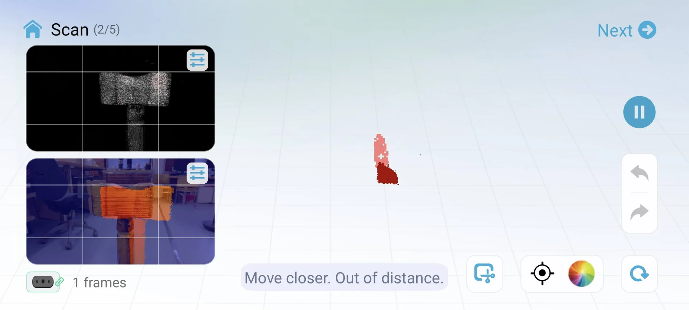

Easily the hardest part of this course is to come up with the ideas for each week's project. Not because of my lack of ideas or creativity in general but because of my desire to make something useful or meaningful for each project with limited time in the lab because of its opening hours, the number of other students on the course whose machine time I do not want to encroach upon, and because I am taking three other courses at the same time with this, those being [Statistical Inference](https://www.aalto.fi/en/open-university-course-list/statistical-inference), [Theory of Computation](https://courses.aalto.fi/s/course/a053X000012R0qeQAC/theory-of-computation?language=en_US) and [Artificial Intelligence D](https://courses.aalto.fi/s/course/a053X000012QzrRQAS/artificial-intelligence-d?language=en_US). Additionally, I just joined a startup called [Miitti App](https://www.miitti.app/) and am still in the process of finding a paying summer job in the software industry too. 

All of that put together adds up to quite a bit of intellectual work, on top of which I still have to figure out what I would 1. want to and 2. be realistically able to make each week. Sometimes the constraints in our assignment guide and help in this and other times, such as this week, they make it all the more difficult. See the assignments below, particularly the "What to design?" section.

## Assignments

**Basics**

- Do NOT use Formlabs printers. This assignment is only FDM.
- Join one of the scheduled introduction / TA sessions to complete the group assignment and get booking access to printers.

**Group assignment**

- Join FDM 3D Printing introduction session and document as you go.
- After the introduction session each of you should print one design rule test file (angle, free, bridging, combined) using any of the FDM 3D printers.
- Look at the prints together and discuss what can you learn from them in terms of design rules.
- Each group has a group leader who is responsible for creating the group assignment page.
- Each participant from the group should link to that page from their individual documentation.

**Individual assignment**

- Design an object (a small one, few cm3) that CAN NOT be made using subtractive manufacturing.
- 3D print the object you designed using an FDM printer, such as Ultimaker, Prusa MK4 or Prusa MINI.
- 3D scan anything with one of our Creality Ferret 3D Scanners.
- Document your process on a new page on your documentation website.

**What to design?**

According to ChatGPT, subtractive manufacturing involves removing material from a larger block or piece of material to create the desired object. However, there are certain objects that cannot be made using this method. Here are some examples:

1. Hollow objects
2. Objects with complex internal structures
3. Objects with fine details
4. Objects made of certain materials
5. Irregularly shaped objects

## Designs

### Ideation

As already mentioned, this week's project was particularly difficult to come up with due to the strictness of the requirements, those being the small size and something that cannot be created using subtractive manufacturing. To achieve the desired scale, my ideas initially revolved around small characters and cable holders, preferably fusing them into one somehow to have both a design challenge as well as something somewhat functional. 

However, the limitation of it having to be something that cannot be manufactured subtractively proved to be very challenging for the types of characters I was considering, those being [minions](https://www.imdb.com/title/tt2293640/), [Paddington](https://www.imdb.com/title/tt1109624/), some [Pokémon](https://www.pokemon.com/us/pokedex) and the like. Furthermore, I am still not quite sure of the technicalities of copyright in terms of creating a 3D-model of something and printing it for personal, non-commercial use but publically sharing it. That being said, looking forward to the ["Invention, Intellectual Property, and Income"](https://academy.cba.mit.edu/classes/invention_IP_business/index.html) week!

I continued my brainstorming for different avenues and thought about creating an elaborate bookmark, accessories either for my phone or [student overalls](https://www.ayy.fi/en/student-culture/overalls-and-jackets) and eventually landed on a keychain. I thought about creating some procedurally generated shapes but that seemed too vague of an idea and due to abovementioned reasons I unfortunately did not have time for such an exploratory process. That, however, got me to the domain of geometry and dimensions beyond three pretty quickly. The first thing I came up with was the [tesseract](https://en.wikipedia.org/wiki/Tesseract), which is the first thing one thinks of in terms of objects in higher dimensions. 

This felt a bit vanilla and so I initially tried to explore further but it turns out that the but the difficulty of making them increased exponentially while their actual representativeness in 3D decreased almost similarly. Now that I think about it afterwards, a [Klein bottle](https://en.wikipedia.org/wiki/Klein_bottle) or the [shadow of a four-dimensional flat torus](https://new.math.uiuc.edu/math198/MA198-2010/jesse_kearns/) might have been similarly interesting but I ended up defaulting to the tesseract as it looked the coolest, is widely recognized and would certainly be exceedingly difficult to produce subtractively - or at all, as it is technically a four-dimensional object after all. Below are some very interesting and enlightening videos I came across when researching tesseracts and the fourth dimension in general:

- [What Does a 4D Ball Look Like in Real Life? Amazing Experiment Shows Spherical Version of Tesseract](https://www.youtube.com/watch?v=_4ruHJFsb4g)
- [What Exactly is a Tesseract? (Hint: Not a Superhero Stone)](https://www.youtube.com/watch?v=KjIUzV094wE)
- [Understanding 4D -- The Tesseract](https://www.youtube.com/watch?v=iGO12Z5Lw8s)
- [A Beginner's Guide to the Fourth Dimension](https://www.youtube.com/watch?v=j-ixGKZlLVc)

To really make sure that it could not be subtractively made, I also made a chain that is inherently connected to the tesseract and so cannot be removed without breaking it. This saved me the effort of finding a chain for it but would likely be the most risky part of the print due to its small scale, odd angles and various overhangs.

### Modeling with Blender

I had made the decision to use [Blender](https://www.blender.org/) for this already when considering the characters as I figured that a standalone 3D-printed object would not gain anything from being parametric and so it would be fastest to create with Blender's robust tools, which I also wanted to explore further. The tesseract - or rather, its 3D projection - was quite simple to make.

I started a new Blender project with the "General" template and created the outer frame of the tesseract by copying the default cube, scaling it to 0.8 in the Y and Z dimensions and to 1.2 in the X-dimension, centering it onto the cube on every axis and copying it twice more, rotated by 90° over each remaining axis and using three Boolean Difference modifiers on the default cube with respect to each of them.


I then added two more cubes, one of which I scaled to 0.5 in all dimensions and the other I scaled to 0.1 in the X and Y dimensions and initially 1.0 in the Z-dimension. I rotated the latter by 40.5° over both Z and Y axes and positioned its middle in one of the corners. Adding a loopcut to the center and deleting the vertices on one side made it so that the object scales only in the remaining direction as the centerpoint was now in the outer end of the connector. I then added a mirror modifier over X, Y and Z axes to automatically add identical connectors to all corners. In the end I adjusted the connector's length to be 0.9, which automatically propagated to all its mirrored instances as well.


I then repeated the process to hollow out a cube on all sides using Boolean Difference modifiers on the small cube as well, producing the first ready version of the tesseract.


I then moved the ready tesseract up and added a torus with a minor radius of 0.16m (Blender works in meters by default instead of centi- or millimeters but this is no problem as scaling is easy) and positioned it carefully in a corner of the tesseract so that it would just touch the ground but not the tesseract at any point. Clicking the ends of the rotation visualizer in the upper right corner (see "Mirrored corner connectors" image), in this case "-X", enters a more precise view with a denser grid from that particular angle.


I copied the torus, rotated it 70° over the X-axis and stretched it a little in the X-dimension after moving it away from the first torus so that they still interlinked but did not touch each other. I then copied that and rotated it 45° over the X-axis, continuing the chain. I then selected the two stretched loops and copy-pasted a few pairs to make a chain, at the end of which I added a rotated copy of the first torus again. 


I tried to keep all the toruses as upright as possible so that they would be easy to print layer by layer by an [FDM](https://www.hubs.com/knowledge-base/what-is-fdm-3d-printing/) 3D-printer. This meant trying to reduce the number and angles of overhangs. As discussed in this week's [group documentation by Zina](https://zinaaaa.gitlab.io/digital-fabrication/week6_docu.html), a bridge is significantly better than an overhang as the filament has supports at both ends. Luckily, with this design for the tesseract, most overhangs took the form of bridges and I intended to print it at such a small scale that they should come out nice as seen in the [bridge test](https://zinaaaa.gitlab.io/digital-fabrication/week6_docu.html). The corner connectors were an exception to this but they were at shallow enough angles so that it should not be a problem either according to the [angle test](https://zinaaaa.gitlab.io/digital-fabrication/week6_docu.html).

I then exported it as both `.stl` as well as `.obj` using the default settings for both, other than changing the scales to 0.016 in order to scale down from meters to 1.6cm. I also made sure to have the "Up Axis" be Z for both as this was not always with `.obj`.


Some important points on Blender modifiers and different filetypes: make sure to have the modifiers in the correct order for the desired effect and for clean exporting to any file format, make sure to apply them. `.glb`, for example, does not automatically include them unless explicitly applied, whereas `.obj` and `.stl` do not have this issue. Also delete unnecessary hidden components as `.stl` files included them all - even those hidden from view. 

After a few iterations of printing, I ended up thickening everything for the final version of the tesseract keychain using the Solidify modifier in Complex mode with a negative value for thickness as it produced the same result as positive values but without the glitch seen in the third image. This made it more structurally sound and better looking as a small print. 


I also made new, thicker toruses with increased, rounder geometry, which I later reduced for the 3D model below using the Decimate Un-Subdivide modifier to make its file size smaller. I made the first and last links in the chain larger so that they would be easier to position for 3D-printing in the tesseract end and for easily fitting any keychain on the other end. I also made them all round for increased structural integrity and easier 3D-printing. 


Below is the 3D-model for the final tesseract keychain. Go to section "[Displaying 3D-models on the web](https://digital-fabrication-portfolio-miro-keimioniemi-a2f2c11a6e705b8f.gitlab.io/p/3d-printing-scanning/#displaying-3d-models-on-the-web)" for documentation on how it is displayed.



I also quickly created a very simplistic cable holder as pretty much just my own custom overhang test, that might provide some utility too should it come out successfully. Below is its 3D-model.



Both design files can be found as `.stl`, `.obj`, `.glb` and `.blend` from my repository [here](https://gitlab.com/miro.keimioniemi/digital-fabrication-portfolio/-/tree/main/content/post/week-5?ref_type=heads).

## 3D Printing

This week's group documentation, made by Zina, can be found [here](https://zinaaaa.gitlab.io/digital-fabrication/week6_docu.html).

First, I rather ambitiously tried to print the first version with no supports and no adhesion so that no post-processing would be necessary. I first opened the `.stl` in [Ultimaker Cura](https://ultimaker.com/software/ultimaker-cura/) - a 3D slicer program - but I noticed that it contained all the objects I had hidden in Blender. Cura also informed me that it had scaled it up by 10000%, which was rather peculiar. I then deleted it and tried the `.obj` instead, which did not contain the hidden elements. 

Both filetypes had a weird visual feature in Cura's Prepare view where additional walls were shown where none existed. Below is an image (left) of that even though the keychain version is different. However, in the Preview view after slicing, they were gone. I did my first quick test print on the Ultimaker S3 with the slicing settings shown below in the image on the right. Draft quality, 0.3mm resolution for "Extra Fast", 20% infill density with a triangle pattern and default shell thickness and no supports or adhesion. The screenshot was taken before adjusting the scale and thus shows much longer print time and greater weight. In reality, it came out at around 13mm height, 1 gram weight and taking only around 10 minutes to print.


## 3D Scanning





.webp>)

.webp>)

.webp>)

.webp>)


-1.webp>)

.webp>)

Start scan from other side works

.webp>)

.webp>)

.webp>)


.webp>)

.webp>)







### Displaying 3D-models on the web

Only kept .glb files in the repo (others are saved locally) because they contain textures and everything as jpgs get converted to webps by my scripts. also to save space

Added the following shortcode for displaying the models using [modelviewer](https://modelviewer.dev/):

```html
<script type="module" src="https://unpkg.com/@google/model-viewer/dist/model-viewer.min.js"></script>

<model-viewer style="width: 100%; height: 400px;" src="{{ .Get 0 }}" alt="3D model" auto-rotate camera-controls></model-viewer>
```

Tesseract key chain and basic cable holder, three branches keychain, sword keychain?

x-ray mode and lasso to delete entire parts

Hammer face count went from 853476 to 213369 only because the texture was very intricate and this was passable in that only very slight distortion was introduced


Paddington or another non-descript bear with a hat and a raincoat if there is a copyright issue. Should not be, however, as this material is purely for educational purposes.

Tesseract

select face in edit mode and move up along Z-axis


https://www.creality.com/pages/download-cr-scan-ferret


To clean up in blender Edit > X-ray > Lasso Select > Delete


