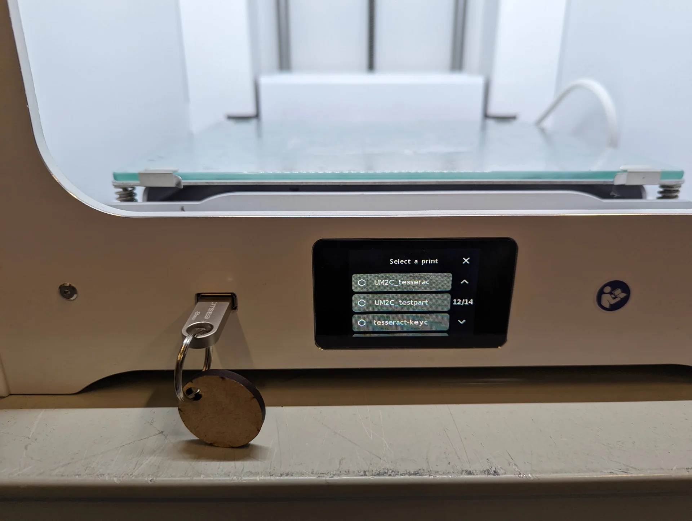
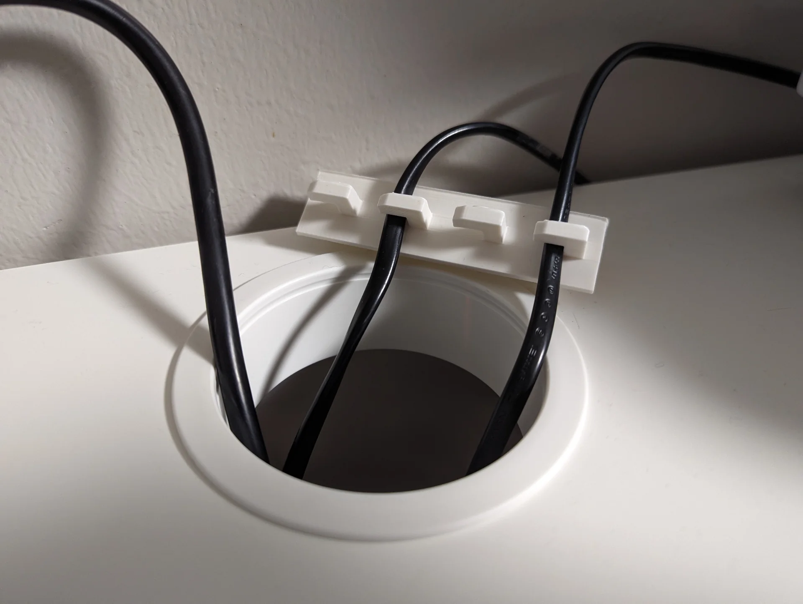
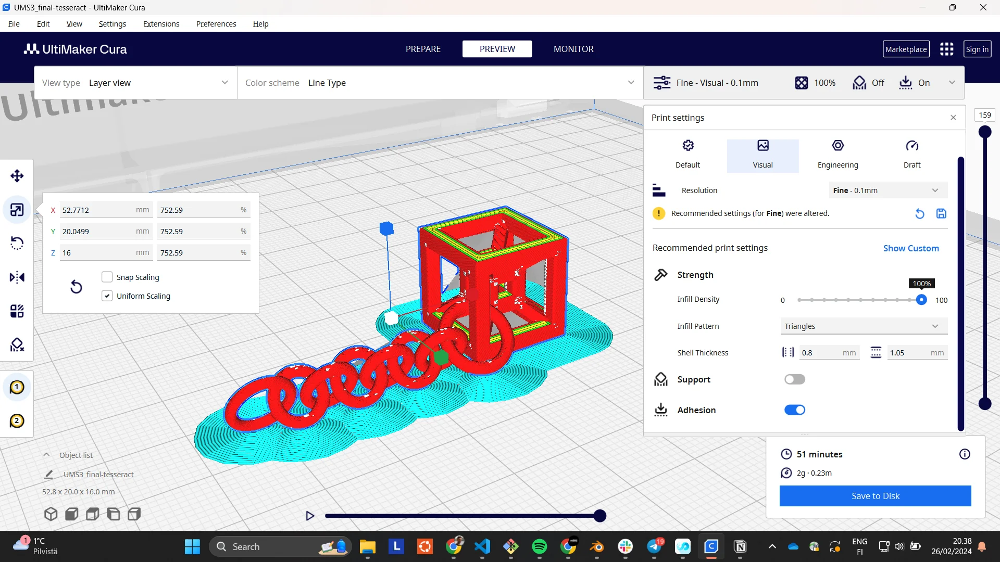
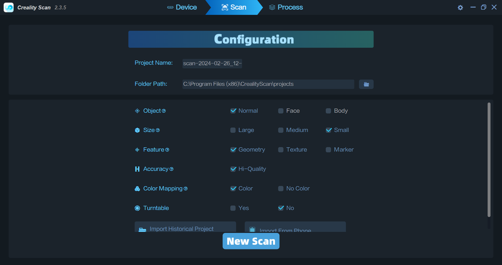

Easily the hardest part of this course is to come up with the ideas for each week's project. Not because of my lack of ideas or creativity in general but because of my desire to make something useful or meaningful for each project with limited time in the lab because of its opening hours, the number of other students on the course whose machine time I do not want to encroach upon, and because I am taking three other courses at the same time with this, those being [Statistical Inference](https://www.aalto.fi/en/open-university-course-list/statistical-inference), [Theory of Computation](https://courses.aalto.fi/s/course/a053X000012R0qeQAC/theory-of-computation?language=en_US) and [Artificial Intelligence D](https://courses.aalto.fi/s/course/a053X000012QzrRQAS/artificial-intelligence-d?language=en_US). Additionally, I just joined a startup called [Miitti App](https://www.miitti.app/) and am still in the process of finding a paying summer job in the software industry too. 

All of that put together adds up to quite a bit of intellectual work, on top of which I still have to figure out what I would 1. want to and 2. be realistically able to make each week. Sometimes the constraints in our assignment guide and help in this and other times, such as this week, they make it all the more difficult. See the assignments below, particularly the "What to design?" section.

## Assignments

**Basics**

- Do NOT use Formlabs printers. This assignment is only FDM.
- Join one of the scheduled introduction / TA sessions to complete the group assignment and get booking access to printers.

**Group assignment**

- Join FDM 3D Printing introduction session and document as you go.
- After the introduction session each of you should print one design rule test file (angle, free, bridging, combined) using any of the FDM 3D printers.
- Look at the prints together and discuss what can you learn from them in terms of design rules.
- Each group has a group leader who is responsible for creating the group assignment page.
- Each participant from the group should link to that page from their individual documentation.

**Individual assignment**

- Design an object (a small one, few cm3) that CAN NOT be made using subtractive manufacturing.
- 3D print the object you designed using an FDM printer, such as Ultimaker, Prusa MK4 or Prusa MINI.
- 3D scan anything with one of our Creality Ferret 3D Scanners.
- Document your process on a new page on your documentation website.

**What to design?**

According to ChatGPT, subtractive manufacturing involves removing material from a larger block or piece of material to create the desired object. However, there are certain objects that cannot be made using this method. Here are some examples:

1. Hollow objects
2. Objects with complex internal structures
3. Objects with fine details
4. Objects made of certain materials
5. Irregularly shaped objects

## Designs

### Ideation

As already mentioned, this week's project was particularly difficult to come up with due to the strictness of the requirements, those being the small size and something that cannot be created using subtractive manufacturing. To achieve the desired scale, my ideas initially revolved around small characters and cable holders, preferably fusing them into one somehow to have both a design challenge as well as something somewhat functional. 

However, the limitation of it having to be something that cannot be manufactured subtractively proved to be very challenging for the types of characters I was considering, those being [minions](https://www.imdb.com/title/tt2293640/), [Paddington](https://www.imdb.com/title/tt1109624/), some [Pokémon](https://www.pokemon.com/us/pokedex) and the like. Furthermore, I am still not quite sure of the technicalities of copyright in terms of creating a 3D-model of something and printing it for personal, non-commercial use but publically sharing it. That being said, looking forward to the ["Invention, Intellectual Property, and Income"](https://academy.cba.mit.edu/classes/invention_IP_business/index.html) week!

I continued my brainstorming for different avenues and thought about creating an elaborate bookmark, accessories either for my phone or [student overalls](https://www.ayy.fi/en/student-culture/overalls-and-jackets) and eventually landed on a keychain. I thought about creating some procedurally generated shapes but that seemed too vague of an idea and due to abovementioned reasons I unfortunately did not have time for such an exploratory process. That, however, got me to the domain of geometry and dimensions beyond three pretty quickly. The first thing I came up with was the [tesseract](https://en.wikipedia.org/wiki/Tesseract), which is the first thing one thinks of in terms of objects in higher dimensions. 

This felt a bit vanilla and so I initially tried to explore further but it turns out that the but the difficulty of making them increased exponentially while their actual representativeness in 3D decreased almost similarly. Now that I think about it afterwards, a [Klein bottle](https://en.wikipedia.org/wiki/Klein_bottle) or the [shadow of a four-dimensional flat torus](https://new.math.uiuc.edu/math198/MA198-2010/jesse_kearns/) might have been similarly interesting but I ended up defaulting to the tesseract as it looked the coolest, is widely recognized and would certainly be exceedingly difficult to produce subtractively - or at all, as it is technically a four-dimensional object after all. Below are some very interesting and enlightening videos I came across when researching tesseracts and the fourth dimension in general:

- [What Does a 4D Ball Look Like in Real Life? Amazing Experiment Shows Spherical Version of Tesseract](https://www.youtube.com/watch?v=_4ruHJFsb4g)
- [What Exactly is a Tesseract? (Hint: Not a Superhero Stone)](https://www.youtube.com/watch?v=KjIUzV094wE)
- [Understanding 4D -- The Tesseract](https://www.youtube.com/watch?v=iGO12Z5Lw8s)
- [A Beginner's Guide to the Fourth Dimension](https://www.youtube.com/watch?v=j-ixGKZlLVc)

To really make sure that it could not be subtractively made, I also made a chain that is inherently connected to the tesseract and so cannot be removed without breaking it. This saved me the effort of finding a chain for it but would likely be the most risky part of the print due to its small scale, odd angles and various overhangs.

### Modeling with Blender

I had made the decision to use [Blender](https://www.blender.org/) for this already when considering the characters as I figured that a standalone 3D-printed object would not gain anything from being parametric and so it would be fastest to create with Blender's robust tools, which I also wanted to explore further. The tesseract - or rather, its 3D projection - was quite simple to make.

I started a new Blender project with the "General" template and created the outer frame of the tesseract by copying the default cube, scaling it to 0.8 in the Y and Z dimensions and to 1.2 in the X-dimension, centering it onto the cube on every axis and copying it twice more, rotated by 90° over each remaining axis and using three Boolean Difference modifiers on the default cube with respect to each of them.


I then added two more cubes, one of which I scaled to 0.5 in all dimensions and the other I scaled to 0.1 in the X and Y dimensions and initially 1.0 in the Z-dimension. I rotated the latter by 40.5° over both Z and Y axes and positioned its middle in one of the corners. Adding a loopcut to the center and deleting the vertices on one side made it so that the object scales only in the remaining direction as the centerpoint was now in the outer end of the connector. I then added a mirror modifier over X, Y and Z axes to automatically add identical connectors to all corners. In the end I adjusted the connector's length to be 0.9, which automatically propagated to all its mirrored instances as well.


I then repeated the process to hollow out a cube on all sides using Boolean Difference modifiers on the small cube as well, producing the first ready version of the tesseract.


I then moved the ready tesseract up and added a torus with a minor radius of 0.16m (Blender works in meters by default instead of centi- or millimeters but this is no problem as scaling is easy) and positioned it carefully in a corner of the tesseract so that it would just touch the ground but not the tesseract at any point. Clicking the ends of the rotation visualizer in the upper right corner (see "Mirrored corner connectors" image), in this case "-X", enters a more precise view with a denser grid from that particular angle.


I copied the torus, rotated it 70° over the X-axis and stretched it a little in the X-dimension after moving it away from the first torus so that they still interlinked but did not touch each other. I then copied that and rotated it 45° over the X-axis, continuing the chain. I then selected the two stretched loops and copy-pasted a few pairs to make a chain, at the end of which I added a rotated copy of the first torus again. 


I tried to keep all the toruses as upright as possible so that they would be easy to print layer by layer by an [FDM](https://www.hubs.com/knowledge-base/what-is-fdm-3d-printing/) 3D-printer. This meant trying to reduce the number and angles of overhangs. As discussed in this week's [group documentation by Zina](https://zinaaaa.gitlab.io/digital-fabrication/week6_docu.html), a bridge is significantly better than an overhang as the filament has supports at both ends. Luckily, with this design for the tesseract, most overhangs took the form of bridges and I intended to print it at such a small scale that they should come out nice as seen in the [bridge test](https://zinaaaa.gitlab.io/digital-fabrication/week6_docu.html). The corner connectors were an exception to this but they were at shallow enough angles so that it should not be a problem either according to the [angle test](https://zinaaaa.gitlab.io/digital-fabrication/week6_docu.html).

I then exported it as both `.stl` as well as `.obj` using the default settings for both, other than changing the scales to 0.016 in order to scale down from meters to 1.6cm. I also made sure to have the "Up Axis" be Z for both as this was not always with `.obj`. Be careful when saving, however, as if you have a pre-existing file with the same name, Blender warns of this only by turning the folder field red and does not ask if you want to override it or not but does so automatically upon clicking save.


Some important points on Blender modifiers and different filetypes: make sure to have the modifiers in the correct order for the desired effect and for clean exporting to any file format, make sure to apply them. `.glb`, for example, does not automatically include them unless explicitly applied, whereas `.obj` and `.stl` do not have this issue. Also delete unnecessary hidden components as `.stl` files included them all - even those hidden from view. 

After a few iterations of printing, I ended up thickening everything for the final version of the tesseract keychain using the Solidify modifier in Complex mode with a negative value for thickness as it produced the same result as positive values but without the glitch seen in the third image. This made it more structurally sound and better looking as a small print. 


I also made new, thicker toruses with increased, rounder geometry, which I later reduced for the 3D model below using the Decimate Un-Subdivide modifier to make its file size smaller. I made the first and last links in the chain larger so that they would be easier to position for 3D-printing in the tesseract end and for easily fitting any keychain on the other end. I also made them all round for increased structural integrity and easier 3D-printing. 


Below is the 3D-model for the final tesseract keychain. Go to section "[Displaying 3D-models on the web](https://digital-fabrication-portfolio-miro-keimioniemi-a2f2c11a6e705b8f.gitlab.io/p/3d-printing-scanning/#displaying-3d-models-on-the-web)" for documentation on how it is displayed.



I also quickly created a very simplistic cable holder as pretty much just my own custom overhang test, that might provide some utility too should it come out successfully. Below is its 3D-model.



Both design files can be found as `.stl`, `.obj`, `.glb` and `.blend` from my repository [here](https://gitlab.com/miro.keimioniemi/digital-fabrication-portfolio/-/tree/main/content/post/week-5?ref_type=heads).

## 3D Printing

This week's group documentation, made by Zina, can be found [here](https://zinaaaa.gitlab.io/digital-fabrication/week6_docu.html). Aalto Fablab's documentation for Ultimakers can be found [here](https://wiki.aalto.fi/pages/viewpage.action?pageId=197412792) and for Prusas [here](https://wiki.aalto.fi/pages/viewpage.action?pageId=302023189).

First, I rather ambitiously tried to print the first version with no supports and no adhesion so that no post-processing would be necessary. I first opened the `.stl` in [Ultimaker Cura](https://ultimaker.com/software/ultimaker-cura/) - a 3D slicer program - but I noticed that it contained all the objects I had hidden in Blender. Cura also informed me that it had scaled it up by 10000%, which was rather peculiar. I then deleted it and tried the `.obj` instead, which did not contain the hidden elements. 

Both filetypes had a weird visual feature in Cura's Prepare view where additional walls were shown where none existed. Below is an image (left) of that even though the keychain version is different. However, in the Preview view after slicing, they were gone. I did my first quick test print on the Ultimaker S3 with the slicing settings shown below in the image on the right: Ultimaker S3 for printer, PLA for material and draft quality, 0.3mm resolution for "Extra Fast", 20% infill density with a triangle pattern and default shell thickness and no supports or adhesion for the settings. The screenshot was taken before adjusting the scale and thus shows much longer print time and greater weight. In reality, it came out at around 13mm height, 1 gram weight and taking only around 10 minutes to print.


After having sliced the model, I fetched a USB flash drive and saved the `.ufp` file onto it by clicking the big blue button at the lower right corner that reads "Save to Removable Drive [name of device]" when connecting it to the computer. Using the [Ultimaker S3](https://ultimaker.com/3d-printers/s-series/ultimaker-s3/) 3D-printer is then very easy, provided that it is already loaded with the desired material, that being white PLA filament in this case. Just make sure that the glass printing plate is clean, plug in the flash drive, select print, start it and wait until it is finished. (Below pictures document the printing of the final keychain, not the initial one)


Without adhesion, however, the results were not pretty. The print quickly got stuck to the nozzle resulting in a severe fail. To be fair, this was to be expected too but a short print time and no competition for printers got me trying it nevertheless, the lesson being that it does not work with such a small, delicate item with very little surface area touching the platform. Another lesson would be to monitor the beginning of the printing, particularly with such experiments, which I luckily did. This allowed me to abort printing and not waste more filament than was necessary. I walked away for a second to check on my 3D scanner and read documentation on the Ultimaker before getting started with trying to fix the situation but someone had managed to fix it and start another print already in the meantime. I belive that the process for doing so would have been to just heat the nozzle and pull or unload a little bit of filament from the printer settings.


As the S3 was now in use, the next attempt was made with an [Ultimaker S2+ Connect](https://ultimaker.com/3d-printers/s-series/ultimaker-2-connect/). This time, however, I toggled on "Adhesion" in Cura. The touchscreen of the S2+ Connect is a bit smaller but the process is the same: select the print, start it and wait for it to finish.





This time the print came out almost as intended. I removed it with a spatula and inspected it from up close. For some reason the last link of the chain had not been fully printed. Due to the combination of it being so small and the resolution being so large, the chain came out very uneven looking and the upright pillars of the tesseract were more round than square.


Removing the adhesion was nevertheless good practice. A carpet knife turned out to be great for the job, particularly with the chain links and soon I had a demo for what it could be like. As can be seen, it would not actually function as a real keychain yet, as the links were broken on both ends. I removed the one that was not properly printed and used the next one instead, which worked well, although the tesseract end was broken too, excerbated by small accidents in the process of removing the adhesion. The tesseract could have been processed further to be quite okay but it was also a bit small for my taste. 

To test its durability, I but it in my pocket with the keys and went to eat at [A Bloc](https://www.compass-group.fi/ravintolat-ja-ruokalistat/foodco/kaupungit/espoo/a-bloc/). To my surprise, it survived very well. Both the tesseract and the previously non-broken chain were perfectly intact. I then conducted a highly accurate test of tensile strength as well by manually pulling until the chain broke, and for how brittle it looked, it took a surprising amount of force. Not too much, but certainly more than I expected. The sides of the tesseract were also impressively durable. Pushing on the horizontally printed parts only squished them a bit after a considerable amount of force, whereas the vertically printed parts snapped a lot more easily, as expected - even though that too took more force than I would have imagined. PLA is a pretty tough material and with good settings, one can likely make quite elegant tiny items.


In between iterations of the tesseract keychain, I printed the very simplistic cable holder as well, which would likely have to be glued or taped in order to actually make sense due to being so light. It too came out surprisingly well, given the overhangs at 90° angles printed without any supports. 


Each hook had filament drooping beneath it but these could easily be ripped out with pliers without causing structural damage to the object. The undersides look actually quite cool even and they cannot be seen from above. Turns out that the design is actually more effective the other way around due to otherwise forcing the cables at a too-steep angle. The hooks do not also accomodate all types of cables due to being too loose for some and too tight for others but it does its job well-enough for a 5-minute design between prints.




I designed and printed various iterations of the tesseract keychain at different sizes and thicknesses and with different lengths, shapes and sizes of the chain, which can be seen below in order of printing from oldest (bottom) to latest (top), excluding the cable holder, which was made in between.


Eventually I nailed both the design as well as the printing settings, those being Ultimaker S3 with Generic PLA and nozzle size 0.4mm with height of the model set to 16mm and Visual mode, Fine 0.1mm resolution with 100% infill density and adhesion toggled on. This resulted in a lengthier print time but made the result near indestructible, so that I don't have to worry about accedentally squeezing it in my pocket or scratching it with my keys.




This produced the results below. The unprocessed result had some weird extrusion artifacts but these were easy to remove using a carpet knife and the adhesion could just be pulled off. Some of the chain links were also very loosely attached but they could be easily wiggled to break those bounds. The result turned out quite clean. It is not perfectly smooth and could be carefully sanded further to achieve that but it was satisfactory to me. 


Now I had an upgraded set of keys with access to the fourth dimension.


And here is a little recap of the successful, final prints.


## 3D Scanning

### Scanning on mobile

For 3D scanning, we had gotten introduction sessions for using the [Creality Ferret 3D Scanners](https://www.creality.com/products/cr-scan-ferret-3d-scanner), Aalto Fablab documentation for which can be found [here](https://wiki.aalto.fi/display/AF/Creality+Ferret+3D+Scanner).

For scanning, I hunted down the most interesting items in our apartment, which turned out to be a wooden hammer and a black, glazed clay panther, both of which I had made likely in middle school crafts. As the butt of the hammer was not quite parallel to the head, I taped it onto a stool, which I could easily circle with the scanner.


The creality scanner setup was quite straightforward, as described [here](https://wiki.aalto.fi/display/AF/Creality+Ferret+3D+Scanner). The kit contains many components and cables but in the image below on the right, everything necessary for a mobile setup can be seen. Only four of the components are needed. The three components from the left are assembled one on top of the other in order and the phone is held by the smallest of them. To connect the scanner to the phone wirelessly, the large block on the right can be used but with the desired data throughput it makes more sense to use the cable, the right end of which connects to the phone's USB-C port, whereas the leftmost USB-A connects to the handle and the one in the middle with the tightening screw connects to the scanner in the top right corner.


For scanning with a mobile phone, one needs the [Creality Scan app](https://play.google.com/store/apps/details?id=com.creality.crealityscan&hl=en_US). I installed that, opened it, configured the rather limited settings as shown below and started scanning the hammer.


It started out alright but I quickly found out that the app was not too great. The distance calibration was continuously off and it lost tracking often, especially with the handle of the hammer, and re-added already scanned points in wrong places, leading to very poor results. There were not that many settings for it to be my fault it not knowing how to configure them either and my Google Pixel 6 should be plenty powerful enough for the problem not to be in it either. Obviously this is very heavy-load work but it should work with a lot weaker phones as well.


I had noticed a rotating Jesus sculpture at the lab and had talked to [Shane](https://swirkes.gitlab.io/digital-fabrication/) who mentioned that he had used the desktop-exclusive turntable mode to scan it with great success. I thought that a turntable would be very convenient for my objects too as this would allow scanning with a lot less movement and therefore less risk of anything really. I tried scanning the Jesus statue with just the mobile app and that already worked very well without the turntable mode. 

I then went to ask [Solomon](https://studios.aalto.fi/people/solomon-embafrash/), the manager of the Fablab about whether they had any more of those. He unfortunately replied in the negative but mentioned that I can use that one by just removing the statue and using the 3D-printed connector myself. After a while of trying to figure out how to remove the statue, I finally just pulled it off, unscrewed it from the platform and taped my hammer on it instead. More tape than what is shown in the below image had to be added soon.


### Scanning on desktop

Below is the setup necessary for the turntable mode on desktop but ultimately I ended up using only the scanner connected to my laptop with the USB cable as this allowed me maximum range of movement, which was necessary to capture especially the belly of the panther.


The limitations of the turntable mode became apparent very quickly. I could not move the scanner around or it would pretty much immediately lose track. Thus I ended up with going with the below settings, them being: "Object": "Normal", "Size": "Medium", "Feature": "Geometry", "Accuracy": "Hi-Quality", "Color Mapping": "Color" and "Turntable": "No".


The workflow with the [Creality Scan Windows application](https://www.creality.com/pages/download-cr-scan-ferret) was just as straightforward as the mobile app, but this time everything mostly worked just as expected after turning off the turntable mode. I scanned the hammer slowly, so that each side was scanned multiple times and after a lengthy optimization process, I had a very solid 3D-model of the wooden hammer with a perfect texture.


To really explore the limits of the scanner, I then proceeded to scan the glazed, clay panther, for which I did not have high hopes due to its quite high reflectivity. I fetched a piece of plywood from the laser cutter garbage can to extend the platform and taped the panther on it. I then started a new scan with the same settings except for the size, which I now set to small.




During this scanning, I made a fascinating discovery about the scanner's tracking. I started the first scan from the left side profile of the panther, which curiously led to the tracking being lost every time it rotated onto the other side. Once it rotated back, however, it always found it immediately. I tried carefully moving the scanner over the turntable and rotating about every degree of freedom available but the scanner simply refused to register the other side no matter what I did. I then started the scan from the right side and everything worked with no problem whatsoever and I got a nice scan.


With the desktop application, the tracking was overall significantly better as compared to the mobile app. Other than this peculiarity, I could move it around without worry and the tracking would either stay on point or recover very well. It did pick up some extra geometry occasionally but not destructively as with the mobile app.

### Post-processing scanned 3D-models

The model came out really nice but the scan of the hammer had a bit of tape and a hole on the bottom, whereas the panther scan, which far exceeded all my expectations, had picked up a lot of unwanted features. I exported both as `.obj` files and opened them in blender.

To delete unwanted vertices from the panther, I changed the "Modeling" view and toggled on X-ray mode from the horizontal toolbar above just left of the shading settings so that I could select all of entire clusters regardless of depth. For some reason I had to also use the lasso tool for this, instead of the regular rectangular selection tool as it failed to select further away vertices. The lasso could be found from "Select > Lasso Select > Set" and a cluster of points after careful selection could be deleted by pressing the Delete key and choosing "Vertices". 


I then moved the origin to the approximate center of the panther by toggling "Options > Transform > Affect Only: Origins" on and dragging it its center, which made it a lot easier to move about and rotate.


After removing all the excess vertices, including the piece of recycled plywood, the feet of the panther were now open holes. I patched them up by creating rectangles that approximately cover them and then sculpting them in the "Sculpting" view mostly with the "Draw", "Crease" and "Smooth" tools after adding more geometry to sculpt with the Subdivision Surface modifier, where I used a level of 4 or 5 under the Catmull-Clark algorithm. Once these looked reasonable, I applied the same texture as what the panther body had to them but edited to only contain the black parts by moving and scaling the projection area appropriately over the texture in the "UV Editing" view.


When directly exporting this model as a `.obj`, it was over 252 MB in size, which would definitely be way too much for the repository. I thus used the Decimate modifier in Collapse mode to significantly reduce the face count and so also the size of the file. I decreased the ratio parameter one order of magnitude at a time until the model broke entirely and then just scaled back one order of magnitude. I settled at a ratio of 0.1, which decreased the number of faces from 844 782 to 110 579, which is almost an 87% reduction in the number of the faces with no perceivable difference in quality. I similarly decimated the new feet and so achieved a compression of over 91% from 252 042 KB to 22 014 KB.


Below is the fully processed 3D-model of the blank panther.



I repeated a similar process for the wooden hammer, deleting excess vertices using the lasso tool in X-ray mode in the "Modeling" view, adding a thin cylinder to cover the hole in the bottom, mapping the texture onto it by first selecting it in the "Shading" view and then scaling and moving the faces in the "UV Editing" view over the texture and finally decimated the model with a ratio of 0.25 bringing the face count down from 853 476 to 213 369 and so the size from 158 891 KB to 32 532 KB, achieving a bit under 80% compression. The ratio was much higher here because of the intricate texture, which got very quickly distorted at any lower settings.


The resulting, processed 3D-model of the wooden hammer can be found below.



### Displaying 3D-models on the web

Upon searching for the simplest method to display 3D-models on my website, I stumbled upon [model-viewer](https://modelviewer.dev/), which seemed to be a very elegant solution for this. Initially I had asked copilot for its recommendations and it came up with a [three.js](https://threejs.org/) based solution, which, to me, seemed a bit overkill for this particular application. Model-viewer, however, provides an incredibly simple interface in the form of a custom HTML tag, which could be used just as any other HTML tag, simply by importing the component using: 

`<script type="module" src="https://ajax.googleapis.com/ajax/libs/model-viewer/3.4.0/model-viewer.min.js"></script>`

To avoid having to read Hugo documentation, I asked copilot to write a shortcode template for it, which I then styled to have 100% width and 400px height:

```html
<script type="module" src="https://ajax.googleapis.com/ajax/libs/model-viewer/3.4.0/model-viewer.min.js"></script>

<model-viewer style="width: 100%; height: 400px;" src="{{ .Get 0 }}" alt="3D model" auto-rotate camera-controls></model-viewer>
```

This was easy to quickly verify and test and works beautifully by calling:

```

```

As can be seen from the shortcode and read from the [model-viewer documentation](https://modelviewer.dev/docs/index.html), the file type must be `gITF/GLB`. Thus, I uploaded only the `.glb` files to the repository in order to save space and avoid having to make changes to my image compression script, which would have changed the separate textures accompanying a `.obj` into `.webp` format. The original scans and other filetypes I saved locally.

## Reflections

This was a tough week. One of the busiest outside of Digital Fabrication already, on top of which this was one of the most painful weeks to ideate for. Although the design ended up quite simplistic, I am overall happy with my tesseract keychain, which could still be carefully sanded for additional polish, but which I don't necessarily see as too important as it looks just fine already and is sturdy enough, at least for now. I am looking forward to seeing how long it lasts for.

Although I expected to be way more enthusiastic about the 3D-printing, I ended up actually being more proud of the results of the 3D-scanning I think. Fiddling with the mobile app and desktop app's turntable mode was annoying but once I finally figured it out, it was pretty smooth sailing and seeing the models come to life in an interactive way on the website using the delightfully simple model-viewer was pretty magical.

For some reason this week's documentation took me twice as long as other weeks' even though it is of similar length relatively straightforward. I know it would be good to do it even more as I go in terms of time allocation but I feel like that would slow the experimentation down lethally. This week I had to do a lot of it images first in order to have something to present at the local lecture and that kind of made sense but also made the website annoying to deal with between saves and also felt somehow even slower. I will keep on exploring and hope to find a better, more efficient technique! 

On a positive note, my Blender skills also improved considerably this week and I learned that 3D-printing without supports is, first of all, a possiblity and, second of all, surprisingly successful given good design. 


