As a second-year Data Science student, I have experience in all types of programming from web development with React, HTML, CSS and JavaScript to machine learning with Python and game development with - funnily enough - Scala, a lot of which can be found from [my GitHub](https://github.com/MiroKeimioniemi). Recently, however, I have also gained experience in embedded programming. I took the [Basic Course in C programming](https://courses.aalto.fi/s/course/a053X000012Qx0rQAC/basic-course-in-c-programming?language=en_US) last spring and got to apply those skills on the [Design Thinking and Electronic Prototyping](https://www.aalto.fi/en/open-university-course-list/design-thinking-and-electronic-prototyping) course last fall, where we created a [prototype for the Networking Bracelet](https://github.com/MiroKeimioniemi/networking-bracelet-arduino-prototype), the idea of which is to encourage and facilitate interesting, spontaneous in-person conversations with the most interesting people at networking events of various kinds.

Overall, I am still relatively new to embedded programming but I can say that I feel quite comfortable with the [Arduino IDE](https://www.arduino.cc/en/software) as a result of the above. Thus, I now wanted to explore other avenues such as PlatformIO and MicroPython this time. And since we have input and output device weeks coming up separately, I wanted to deliberately limit myself to the board only and see how creative I could get with these tools and just a button and three LEDs.

## Assignments

Group assignment:

- Look at the datasheet of the [RP2040](https://files.seeedstudio.com/wiki/XIAO-RP2040/res/rp2040_datasheet.pdf) and reflect on what you learned.
- Try and compare other [MCU](https://www.youtube.com/watch?v=7yXqApEcjLU)'s, such as other [XIAO boards](https://wiki.seeedstudio.com/xiao_topic_page/) and [ATtiny](https://www.studiopieters.nl/attiny/) and [SAMD](https://www.digikey.com/en/products/detail/microchip-technology/ATSAMD11C14A-SSUT/5226470) boards.
- Look at [Saskia's documentation](https://gitlab.fabcloud.org/academany/fabacademy/2023/labs/aalto/group-assignments/embedded-programming) where ATtiny and SAMD hello boards are explored.
- You may do this individually or in group, feel free to choose what is best for you this time.

Do the following to complete the assignment.

- Program the XIAO board you made in Electronics Production week to do something with all available output devices on the board (R, G and B LEDs, NEOPIXEL LED). You need to have your board ready and functioning at this point.
- Write code to detect a button press to switch between several modes.
- Write code to send to and receive messages from the board using the Serial class.
- Document your process on your documentation website.

## RP2040 Datasheet

### How to read a datasheet

The [RP2040 Datasheet](https://files.seeedstudio.com/wiki/XIAO-RP2040/res/rp2040_datasheet.pdf) is very well formatted and thoroughly written. In fact, it is so extensive that the rather dense table of contents alone is 12 pages long. Given my very limited expertise in processors on this low of a level and lack of time, which I discussed [last week](), I was obviously not going to read the entire thing. While I know that the pinout diagram and descriptions are always interesting, I was not sure how to make the most out of the document otherwise. Thus, I first watched [this tutorial](https://www.youtube.com/watch?v=9r8JMbHc-xQ) for an idea about how to approach electronics datasheets in general.

The narrator of the video recommends the following approach to reading datasheets in general:

1. Typical application circuit (usually not applicable to microcontrollers)
2. Description and operational description / detailed functions
3. Absolute maximum ratings and recommended operating conditions
4. Pinout / pin description
5. Block diagram
6. Charts
7. PCB layouts
8. [Errata](https://en.wikipedia.org/wiki/Erratum) / revisions

What he most stressed, however, was to make sure to always be reading the latest version of the document to see all corrections that likely have accumulated.

### Areas of interest

In light of the above section, I then skimmed through the table of contents and collected the most interesting things to read through. These are first listed, in what looks like a rather long table of contents but barely contains each overview, and then discussed below in an order that makes more sense and has much more condensed information about topics strictly relevant to programming an RP2040-equippped board using higher level languages such as C/C++ and Python.

<ul style="list-style-type: none;">
  <li>1. Introduction
    <ul style="list-style-type: none;">
      <li>1.1. Why is the chip called RP2040?</li>
      <li>1.2. Summary</li>
      <li>1.3. The Chip</li>
      <li>1.4. Pinout Reference
        <ul style="list-style-type: none;">
          <li>1.4.1. Pin Locations</li>
          <li>1.4.2. Pin Descriptions</li>
          <li>1.4.3. GPIO Functions</li>
        </ul>
      </li>
    </ul>
  </li>
  <li>2. System Description</li>
  <ul style="list-style-type: none;">
    <li>2.4. Cortex-M0+
        <ul style="list-style-type: none;">
        <li>2.4.1. Features
            <ul style="list-style-type: none;">
            <li>2.4.1.1. Interfaces</li>
            <li>2.4.1.2. Configuration</li>
            <li>2.4.1.3. ARM architecture</li>
            </ul>
        </li>
        <li>2.4.2. Functional Description
            <ul style="list-style-type: none;">
            <li>2.4.2.1. Overview</li>
            <li>2.4.2.2. Features</li>
            <li>2.4.2.3. NVIC features</li>
            <li>2.4.2.4. Debug features</li>
            </ul>
        </li>
        </ul>
    </li>
    <li>2.5. Memory
        <ul style="list-style-type: none;">
        <li>2.5.1. ROM</li>
        <li>2.5.2. SRAM
            <ul style="list-style-type: none;">
            <li>2.5.2.1. Other On-chip Memory</li>
            </ul>
        </li>
        <li>2.5.3. Flash</li>
        </ul>
    </li>
    <li>2.6. Boot Sequence</li>
    <li>2.8. Power Supplies</li>
  </ul>
  <li>3. PIO
    <ul style="list-style-type: none;">
      <li>3.1. Overview</li>
      <li>3.2. Programmer’s Model
        <ul style="list-style-type: none;">
          <li>3.2.1. PIO Programs</li>
          <li>3.2.2. Control Flow</li>
        </ul>
      </li>
      <li>3.6. Examples</li>
    </ul>
  </li>
  <li>4. Peripherals
    <ul style="list-style-type: none;">
      <li>4.1. USB
        <ul style="list-style-type: none;">
          <li>4.1.1. Overview
            <ul style="list-style-type: none;">
              <li>4.1.1.1. Features
                <ul style="list-style-type: none;">
                  <li>4.1.1.1.1. Device Mode</li>
                  <li>4.1.1.1.2. Host Mode</li>
                </ul>
              </li>
            </ul>
          </li>
        </ul>
      </li>
      <li>4.2. DMA</li>
      <li>4.3. UART
        <ul style="list-style-type: none;">
          <li>4.3.1. Overview</li>
        </ul>
      </li>
      <li>4.4. I2C</li>
      <li>4.5. SPI</li>
      <li>4.6. PMW</li>
      <li>4.7. Timer</li>
      <li>4.8. Watchdog</li>
      <li>4.9. RTC</li>
      <li>4.10. ADC and Temperature Sensor</li>
      <li>4.11. SSI</li>
    </ul>
  </li>
  <li>5. Electrical and Mechanical
    <ul style="list-style-type: none;">
      <li>5.1. Package
        <ul style="list-style-type: none;">
          <li>5.1.1. Recommended PCB Footprint</li>
        </ul>
      </li>
      <li>5.2. Pinout
        <ul style="list-style-type: none;">
          <li>5.2.1. Pin Locations</li>
          <li>5.2.2. Pin Definitions
            <ul style="list-style-type: none;">
              <li>5.2.2.1. Pin Types</li>
              <li>5.2.2.2. Pin List</li>
            </ul>
          </li>
          <li>5.2.3. Pin Specifications
            <ul style="list-style-type: none;">
              <li>5.2.3.1. Absolute Maximum Ratings</li>
              <li>5.2.3.2. ESD Performance</li>
              <li>5.2.3.3. Thermal Performance</li>
              <li>5.2.3.4. IO Electrical Characteristics</li>
              <li>5.2.3.5. Interpreting GPIO output voltage specifications</li>
            </ul>
          </li>
        </ul>
      </li>
      <li>5.3. Power Supplies</li>
      <li>5.4. Power Consumption
        <ul style="list-style-type: none;">
          <li>5.4.1. Power Consumption versus frequency</li>
        </ul>
      </li>
    </ul>
  </li>
</ul>

### Summary of findings

I tried my best trying to be as clear, educational and concise as possible and while most of the text is my own based on my reading of the datasheet, some expressions had already been perfected in it, in which case I may have used them directly. Quotes and references would have made the text quite unreadable and as this is no academic paper, I thought it passable to borrow the best expressions with merely general attribution. The up-to-date RP2040 datasheet can be found [here](https://www.raspberrypi.com/products/rp2040/specifications/).

#### Overview

The RP2040 is a 2-core microcontroller with dedicated hardware for many commonly used peripherals that supports [C/C++](https://en.cppreference.com/w/c/language) and [MicroPython](https://micropython.org/) cross-platform environments. It has dual 32-bit [ARM Cortex-M0+ processor cores](https://developer.arm.com/documentation/ddi0484/latest) using the RISC-based [ARMv6-M Thumb®](https://developer.arm.com/documentation/ddi0419/latest/) instruction set and running at up to 133 MHz and a total of 284kB of on-chip Static Random Access Memory (SRAM), of which 264kB is available in regular use. It is capable of executing code directly from external memory through the dedicated SPI, DSPI and QSPI interfaces and can be debugged via the SWD interface. 

Other key features include the versatility of the General Purpose Input/Output (GPIO) pins, which can be driven directly or from a variety of dedicated logic functions such as SIO, PIO (both of which can connect to all GPIO pins), SPI, UART, SCL, PWM, CLOCK and USB, which all will be explained in more detail below, and four of which have an analogue-to-digital converter function. There is also an in-built high-bandwidth USB that can act as both device and host, and dedicated hardware for fixed functions such as SPI, I2C and UART as well as two PIO blocks with four state machines each that can be programmed to provide additional IO functions. An internal voltage regulator supplies the core voltage, thus only necessitating the end product to supply the IO voltage.

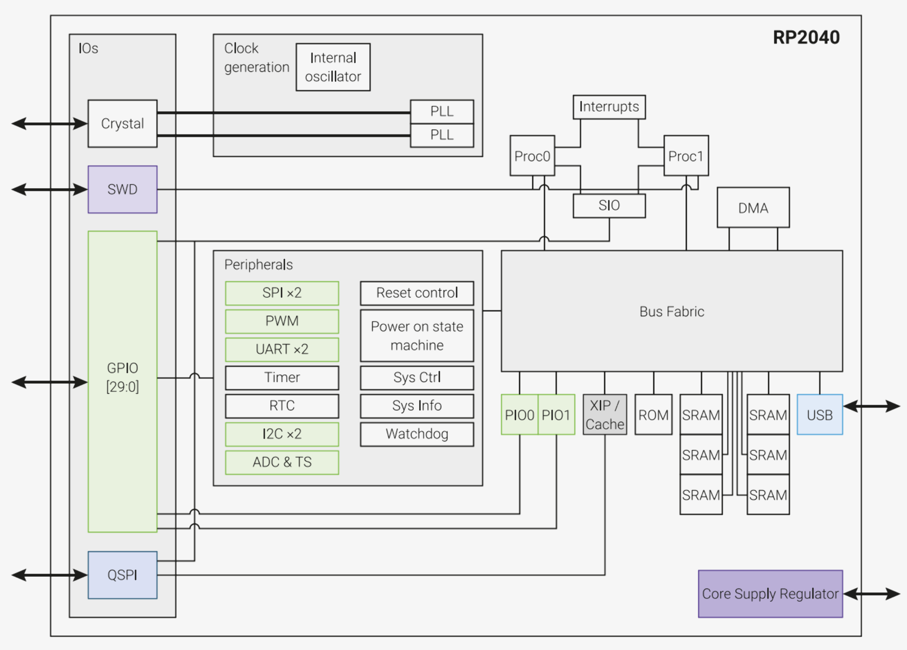

The ARM Cortex-M0+ is a very low gate count but energy efficient, configurable, multistage 32-bit RISC processor with support for single-cycle I/O access, integrated sleep modes, 32-bit hardware multiplier 24-bit SysTick timer, ARMv6-M Thumb® instruction set and Thumb-2 technology, deterministic, fixed-latency interrupt handling with ability to load and store multiple instructions. Its debug features include Serial Wire Debug interface, Debug Access Port (DAP), four hardware breakpoints, two watchpoints, Program Counter Sampling Register (PCSR), full access to core registers when the processor is halted and support for unlimited software breakpoints with BKPT instruction. The processor is configured with little endian bus access.

The RP2040 chip has 16kB of embedded Read-Only Memory (ROM) for the initial startup routine (core 0 initial boot sequence and core 1 low power wait and lauch protocol), USB MSC class-compliant bootloader with [UF2](https://github.com/Microsoft/uf2) support for downloading code/data to FLASH or RAM, USB [PICOBOOT](https://github.com/raspberrypi/pico-bootrom) bootloader interface for advanced management and utility libraries such as fast floating point, fast bit counting / manipulation functions and fast memory fill / copy functions. There is 264kB of on-chip Static Random Access Memory (SRAM), which is physically partitioned into six banks (4 x 64kB + 2 x 4kB), enabling parallel access of up to four 32-bit SRAM accesses per clock cycle. There are also 16kB of XIP cache and 4kB of USB data DPRAM, both of which can be used if their respective functions are not in use, totaling at 284kB of on-chip SRAM.

The RP2040 chip's name incorporates a lot of this information with RP referring to [Raspberry Pi](https://www.raspberrypi.com/), 2 to the number of cores, 0 to the type of core (ARM Cortex-M0+ in this case), 4 to the amount of ram and 0 to the amount of nonvolatile memory. The rest of the key overview information is packaged in the pinout diagram and pin descriptions.

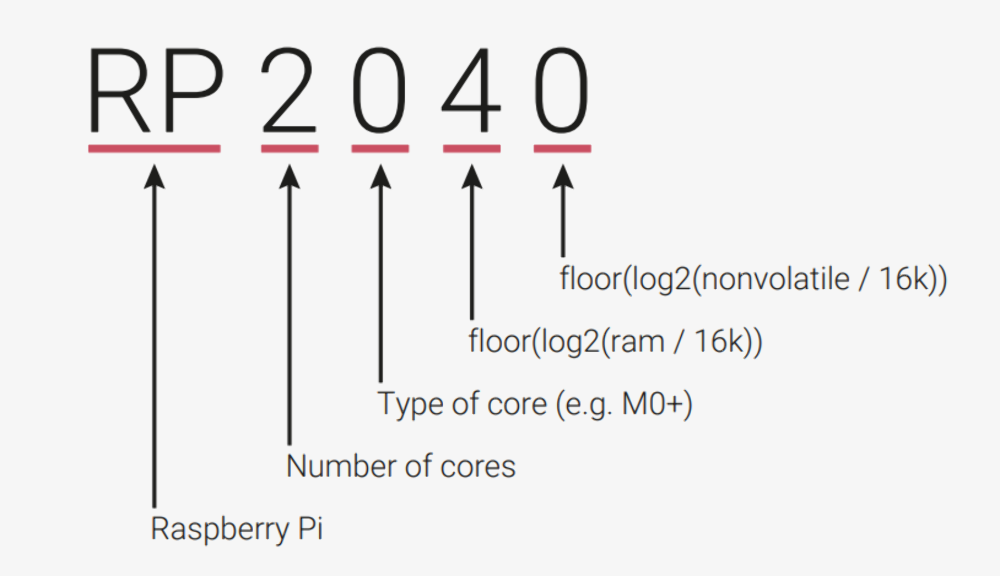
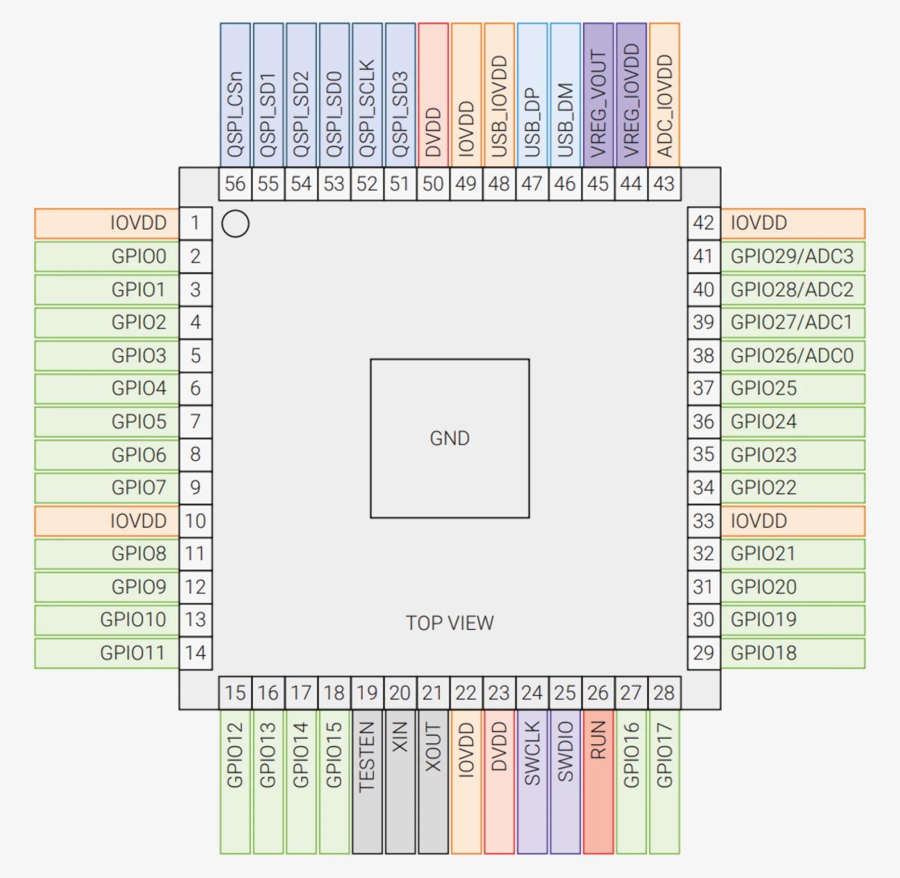

#### Pin descriptions

- **GPIOx** - General-purpose digital input and output that can be controlled via internal peripherals or directly from software
- **GPIOx/ADCy** - General-purpose digital (1 or 0) input and output with analogue-to-digital converter function (any number between 1 and 0 divided in 4096 steps for a 12-bit ADC)
- **QSPIx** - Interface to SPI, Dual-SPI or Quad-SPI flash device, with execute in place support (can also be used as software-controlled GPIOs if not required for flash access)
- **USB_DM and USB_DP** - USB controller supporting Full Speed device and Full/Low Speed host (requires 27Ω series termination resistors for each pin)
- **XIN and XOUT** - Connect a crystal or use as a single-ended CMOS clock input (USB bootloader requires 12MHz)
- **RUN** - Global asynchronous reset pin
- **SWCLK and SWDIO** - Access to the internal Serial Wire Debug multi-drop bus (provides debug access to both processors and can be used to download code)
- **TESTEN** - Factory test mode pin (tie to GND)
- **GND** - External ground connection bonded to internal ground pads
- **IOVDD** - Power supply for digital GPIOs (1.8 V to 3.3 V)
- **USB_IOVDD** - Power supply for internal USB Full Speed PHY (3.3 V)
- **ADC_IOVDD** - Power supply for analogue-to-digital converter (3.3 V)
- **VREG_IOVDD** - Power input for the internal core voltage regulator (1.8 V to 3.3 V)
- **VREG_VOUT** - Power output for the internal core voltage regulator (1.1 V, max 100 mA)
- **DVDD** - Digital core power supply (1.1 V)

As can be seen from the number of power supply pins, the RP2040 requires five separate power supplies, several of which can be combined for most applications, such that only a single power source is needed. Typically this is 3.3V but it can be as low as 1.8V if a functional USB PHY and optimum ADC performance are not required. The core can also be supplied with power separately with as low as a 1.1V supply.

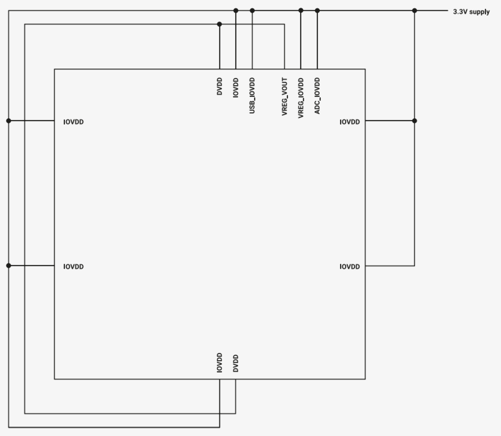

#### PIO hardware interface

The programmable input/output block (PIO) is a hardware interface capable of implementing various IO (Input/Output) standards including 8080 and 6800 parallel bus, I2C, 3-pin I2S, SDIO, SPI, DSPI, QSPI, UART and DPI or VGA (via resistor DAC). It is programmable similarly to a processor but is highly specialized for IO with a focus on determinism, precise timing and close integration with fixed-function hardware.

Both PIO blocks on the RP2040 have four state machines each, that can independently execute short, binary programs from a shared instruction memory that either come from the PIO library or are directly assembled or programmatically generated by the user software. The PIO instruction set consists of JMP, WAIT, IN, OUT, PUSH, PULL, MOV, IRQ, and SET. This allows for more flexible, dynamic interfaces without increasing costs or power required. All state machines have independent, simultaneous access to all GPIOs. It can be programmed directly to implement a wide variety of interfaces but it can also be used as any of the previously mentioned interfaces with the PIO library.

PIO can be used to, for example, implement the proprietary pulse-width serial format that drives [WS2812 LEDs](https://cdn-shop.adafruit.com/datasheets/WS2812.pdf) using the following PIO assembly code, supplemented with a lot of C code.

```assembly
.program ws2812
.side_set 1

.wrap_target
bitloop:
out x, 1 [3] set 0 ; Side-set still takes place when instruction stalls
jmp !x do_zero [2] set 1 ; Branch on the bit we shifted out. Positive pulse
do_one:
jmp bitloop [3] set 1 ; Continue driving high, for a long pulse
do_zero:
nop [3] set 0 ; Or drive low, for a short pulse
.wrap
```

#### Peripherals

##### USB

The RP2040 has a Universal Serial Bus (USB) 2.0 controller that can operate either as a Full Speed device (12 Mbit/s) or as a host capable of communicating with both Low Speed (1.5 Mbit/s) and Full Speed devices, including multiple downstream devices via a USB hub. It has 3840 bytes of DPSRAM for usable buffer space and supports up to 32 endpoints with 16 in each direction for device mode and 15 for host mode.

##### DMA

The Direct Memory Access (DMA) master can perform up to 32 bits in size of read and write accesses every clock cycle across 12 independent channels on the processor's behalf, leaving it free for other tasks or low-power sleep states.

##### UART

The RP2040 has 2 identical Universal Asynchronous Receiver-Transmitter (UART) peripherals with programmable [baud](https://en.wikipedia.org/wiki/Baud) rate generators up to 921600 bps, separate 32x8 Tx and 32x12 Rx FIFOs and a programmable serial interface with 5 - 8 bits.
It performs serial-to-parallel conversion on data received and parallel-to-serial conversion on data transmitted to the peripheral device.

##### I2C

The RP2040 has 2 identical Inter-Integrated Circuit (I2C) controllers that can carry information between devices connected to a bus via a 2-wire serial interface with data rates of 100 Kb/s (standard mode), 400 Kb/s (fast mode) and 1000 Kb/s (fast mode plus). It must be either in master (initiates data transfers and generates clock signals) or slave mode.

##### SPI

There are two identical Serial Peripheral Interface (SPI) controllers for communicating with peripherals with Motorola SPI, National Semionductor Microwire or Texas Instruments synchronous serial interfaces in master or slave mode with bit rates up to 2MHz and higher, programmable clock rate and programmable data size between 4 and 16 bits. The ARM PrimeCell Synchronous Serial Port (SSP) -based SPI also performs serial-to-parallel conversion on data received from a peripheral device. 

##### PWM

The RP2040 Pulse Width Modulation (PWM) block has 8 identical slices, each capable of driving two PWM output signals or measuring the frequency or duty cycle of an input signal for a total of 16 controllable PWM outputs, which can be used to drive any of the 30 GPIO pins. The output is a smoothly varying average voltage created with positive pulses of controlled width at regular intervals with the time spent high referred to as the duty cycle measured in percentages. PWM can be used to approximate an analog output or control switchmode power electronics.

##### Timer

The timer peripheral on the RP2040 provides a single 64-bit counter incrementing once per microsecond with the reference generated in the Watchdog that can be read from a pair of latching registers for race-free reads over a 32-bit bus.

##### Watchdog

The watchdog is a countdown timer that restarts parts of the chip upon reaching zero, if no values are periodically written by the programmer.

##### RTC

The Real-Time Clock (RTC) provides time in human-readable format and can be set to generate events at specific times. It can be driven from an internal or external clock source.

##### ADC and Temperature Sensor

The RP2040 has an internal 12-bit Analogue-to-Digital Converter (ADC) with Effective Number Of Bits (ENOB) of 9.5, which can thus represent analogue values in 4096 or, effectively 724 increments between 1 and 0. Its sampling rate using an independent 48MHz clock is 500 Ks/s. When using an ADC input shared with a GPIO pin, the digital functions must be disable by setting `IE` low and `0D` high in the pin's pad control register. THe maximum input voltage is determined by the digital IO supply voltage (IOVDD), not the ADC supply voltage (ADC_IOVDD).

##### SSI

In addition to - and separate from - SPI, the RP2040 also has a Synchronous Serial Interface (SSI) controller as a part of the XIP block, connected to the QSPI pins and is used to communicate with external Flash devices. Similarly to SPI, it can also be connected to serial-master or serial-slave peripheral devices with the Motorola Serial Peripheral Interface (SPI), Texas Instruments Serial Protocol (SSP) or National Semiconductor Microwire.

#### Electrical and mechanical features

The size, dimensions and recommended PCB footprint can be seen below. Below them is a DVDD Current vs Core Frequency chart of a typical RP2040 device running Fast Fourier Transform (FFT) calculations to illustrate power consumption.

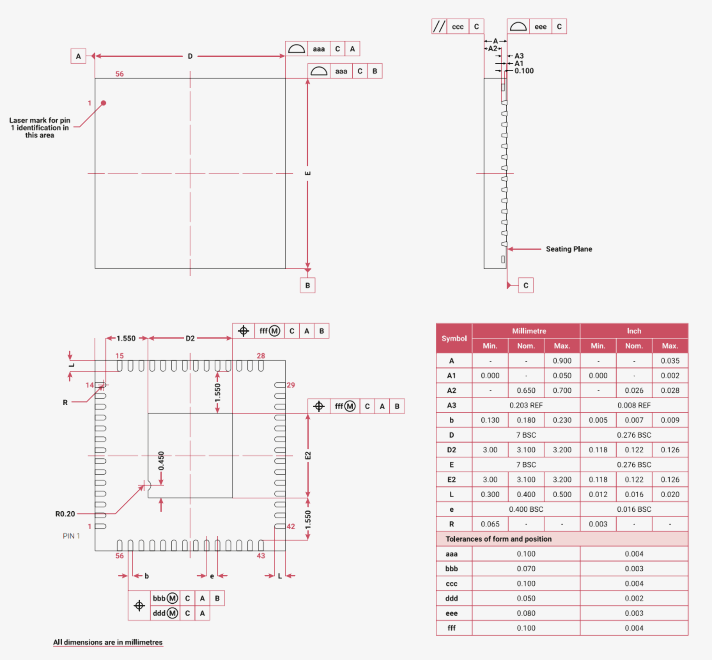
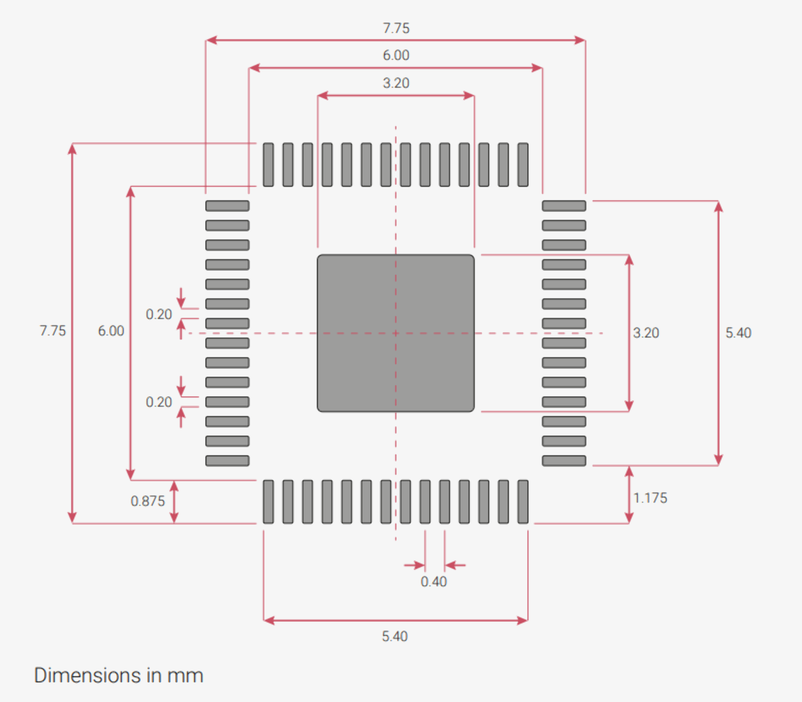

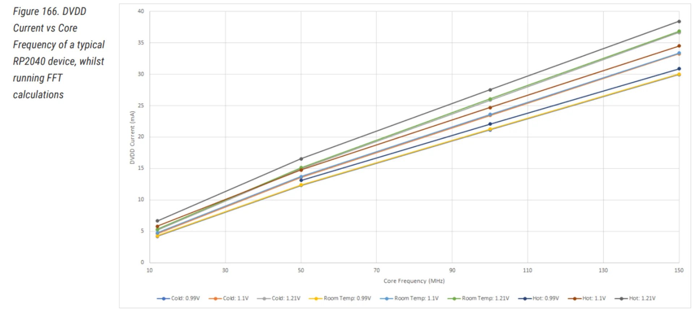

## Comparing boards

The below table is compiled and formatted with Copilot by asking it to add a column based on the data copied from the specifications of the boards and while I found nothing wrong with a quick check, be advised that some information might not be fully accurate or in the right place. Due to good experiences with XIAOs, I decided to compare mostly them with an Attiny and a smaller SAMD board for reference.

| Feature | [XIAO RP2040](https://wiki.seeedstudio.com/XIAO-RP2040/) | [XIAO SAMD21](https://wiki.seeedstudio.com/Seeeduino-XIAO/) | [XIAO ESP32S3 (Sense)](https://wiki.seeedstudio.com/XIAO-ESP32S3-Sense/) | [ATSAMD11C14A-SSUT](https://www.digikey.com/en/products/detail/microchip-technology/ATSAMD11C14A-SSUT/5226470) | [ATTINY412-SSN](https://www.digikey.fi/en/products/detail/microchip-technology/ATTINY412-SSN/9947540) |
|---------|--------|-----------|-------------|----------------------|-------------|
| CPU | Dual-core ARM Cortex M0+ processor up to 133MHz | ARM Cortex-M0+ CPU(SAMD21G18) running at up to 48MHz | ESP32-S3R8 Xtensa LX7 dual-core, 32-bit processor running at up to 240 MHz | ARM® Cortex®-M0+ 32-Bit Single-Core running at 48MHz | AVR 8-Bit |
| Flash Memory | 2MB | 256KB | 8MB Flash onboarding SD Card Slot, supporting 32GB FAT | 16KB (16K x 8) | 4KB (4K x 8) |
| SRAM | 264KB | 32KB | 8M on-chip PSRAM | 4K x 8 | 256 x 8 |
| Digital I/O Pins | 11 | 11 | 11 | 12 | 6 |
| Analog I/O Pins | 4 | 11 | 9 | A/D 5x12b | A/D 6x10b |
| PWM Pins | 11 | - | 11 | - | - |
| I2C interface | 1 | 1 | 1 | 1 | 1 |
| SPI interface | 1 | 1 | 1 | 1 | 1 |
| IIC interface | - | - | 1 | - | - |
| IIS interface | - | - | 1 | - | - |
| UART interface | 1 | 1 | 1 | 1 | 1 |
| Power supply and downloading interface | Type-C | Type-C | Type-C | - | - |
| Power | 3.3V/5V DC | 3.3V/5V DC | 5V | 1.62V ~ 3.63V | 1.8V ~ 5.5V |
| Dimensions | 20×17.5×3.5mm | 20×17.5×3.5mm | 21 x 17.5mm | - | - |
| Price | 4.98€ | 4.98€ | 12.89€ | 1.46€ | 0.52€ |
| QTouch | - | 7 (A0,A1,A6,A7,A8,A9,A10) | - | - | - |
| Wireless | - | - | Complete 2.4GHz Wi-Fi subsystem, BLE: Bluetooth 5.0, Bluetooth mesh | - | - |
| Built-in Sensors | - | - | OV2640 camera sensor for 1600*1200, Digital microphone | - | - |
| Working Temperature | - | - | -40°C ~ 65°C | -40°C ~ 85°C (TA) | -40°C ~ 105°C (TA) |

The board I made during week 6 and programmed this week was the powerful XIAO RP2040 but the XIAO SAMD21 looks very promising for my final project due to its QTouch functionality, although it is otherwise less capable than the RP2040 in terms of performance and memory.

Unlike the XIAO development boards, the D11C and the ATtiny are only chips, making them much smaller and cheaper, but also meaning that they cannot be programmed directly from a laptop or PC and require a programmer board instead. Programmer boards can be created with other programmer boards by flashing certain code on them with software such as [EDBG](https://taradov.com/bin/edbg/). [Here](https://gitlab.fabcloud.org/pub/programmers/getting-started) is a tutorial for programming boards and chips with two types of interfaces: the [Universal Program and Debug Interface (UPDI)](https://gitlab.fabcloud.org/pub/programmers/getting-started/-/tree/main/Prog_UPDI_D11C) and the [Serial Wire Debug (SWD)](https://gitlab.fabcloud.org/pub/programmers/getting-started/-/tree/main/Prog_SWD_D11C). While the tutorial is mostly sufficiently detailed, we were advised to remember to power on both boards by having them the right way around in the USB connectors and to rename the EDBG executable to `edbg.exe` and to either put it in the `/bin` folder for global use or to make sure we were always in the correct directory, where we would have to call it using `./edbg` on Windows.

A great resource for programmers can be found [here](https://gitlab.fabcloud.org/pub/programmers).

## Programming the Seeed Studio XIAO RP2040

The [Seeed Studio XIAO RP2040](https://wiki.seeedstudio.com/XIAO-RP2040/) is a powerful development board compatible with MicroPython, Arduino and CircuitPython, that is just a bit larger than a thumbnail. It has the dual-core RP2040 processor, extensively discussed above, running at up to 133 MHz with 264KB of SRAM and 2MB of on-board Flash memory. There are a total of 14 General Purpose Input/Output (GPIO) pins, 11 of which are digital, 4 of which analog, 11 of which supporting PWM, and one of each of the following interfaces: Inter-Integrated Circuit ( I2C / IIC ), Universal Asynchronous Receiver-Transmitter (UART), Serial Peripheral Interface (SPI) and an SWD Bonding pad.

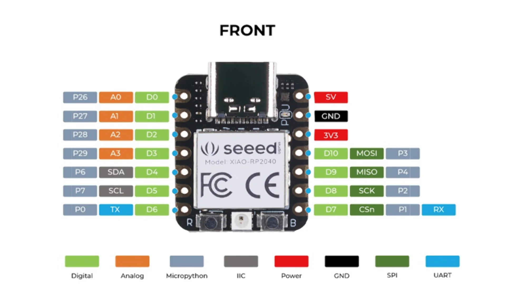

A list for software pin definitions can be found [here](https://mycourses.aalto.fi/pluginfile.php/2228725/mod_resource/content/2/pins_arduino.h).

The XIAO RP2040 board operates at a working voltage of 3.3V but can be powered with 5V via VIN-PIN and 5V-PIN, which will be changed to 3.3V by the built-in DC-DC converter circuit. GPIO pins can only handle input of 3.3V and may cause the chip damage upon receiving anything higher. Do not connect to Type-C while a battery is connected.

### Testing the board

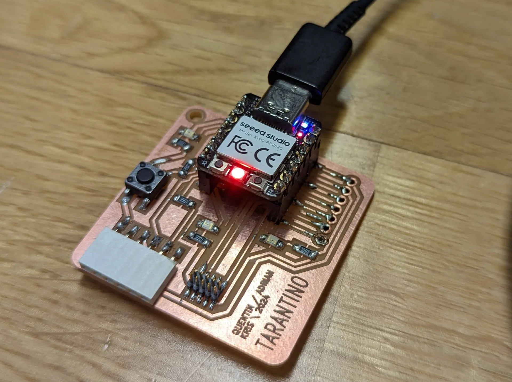

The board I am using is the [XIAO RP2040](https://wiki.seeedstudio.com/XIAO-RP2040/)-equipped "[Tarantino](https://gitlab.fabcloud.org/pub/programmers/tarantino)" board that I made during [week 6]() based on the files [here](https://gitlab.fabcloud.org/pub/programmers/tarantino). I already tested it then using the `hello_tarantino.ino` code found [here](https://gitlab.fabcloud.org/pub/programmers/tarantino/-/blob/main/Arduino/hello_tarantino/hello_tarantino.ino?ref_type=heads) as documented in [Electronics Production](https://digital-fabrication-portfolio-miro-keimioniemi-a2f2c11a6e705b8f.gitlab.io/p/electronics-production/#testing). However, it only used one of the LEDs. To make sure all of the onboard LEDs work properly, I wrote a quick, simple program in Arduino IDE to cycle through the LEDs in response to button presses.

Similarly to the ["Testing" section](https://digital-fabrication-portfolio-miro-keimioniemi-a2f2c11a6e705b8f.gitlab.io/p/electronics-production/#testing) in [week 6 Electronics Production](), I opened Arduino IDE, chose the board and uploaded the [hello_tarantino code](https://gitlab.fabcloud.org/pub/programmers/tarantino/-/blob/main/Arduino/hello_tarantino/hello_tarantino.ino?ref_type=heads) onto it, which resulted in the LED turning on and off in response to a button press.

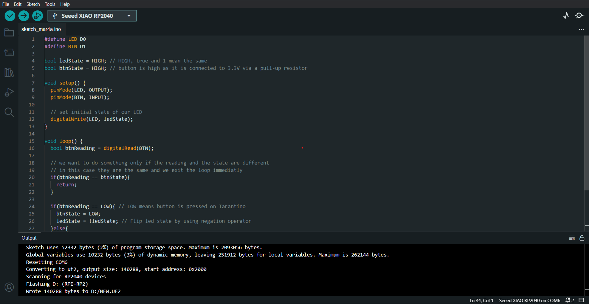

I then figured out which pins control which LED by going back to week 6 documentation and inspecting the [screenshot of `Tarantino-F_Cu.gbr` open in CopperCAM](https://digital-fabrication-portfolio-miro-keimioniemi-a2f2c11a6e705b8f.gitlab.io/p/electronics-production/#setting-up-using-coppercam). Below is a list of which XIAO pin corresponds to which LED from left to right when viewing the board directly from above so that the "Seeed Studio" on the XIAO board is horizontally positioned:

- LED 1 - D0
- LED 2 - D6
- LED 3 - D7

When testing them out by redefining the LED variable in the code as each one, one at a time, I noticed that LED 2 did not work. Initially I thought it might be either a defective component or either one of the bit rougher looking solders. I nevertheless wrote the below program with the assumption that all three LEDs would work, because I assumed that I could fix the board the next day.

I modified the `hello_tarantino.ino` code into the one below by defining all of the LEDs and setting their states based on a switch statement that rotates the lit LED by incrementing the `int targetLED` variable and taking its modulo 3 to create the three cases every time the button is pressed.

```C
#define LED1 D0
#define LED2 D6
#define LED3 D7
#define BTN D1

bool led1State = HIGH; // HIGH, true and 1 mean the same
bool led2State = HIGH;
bool led3State = HIGH;

int targetLED = 0;

bool btnState = HIGH; // button is high as it is connected to 3.3V via a pull-up resistor

void setup() {
  pinMode(LED1, OUTPUT);
  pinMode(LED2, OUTPUT);
  pinMode(LED3, OUTPUT);
  pinMode(BTN, INPUT);

  // set initial state of LEDs
  digitalWrite(LED1, led1State);
  digitalWrite(LED2, led2State);
  digitalWrite(LED3, led3State);
}

void loop() {
  bool btnReading = digitalRead(BTN);

  // we want to do something only if the reading and the state are different
  // in this case they are the same and we exit the loop immediatly
  if(btnReading == btnState){
    return; 
  }
 
  if(btnReading == LOW){ // LOW means button is pressed on Tarantino
    btnState = LOW;
    targetLED++;

    switch(targetLED % 3){
      case 0: 
        led1State = LOW;
        led2State = LOW;
        led3State = HIGH;
        break;
      case 1: 
        led1State = HIGH;
        led2State = LOW;
        led3State = LOW;
        break;
      case 2: 
        led1State = LOW;
        led2State = HIGH;
        led3State = LOW;
        break;
    }
  }else{
    btnState = HIGH;
  }

  digitalWrite(LED1, led1State);
  digitalWrite(LED2, led2State);
  digitalWrite(LED3, led3State);
  delay(10);
}
```

The define statements in the beginning map the digital pins to the `LEDx` and `BTN` [macros](https://www.geeksforgeeks.org/macros-and-its-types-in-c-cpp/). The boolean `ledxState`s are all set to `HIGH` (= `true` = `1`) initially in order to quickly verify at a glance that all the LEDs work. The `targetLED` variable is initialized at zero and `btnState` is identified initially as `HIGH` due to the design of the circuit.

Inside the `void setup()` function, which initializes the program, the pins are configured with their roles with the `pinMode()` function and the LEDs are initially turned on using `digitalWrite()` with the arguments for pins and the output, which in this case holds `HIGH` / `true` / `1` as defined above.

After the initialization, the program enters the main loop with `void loop()`, which is repeatedly called by the processor. It continuously scans the button state by reading the `BTN` pin's value with `digitalRead()` into the `btnReading` variable and comparing it with `btnState`. If no change is detected, the function returns, skipping over the rest of the code within the function until a change is detected. When `LOW` is encountered in `btnReading`, the program sets `btnState` to `LOW` and increments the integer value in the `targetLED` variable by one. 

The `switch(targetLED % 3)` statement checks for the remainder after dividing the value of `targetLED` by 3 and changes the values of the `ledxState` variables in a manner which appears to rotate the light on the board by one increment every time the button is pressed. A small memory optimization, especially with more cases would be to set all of them to `LOW` before and only use the `switch` statement for setting one of them to `HIGH` but this is arguably clearer.

If the `btnReading` changed but to `HIGH` instead of `LOW`, such as when releasing the press, the `btnState` is updated to `HIGH` but nothing else is done. Finally, the LEDs are turned on or off by setting the pins to 1s and 0s with `digitalWrite` and the updated states. The function is delayed for 10 milliseconds, doing nothing before it is called again by the processor.



The next day I went to the lab to resolder the lower quality solders with no effect. I even changed the LED component to see if it were faulty by lifting it with tweezers while pushing down with the hot solder iron on the solder and pad and soldering another LED in its place as described in [week 6 documentation](https://digital-fabrication-portfolio-miro-keimioniemi-a2f2c11a6e705b8f.gitlab.io/p/electronics-production/#soldering). It still did not work. I then tried running the above program on the reference board but it did not work with that either. 

Upon further inspection of the design files, we figured it out with [Thanh Vo](https://0nitfans.com/) that the third LED is actually not attached to ground. I had noticed this already upon my first inspection but I had just assumed that the routing would occur inside the connector component. It appears to not have been the case after all and due to the lacking documentation of the Tarantino board, it is not obvious if this is intended or not. It might be intentional, so that it signals of a successful connection or it might just be that it was forgotten in the design phase. Without intention it is difficult to tell. The LED and the program were verified to be working by connecting the second pin on the lower row of the connector to ground, which resulted in it successfully lighting up. As the board was fully functional to the extent it was designed, I decided to forego the third LED and adapt my programs for two and the one RGB LED mounted on the XIAO RP2040.

### PlatformIO

[PlatformIO](https://platformio.org/) is a plugin, most commonly used as a [VS Code extension](https://marketplace.visualstudio.com/items?itemName=platformio.platformio-ide), that provides a wide variety of more advanced features over the simpler Arduino IDE. These include an integrated debugger, unit testing, static code analysis, continuous integration, increased flexibility and most importantly to me, all VS Code's benefits such as autocompletion, copilot and the extensions ecosystem. Not only is it much more advanced but also more broad as well, it supports 40+ platforms, 20+ frameworks, Arduino being just one of them, 1500+ boards and 13000+ libraries. For a quick introduction, check out [this video](https://www.youtube.com/watch?v=PYSy_PLjytQ). With all of that, one would naturally expect it to be relatively straightforward to start programming with it in a plug-and-play manner but this was not the case for me.

Installing PlatformIO was straightforward enough. I just had to click on the "Extensions" tab in VS Code, search for "PlatformIO" and click install. That is where the straightforwardness mostly ended. If you are lucky and your board is among one of the directly supported boards, starting development is as easy as clicking on the PlatformIO logo on the VS Code side panel and navigating to "PIO Home" > "Open", clicking "New Project" and giving it a name as well as searching and selecting the board to be used. This automatically selects a supported framework, which, depending on the board, can also be changed. Then either use the default location at `C:\Users\[user]\Documents\PlatformIO\Projects` or navigate to another location and click "Finish". When creating the first project, this may take multiple minutes but it is almost instantaneous afterwards.

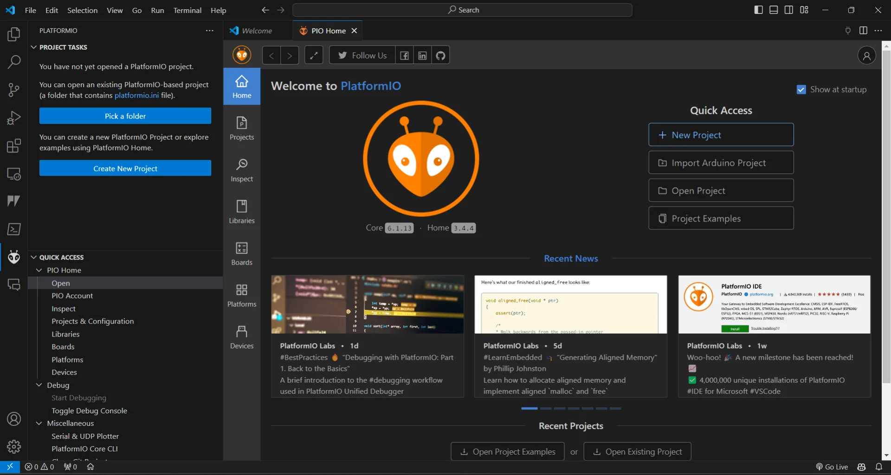

The Seeed Studio XIAO RP2040 board obviously did not appear on the list. Luckily, after a while of searching, I found [Hiroe Takeda's documentation](https://fabacademy.org/2023/labs/kitakagaya/students/hiroe-takeda/assignments/week04/2.xiao_RP2040/) from 2023, which contained a link to a GitHub repository for the [RP2040 development platform](https://github.com/maxgerhardt/platform-raspberrypi) for PlatformIO, which could be added by going to "Platforms" > "Advanced Installation", pasting in the GitHub link: [https://github.com/maxgerhardt/platform-raspberrypi](https://github.com/maxgerhardt/platform-raspberrypi) and clicking "Install", which soon gives an overly lengthy success message. However, I have clearly gotten away with everything working a bit too smoothly in terms of the course for a bit too long now and the universe decided to throw me a real curveball. That is, creating a new project would consistently and reliably fail after a few minutes of waiting each time. Funnily enough, opening `arduino-blink` from "Project Examples" gave me a bit of false hope by opening the workspace but trying to build or upload the code ultimately resulted in the same terminal output and failure.

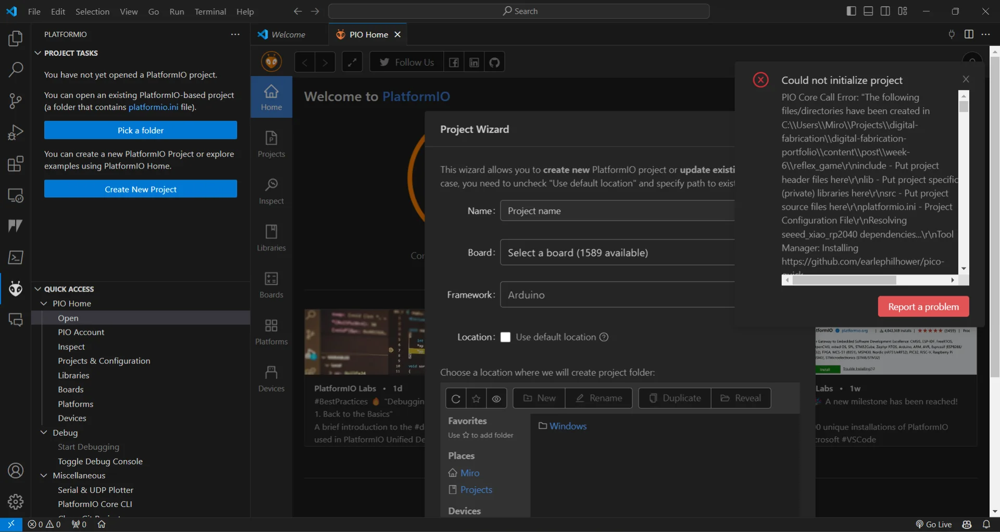

Unfortunately I did not scroll to the bottom of the terminal output for the screenshot but it said that it could not clone the plaform-raspberrypi repository because of a too long filename(/path). I have bumped into this issue on Windows before but in those cases it was easier to just shorten the filenames or move the file using, for example, PowerShell. I found [this article](https://helpdeskgeek.com/how-to/how-to-fix-filename-is-too-long-issue-in-windows/) about how to make Windows accept long paths by setting the `LongPathsEnabled` variable to 1 at `Computer\HKEY_LOCAL_MACHINE\SYSTEM\CurrentControlSet\Control\FileSystem` in Registry Editor, which can be accessed by pressing `Windows + R`, typing "regedit" and clicking "OK". However, this did not work either - alone at least. From Windows 10 onwards, the maximum path length limitation has been removed, as mentioned [here](https://learn.microsoft.com/en-us/windows/win32/fileio/maximum-file-path-limitation?tabs=registry), but one must opt into this with the above method. Even though it did not work, it should not cause problems either and so I left it on.

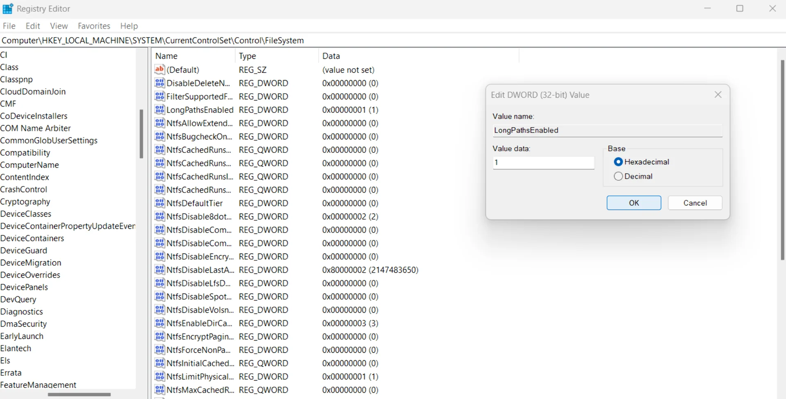

After hours of more research and multiple laptop restarts, I found the following git command on [StackOverflow](https://stackoverflow.com/questions/22575662/filename-too-long-in-git-for-windows): `git config --system core.longpaths true`. Running GitBash as an administrator and running the command enabled me to finally successfully start a new XIAO RP2040 project on PlatformIO. I made sure to set `core.longpaths` back to `false` immediately afterwards due to potential drawbacks of having it on that were discussed under the most upvoted answer. Judging from the number of upvotes, the problem is quite common and perhaps it was then good to discover and document it at this point. I am not certain whether this alone fixed the issue or whether the previous step in regex was also necessary, but the important thing is that it finally worked.

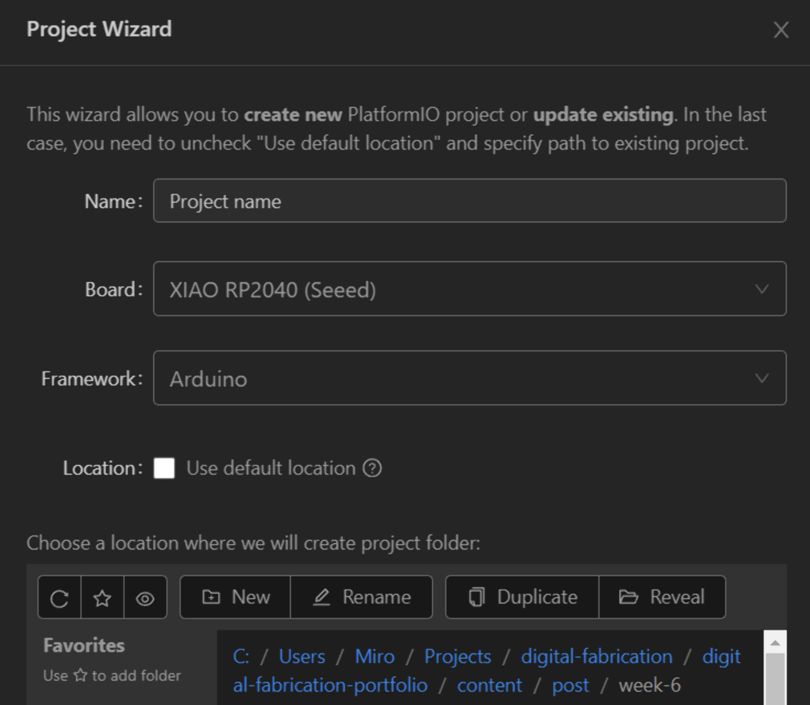

I created a new project within this weeks folder ("week-6" for week 8 because week 1-3 was called "week-1" and I have stuck to that due to fear of refactoring), copied the code in the testing session to `main.cpp` under `src` and made sure to include the Arduino header with `#include <Arduino.h>` on line 1 as due to PlatformIOs generality, this was no longer automatic. I then built and uploadedd the code onto the board, where it worked just as previously. The upload feels a bit slower when compared to Arduino IDE but otherwise it is just as simple, if not more satisfying due to richer terminal feedback.

To test the NeoPixel RGB LED, I added the FastLED library to the project via the "Libraries" tab by searching for "[FastLED](https://fastled.io/docs/)", which is a very intuitive and powerful library for easily controlling RGB LEDs that I found when creating the [Networking Bracelet prototypes](https://www.linkedin.com/posts/miro-keimi%C3%B6niemi_now-that-school-is-over-for-the-year-ill-activity-7143994838173089792-r3KP?utm_source=share&utm_medium=member_desktop). I added it to the project by clicking "Add to Project", selecting the right project in the right place and clicking "Add", which added the line `lib_deps = fastled/FastLED@^3.6.0` to the `platformio.ini` configuration file.

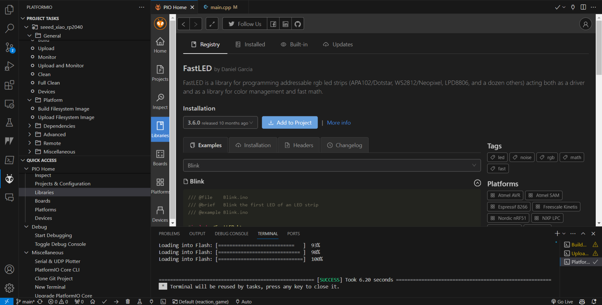
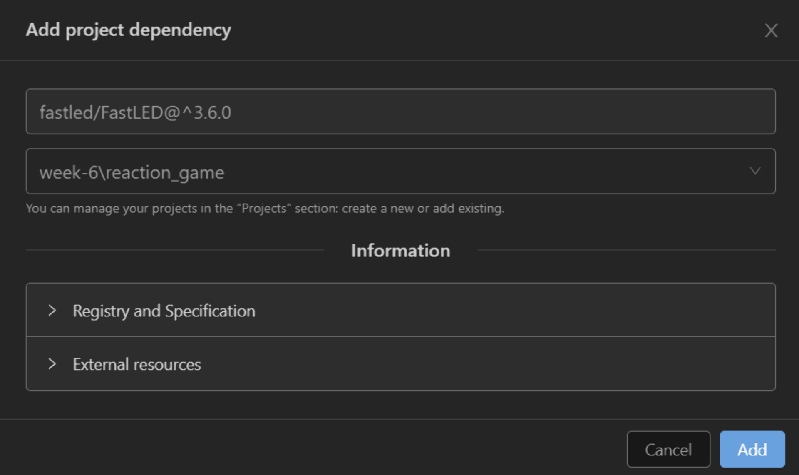

I adapted the [FastLED Blink example](https://fastled.io/docs/_blink_8ino-example.html) with Copilot's help for the RP2040 by setting the number of LEDs to 1 and same for the brightness (out of 255), due to how ridiculously bright it gets. The LED also needs to have a power pin toggled on, which I defined and set to `HIGH`, but otherwise the below code is mostly the same, except for the addition of the `#include <Arduino.h>` statement and the removal of redundant LED types.

```C
#include <Arduino.h>
#include <FastLED.h>

#define NUM_LEDS 1
#define BRIGHTNESS 1

CRGB leds[NUM_LEDS];

void setup() { 
    FastLED.addLeds<NEOPIXEL, PIN_NEOPIXEL>(leds, NUM_LEDS);
    FastLED.setBrightness(BRIGHTNESS);
    pinMode(NEOPIXEL_POWER, OUTPUT);
    digitalWrite(NEOPIXEL_POWER, HIGH);
}

void loop() { 

  leds[0] = CRGB::Red;
  FastLED.show();
  delay(500);

  leds[0] = CRGB::Black;
  FastLED.show();   
  delay(500);
  
}
```

Having gotten it to work too, I then quickly modified the earlier code to use the NeoPixel RGB LED instead of the unconnected LED by replacing it with the `NEOPIXEL_POWER` pin, making the RGB LED orange with `leds[0] = CRGB::Orange` and refreshing the LED with `FastLED.show()` at the end of each loop. I also turned off the R, G and B LEDs in the corner by setting them to `HIGH` - a quirk of XIAO's. `LOW` turns them on and `HIGH` off.

```C
#include <Arduino.h>
#include <FastLED.h>

#define LED1 D0
#define LED2 NEOPIXEL_POWER
#define LED3 D7
#define BTN D1
#define NUM_LEDS 1
#define NEOPIXEL_BRIGTHNESS 2

CRGB leds[NUM_LEDS];

bool led1State = HIGH; // HIGH, true and 1 mean the same
bool led2State = HIGH;
bool led3State = HIGH;

bool btnState = HIGH; // button is high as it is connected to 3.3V via a pull-up resistor

int targetLED = 0;

void setup() {

  FastLED.addLeds<NEOPIXEL, PIN_NEOPIXEL>(leds, NUM_LEDS);
  FastLED.setBrightness(NEOPIXEL_BRIGTHNESS);

  pinMode(PIN_LED_R, OUTPUT);
  pinMode(PIN_LED_G, OUTPUT);
  pinMode(PIN_LED_B, OUTPUT);
  pinMode(LED1, OUTPUT);
  pinMode(LED2, OUTPUT);
  pinMode(LED3, OUTPUT);
  pinMode(BTN, INPUT);

  // set initial state of LEDs
  digitalWrite(PIN_LED_R, HIGH);
  digitalWrite(PIN_LED_G, HIGH);
  digitalWrite(PIN_LED_B, HIGH);

  digitalWrite(LED1, led1State);
  digitalWrite(LED2, led2State);
  digitalWrite(LED3, led3State);

  leds[0] = CRGB::Orange;
  FastLED.show();
}

void loop() {
  bool btnReading = digitalRead(BTN);

  // we want to do something only if the reading and the state are different
  // in this case they are the same and we exit the loop immediatly
  if(btnReading == btnState){
    return; 
  }
 
  if(btnReading == LOW){ // LOW means button is pressed on Tarantino
    btnState = LOW;
    targetLED++;

    switch(targetLED % 3){
      case 0: 
        led1State = LOW;
        led2State = LOW;
        led3State = HIGH;
        break;
      case 1: 
        led1State = HIGH;
        led2State = LOW;
        led3State = LOW;
        break;
      case 2: 
        led1State = LOW;
        led2State = HIGH;
        led3State = LOW;
        break;
    }
  }else{
    btnState = HIGH;
  }

  digitalWrite(LED1, led1State);
  digitalWrite(LED2, led2State);
  digitalWrite(LED3, led3State);
  delay(10);
  FastLED.show();
}
```

Below is the result: the RGB orange is not even near the other LEDs' orange but I could not bother trying to match them with trial and error at 1am anymore.



I then opened a new file and created a reaction time game, the code for which is shown below. The idea is to improve the players' reflexes by forcing them to overcome their previous best reaction time for, in this case, five times in a row. The game is entirely configurable, however, meaning that this, along with many other features, can be changed by altering the single `WIN_COUNT` variable. Below is the code for the game, which is explained both in the comments as well as below.

```C
#include <Arduino.h>
#include <FastLED.h>

// Decoy LED pin
#define D_LED D0

// Win LED pin
#define W_LED D7

// Neopixel feedback LED configuration
#define FEEDBACK_LED PIN_NEOPIXEL
#define NEOPIXEL_BRIGHTNESS 2
#define NUM_LEDS 1
CRGB leds[NUM_LEDS];

// Button pin
#define BTN D1

// Maximum button press delay value in ms
#define MAX_DELAY 600
// Lower bound for random delay in ms
#define RANDOM_DELAY_LOW 500
// Upper bound for random delay in ms
#define RANDOM_DELAY_HIGH 5000

// Number of successes required to win
#define WIN_COUNT 5

// Number of failure required to lose
#define LOSS_COUNT 5

// LED states
bool w_LED_state = LOW;
bool d_LED_state = LOW;

// Button state (connected to 3.3V via a pull-up resistor)
bool btnState = HIGH;

// Game variables
unsigned long time_taken;
unsigned long best_time = ULONG_MAX;
int victory_count = 0;
int failure_count = 0;

// Function to measure time until button press
// Waits for delay_time milliseconds and returns the time taken to press 
// the button or the delay time given as an input, whichever is smaller
unsigned long timeUntilButtonPress(int delay_time) {
  unsigned long startTime = millis();
  while (digitalRead(BTN) == HIGH) {
    if (millis() - startTime > delay_time) {break;}
  }
  unsigned long endTime = millis();
  return endTime - startTime;
}

void setup() {

  // Initialize serial communication at 115200 baud
  Serial.begin(115200);

  // Neopixel setup
  FastLED.addLeds<NEOPIXEL, FEEDBACK_LED>(leds, NUM_LEDS);
  FastLED.setBrightness(NEOPIXEL_BRIGHTNESS);
  pinMode(NEOPIXEL_POWER, OUTPUT);
  digitalWrite(NEOPIXEL_POWER, HIGH);
  delay(10);

  // Map pins
  pinMode(W_LED, OUTPUT);
  pinMode(D_LED, OUTPUT);
  pinMode(PIN_LED_R, OUTPUT);
  pinMode(PIN_LED_G, OUTPUT);
  pinMode(PIN_LED_B, OUTPUT);
  pinMode(BTN, INPUT);

  // Set initial LED states
  digitalWrite(PIN_LED_R, HIGH);
  digitalWrite(PIN_LED_G, HIGH);
  digitalWrite(PIN_LED_B, HIGH);

  digitalWrite(W_LED, w_LED_state);
  digitalWrite(D_LED, d_LED_state);

  // Visual countdown for player to get ready
  leds[0] = CRGB::Red;
  FastLED.show();
  delay(1000);

  leds[0] = CRGB::Yellow;
  FastLED.show();
  delay(1000);

  leds[0] = CRGB::Green;
  FastLED.show();
  delay(1000);

  leds[0] = CRGB::Black;
  FastLED.show();
}

void loop() {

  // Random delay before one of the LEDs turns on
  int random_delay = random(RANDOM_DELAY_LOW, RANDOM_DELAY_HIGH);
  time_taken = timeUntilButtonPress(random_delay);
  // If the button is pressed before the target LED lights up, the
  // feedback LED flashes red and the player gets a failure point
  if (time_taken < random_delay) {
    Serial.println("Too early!");
    leds[0] = CRGB::Red;
    FastLED.show();
    delay(MAX_DELAY);
    leds[0] = CRGB::Black;
    FastLED.show();
    failure_count++;
  }

  // Randomly selects one of the LEDs to turn on after the random delay time
  switch (random(0, 2))
  {
  case 0:
    // Turn on the decoy LED and wait if a button press is detected while it is on
    d_LED_state = HIGH;
    digitalWrite(D_LED, d_LED_state);
    time_taken = timeUntilButtonPress(MAX_DELAY);
    d_LED_state = LOW;
    digitalWrite(D_LED, d_LED_state);
    // If the button is pressed while the decoy LED is on, the feedback 
    // LED flashes red and the player gets a failure point
    if (time_taken < MAX_DELAY) {
      Serial.println("Wrong LED!");
      leds[0] = CRGB::Red;
      FastLED.show();
      delay(MAX_DELAY);
      leds[0] = CRGB::Black;
      FastLED.show();
      failure_count++;
    }
    break;
  case 1:
    // Turn on the target LED and wait if a button press is detected while it is on
    w_LED_state = HIGH;
    digitalWrite(W_LED, w_LED_state);
    time_taken = timeUntilButtonPress(MAX_DELAY);
    w_LED_state = LOW;
    digitalWrite(W_LED, w_LED_state);
    // If the button is pressed while the target LED is on and faster than the previous time, 
    // the feedback LED flashes green and the player gets a victory point
    if (time_taken < best_time && time_taken < MAX_DELAY) {
      // Prints the new best time taken to press the button and the previous best time if it exists
      Serial.print("New best time_taken: " + String(time_taken) + "ms"); if (best_time != ULONG_MAX) {Serial.print(" (previous best: " + String(best_time) + "ms)");} Serial.println();
      best_time = time_taken;
      leds[0] = CRGB::Green;
      FastLED.show();
      delay(MAX_DELAY);
      leds[0] = CRGB::Black;
      FastLED.show();
      victory_count++;
      // If the button is pressed while the target LED is on but slower than the previous time,
      // the feedback LED flashes yellow and the player gets a message to keep trying
    } else {
      // Prints the keep on trying message and the current best time if it exists
      Serial.print("keep on trying!"); if (best_time != ULONG_MAX) {Serial.print(" (Current best time: " + String(best_time) + "ms)");} Serial.println();
      leds[0] = CRGB::Yellow;
      FastLED.show();
      delay(MAX_DELAY);
      leds[0] = CRGB::Black;
      FastLED.show();
    }
  }  

  // If the player has WIN_COUNT victory points, they win the game, indicated 
  // by the final scoreboard and green LEDs that stay on
  if (victory_count >= WIN_COUNT) {
    Serial.println("You win with a score of " + String(victory_count) + " victories and " + String(failure_count) + " failures!");
    digitalWrite(PIN_LED_G, LOW);
    leds[0] = CRGB::Green;
    FastLED.show();
    delay(ULONG_MAX);
  }

  // If the player has LOSS_COUNT failure points, they lose the game, indicated
  // by the final scoreboard and red LEDs that stay on
  if (failure_count >= LOSS_COUNT) {
    Serial.println("You lose with a score of " + String(victory_count) + " victories and " + String(failure_count) + " failures!");
    digitalWrite(PIN_LED_R, LOW);
    leds[0] = CRGB::Red;
    FastLED.show();
    delay(ULONG_MAX);
  }

  delay(10);
}
```

As already mentioned, the point of the game is to improve your reflexes by having to overcome yourself consecutively for five times in order to win. When started, the game gives a visual countdown with the RGB LED and starts soon after it flashes green. It then flashes either the target LED or a decoy LED at random intervals ranging from 0.5 to 5 seconds. 

The player has to react to the target LED flashing by quickly pressing the button. If they did this in under `MAX_DELAY` and faster than their previous best (or `ULONG_MAX` denoting a very large long number in the case of the first press), they get a point, which is indicated by the RGB LED flashing green and a message in the Serial terminal with the new best time. If they fail to press the button faster, the RGB LED will flash yellow and neither positive nor negative points are given. 

If, however, the player presses the button when they are not supposed to, i.e. when either the decoy LED is on or no LED is on, they get a strike, 5 of which lead to failure in the current configuration. A failure is indicated by the on-board LEDs turning semi-permanently red and victory is indicated similarly but with green. In order to start a new game, just press the reset button on the lower left corner of the XIAO board, denoted by "R".

 Below is a video of me playing the game and eventually deliberately losing in order to show all message variants and to not make the video too long.



[Rosa](https://www.linkedin.com/in/rosa-linke/) actually managed to beat the game by covering the decoy LED and getting predictively lucky a couple of times on top of her blazing fast reaction time. This once more demonstrates the importance of having playtesters!

Overall, once I finally got it working, the development experience with PlatformIO was vastly superior to Arduino IDE mostly thanks to the very capable autofill function and copilot suggestions that knew to, for example, invert the actions and flash the LED as red upon failure cases after writing a success case, and helped generate the comments a lot faster.

In addition, the ability to create multiple cursors with `Shift + Alt + Mouse left click` and to select text in multiple places at once with `Ctrl + D`, making for a much swifter workflow (I am not sure if Arduino IDE has these but the shortcuts at least are not the same to which I have now gotten highly accustomed to). The ability to select multiple words, variables or sentences in multiple places is made all the more powerful in VS Code by the "Match Case" and "Match Whole Word" options.

### MicroPython

[MicroPython](https://micropython.org/) is a lean implementation of [Python 3](https://www.python.org/) that fits on a chip with 256kB of code space and 16kB of RAM, thus allowing one to do embedded programming with Python instead of C. This is very attractive as Python is a higher level language than C, allowing for a lot more concise code and faster development.

I had heard that MicroPython could be used with VS Code as well and thus first searched for how to do it. I found [this](https://www.youtube.com/watch?v=O6lkYTfcMEg) video but there was no direct tutorial for my specific board and with my little experience with electronics, I have learned to avoid straying too far from the established paths if I want to get something done in a reasonable time interval. Anything and everything is of course possible but I don't yet possess the experience and confidence to go exploring too far beyond on my onw given how often even well documented setups end up not being quite as straightforward as advertised, see [PlatformIO section](https://digital-fabrication-portfolio-miro-keimioniemi-a2f2c11a6e705b8f.gitlab.io/p/embedded-programming/#platformio) above.

PlatformIO support for MicroPython has also been [discussed since 2016](https://github.com/platformio/platformio-core/issues/728) but has not been implemented for 8 years now. There was a direct tutorial for [using MicroPython with the XIAO RP2040](https://wiki.seeedstudio.com/XIAO-RP2040-with-MicroPython/) using [Thonny](https://thonny.org/), however, and so I decided to follow that. 

This process was delightfully straightforward as compared to above. First, simply download and install the recommended version of [Thonny](https://thonny.org/) for your operating system. Second, appreciate the quote in the below screenshot of the finished installer - although I do not necessarily agree with the implication that you should not always have to document your code nevertheless.

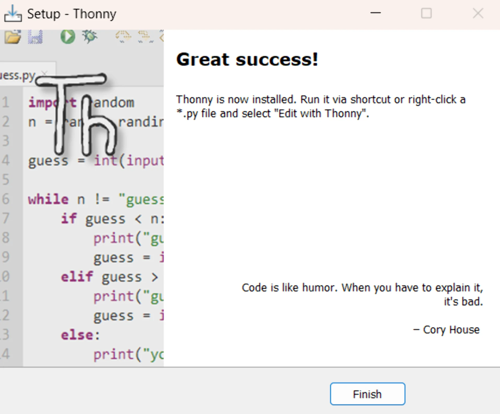

Then, launch Thonny and navigate to "Tools" > "Options" > "Interpreter", choose "MicroPython (Raspberry Pi Pico)" and leave the port as "Try to detect port automatically". Then take the [Seeed Studio XIAO RP2040](https://wiki.seeedstudio.com/XIAO-RP2040-with-MicroPython/) and press and hold the "BOOT" button on the bottom right, labeled with "B", while connecting it to your computer with a USB-C cable. Click "Install or update MicroPython", choose the "Raspberry Pi Pico / Pico H" variant and click "Install". 

Before this, I had to check whether the process was easily reversible for peace of mind and I found out first from [Reddit](https://www.reddit.com/r/esp32/comments/9urif9/remove_micropython_and_factory_reset/) and then from experience that it indeed is: flashing MicroPython onto a board does not remove the original firmware and is thus a safe, reversible operation. When one wants to use something different such as C code with PlatformIO, the board must be connected in bootloader mode (holding "B" button while connecting) for the first time after which it will continue working normally.

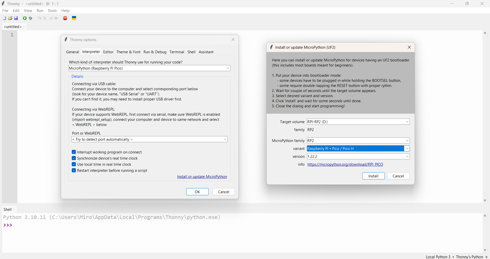

After that, the board is ready for use, which works by writing Python code and clicking the green play icon to "Run current script". I tried out the MicroPython Blink example, which worked nicely immediately. To use the NeoPixel RGB LED requires an additional step of downloading and saving the [ws2812.py library](https://files.seeedstudio.com/wiki/XIAO-RP2040/img/micropython/ws2812.py) onto the board by navigating to "File" > "Save as", selecting "Raspberry Pi Pico" and naming it "ws2812.py".

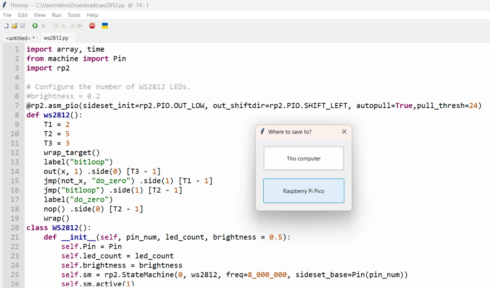
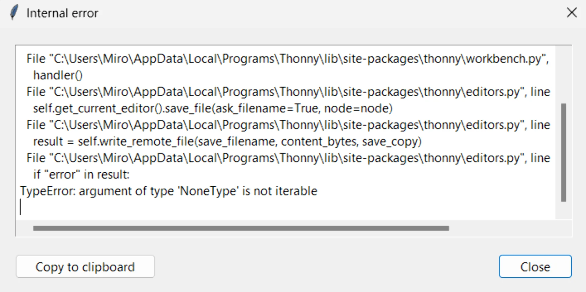

I got a peculiar error at first when trying to save the `ws2812.py` after the upload dialogue being stuck for minutes and then canceling it, but this was fixed by reconnecting the board and restarting Thonny. I then ran the example code and it worked wonderfully, although the LED was once more way too bright for my taste, so I lowered that by adding `0.01` as the third argument to the `WS2812` class instantiation. This was easy to do even in the absence of documentation thanks to the very short and easily readable library that took approximately a minute to figure out in its entirety.

The python scripts can be saved both on board as well as on the computer and they can be similarly run in the REPL environment regardless of where the script is saved. The on-board files can be managed from "File" > "Open" similarly to the ones on the computer.

I then stole the imports and variable definitions from the RGB LED example in the [XIAO RP2040 with MicroPython article](https://wiki.seeedstudio.com/XIAO-RP2040-with-MicroPython/) and wrote the following program that changes the RGB LED color based on textual user input.

```Python
from ws2812 import WS2812
import utime
import machine

# Toggle NEOPIXEL_POWER pin on to power the NeoPixel LED
power = machine.Pin(11,machine.Pin.OUT)
power.value(1)

# Define recognized colors
BLACK = (0, 0, 0)
RED = (255, 0, 0)
YELLOW = (255, 150, 0)
GREEN = (0, 255, 0)
CYAN = (0, 255, 255)
BLUE = (0, 0, 255)
PURPLE = (180, 0, 255)
WHITE = (255, 255, 255)

# Map strings to colors
color_dict = {
    "black": BLACK,
    "red": RED,
    "yellow": YELLOW,
    "green": GREEN,
    "cyan": CYAN,
    "blue": BLUE,
    "purple": PURPLE,
    "white": WHITE
}

# Instantiate the WS2812 class with
# pin_num = PIN_NEOPIXEl, led_count = 1 and brightness = 0.01
led = WS2812(12,1,0.01)

# Create an infinite loop for the body of the program
while True:
    # Wait for serial input and convert it to lowercase
    color = input("Name a color: ").lower()
    # If the given color exists in the dictionary,
    # change the LED color to it and print it
    if color in color_dict:
        led.pixels_fill(color_dict[color])
        led.pixels_show()
        print(f"LED color: {color}")
    else:
        print("Color not recognized.")
```

Below is a video of the program in action.



## Reflections

Having now read a datasheet perhaps a bit too closely (although still nowhere near fully) I will never have to do it again. I learned a lot about how to approach reading one, what is the relevant information and where to find it. I got familiar with the RP2040 architecture specifically but also learned a lot about, for example, I/O communication protocols in general as well. The most relevant data of course depends on the type of the part in question, but for microprocessors they are software compatibility, memory, speed, number, layout and descriptions of pins, types of interfaces, cost and sometimes size. As someone more accustomed to PC parts, I still do need a bit more intuition about what each memory capacity can actually fit.

As for programming, my intense hatred for setting up development environments was yet again enforced further but I did get everything to work in the end and am relatively proud of my minimalistic reaction game. Due to running out of time, I unfortunately did not get to build anything too interesting with MicroPython but I am looking forward to using it more in the future. Thonny is very clean and minimal, which I liked, but the interface is in lightmode by default and it is not nearly as powerful as VS Code, which is a shame. Nevertheless, looking forward to input and output devices weeks!


