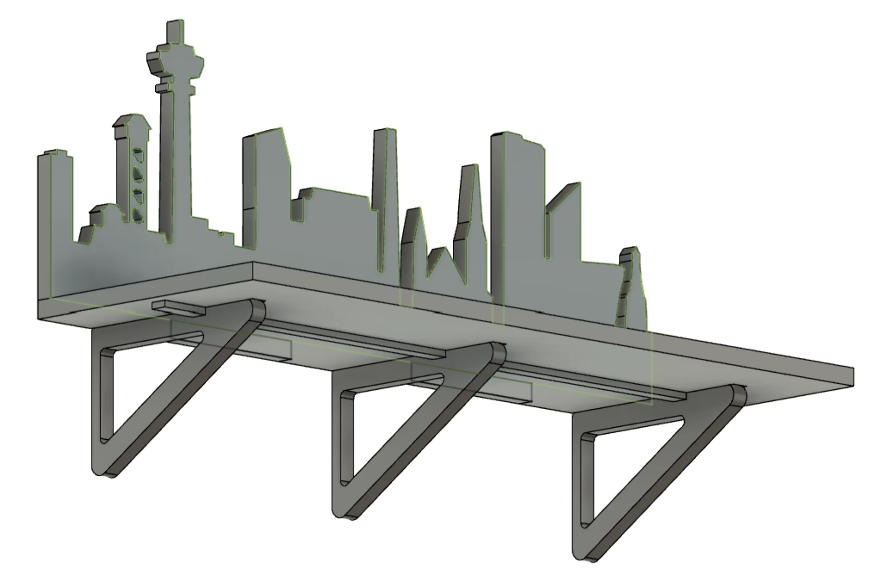

I feel that this week had the highest stakes thus far. Not only could the machine actually kill you, for which there is actual [precedent](https://www.nytimes.com/2011/04/14/nyregion/yale-student-dies-in-machine-shop-accident.html), we were also given a strictly limited 120cm x 120cm x 1.5cm sheet of plywood and our assignment was to create something large, meaning that it could not be easily hidden. This meant that the project had to be large and complex enough to pass the assignment criteria but also something that we genuinely needed and wanted to have in our apartment.

## Assignment

- Document the safety introduction details and general flow of using the machine.
- Make (design+mill+assemble) something big using a 15 mm thick and 120x120 cm big soft plywood sheet.
- Do a fitting test with a simple design first so that your parts are snug fit when assembling them and to avoid spoiling material. You will get one plywood sheet.
- Make sure you choose the right depth of cut (1/2 diameter of tool is safe) and calculate the feed rate (FR = SS * CL * NF) accordingly to avoid breaking the tool.
- Document your process in a new page on your website.

## Design

As the assignment was to make something big at approximately meter-scale as specified on the [Fab Academy page](https://academy.cba.mit.edu/classes/computer_machining/index.html), I had to immediately discard many ideas such as organizer boxes and a stand for our [portable projector](https://us.xgimi.com/products/halo-plus) to mount it on the bedhead. I had to think bigger, which naturally led to seats, tables and bookcases but our apartment was already filled with those. Something which we had talked about for a while now, however, was to get shelves for a corner of our kitchen - shown below - where we could put jars of dried goods in order to gain more storage space and add a bit of color.

Browsed skyline silhouettes of Tampere and Munich with the search "Tampere/Munich skyline" and found these: https://sndp.mediadelivery.fi/img/468/200572301.png, https://image.shutterstock.com/image-vector/munich-skyline-silhouette-black-city-260nw-1890802744.jpg 

also used this as an inspiration https://media.licdn.com/dms/image/C4D16AQHuzMTjrQYcfw/profile-displaybackgroundimage-shrink_200_800/0/1592293143501?e=2147483647&v=beta&t=ZKE729V-MwQuIzHG-s6nCrEIPGbMoybx5kuUVhBlo34

<svg width="100%" height="100%" viewBox="0 0 690 250" xml:space="preserve" xmlns="http://www.w3.org/2000/svg"><g style="display:inline"><path style="fill:var(--pre-text-color)" d="M148 0v20l-11 1-2 6.73L125 29v6l5 10 11 2v6l-6 1v6h6l-2 127c-2.212.18-4.425 0-6.643 0L130 180h-20v-75h2V95h3l-10-10H95L85 95h3v10h2v71h-8v-6h2l-8.864-7h-8L58 170h2c.062 4.354.104 8.648 0 13H50l-5 17H25v-70h-7v-4.239H7V130H-.237v120H690v-60h-6v-10l-1.163-15-1.837-3-3-11c-.973-6.29-2-14.288-2-17.32v-5.941l-4-6-4.153 6-.01 6c0 6-.837 13.261-1.837 17.261-.457 1.827-2 7.61-3 11l-2 3-1.006 15-.157 10H648l5.99-29.527s8.734-20.28 1.01-20.473h-10l-37 2.502v-66l-35 30v38l-5.874.498V55.099l-2.258-1.874-2.258-1.874-10.354-.95-10.354-.948-1.01-1.62-1.01-1.62-8.101-.5-8.1-.5-1.84 1.168L520 47.55V205h-13v-20l-7-5.092V140c-1.026-5.21-2.93-10.081-4.855-15L490 77h-3c-1.48 13.259-4.601 34.631-5 48-2.101 4.863-3.537 9.915-4.96 15v39.43L453 150l-20.806 28.989-.916-28.989-7.254-29.084L417.032 150c-.383 7.702-1.048 47.357-2.032 55h-14l-5-145h-10l-5 120h-6v-50h-8.041L364 120h-63l-3 10h-8v20h-15v-45l-10-30-30 10 .242 60-.242 35h-25v-10.057L198 170v3h-6v-3l-12-.057V162h-18.702L159 60h6v-6l-6-1v-6l11-2 5-10v-6l-10-1.492L163 21l-11-1V0Zm-48 112.957c1.97 0 3.94.095 4.346.282a2.94 2.94 0 0 1 1.463 1.514c.336.805.299 7.849-.046 8.593-.673 1.454-2.592 2.117-4.091 1.414-.736-.344-7.202-6.85-7.482-7.526-.622-1.505.051-3.34 1.466-3.995.405-.188 2.375-.282 4.345-.282m-2.849 16.003c.401.013.802.104 1.177.28.736.344 7.202 6.85 7.482 7.526.622 1.505-.052 3.34-1.466 3.995-.81.375-7.879.375-8.69 0a2.94 2.94 0 0 1-1.463-1.514c-.336-.805-.298-7.849.046-8.593.505-1.09 1.71-1.736 2.914-1.694m2.85 17.997c1.97 0 3.94.095 4.345.282a2.94 2.94 0 0 1 1.463 1.514c.336.805.299 7.849-.046 8.593-.673 1.454-2.592 2.117-4.091 1.414-.736-.344-7.202-6.85-7.482-7.526-.622-1.505.051-3.34 1.466-3.995.405-.188 2.375-.282 4.345-.282m-2.85 16.003c.401.013.802.104 1.177.28.736.344 7.202 6.85 7.482 7.526.622 1.505-.052 3.34-1.466 3.995-.81.375-7.879.375-8.69 0a2.94 2.94 0 0 1-1.463-1.514c-.336-.805-.298-7.849.046-8.593.505-1.09 1.71-1.736 2.914-1.694" transform="translate(.237)"/></g></svg>

<svg width="100%" height="100%" viewBox="0 0 690 230" xml:space="preserve" xmlns="http://www.w3.org/2000/svg"><path style="display:inline;fill:var(--pre-text-color)" d="m629 3-1 22-1 20-2 10v5h-2c-.957.028-2 1.043-2 2 .028 1.042 1.043 1.972 2 2h2v6l-6 2v10l6 2v6h-6v2c2 0 2 3 2 3s0 3-2 3v2c2 0 2 3 2 3s0 3-2 3v2h6l-1 32h-7v28c0 6 6 14 13 14h-22.913v-42L599 136l8.181-4L607 85h-12l-.096-15H587c0 6.927-7 5-7 5V63h-10v2h-6v-2h-11v2h-6v-2h-10v12s-7.08 1.85-7-5h-8l-.009 14.78H510V132l8 4-8 4v7h-41v-20h-6V85l-4-15h-3V60h-2l-1-18s-.885-4.54-2 0l-1 18h-2v10h-3l-4 15v42h-6v20h-37v-3s-2-.199-2-4h-1l-2-20s-.462-2.31-1 0l-2 20h-1c-.084 4.055-2 4-2 4v8h-1s-1 .014-1 1v2c.056 1.042.977 1 .977 1H387v7h-1s-.972.014-1 1v3c.028.986.92 1 .92 1H387v6.915L375 175v-60l-1-40 1-9.81s.013-7.5-5-7.613L366 57l-.744-7s-.094-.215-.224-.241c-.079-.016-.17.035-.262.241l-.77 7-4 .55c-5.012 0-5 7.45-5 7.45-.043 4.01 1.015 6.036 1 10-.046 12.483-.908 27.729-1 40-.033 5.333 0 4.667 0 10h-20v-10l-1-40 1-9.81s.012-7.5-5-7.613L326 57l-.744-7s-.24-.55-.487 0l-.77 7-3.999.55c-5.012 0-5 7.45-5 7.45-.044 4.011 1.015 6.036 1 10-.05 13.5-1.046 26.722-1 40 .068 19.804.077 39.623 0 60h-10v-35c-1.294-1.71 0-3-5.052-5.008L300 135s1.274-2.492 0-5c0 0-1-1-3-1-.415 0-1.056-7.307-2-9-.688-1.233-1.379-1.2-2 0-.282.542-1.472 8.978-2 9-2.552.104-3 1-3 1-.896 1.75-.036 4.726 0 5-1 0-8 0-8-5v-30l-5-.04c-1.952 0-2-4.96-2-4.96V85s-2.043-2.972-5-3V71c-3.363-6.77-2.696-6.564-6 0v11c-2.985.028-5 3-5 3v10s.03 5-2 5h-5c-.006 2.504 0 18.908 0 30 0 5-7 5-8 5 0 0 1.275-2.491 0-5 0 0-1-1-3-1-.415 0-1.056-7.307-2-9-.687-1.232-1.378-1.2-2 0-.281.542-1.472 8.978-2 9-2.552.104-3 1-3 1-1.24 2.421 0 5 0 5-4.956 2.056-5 5-5 5 .048 11.14.225 22.283 0 33.422h-7.096L217 22c.04-1.951-2-2-2-2l-43 .003s-2.04-.034-2 1.997l-.054 146h-7l.054-44h-5v-4h-5v3.783h-5.922L147 77h-9v5h-13V70h-12l-.086 116H106v-11h-4v-27l-3-18-3 18v5.92h-6.033L90 148h-2v-3h-2v-3h-2v-3h-2v-3h-2v-3h-2v-3h-2v-3h-2l-3-33h-1l-3 33h-2l.05 3H63v3h-2v3h-2v3h-2v3h-2v3h-2v3h-2v6h-6v-6l-3-18-3 18v27h-7l.002-43-2.497-9L27 132h-5v-19l1-4-7-22-7 22 1 4v19H5l-2.493-9L0 132v98h690v-40h-19.636v-7.284C680 182 687 175 690 168v-23h-35v-5h-19l-1-32h6v-2c-2-.01-2-3-2-3s0-3.035 2-3.035V98c-2-.019-2-3-2-3s0-3 2-3v-2h-6v-6l6-2V72l-6-2v-6h2c.975 0 2.093-1.025 2.093-2 0-1.042-1-2-2-2H635v-5l-2-10-1-20-1-22c-1-6.743-2 0-2 0"/></svg>

Ondsel files got corrupted 

Starting over in Fusion 360

Imported .obj to blender, downloaded a [plywood texture](https://polyhaven.com/a/plywood), opened example project and replaced sphere with .obj and exported as .glb below. Used X- and Y-scaling of 0.01 for the texture.



Initially 1900, now 2100

Straighten lines in node tool
Gridlines every 1mm + snap to grid by holding down CTRL

Break apart combined path and then make them overlap and union

Created it with 6mm stroke, then exported png, brought back, traced bitmap and then took difference

Ondsel increase grid size from 100 to 1000 lines

svg does not scale right in Fusion 360 and it kept crashing. Ondsel better

Ondsel betrayed me

Switched back to Fusion with scaling of Tampere: 3.778233, Munich: 3.7795275

fusion constraints are better

Inkscape break path and join

Fix dxfs by deleting overlapping lines, joining the rest to form a closed shape etc etc.

