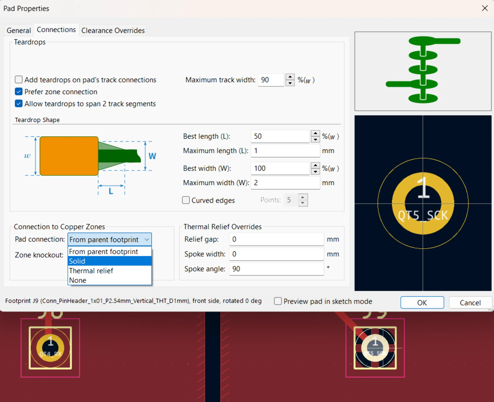
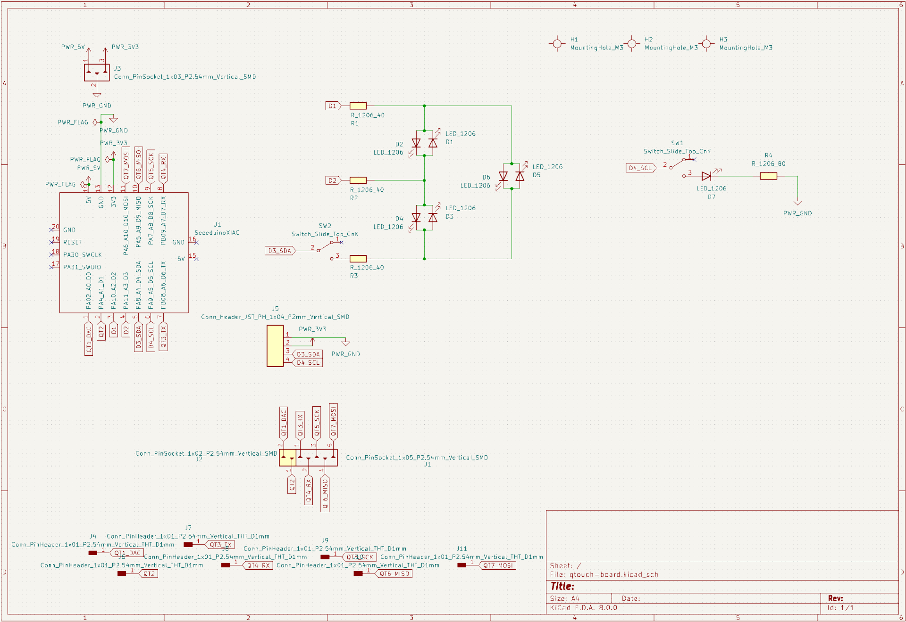
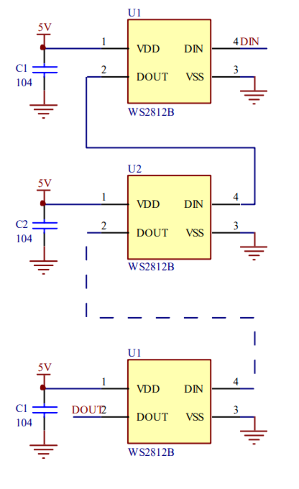
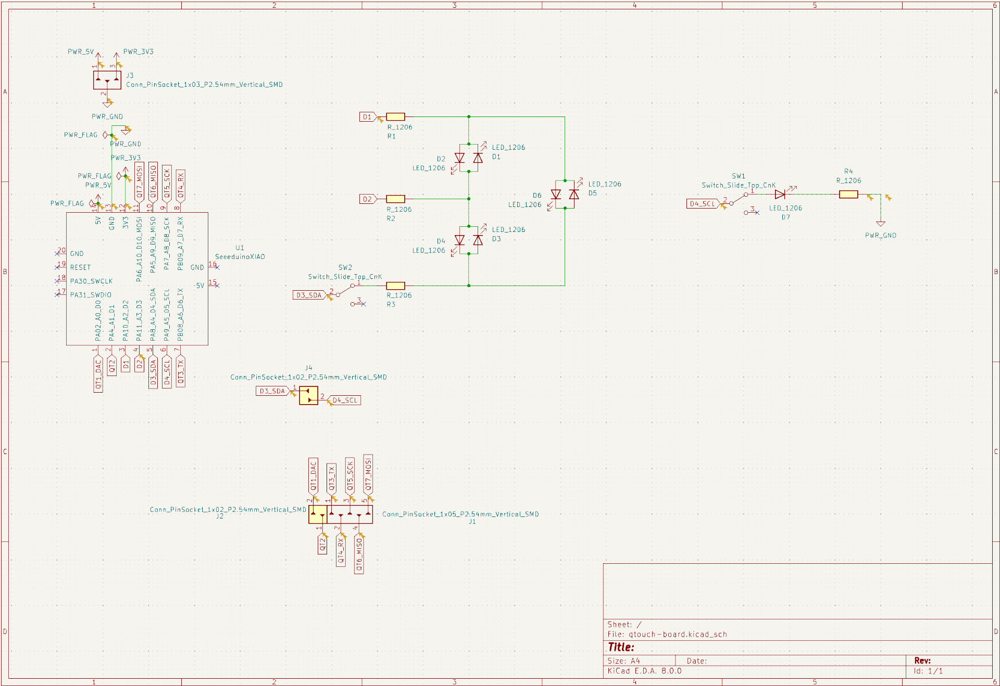
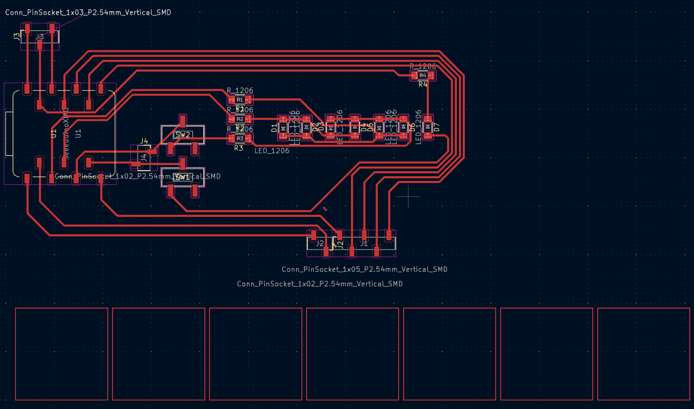

## Assingments

**Group assignment**

- Join one of the test equipment introduction session.
- Use the test equipment (benchtop power supply, oscilloscope, logic analyzer) at the Fablab to observe the operation of a microcontroller circuit board.
- Check operating voltage on the board with multimeter or voltmeter.
- Elect a group leader who will be responsible for creating group assignment page.
- Help group leader with adding relevant information to the group assignment page.

**Individual assignment**

- Add link to the group assignment to your documentation page along with a paragraph of text about what you learned.
- Design and make a circuit board using KiCad or equivalent electronics design automation (EDA) software. 
- You can use XIAO, ATtiny, D11C microcontrollers as core components.
- As a minimum, add a LED, a button and a 2x2 connector for serial communication with other boards that you will make in following weeks.
- Break out all the unused pins of the microcontroller you are using as the core.
- Calculate the ideal value of a current limiting resistor for the LED you are using on your board. 
- Document your process in a new page on your website.

## Design

This electronics design week provides a prime opportunity for testing out the QTouch capabilities of the [XIAO SAMD21](https://wiki.seeedstudio.com/Seeeduino-XIAO/), which could be used for the gesture controls of my [final project]().

[Seeed Studio XIAO SAMD21](https://wiki.seeedstudio.com/Seeeduino-XIAO/)

- ATSAMD21G18A-MU low-power microcontroller
- ARM Cortex-M0+ CPU(SAMD21G18) running at up to 48MHz
- 256KB of flash memory
- 32KB of SRAM
- 11 digital and analog I/O pins (working voltage 3.3V)
- 1 I2C interface
- 1 SPI interface
- 7 QTouch pins
- 1 UART interface
- Type-C power supply and downloading interface
- 3.3V/5V DC power

Download KiCAD file for Seeeduino XIAO

Had to import library and link footprint separately

https://www.youtube.com/watch?v=3MkWZ38WY5U

"D" brings up documentation

104 capacitor refers to 0.1uF

https://www.makerforge.tech/posts/neopixel-intro/

Much faster to copypaste stuff

https://www.seeedstudio.com/blog/2020/04/23/use-seeeduino-xiao-in-kicad-pcb-design-like-a-components/

https://www.instructables.com/Charlieplexing-Made-Easy-and-What-It-Even-Means/

Documentation for QTouch
https://ww1.microchip.com/downloads/en/DeviceDoc/atmel-42195-qtouch-library-peripheral-touch-controller_user-guide.pdf

In pcb editor press "D" for the traces to follow

[Group Documentation]()

