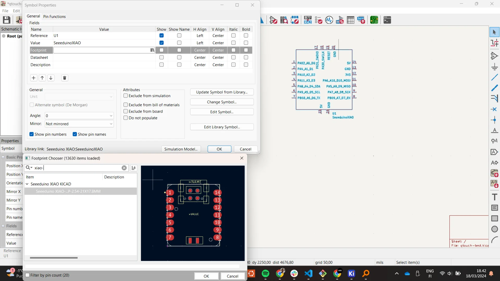
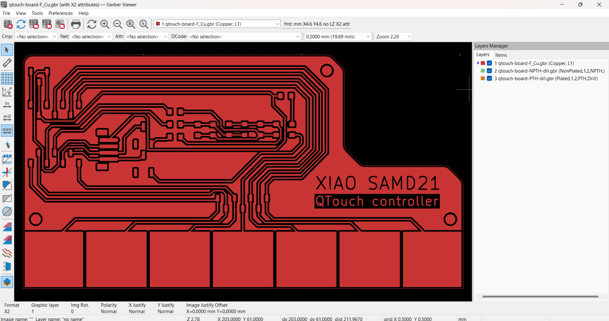

I am now writing this approximately two weeks late - three if we count from the start of the week - and therefore the latest learnings might now be very mixed across the electronics design and output devices weeks. This is of course due to a multitude of reasons as always, such as hurry with [Miitti App](https://miitti.app) and other courses. Primarily though, it is because how damn hard these electronics weeks have been. I have barely had time to produce the boards, let alone document the process or even properly test them.

Previous weeks have mostly been about learning how to design for and follow certain prototyping processes whereas this week felt like being dropped straigth to the deep end off of a high but only gently sloping cliff so that you roll and tumble all the way down. Thus far, it could be argued that not too much prior knowledge has been needed if one just has time and does not want to get super fancy. Now, however, I don't think that is the case anymore and I definitely lacked the necessary background information.

I even dug out my old [IB Higher Level Physics notes](https://ibdone1.wordpress.com/the-comprehensive-ib-physics-notes-for-2022-examinations-hl-and-sl/) but even though they were excellent for recapping the basic laws from [Coulomb's](https://en.wikipedia.org/wiki/Coulomb%27s_law) to [Kirchoff's](https://en.wikipedia.org/wiki/Kirchhoff%27s_circuit_laws), there was not too much about actually building electric circuits in the real world. And even though I had taken the [Design Thinking and Electronic Prototyping](https://www.aalto.fi/en/open-university-course-list/design-thinking-and-electronic-prototyping) course, where all theory focused on the former part and the latter consisted of playing with breadboards with other people doing mostly similar things, I found myself lacking practically all intuition necessary for actually designing printed circuit boards.

We were given a couple of lectures about different types of basic components and some quick examples about specific topics such as driving a certain type of motor but I, personally at least, failed to extract many of the underlying principles and just walked away with the feeling that everything is possible is nothing is clear. This was not helped by our teacher either. If your eye happens to catch this paragraph Kris, I am sorry but you don't seem very approachable. I understand that your time is very limited but your responses often feel quite dismissive and frankly, unhelpful despite your vast knowledge and impressive expertise. The fault is partially mine for not always asking the right questions but without knowing what they are and how to find them, it is very difficult to ask them.

When I have absolutely zero intuition about actually designing intercompatible electric circuits and limited skills in assembling them - which means that even if we would have been encouraged to bravely experiment without worrying about material costs in the beginning, I can only make so many in a limited amount of time - a general answer along the lines of "everything is possible but simultaneously entirely dependent on a thousand different factors" does not feel particularly reassuring - even if it is true. In such cases, I would usually rather be looking for general approaches, typical conventions, concrete examples, resources to learn from, or the underlying principles. Eventually I did manage to make something but it was a very bumpy road.

## Assingments

**Group assignment**

- Join one of the test equipment introduction sessions.
- Use the test equipment (benchtop power supply, oscilloscope, logic analyzer) at the Fablab to observe the operation of a microcontroller circuit board.
- Check operating voltage on the board with multimeter or voltmeter.
- Elect a group leader who will be responsible for creating group assignment page.
- Help group leader with adding relevant information to the group assignment page.

**Individual assignment**

- Add link to the group assignment to your documentation page along with a paragraph of text about what you learned.
- Design and make a circuit board using KiCad or equivalent electronics design automation (EDA) software. 
- You can use XIAO, ATtiny, D11C microcontrollers as core components.
- As a minimum, add a LED, a button and a 2x2 connector for serial communication with other boards that you will make in following weeks.
- Break out all the unused pins of the microcontroller you are using as the core.
- Calculate the ideal value of a current limiting resistor for the LED you are using on your board. 
- Document your process in a new page on your website.

## Analyzing electronic circuits

Our group documentation was done by [Tomi Monahan](https://tomimonahan.gitlab.io/digital-fabrication/index.html) and can be found [here](https://tomimonahan.gitlab.io/digital-fabrication/electronics-design-group-assignment.html). We were introduced to a variety of devices including a multimeter, a power supply, an oscilloscope and a [logic analyzer](https://www.saleae.com/products/saleae-logic-8), which is shockingly expensive for what it looks like. The multimeter is probably the most common out of all the tools and is the only one I have used with all my boards. It can be used to measure both DC and AC voltage as well as current and resistance to varying levels of precision. What I consistently find myself using it for, however, is checking for continuity, which it indicates with a beeping noise when the ends of the wires are connected to a continuous conductor. In my testing, however, it will not detect continuity with a resistor in between even if the board functions as expected so make sure to make the solder joints clean.

The power supply is good for testing if components such as, for example, motors work and how they respond to different amounts of current or voltage. Howevere, never connet anything without checking the voltage and amperage first as either one being too high might break the component or circuit. An oscillator can be used to investigate the elctronic signals traveling between points in the circuit and are thus often used for debugging purposes. A logic analyzer is an even more sophisticated version of this with support for multiple channels, increased resolution and an easier-to-use software interface but both seem a bit overkill for many small and simple boards even though their research and repair utility is undoubtedly great.

## Design

This electronics design week provided a prime opportunity for testing out the QTouch capabilities of the [XIAO SAMD21](https://wiki.seeedstudio.com/Seeeduino-XIAO/), which could likely be used for the gesture controls of my [final project](). Some of its most important specs are listed below.

[Seeed Studio XIAO SAMD21](https://wiki.seeedstudio.com/Seeeduino-XIAO/)

- ATSAMD21G18A-MU low-power microcontroller
- ARM Cortex-M0+ CPU(SAMD21G18) running at up to 48MHz
- 256KB of flash memory
- 32KB of SRAM
- 11 digital and analog I/O pins (working voltage 3.3V)
- 1 I2C interface
- 1 SPI interface
- 7 QTouch pins
- 1 UART interface
- Type-C power supply and downloading interface
- 3.3V/5V DC power

### Setting up KiCad

I chose to use [KiCad 8.0](https://www.kicad.org/) as it seemed to be the best supported option for us due to the [fab library](https://gitlab.fabcloud.org/pub/libraries/electronics/kicad) maintained by our instructor that contains all the components in the [Fab Lab Class Inventory](https://inventory.fabcloud.io/) along with their footprints. Additionally, all lectures and tutorials use it. Indeed, it is relatively simple and straightforward to use for simple boards made of components that are already included in the library. Below is a screenshot of the KiCad homescreen with a freshly created project called "qtouch-test". To create a new project, simply navigate to "File" > "New Project", press `CTRL + N` or click the notebook icon with a star on the left. 

The menu on the right provides different options analogous to workbenches in other CAD software and clicking them opens new windows somewhat unconventionally for modern software. For most projects, only the "Schematic Editor" and "PCB Editor" are relevant to which also the default project files correspond. The standard workflow is to define the components to be used and their connections in the "Schematic Editor", after which the actual PCB layout can be drawn in the "PCB Editor" using the footprints, i.e. pad layouts, associated with each component.

I first installed [KiCad for Windows](https://www.kicad.org/download/) and then cloned the [Fab Electronics Library for KiCad](https://gitlab.fabcloud.org/pub/libraries/electronics/kicad) into a new folder called `additional-libraries` that I created in `C:\Users\Miro\Documents\KiCad\8.0`. I renamed the repository to `fab` and added it to KiCad by first navigating to "Preferences" > "Manage Symbol Libraries" and clicking "Add existing library to table" and selecting `fab.kicad_sym`. I also installed the default libraries when prompted but toggled off their visibility to not overcrowd the symbols. I clicked okay and added the footprints similarly by navigating to "Preferences" > "Manage Footprint Libraries" and selecting the `fab.pretty` library this time.

The libraries did not feature the XIAO Seeeduino SAMD21 though and I thus had to install another library for it separately, which can be seen in the above images below the fab library. To do so, I scrolled to the bottom of the [Seeeduino XIAO wiki page](https://wiki.seeedstudio.com/Seeeduino-XIAO/) and downloaded the `Seeed Studio XIAO SAMD21 KiCAD file` under resources. I added the symbol library similarly to above with the help of [this article](https://www.seeedstudio.com/blog/2020/04/23/use-seeeduino-xiao-in-kicad-pcb-design-like-a-components/). The difference was that for the legacy library you have to add the `.lib` file as the symbol library and the entire `Seeeduino XIAO KICAD` folder to the footprint library. The article also recommends adding them to "Project Specific Libraries" for some reason. Using its content is also a bit more involved where the symbol and footprint must be separately linked as shown below. Open the "Symbol Properties" dialogue by double left clicking the symbol or choosing it from the context menu, click the library icon in the empty "Footprint" field and choose the corresponding Seeeduino XIAO footprint.

### Creating the schematic

The schematic of a circuit board specifies the components used on the board and their connections. These include, among many others, for example, a variety of microcontrollers to perform logic, computation and communications; resistors to limit current; connectors ranging from holes to sockets and headers for enabling easy intercircuit connectivity; one kind of switches to provide input signals and other kinds, along with transistors and mosfets for adjusting connections and redirecting current although the latter can also perform other functions too, such as amplification; capacitors to buffer and/or store energy; power sources to supply power; diodes for directing current only one way; light-emitting diodes (LEDs) to produce light and a variety of other input and output devices such as many kinds of sensors, screens, speakers and networking devices. For a more complete list of different categories, consult [Wikipedia's list of electronic components](https://en.wikipedia.org/wiki/Electronic_component).

In KiCad, schematics are created in the "Schematic Editor" usually with just a few simple tools, which can be found from the right sidebar. The most important / frequently used tools are:

<ol>
<li value="1">Select item(s)</li>
<li value="3">Add symbols (shortcut: "A")</li>
<li value="4">Add power symbols (shortcut: "P")</li>
<li value="5">Add a wire (shortcut: "W")</li>
<li value="8">Draw no-connection flags (shortcut: "Q")</li>
<li value="10">Draw net labels (shortcut: "L")</li>
<li value="12">Add global labels (shortcut: "CTRL + L")</li>
</ol>

"Add symbols" is used for, as its name suggests, adding symbols, which are representations of components and their interfaces. The image below has the symbol selection menu open, which displays the symbol and the footprint of the component on the right and the library of components as well as the selected component's description usually also containing its data sheet on the left.

The components can be connected by giving the to-be-connected pins the same net labels or global labels (which function the same at this scale but look better to my eye - inspired by the [Tarantino board](https://gitlab.fabcloud.org/pub/programmers/tarantino)'s KiCad file) or by drawing a wire from one to the other. This concept of [nets](https://www.raypcb.com/pcb-nets/) is very important as they designate physically connected areas and components on the printed circuit board (PCB). It is often much cleaner and therefore advisable to mostly use labels but sometimes wires can create space and add clarity to specific parts of the wiring.

Finally, power symbols are used to signify ground and power connections with the convention of ground pointing downwards and power upwards. There is also a power flag, which is used to dedicate the source of power.

Once all the components are added and their connections are specified, it is always a good idea to perform the electrical rules check (ERC), which warns about potential errors with the schematic connections. Errors should not be ignored as they are usually intimately related to the actual schematic but warnings might result, for example, from deficiencies in no longer actively maintained legacy libraries such as in the image below, where the pin types of the XIAO SAMD21 have not been properly specified. If you are confident that the warnings should not cause any issues, they can be ignored by right-clicking and selecting "Exclude this violation" in the case of a singular warning or "Ignore all 'X' violations" in case you want to hide them all. 

The difficult part was knowing what I would need. The electronic components at the [Aalto FabLab](https://studios.aalto.fi/fablab/) are mostly split between two cabinets: one containing the stock stuff such as basic resistors, capacitors and LEDs, and the other containing the more expensive microcontrollers, switches, adapters, connectors, RGB LEDs and other output devices etc., which is always closed and locked for off-hours. There seems to be a rough split with an inkling of logic between the two but in reality one cannot expect much from this as the stock tower still contains some microcontrollers and the lockable cabinet contains basic switches and connectors

Before I was granted better access to the cabinet, this really made my life difficult as I could often make it to the lab only a bit before closing and so had to take out the components before it was closed. However, I did not know exactly what I would need beforehand as I was not familiar enough with them yet but I also needed to know what was available in order to make the designs quickly producable. I solved this paradox partially by taking pictures of the contents of the cabinets and overstocking on the types of components I thought I might potentially need.

I had a simple idea for this week's circuit board. I wanted to test the QTouch (capacitance detection) capability of the XIAO SAMD21 to see if it might be useful for my final project. The idea was to create a board with seven touch zones and seven corresponding LEDs, which would light up according to which zone was touched. This would enable me to test the resolution of capacitance detection through different materials and start programming the final project code already. I also wanted to make it more future-proof with reasonable connections.

My initial idea was to use [NeoPixels](https://www.adafruit.com/product/1655) for the LEDs to save pins but it seemed to get really crowded really quickly as according to my interpretation of the [datasheet](https://cdn-shop.adafruit.com/datasheets/WS2812B.pdf) one would need to add capacitors for each one of the NeoPixels. Luckily I was late with the design and Neil Gershendfeld showed us [charlieplexing](https://en.wikipedia.org/wiki/Charlieplexing) during the output devices lecture, which required one more pin but fewer components overall. 

At this point, I started over with my design as it felt easier and safer to save the project and then just apply my new skills with KiCad to make sure everything went right from the beginning. I had initially placed the XIAO SAMD21 with the footprint of the board but with the restart, I realized that I could still use the SAMD21 symbol in the schematic but replace the footprint with the XIAO socket, which was used with the [Tarantino board](https://gitlab.fabcloud.org/pub/programmers/tarantino) as well because the formfactors were identical. This was the most straightforward way of soldering sockets for the microcontroller.

I then added the rest of the components, those being a total of 7 LEDs with [1206 footprints](https://eepower.com/resistor-guide/resistor-standards-and-codes/resistor-sizes-and-packages/#), where 1206 refers to the size and dimensions of the [surface-mounted device (SMD)](https://en.wikipedia.org/wiki/Surface-mount_technology) in [imperial units](https://en.wikipedia.org/wiki/Imperial_units), 4 1206 resistors, 4 different vertical connectors, 2 switches, 7 through-hole connectors and 3 mounting holes, some of which were really added afterwards while drawing the PCB but mentioned here already as the below image shows them all. 

The connector in the upper left corner breaks out the power and ground pins, meaning that they are easily accessible to wires. The other three connectors that can be recognized by their names, starting with `Conn_` are for enabling an I2C connection and extending the QTouch connections. The mess at the bottom is a pile of through-hole connectors for each of the touch pads to keep my connectivity options open. 

The naming scheme of the components largely follows the template: `TypeOfComponent_NameOfComponent_FeaturesOfComponent` except for when the type and name are essentially the same. For example, `Conn_PinSocket_1x05_P2.54mm_Vertical_SMD` means that it is a vertical, surface mount pin socket connector with 5 sockets that are spaced 2.54mm apart.

The majority of the LEDs are connected in a [charlieplexing](https://en.wikipedia.org/wiki/Charlieplexing) configuration, about the existence of which I learned about on the [output devices lecture](https://vimeo.com/925582461). This is very convenient as it allows you to control multiple LEDs with a proportionally decreasing number of pins, where 3 pins can already control 6 pins and 11 can control 110 according to the formula N * (N - 1), where N is the number of pins used and the product is the number of LEDs that can be controlled. Do note, however, that the cost of charlieplexing is that you can only have 1 LED on at a time. In order to create the illusion of multiple ones being on simultaneously i.e. "virtually lit", you have to  refresh all of them at least 60 times per second, meaning that the processing power of the microcontroller will become a problem with enough LEDs. For reference, an Arduino programmed on a low level can just about reach 240 according to [this article](https://www.instructables.com/Charlieplexing-Made-Easy-and-What-It-Even-Means/).

 In my research about charlieplexing I found [this video](https://www.youtube.com/watch?v=b44VGTaCSk8) and [this article](https://www.instructables.com/Charlieplexing-Made-Easy-and-What-It-Even-Means/) to be very helpful. For my schematic, I pretty much just replicated the 6 LED configuration using actual wires for clarity. The general idea is always to connect two LEDs in parallel in opposite orientations so that only one will ever be on at a time. As shown in the image below, the logic by which the LEDs are controlled is to make the pins connected to the ends of the LED one wants to turn on and set them to high and low output accordingly to the direction of the light-emitting *diode*, while disconnecting all other pins by setting them to input (/ high impedance) mode so that no current can flow in or out of that pin.

 
 
 For the resistor values I calculated 40 Ohms each as, according to the [datasheet of the LEDs](https://optoelectronics.liteon.com/upload/download/DS-22-98-0002/LTST-C150CKT.pdf), their forward voltage is `1.8V` and the maximum DC forward current is `40mA`, which results in `5V - 1.8V = 3.2V` for the resistor to sink after the LED. Solving for resistance in `V = IR`, where V is voltage, I is current and R is resistance, gives `R = V/I`, which gives `R = 3.2 / 0.04 = 80` with the above values. However, as mentioned in the [Instructables article](https://www.instructables.com/Charlieplexing-Made-Easy-and-What-It-Even-Means/), "resistors should have half the resistance for driving a single LED because current flows through two resistors" and therefore I chose 40 Ohms as the three resistor values.

 Finally, I added one more LED in the standard way with an 80 Ohm resistor to complete the row. I did, however, add switches before it and the last charlieplexing pin as they use the SDA and SCL pins, which are used to implement the [I2C protocol](https://learn.sparkfun.com/tutorials/i2c/all). The same pins are connected to the [Qwiic](https://www.sparkfun.com/qwiic) compatible header connector, which allows me to choose whether to use them for communication or for the indicator LEDs. [Qwiic](https://www.sparkfun.com/qwiic) on the other hand is like an interface standard, which ensures consistency between interfaces and enables inter-board communication with standardized cable. After our instructor's feedback as I had not finished it by our review session either, I implemented it for the I2C breakout connector, except in reverse and with too large of a header but at least I had a connection.

### Creating the PCB layout

As I was late with the design, I also attended our own local lecture with only a partial design and a ton of questions and was told that 

https://learn.adafruit.com/adafruit-cap1188-breakout/overview

Made it qwiic compatible for future proofness.

Due inertia finsihed the non-optimal one

https://www.sparkfun.com/qwiic

D can also be used to modify the tracks themselves

Running DRC colors in the filled areas

Selecting the nets corresponding to the QTouch pins for the filled in areas got them connected to the wires

Make sure to have edge cuts layer selected when drawing them

First gerber was not correct

DRC must be ran for changes to become visible

Broke my bit due to forgetting to readjust Z after it did not initially cut at all

Download KiCAD file for Seeeduino XIAO

Had to import library and link footprint separately

https://www.youtube.com/watch?v=3MkWZ38WY5U

"D" brings up documentation

104 capacitor refers to 0.1uF

https://www.makerforge.tech/posts/neopixel-intro/

Much faster to copypaste stuff

https://www.seeedstudio.com/blog/2020/04/23/use-seeeduino-xiao-in-kicad-pcb-design-like-a-components/

https://www.instructables.com/Charlieplexing-Made-Easy-and-What-It-Even-Means/

Documentation for QTouch
https://ww1.microchip.com/downloads/en/DeviceDoc/atmel-42195-qtouch-library-peripheral-touch-controller_user-guide.pdf

In pcb editor press "D" for the traces to follow

[Group Documentation](https://tomimonahan.gitlab.io/digital-fabrication/electronics-design-group-assignment.html)

