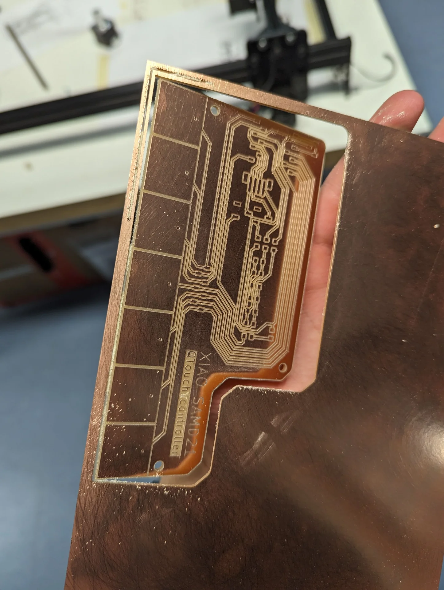

I am now writing this approximately two weeks late - three if we count from the start of the week - and therefore the latest learnings might now be very mixed across the electronics design and output devices weeks. This is of course due to a multitude of reasons as always, such as hurry with [Miitti App](https://miitti.app) and other courses. Primarily though, it is because how damn hard these electronics weeks have been. I have barely had time to produce the boards, let alone document the process or even properly test them.

Previous weeks have mostly been about learning how to design for and follow certain prototyping processes whereas this week felt like being dropped straigth to the deep end off of a high but only gently sloping cliff so that you roll and tumble all the way down. Thus far, it could be argued that not too much prior knowledge has been needed if one just has time and does not want to get super fancy. Now, however, I don't think that is the case anymore and I definitely lacked the necessary background information.

I even dug out my old [IB Higher Level Physics notes](https://ibdone1.wordpress.com/the-comprehensive-ib-physics-notes-for-2022-examinations-hl-and-sl/) but even though they were excellent for recapping the basic laws from [Coulomb's](https://en.wikipedia.org/wiki/Coulomb%27s_law) to [Kirchoff's](https://en.wikipedia.org/wiki/Kirchhoff%27s_circuit_laws), there was not too much about actually building electric circuits in the real world. And even though I had taken the [Design Thinking and Electronic Prototyping](https://www.aalto.fi/en/open-university-course-list/design-thinking-and-electronic-prototyping) course, where all theory focused on the former part and the latter consisted of playing with breadboards with other people doing mostly similar things, I found myself lacking practically all intuition necessary for actually designing printed circuit boards.

We were given a couple of lectures about different types of basic components and some quick examples about specific topics such as driving a certain type of motor but I, personally at least, failed to extract many of the underlying principles and just walked away with the feeling that everything is possible is nothing is clear. This was not helped by our teacher either. If your eye happens to catch this paragraph Kris, I am sorry but you don't seem very approachable. I understand that your time is very limited but your responses often feel quite dismissive and frankly, unhelpful despite your vast knowledge and impressive expertise. The fault is partially mine for not always asking the right questions but without knowing what they are and how to find them, it is very difficult to ask them.

When I have absolutely zero intuition about actually designing intercompatible electric circuits and limited skills in assembling them - which means that even if we would have been encouraged to bravely experiment without worrying about material costs in the beginning, I can only make so many in a limited amount of time - a general answer along the lines of "everything is possible but simultaneously entirely dependent on a thousand different factors" does not feel particularly reassuring - even if it is true. In such cases, I would usually rather be looking for general approaches, typical conventions, concrete examples, resources to learn from, or the underlying principles. Eventually I did manage to make something but it was a very bumpy road.

## Assingments

**Group assignment**

- Join one of the test equipment introduction sessions.
- Use the test equipment (benchtop power supply, oscilloscope, logic analyzer) at the Fablab to observe the operation of a microcontroller circuit board.
- Check operating voltage on the board with multimeter or voltmeter.
- Elect a group leader who will be responsible for creating group assignment page.
- Help group leader with adding relevant information to the group assignment page.

**Individual assignment**

- Add link to the group assignment to your documentation page along with a paragraph of text about what you learned.
- Design and make a circuit board using KiCad or equivalent electronics design automation (EDA) software. 
- You can use XIAO, ATtiny, D11C microcontrollers as core components.
- As a minimum, add a LED, a button and a 2x2 connector for serial communication with other boards that you will make in following weeks.
- Break out all the unused pins of the microcontroller you are using as the core.
- Calculate the ideal value of a current limiting resistor for the LED you are using on your board. 
- Document your process in a new page on your website.

## Analyzing electronic circuits

Our group documentation was done by [Tomi Monahan](https://tomimonahan.gitlab.io/digital-fabrication/index.html) and can be found [here](https://tomimonahan.gitlab.io/digital-fabrication/electronics-design-group-assignment.html). We were introduced to a variety of devices including a multimeter, a power supply, an oscilloscope and a [logic analyzer](https://www.saleae.com/products/saleae-logic-8), which is shockingly expensive for what it looks like. The multimeter is probably the most common out of all the tools and is the only one I have used with all my boards. It can be used to measure both DC and AC voltage as well as current and resistance to varying levels of precision. What I consistently find myself using it for, however, is checking for continuity, which it indicates with a beeping noise when the ends of the wires are connected to a continuous conductor. In my testing, however, it will not detect continuity with a resistor in between even if the board functions as expected so make sure to make the solder joints clean.

The power supply is good for testing if components such as, for example, motors work and how they respond to different amounts of current or voltage. Howevere, never connet anything without checking the voltage and amperage first as either one being too high might break the component or circuit. An oscillator can be used to investigate the elctronic signals traveling between points in the circuit and are thus often used for debugging purposes. A logic analyzer is an even more sophisticated version of this with support for multiple channels, increased resolution and an easier-to-use software interface but both seem a bit overkill for many small and simple boards even though their research and repair utility is undoubtedly great.

## Design using KiCad

This electronics design week provided a prime opportunity for testing out the [QTouch capabilities](https://ww1.microchip.com/downloads/en/DeviceDoc/atmel-42195-qtouch-library-peripheral-touch-controller_user-guide.pdf) of the [XIAO SAMD21](https://wiki.seeedstudio.com/Seeeduino-XIAO/), which could likely be used for the gesture controls of my [final project](). Some of its most important specs are listed below.

[Seeed Studio XIAO SAMD21](https://wiki.seeedstudio.com/Seeeduino-XIAO/)

- ATSAMD21G18A-MU low-power microcontroller
- ARM Cortex-M0+ CPU(SAMD21G18) running at up to 48MHz
- 256KB of flash memory
- 32KB of SRAM
- 11 digital and analog I/O pins (working voltage 3.3V)
- 1 I2C interface
- 1 SPI interface
- 7 QTouch pins
- 1 UART interface
- Type-C power supply and downloading interface
- 3.3V/5V DC power


### Setting up KiCad

I chose to use [KiCad 8.0](https://www.kicad.org/) as it seemed to be the best supported option for us due to the [fab library](https://gitlab.fabcloud.org/pub/libraries/electronics/kicad) maintained by our instructor that contains all the components in the [Fab Lab Class Inventory](https://inventory.fabcloud.io/) along with their footprints. Additionally, all lectures and tutorials use it. Indeed, it is relatively simple and straightforward to use for simple boards made of components that are already included in the library. Below is a screenshot of the KiCad homescreen with a freshly created project called "qtouch-test". To create a new project, simply navigate to "File" > "New Project", press `CTRL + N` or click the notebook icon with a star on the left. 

The menu on the right provides different options analogous to workbenches in other CAD software and clicking them opens new windows somewhat unconventionally for modern software. For most projects, only the "Schematic Editor" and "PCB Editor" are relevant to which also the default project files correspond. The standard workflow is to define the components to be used and their connections in the "Schematic Editor", after which the actual PCB layout can be drawn in the "PCB Editor" using the footprints, i.e. pad layouts, associated with each component.


I first installed [KiCad for Windows](https://www.kicad.org/download/) and then cloned the [Fab Electronics Library for KiCad](https://gitlab.fabcloud.org/pub/libraries/electronics/kicad) into a new folder called `additional-libraries` that I created in `C:\Users\Miro\Documents\KiCad\8.0`. I renamed the repository to `fab` and added it to KiCad by first navigating to "Preferences" > "Manage Symbol Libraries" and clicking "Add existing library to table" and selecting `fab.kicad_sym`. I also installed the default libraries when prompted but toggled off their visibility to not overcrowd the symbols. I clicked okay and added the footprints similarly by navigating to "Preferences" > "Manage Footprint Libraries" and selecting the `fab.pretty` library this time.


The libraries did not feature the XIAO Seeeduino SAMD21 though and I thus had to install another library for it separately, which can be seen in the above images below the fab library. To do so, I scrolled to the bottom of the [Seeeduino XIAO wiki page](https://wiki.seeedstudio.com/Seeeduino-XIAO/) and downloaded the `Seeed Studio XIAO SAMD21 KiCAD file` under resources. I added the symbol library similarly to above with the help of [this article](https://www.seeedstudio.com/blog/2020/04/23/use-seeeduino-xiao-in-kicad-pcb-design-like-a-components/). The difference was that for the legacy library you have to add the `.lib` file as the symbol library and the entire `Seeeduino XIAO KICAD` folder to the footprint library. The article also recommends adding them to "Project Specific Libraries" for some reason. Using its content is also a bit more involved where the symbol and footprint must be separately linked as shown below. Open the "Symbol Properties" dialogue by double left clicking the symbol or choosing it from the context menu, click the library icon in the empty "Footprint" field and choose the corresponding Seeeduino XIAO footprint.


### Creating the schematic

The schematic of a circuit board specifies the components used on the board and their connections. These include, among many others, for example, a variety of microcontrollers to perform logic, computation and communications; resistors to limit current; connectors ranging from holes to sockets and headers for enabling easy intercircuit connectivity; one kind of switches to provide input signals and other kinds, along with transistors and mosfets for adjusting connections and redirecting current although the latter can also perform other functions too, such as amplification; capacitors to buffer and/or store energy; power sources to supply power; diodes for directing current only one way; light-emitting diodes (LEDs) to produce light and a variety of other input and output devices such as many kinds of sensors, screens, speakers and networking devices. For a more complete list of different categories, consult [Wikipedia's list of electronic components](https://en.wikipedia.org/wiki/Electronic_component).

In KiCad, schematics are created in the "Schematic Editor" usually with just a few simple tools, which can be found from the right sidebar. The most important / frequently used tools are:

<ol>
<li value="1">Select item(s)</li>
<li value="3">Add symbols (shortcut: "A")</li>
<li value="4">Add power symbols (shortcut: "P")</li>
<li value="5">Add a wire (shortcut: "W")</li>
<li value="8">Draw no-connection flags (shortcut: "Q")</li>
<li value="10">Draw net labels (shortcut: "L")</li>
<li value="12">Add global labels (shortcut: "CTRL + L")</li>
</ol>

"Add symbols" is used for, as its name suggests, adding symbols, which are representations of components and their interfaces. The image below has the symbol selection menu open, which displays the symbol and the footprint of the component on the right and the library of components as well as the selected component's description usually also containing its datasheet on the left, which can be brought up at any time with the keboard shortcut `D` with the component of interest selected.


The components can be connected by giving the to-be-connected pins the same net labels or global labels (which function the same at this scale but look better to my eye - inspired by the [Tarantino board](https://gitlab.fabcloud.org/pub/programmers/tarantino)'s KiCad file) or by drawing a wire from one to the other. This concept of [nets](https://www.raypcb.com/pcb-nets/) is very important as they designate physically connected areas and components on the printed circuit board (PCB). It is often much cleaner and therefore advisable to mostly use labels but sometimes wires can create space and add clarity to specific parts of the wiring.

Finally, power symbols are used to signify ground and power connections with the convention of ground pointing downwards and power upwards. There is also a power flag, which is used to dedicate the source of power.

Once all the components are added and their connections are specified, it is always a good idea to perform the electrical rules check (ERC), which warns about potential errors with the schematic connections. Errors should not be ignored as they are usually intimately related to the actual schematic but warnings might result, for example, from deficiencies in no longer actively maintained legacy libraries such as in the image below, where the pin types of the XIAO SAMD21 have not been properly specified. If you are confident that the warnings should not cause any issues, they can be ignored by right-clicking and selecting "Exclude this violation" in the case of a singular warning or "Ignore all 'X' violations" in case you want to hide them all. 


The difficult part was knowing what I would need. The electronic components at the [Aalto FabLab](https://studios.aalto.fi/fablab/) are mostly split between two cabinets: one containing the stock stuff such as basic resistors, capacitors and LEDs, and the other containing the more expensive microcontrollers, switches, adapters, connectors, RGB LEDs and other output devices etc., which is always closed and locked for off-hours. There seems to be a rough split with an inkling of logic between the two but in reality one cannot expect much from this as the stock tower still contains some microcontrollers and the lockable cabinet contains basic switches and connectors

Before I was granted better access to the cabinet, this really made my life difficult as I could often make it to the lab only a bit before closing and so had to take out the components before it was closed. However, I did not know exactly what I would need beforehand as I was not familiar enough with them yet but I also needed to know what was available in order to make the designs quickly producable. I solved this paradox partially by taking pictures of the contents of the cabinets and overstocking on the types of components I thought I might potentially need.

I had a simple idea for this week's circuit board. I wanted to test the QTouch (capacitance detection) capability of the XIAO SAMD21 to see if it might be useful for my final project. The idea was to create a board with seven touch zones and seven corresponding LEDs, which would light up according to which zone was touched. This would enable me to test the resolution of capacitance detection through different materials and start programming the final project code already. I also wanted to make it more future-proof with reasonable connections.

My initial idea was to use [NeoPixels](https://www.adafruit.com/product/1655) for the LEDs to save pins but it seemed to get really crowded really quickly as according to my interpretation of the [datasheet](https://cdn-shop.adafruit.com/datasheets/WS2812B.pdf) one would need to add capacitors for each one of the NeoPixels. Luckily I was late with the design and Neil Gershendfeld showed us [charlieplexing](https://en.wikipedia.org/wiki/Charlieplexing) during the output devices lecture, which required one more pin but fewer components overall. 

At this point, I started over with my design as it felt easier and safer to save the project and then just apply my new skills with KiCad to make sure everything went right from the beginning. I had initially placed the XIAO SAMD21 with the footprint of the board but with the restart, I realized that I could still use the SAMD21 symbol in the schematic but replace the footprint with the XIAO socket, which was used with the [Tarantino board](https://gitlab.fabcloud.org/pub/programmers/tarantino) as well because the formfactors were identical. This was the most straightforward way of soldering sockets for the microcontroller.


I then added the rest of the components, those being a total of 7 LEDs with [1206 footprints](https://eepower.com/resistor-guide/resistor-standards-and-codes/resistor-sizes-and-packages/#), where 1206 refers to the size and dimensions of the [surface-mounted device (SMD)](https://en.wikipedia.org/wiki/Surface-mount_technology) in [imperial units](https://en.wikipedia.org/wiki/Imperial_units), 4 1206 resistors, 4 different vertical connectors, 2 switches, 7 through-hole connectors and 3 mounting holes, some of which were really added afterwards while drawing the PCB but mentioned here already as the below image shows them all. 


The connector in the upper left corner breaks out the power and ground pins, meaning that they are easily accessible to wires. The other three connectors that can be recognized by their names, starting with `Conn_` are for enabling an I2C connection and extending the QTouch connections. The mess at the bottom is a pile of through-hole connectors for each of the touch pads to keep my connectivity options open. 

The naming scheme of the components largely follows the template: `TypeOfComponent_NameOfComponent_FeaturesOfComponent` except for when the type and name are essentially the same. For example, `Conn_PinSocket_1x05_P2.54mm_Vertical_SMD` means that it is a vertical, surface mount pin socket connector with 5 sockets that are spaced 2.54mm apart.

The majority of the LEDs are connected in a [charlieplexing](https://en.wikipedia.org/wiki/Charlieplexing) configuration, about the existence of which I learned about on the [output devices lecture](https://vimeo.com/925582461). This is very convenient as it allows you to control multiple LEDs with a proportionally decreasing number of pins, where 3 pins can already control 6 pins and 11 can control 110 according to the formula N * (N - 1), where N is the number of pins used and the product is the number of LEDs that can be controlled. Do note, however, that the cost of charlieplexing is that you can only have 1 LED on at a time. In order to create the illusion of multiple ones being on simultaneously i.e. "virtually lit", you have to  refresh all of them at least 60 times per second, meaning that the processing power of the microcontroller will become a problem with enough LEDs. For reference, an Arduino programmed on a low level can just about reach 240 according to [this article](https://www.instructables.com/Charlieplexing-Made-Easy-and-What-It-Even-Means/).

 In my research about charlieplexing I found [this video](https://www.youtube.com/watch?v=b44VGTaCSk8) and [this article](https://www.instructables.com/Charlieplexing-Made-Easy-and-What-It-Even-Means/) to be very helpful. For my schematic, I pretty much just replicated the 6 LED configuration using actual wires for clarity. The general idea is always to connect two LEDs in parallel in opposite orientations so that only one will ever be on at a time. As shown in the image below, the logic by which the LEDs are controlled is to make the pins connected to the ends of the LED one wants to turn on and set them to high and low output accordingly to the direction of the light-emitting *diode*, while disconnecting all other pins by setting them to input (/ high impedance) mode so that no current can flow in or out of that pin.

 
 
 For the resistor values I calculated 40 Ohms each as, according to the [datasheet of the LEDs](https://optoelectronics.liteon.com/upload/download/DS-22-98-0002/LTST-C150CKT.pdf), their forward voltage is `1.8V` and the maximum DC forward current is `40mA`, which results in `5V - 1.8V = 3.2V` for the resistor to sink after the LED. Solving for resistance in `V = IR`, where V is voltage, I is current and R is resistance, gives `R = V/I`, which gives `R = 3.2 / 0.04 = 80` with the above values. However, as mentioned in the [Instructables article](https://www.instructables.com/Charlieplexing-Made-Easy-and-What-It-Even-Means/), "resistors should have half the resistance for driving a single LED because current flows through two resistors" and therefore I chose 40 Ohms as the three resistor values.

 Finally, I added one more LED in the standard way with an 80 Ohm resistor to complete the row. I did, however, add switches before it and the last charlieplexing pin as they use the SDA and SCL pins, which are used to implement the [I2C protocol](https://learn.sparkfun.com/tutorials/i2c/all). The same pins are connected to the [Qwiic](https://www.sparkfun.com/qwiic) compatible header connector, which allows me to choose whether to use them for communication or for the indicator LEDs. [Qwiic](https://www.sparkfun.com/qwiic) on the other hand is like an interface standard, which ensures consistency between interfaces and enables inter-board communication with standardized cable. After our instructor's feedback as I had not finished it by our review session either, I implemented it for the I2C breakout connector, except in reverse and with too large of a header but at least I had a connection.

### Creating the PCB layout

The schematic defines the functionality and connectivity of the board but the traces have to be laid out in the PCB editor for it to actually be producable and usable. Considerations include as little overlap as possible for ease of manufacturing, closseness of components for strong signals and fast communication, shape and size of the printed circuit board for ease of mounting, encasability and integrability, and length and closeness as well as thickness and angles of traces for signal integrity and support for varying amounts of current.

In KiCad, PCB layouts are created in the "PCB Editor" usually based on a schematic, mostly using a few simple tools, again found in the right sidebar:

<ol>
<li value="1">Select item(s)</li>
<li value="4">Route tracks (shortcut: "X")</li>
<li value="7">Add a filled zone (shortcut: "Ctrl + Shift + Z")</li>
<li value="9">Draw a line (shortcut: "Ctrl + Shift + L")</li>
<li value="11">Draw a rectangle</li>
<li value="15">Add a text item (shortcut: "Ctrl + Shift + T")</li>
</ol>


In order to import the footprints or generally update the relationship between the schematic and the PCB layout after changes in the former, click on the fourth icon from the right in the horizontal toolbar that looks like a half anf half matchup of the schematic editor and the PCB editor with an arrow leading from the former to the latter. This brings up the dialogue below, where clicking "Update PCB", indeed, updates the PCB and gives a report of the operation.


In the above report, the errors about missing pads can be ignored as I made the deliberate choice of using the XIAO SocketSMD footprint with the XIAO Seeeduino microcontroller, which contains more connections than the socket footprint. The correct footprint is shown in the "Imported footprints" image above on the right as it is an earlier picture from when I had not realized the trick just yet. In it, it can be seen that it has six more pads in addition to the pins but these are unaccounted for in the socket footprint, thus resulting in the errors. If no such unconventional tricks are necessary, no errors should occur. 

A successful first import looks like the above image with a set of footprints of the components defined in the schematic. As the view is rather cluttered, it is often advisable to move the components around to create a bit more space and to toggle off the visibility of the F.Fab layer to hide the component names if there are only few compnents and they are sufficiently distinct-looking. The components can also be identified by the letter and number combinations on the silkscreen, which is the layer on top of some PCB stock where things can be written. This is not relevant for our simple FR2 copper stock however and thus all warnings related to silkscreen can be ignored. In more advanced boards it is likely a good idea to take full advantage of the silkscreen though.

The blue lines between pads are called ratsnests and they indicate which footprints share the same net, i.e. *possible* connections between components. When visible, they always show the shortest path from the bird's eye view between the pads nearest to each other that share the same net. This means that moving a component around might change which pad and component the ratsnest points to but ultimately they will all be connected to each other. The order of the connections might still matter though, such as when some components should be closer to the microcontroller and others, such as connectors in certain cases, might be just fine a bit further. To troubleshoot crossed ratsnests you can move the components around and go back to edit the connections in the schematic so that they do not overlap. In the worst case scenario, you can also jump connections by adding 0 Ohm resistors or by using two-sided copper sheets and rivets to connect them at certain places.

The finest precision our milling machines can reliably achieve was given to be 0.4mm by our instructor. The default in KiCad is 0.2mm but this can be changed by navigating to the dropdown in the upper left corner that reads "Track: use netclass width", clicking it and then selecting "Edit Pre-definced Sizes...", which brings up the menu below. Select "Net Classes" under "Design Rules" in the left menu and change both "Clearance" and "Track Width" to 0.4mm. You can also create multiple netclasses with different values for, for example, thicker traces for sections that may take more current and select that from the dropdown whenever drawing such tracks. 


You can also change pad size and other attributes by double-clicking one or right-clicking and either pressing "E" or choosing "Properties". By enlargening the pads, you can make the components easier to solder. You can then select multiple pads and use "Paste Default Pad Properties to Selected" to apply the changes to multiple pads at once. Additionally, if you wish the pad to connect fully to the nearby copper zone with the same net class, you can navigate to the "Connections" tab in "Pad Properties" and choose "Pad connection: Solid" as shown below in the third picture where the left through-hole connector has this and the right one has the default "From parent footprint", which causes it not to be fully connected.


The workflow is then generally the following: position the components with the grid spacing that makes the most sense (located next to zoom dropdown and I usually used everything between 1,0000 to 0,0100) and route tracks using the similarily named tool. The route follows your cursor by autogenerating a path up to it according to some logic but it is often quite suboptimal and therefore it is advisable to left-click to set the trace up until that point and then extend it. To stop drawing, press "End" or choose it from the context menu. It is also advisable to avoid 90° angles, and make tracks with sensitive signals as short and insulated as possible. The traces can also be edited easily by dragging its parts or changing their properties using the context menu.

Some useful shortcuts for the PCB editor: 

- **U**: Select the entire track
- **D**: Move component or a section of a track while maintaining its connections
- **F**: Autocomplete the currently drawn track
- **E**: Edit any item your cursor is hovering over

(Inclusion of the above was inspired by [Mika Järvi's documentation](https://mikajarvi.gitlab.io/digital-fabrication/10-electronics-design.html) which features even more useful shortcuts and tips)

To finish the PCB layout, select the Edge.Cuts layer and draw its shape using any of the shape tools. Fillet lines are apparently quite a new and long awaited option but are now available via "Shape Modification" > "Fillet Lines..." in the context menu. [CopperCAM](https://www.galaad.net/coppercam-eng.html) handles the milling of both types of gerber files similarly but "Add a filled zone" can be used to fill the copper area of the board, which can also be connected to a net, such as ground, which is often used. If no net is selected, it will be an isolated copper island, meaning that it has no connections but it will not be milled away either. One can also decide how uniformly they want the zone to be connected to pads by selecting the appropriate pad connection type. When using the shape and fill tools, make sure you have the correct layer selected for which you want it to apply.


Finally, perform the design rules check using the Design Rules Checker (DRC) found right next to the "Update PCB with changes made to the schematic icon (shortcut: F8). Once again, you do not want to see errors but warnings regarding the silkscreen can safely be ignored as our copper sheets do not feature such a layer at all. They can also be hidden similarly to how it was done with the ERC. Running the DRC is also the simplest way I have discovered to refresh the filled-in zones in the PCB editor.


After abandoning the NeoPixel design due to how crowded and convoluted the wiring threatened to get, my initial design using charlieplexing that I presented in our review session looked as shown below. Our instructor suggested that I should add power and ground to the I2C connector for future proofness and warned of the long tracks to the capacitance-sensing pads.


I forced the tracks to bend to my will and I managed to add the power and 3.3V to the 4-pin JST header between the XIAO socket and the two switches. I left the longer traces, however, as I liked the look and quite frankly, could not bother re-routing after the struggle it had already been to get to that point. I also decided to experiment on whether the capacitance readings would actually interfere or not with the other traces. To mitigate against this a little bit, I separated the tracks more, which also made the design look better. 

The pads do not have to be connected to anything other than the QTouch pins as ground goes through what- or whoever changes the capacitance. This I gathered from [this tutorial](https://www.seeedstudio.com/blog/2020/07/20/how-to-make-a-fruit-piano-on-seeeduino-xiaos-q-touch-function-m/) on how to make a fruit piano using the XIAO SAMD21 by observing that each fruit was directly connected to the QTouch pins with only a single wire.

I then added 3mm mounting holes and drew the outline on the Edge.Cuts layer. To connect the touchpads to the QTouch pins, I drew them as rectangles, filled them in by changing their properties to "Filled shape" and made them share the corresponding nets so that the tracks could be drawn in them. I also added simple, single through-hole connectors to each, to which I connected the tracks. After adding some text as well, the resulting gerber preview looked as below on the right.


As can be seen, the above gerber preview was close but not quite what I wanted still as the pads were not properly connected. I drew zone fills over the rectangles as well as the entire board and made sure all areas, tracks and connectors shared the correct nets and then changed both the areas' and pads' pad connections to solid, which then finally resulted in what I ultimately wanted, after also toggling on "Knockout" for the larger text in "Text Properties". Below on the left is the design in the PCB editor and on the right are its exported gerber files in KiCad's gerber viewer, which can be used to preview the `.grb` files before milling.


### Export PCB design

To export the design files as `.grb` files, click "Plot" (rightmost of the two printer looking icons in the horizontal toolbar). This brings about the below window on the left. You can unselect everything else except for "F.Cu" for the front copper layer in the "Include Layers" menu, "Edge.Cuts" for the shape for all layers of the board in the "Plot on All Layers" menu and "Use extended X2 format (recommended) for export settings. Click "Save" to choose a folder where to save the gerber files (I created one called "gerbers" in my KiCad project folder) and then click "Plot" to export. Be advised, however, "Plot" asks for no confirmation and pre-existing files with the same name are overwritten. To generate drill files, click "Generate Drill Files...", select "Gerber X2" under "Drill File Format", "Gerber X2" under "Map File Format" and "Absolute" under "Drill Origin" in the resulting dialogue and click "Generate Drill File", which generates two files where usually only the one with "-PTH-" in its name is of interest.


All the `.grb` files and KiCad project files can be found from the repository [here](https://gitlab.com/miro.keimioniemi/digital-fabrication-portfolio/-/tree/main/content/post/week-8/qtouch-board?ref_type=heads) under [`content/post/week-8/qtouch-board`](https://gitlab.com/miro.keimioniemi/digital-fabrication-portfolio/-/tree/main/content/post/week-8/qtouch-board?ref_type=heads).

## Making the board

I then milled and soldered the board similarly to the process already documented [here](). There were, however, a couple of additional bumps on the road. Firstly, the text was not properly carved when calculating contours in CopperCAM. I fixed this by manually adding contour segments by drawing them so that also "A", "X", "2" and the empty space around the "QTouch controller" were properly cut as well.


Secondly, I had completely novel issues with milling the board. I followed the procedure I had documented on [electronics production week]() precisely by placing a paper under the tip, loosening it and carefully lowering it and then re-tightening again but when I started milling, no traces were produced on the board even after a couple of minutes of the tool spinning and moving around.

I aborted the process by pressing "Quit Cutting" on the controlling laptop and inspected the board to find no traces whatsoever. I had been very careful of following the procedure exactly and continued to do so by resetting the Z-axis again, this time without a paper in between. Still no result. 

On the third attempt, however, I must have forgotten to reset the Z-axis in the software as now when I ran it, the machine smashed my tool bit deep into the board and used it to cut through what was supposed to be the first trace. I quickly aborted the operation again and inspected the damage to the bit, frustrated. It had retained its general shape at least but it did look a bit duller and so I cursingly decided to play it safe and use the same bit I had used during the electronics production week, before having gotten my own. If you read this Kris and I owe the fablab something for it, let me know.

I tried being extra<sup>2</sup> careful this time and also tried resetting the Z-axis at a different spot to compensate for possible unevennes. This time it worked, but as can be seen below, it had not quite cut through even still (this time using my own 0.8mm tool which I managed not to ruin). I made absolutely certain that the tape was perfectly even when applying it so my suspicions are directed towards the copper sheet, especially as this happened during the output week too.




I only later realized that there were different kinds of vertical sockets available in the blue cabinet, which required no processing but for the connections on this board, I grabbed a stick of connectors, cut it and bent the connectors to fit the shape of the footprint. They felt a bit too large, which aroused my suspicion, but could still be soldered on when placed just right. 

I then soldered on the components, which went mostly relatively smoothly except for me ripping out a trace again when trying to adjust the levitating LED in the rightmost picture below, which has become somewhat of a trademark of mine at this point. I did, however, manage to fix it with patience and extra care, soldering it much further along the trace than normal. I also spilled the solder every now and then but could destroy the bridges I accidentally created by tracing the nearby clearances with the soldering iron, which resulted in a not pretty but functional splitting of the solder onto the two sides. A major tip for helping to keep the soldering iron's tip clean (very important!) was to actually wet the sponges in the soldering stations.


The resistors closest to 40 and 80 I could find were 49.9 and 100 and so I used those. I then tested for the connectivity of the board and noticed that you cannot test for connectivity with a resistor in between, which was slightly inconvenient but still doable by making sure they were well soldered and everything around them was well connected. After ensuring that all the connections worked, to the degree I could, I finally had a ready board. The result can be seen below.


## Testing the board

To test the board, I adapted the code from the [fruit piano example](https://www.seeedstudio.com/blog/2020/07/20/how-to-make-a-fruit-piano-on-seeeduino-xiaos-q-touch-function-m/) and modified it as shown below:

```C
#include <Arduino.h>
#include "Adafruit_FreeTouch.h"

Adafruit_FreeTouch qt_1 = Adafruit_FreeTouch(A0, OVERSAMPLE_4, RESISTOR_50K, FREQ_MODE_NONE);
Adafruit_FreeTouch qt_2 = Adafruit_FreeTouch(A1, OVERSAMPLE_4, RESISTOR_50K, FREQ_MODE_NONE);
Adafruit_FreeTouch qt_3 = Adafruit_FreeTouch(A6, OVERSAMPLE_4, RESISTOR_50K, FREQ_MODE_NONE);
Adafruit_FreeTouch qt_4 = Adafruit_FreeTouch(A7, OVERSAMPLE_4, RESISTOR_50K, FREQ_MODE_NONE);
Adafruit_FreeTouch qt_5 = Adafruit_FreeTouch(A8, OVERSAMPLE_4, RESISTOR_50K, FREQ_MODE_NONE);
Adafruit_FreeTouch qt_6 = Adafruit_FreeTouch(A9, OVERSAMPLE_4, RESISTOR_50K, FREQ_MODE_NONE);
Adafruit_FreeTouch qt_7 = Adafruit_FreeTouch(A10, OVERSAMPLE_4, RESISTOR_50K, FREQ_MODE_NONE);

void setup() {
  Serial.begin(115200);
  Serial.println("FreeTouch test");
  pinMode(LED_BUILTIN, OUTPUT);
  pinMode(PIN_LED_RXL, OUTPUT);
  pinMode(PIN_LED_TXL, OUTPUT);

  digitalWrite(PIN_LED_RXL, HIGH);
  digitalWrite(PIN_LED_TXL, HIGH);

  pinMode(2, INPUT);
  pinMode(3, INPUT);
  pinMode(4, INPUT);
  pinMode(5, OUTPUT);

  if (! qt_1.begin())
    Serial.println("Failed to begin qt");
  if (! qt_2.begin())
    Serial.println("Failed to begin qt");
  if (! qt_3.begin())
    Serial.println("Failed to begin qt");
  if (! qt_4.begin())
    Serial.println("Failed to begin qt");
  if (! qt_5.begin())
    Serial.println("Failed to begin qt");
  if (! qt_6.begin())
    Serial.println("Failed to begin qt");
  if (! qt_7.begin())
    Serial.println("Failed to begin qt");
}

int qt_Threshold = 850;

void loop() {
  int qt1 = 0;
  int qt2 = 0;
  int qt3 = 0;
  int qt4 = 0;
  int qt5 = 0;
  int qt6 = 0;
  int qt7 = 0;

  digitalWrite(PIN_LED_RXL, HIGH);
  digitalWrite(PIN_LED_TXL, HIGH);

  qt1 = qt_1.measure();
  Serial.print("qt1: ");
  Serial.println(qt1);
  

  qt2 = qt_2.measure();
  Serial.print("qt2: ");
  Serial.println(qt2);
  

  qt3 = qt_3.measure();
  Serial.print("qt3: ");
  Serial.println(qt3);
  

  qt4 = qt_4.measure();
  Serial.print("qt4: ");
  Serial.println(qt4);
  

  qt5 = qt_5.measure();
  Serial.print("qt5: ");
  Serial.println(qt5);
  

  qt6 = qt_6.measure();
  Serial.print("qt6: ");
  Serial.println(qt6);
  

  qt7 = qt_7.measure();
  Serial.print("qt7: ");
  Serial.println(qt7);


  if (qt1 >= qt_Threshold) {
    digitalWrite(LED_BUILTIN, LOW);
  }
  else if (qt2 >= qt_Threshold) {
    digitalWrite(LED_BUILTIN, LOW);
  }
  else if (qt3 >= qt_Threshold) {
    digitalWrite(LED_BUILTIN, LOW);
  }
  else if (qt4 >= qt_Threshold) {
    digitalWrite(LED_BUILTIN, LOW);
  }
  else if (qt5 >= qt_Threshold) {
    digitalWrite(LED_BUILTIN, LOW);
  }
  else if (qt6 >= qt_Threshold) {
    digitalWrite(LED_BUILTIN, LOW);
  }
  else if (qt7 >= qt_Threshold) {
    digitalWrite(LED_BUILTIN, LOW);
  }
  else {
    digitalWrite(LED_BUILTIN, HIGH);
  }


  int qts[] = {qt_Threshold, qt1, qt2, qt3, qt4, qt5, qt6, qt7};
  int maxIndex = 0;

  for (int i = 0; i <= 7; i++) {
      if (qts[i] > qts[maxIndex]) {
          maxIndex = i;
      }
  }

  Serial.print("maxIndex: ");
  Serial.println(maxIndex);


  switch(maxIndex) {
    case 0:
      pinMode(2, INPUT);
      pinMode(3, INPUT);
      pinMode(4, INPUT);
      digitalWrite(5, LOW);
      break;
    case 1:
      pinMode(2, OUTPUT);
      pinMode(3, OUTPUT);
      pinMode(4, INPUT);
      digitalWrite(2, LOW);
      digitalWrite(3, HIGH);
      break;
    case 2:
      pinMode(2, OUTPUT);
      pinMode(3, OUTPUT);
      pinMode(4, INPUT);
      digitalWrite(2, HIGH);
      digitalWrite(3, LOW);
      break;
    case 3:
      pinMode(2, INPUT);
      pinMode(3, OUTPUT);
      pinMode(4, OUTPUT);
      digitalWrite(3, LOW);
      digitalWrite(4, HIGH);
      break;
    case 4:
      pinMode(2, INPUT);
      pinMode(3, OUTPUT);
      pinMode(4, OUTPUT);
      digitalWrite(3, HIGH);
      digitalWrite(4, LOW);
      break;
    case 5:
      pinMode(2, OUTPUT);
      pinMode(3, INPUT);
      pinMode(4, OUTPUT);
      digitalWrite(2, LOW);
      digitalWrite(4, HIGH);
      break;
    case 6:
      pinMode(2, OUTPUT);
      pinMode(3, INPUT);
      pinMode(4, OUTPUT);
      digitalWrite(2, HIGH);
      digitalWrite(4, LOW);
      break;
    case 7:
      digitalWrite(5, HIGH);
  }
}
```

The `qt_x` pins correspond to the QTouch pins initialized as instances of `Adafruit_FreeTouch`. These did not have to be modified as the example uses the same board. The setup, however, required a few alterations. I did not use a speaker and could thus delete all references to one. Instead, I needed to define some more pins. First the ones controlling the builtin LEDs and later the pins used for charlieplexing and the one extra LED. In the loop part, I first modified the Serial output to be better formatted and then changed the if block to light up the orange onboard LED upon registering QTouch input over the threshold. These are inverted with respect to Arduino and have to thus be pulled low instead of high to light up. 

This worked perfectly. The QTouch pins registered capacitances between 400 and 650 when not touched and over 1000 when touched. Furthermore, these values were stable. They vary quite significantly between pins - particularly when not touched - but the measurements of a single pin typically varied only by 1. Every time I touched a pad, the orange onboard LED lit up. However, it was overshadowed by a very bright blue serial indicator LED, which prompted me to add the `digitaWrite(PIN_LED_RXL, HIGH)` and `digitalWrite(PIN_LED_TXL, HIGH)` statements to turn them off.

To then test the charlieplexed LEDs, I wrote a loop that iterates over all the values read in by the QTouch pins with the threshold value included. It then finds the index of the highest measurement, which is the threshold if none of them are touched, and matches it to the corresponding case: 0 means no touch and thus turns off all LEDs, whereas 1 to 7 correspond to the respective QTouch pins. To turn on a given charlieplexed LED, simply assign the pins connected to the anode and cathode to `OUTPUT` with the former `HIGH` and the latter `LOW` and set all other pins as `INPUT` as explained [here](https://www.instructables.com/Charlieplexing-Made-Easy-and-What-It-Even-Means/). The last, regularly connected LED is turned on with a `digitalWrite()` to `HIGH`.

The charlieplexed LEDs did not work so smoothly in the beginning. Only four of them lit up in the first place and they did so only in pairs with a non-lit LED in between. The first two did not light up at all. I first tried to extensively debug the software both by manually modifying it as well as by trying different ways of doing it such as [this](https://circuitdigest.com/microcontroller-projects/charlieplexing-arduino-to-control-12-leds-with-4-gpio-pins) but the issues persisted, leading me to conclude that it must be a hardware issue.

 I tried to debug it with a multimeter checking for connectivity and found that the four LEDs that lit up with the code did so with the multimeter too, depending on which way they were prodded. The first two, however, did not light up but beeped instead, indicating that they were connected but that something was not quite right. It turned out that some of the solder on one of the LEDs had overflowed slightly to just barely touch one trace too far. This went entirely unnoticed by me until our instructor, Krisjanis, spotted it. After a quick resoldering the problem was gone and the board worked beautifully just as intended! This can be seen in the video below where each QTouch pad corresponds to a separate LED that gets lit up when touching the corresponding pad:



## Reflections

Electronics are tough. Not only because debugging becomes exponentially more difficult but because every choice you make locks you in further and further and it feels like there is no going back from most things. Once I got the components from the cabinet and everyone else had left the lab, those were what I had to work with. Once the traces were milled, there was no bringing back the copper or adding new traces (although the latter could be solved by soldering wires even if they would make the board quite ugly). Once a more complex component with more than two pads was soldered on, it was as good as permanent for me, who is not experienced in removing them (luckily no issues with this though).

This meant that prototyping electronics by way of designing and producing PCBs was very slow for me as I wanted to ensure that everything would work down the line with certainty. This was quite agonizing as there were no definite answers to anything either. I like tinkering but this process was very far from iterative for me, as due to my lack of experience, designing and producing a board to testing took tens and tens of hours. 

That being said, when things worked, KiCad was quite pleasant to use and I liked the meditative soldering while listening to [Lex Fridman](https://lexfridman.com/podcast). The board finally responding to touch fully as intended also felt very rewarding but I would personally stick with breadboards for a lot longer for iteration to develop the necessary intuition and functionality of the design before committing it onto a PCB, which is a very lengthy process for a novice. This could probably be largely substituted with playing around on virtual breadboards such as [TinkerCAD](https://www.tinkercad.com/learn/circuits), [Virtual Breadboard](https://www.virtualbreadboard.com/) or [fritzing](https://fritzing.org/) although these 
might likely miss many component-specific features and I am not sure about how precise their simulations are. 


