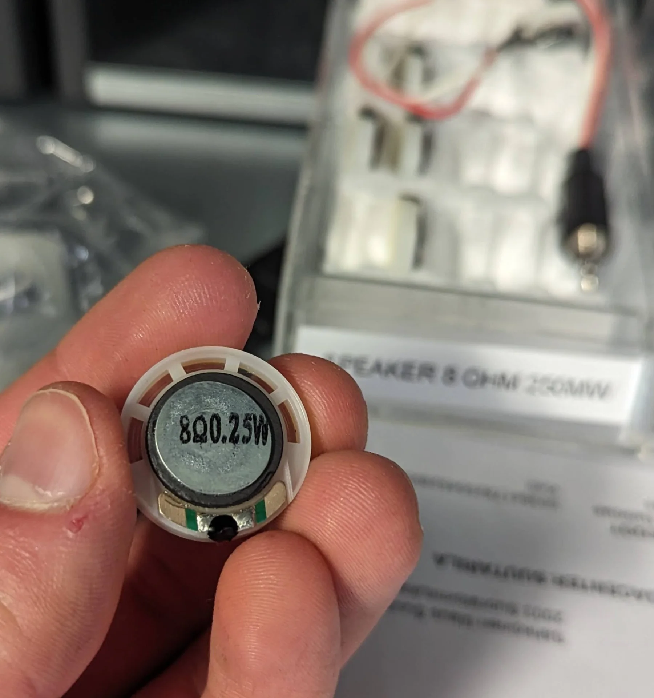

This week I faced my old nemesis once again; the NeoPixel LED strip. Nothing in electronics has caused me nearly as much headache as them. When creating the [networking bracelet prototypes](https://www.linkedin.com/posts/miro-keimi%C3%B6niemi_now-that-school-is-over-for-the-year-ill-activity-7143994838173089792-r3KP?utm_source=share&utm_medium=member_desktop), we could not find a single small development board in the entire [Aalto school of electrical engineering](https://www.aalto.fi/en/school-of-electrical-engineering) that would support both FastLED or NeoPixel arduino libraries and bluetooth communications. Both Arduino Nano 33 BLE and Nano 33 IoT lacked the former whereas we apparently had the only esp32s (ESP 32-S2) that lacked the latter, forcing us eventually to opt for an Arduino Micro with a separate, external Bluetooth module. 

As recently as just last week I had opted out of using them in favor of standard LEDs due to unnecessary complexity where each NeoPixel would have needed its own capacitor and my first attempt at wiring all of it got very nasty. However, I could no longer run but had to finally confront it head first due to their central importance for my final project. I had gotten away with powering them directly with 3.3V from the Arduino Micro with the networking bracelet prototype due to how few we needed to use but I could not risk operating even slightly outside of specification when I would need probably closer to a hundred instead of only few and so I spent the  vast majority of output week wrestling with how to drive 5V CMOS LED strips with 3.3V logic, all of which will be delved into and explained more deeply below.

## Assignments

- Add an output device to a microcontroller board you've designed, and program it to do something. 
- If you have not produced and tested a board in the Electronics Design week yet, you can improve its design to include an output device and produce one working board for both of the weeks (Electronics Design and Output Devices).
- Include a hero shot and source files of your board in your documentation (such as KiCad project and Arduino test code).

## Outputting audio

On the surface, my final project is a gesture controlled lamp, which sounds interesting and somewhat unique in its particular form but also relatively simple to make, but my true underlying motivation was to create a wake-up lamp capable of simulating a sunrise and with a unique spin to it. However, I am a very heavy sleeper and need something in addition to just light, even if it is shining straight at my face from up close. My idea is therefore to also have a speaker inside that plays, for example, nature noises and gets louder at the same rate as the sunrise gets brighter and whiter for a gradual, gentle wakeup.

I thus started by trying out a small speaker, which was delightfully straigthforward to use in comparison to the NeoPixel LEDs. I took one which already had an adapter and just plugged it to a laptop to hear what it would sound like. It was very quiet but reproduced the desired sound well. I then tried driving it using a microcontroller according to [documentation](https://github.com/kr15h/i2s_xiao-esp32c3) by our instructor.




I have now learned to always go with the exact parts discussed if they are available as hardware compatibility issues get a lot nastier and more annoying than software ones, where there usually exists workarounds. Therefore, I grabbed the [XIAO ESP32C3](https://wiki.seeedstudio.com/XIAO_ESP32C3_Getting_Started/), which I found to potentially be quite optimal as the main microcontroller of my entire final project upon further research for reasons further explained below. I then paired it with the [Adafruit MAX98357 I2S Class-D Mono Amp](https://learn.adafruit.com/adafruit-max98357-i2s-class-d-mono-amp/raspberry-pi-wiring) with a [2-pin screw terminal block](https://www.adafruit.com/product/724) soldered on it and a couple wires.

Before designing and soldering anyhting, I wanted to make sure that the documentation delivered on its promises and that all the components certainly worked. I connected the pins [as specified](https://github.com/kr15h/i2s_xiao-esp32c3) with the left side representing the XIAO ESP32C3 and the right the amplifier:

- GND -> GND
- 5V -> VIN
- D7 (GPIO20) -> LRC
- D6 (GPIO21) -> BCLK
- D5 (GPIO7) -> DIN

I connected the XIAO to my laptop and uploaded the [`SimpleTone.ino` example code](https://github.com/kr15h/i2s_xiao-esp32c3/blob/main/SimpleTone.ino) playin a consistent 440Hz. Even though the test setup was fiddly and fragile with wires pushed through holes and diagonally against their walls, the experiment was successful as can be heard below:



Since the last time I had edited a video for documentation, Microsoft had made it mandatory to register to [Clipchamp](https://clipchamp.com/en/) and so the above video was edited with [kdenlive](https://kdenlive.org/en/), which is an open-source video editing application that Neil Gershenfeld had recommended on the very first lecture if I remember correctly. The very basic operations and navigation felt pleasantly similar to [Adobe Premiere Pro](https://www.adobe.com/products/premiere.html), with which I am already intimately familiar with, although exporting was found under "Project" > "Render..." which caught me a bit off guard. Overall, however, I am much happier with it than Clipchamp. The tone produced by the contraption depicted above was again very quiet and hence I increased the gain of the audio in the clip to 1000%.

## Testing the LEDs

I tried testing the LED strip similarly for probably hours without result. I could not fathom what could possibly be wrong until I did some further research and discovered that, according to their [datasheet](https://cdn-shop.adafruit.com/datasheets/WS2812B.pdf), the input voltage level to a WS2812B strip has to be 0.7 times the power voltage in order to be registered as a 1 bit. As they are rated for 3.5V - 5.3V, I tried to power them with 5V but controlling them with 3.3V logic did not work because it is less than 0.7 * 5V = 3.5V and so the NeoPixels could not resolve the peaks of the PWM signal from the valleys, resulting in them not responding. 

I used two different kinds of LEDs, one of which was a NeoPixel [strip](https://www.adafruit.com/product/1138) and the other a [stick](https://www.adafruit.com/product/1426). My first goal was to try and test whether the NeoPixels work in the first place - and I had a heavy suspicion that at least one of them should as I tried out a few. As none of them lit up, however, I got to my abovementioned research. 


After discovering the difference between the [CMOS](https://en.wikipedia.org/wiki/CMOS) and [TTL](https://en.wikipedia.org/wiki/Transistor%E2%80%93transistor_logic) logic families, those being from the casual user's perspective mainly their input voltage requirements, I managed to diagnose the issue. With a great degree of simplification, the concept of a logic family relates to how logic gates are built physically in the circuit. What is interesting in terms of everyday usage, however, is that TTL (transistor-transistor logic) accepts "absolute" voltages such that the logic voltages are independent of the power voltage of a component, so that both 5V and 3.3V components recognize 2V logic, whereas CMOS (complementary metal-oxide-semiconductor) only accepts "relative" logic voltages, which must be at the least 0.7 times the power voltage of a component, meaning that a 3.3V device requires 2.31V logic input and a 5V device needs 3.5V logic input.

Herein lies the problem. I was initially trying to power them on with 5V and control them with 3.3V, which did not and - discovered with my newly found understanding - should not work. Even though, the strips are rated for 3.5V - 5.3V, I remembered successfully using them with 3.3V with the networking bracelet prototypes and so I tried it just to check that they were actually working. As can be seen below, this lit up the LED as expected.


The interesting part was then to see how this would look behind semi-transparent acrylic and whether it would be bright enough to be used as an actual lamp. After a quick test with just a single LED, this seemed indeed to be the case and I could feel good about proceeding with the NeoPixels - at least in terms of their brightness...


There were a few highly peculiar observations when testing. In order of increasing weirdness: the stick would light up momentarily every time the power wire was plugged to it even though it did not light up otherwise, my laptop occasionally complained about power surges on the USB port when testing the LEDs, even though they never lit up, and finally, every time this happened, my Bluetooth mouse stopped working until I put the laptop to sleep and reopened it while turning the mouse off and on. Most weirdly, however, my [Dexcom G6 glucose sensor's](https://www.dexcom.com/en-us/g6-cgm-system) transmitter, which was only connected to my phone via Bluetooth, was also disconnected and it never recovered. I had to prematurely change it to a new one because of the EMP I had somehow managed to create. It might of course be a weird coincidence but it would be quite weird indeed...


Using a lower voltage seemed to work but this felt wrong. One would imagine that RGB LEDs are still one of the simplest output devices out there. Why should you have to drive them out of spec on so many microcontrollers? There had to be a better way. The question was then: how to step up the input voltage?

### Level shifting exploration

After extensive search, which started from this [Arduino forum post](https://forum.arduino.cc/t/neopixels-will-not-work-on-xiao-esp32c3-but-will-on-uno/1137392), I found a couple possible solutions: using components called 74HCT125, 74HC14 or 74HCT04, none of which we had at our lab, or creating a custom circuit using MOSFETs. The closest to the beforementioned components, at least in name, was the [74HC164D,653 8-bit serial-in/parallel-out shift register](https://assets.nexperia.com/documents/data-sheet/74HC_HCT164.pdf) but it did not sound like the right thing and I could not figure out if it could do the job or no due to my utter lack of all electronic circuits intuition and poor understanding of datasheets. I cannot even figure out all the components and connections of most example circuits with familiar sounding labels but incomprehensible and unexplained subscripts.

You cannot build circuits with components you do not have and thus I dove head-first into the MOSFET route. MOSFETs (Metal-Oxide-Semiconductor Field-Effect Transistor) are a type of [transistor](https://en.wikipedia.org/wiki/Transistor#:~:text=A%20transistor%20is%20a%20semiconductor,connection%20to%20an%20electronic%20circuit.) analogous to variable resistors. Unlike current controlled "regular" BJT transistors, MOSFETs are voltage controlled. There are three pins: drain (D), gate (G) and source (S). When voltage is applied to gate (G), current flows from the drain (D) to the source (S). They can thus be used as programmable switches or amplifiers by connecting the drain (D) to a voltage source and the source (S) to ground. If the voltage source is larger than the voltage applied to the gate (G) pin, the MOSFET acts effectively as an amplifier, outputting higher voltage signal than the logic input, which was exactly what I was looking for. 


[Here](https://www.youtube.com/watch?v=J4oO7PT_nzQ) is a [great video about transistors in general](https://www.youtube.com/watch?v=J4oO7PT_nzQ) and [here](https://www.youtube.com/watch?v=GrvvkYTW_0k) is a shorter, simpler explanation on [N-channel MOSFETs](https://www.youtube.com/watch?v=GrvvkYTW_0k) specifically, which are the most common type. The datasheet for the N-channel logic level MOSFETs can be found [here](https://www.onsemi.com/pdf/datasheet/nds355an-d.pdf).

While a relatively simple component, their actual usage was not quite as obvious. I searched for model circuits and found a wide range of variants. [Many](https://forum.arduino.cc/t/neopixels-will-not-work-on-xiao-esp32c3-but-will-on-uno/1137392) [have](https://forums.adafruit.com/viewtopic.php?t=166684) [had](https://forum.arduino.cc/t/shift-register-output-voltage/65511) [similar issues](https://www.reddit.com/r/arduino/comments/4wxz05/neopixel_on_33v_arduino_help/) to mine but none were definitively solved outside the [recommendation to use a 74AHCT125 level shifter](https://electronics.stackexchange.com/questions/593193/high-frequency-voltage-conversion-3-3v-control-of-neopixels), which I did not have access to during the few days I had. Another option would have been to step down the power voltage to the NeoPixels but this felt like giving up (something).

I jumped from [one](https://forum.arduino.cc/t/level-shifting-3-3v-to-12v-without-inversion/916694) [forum](https://forum.arduino.cc/t/solved-how-to-build-level-shifter-3-3v-to-24v/345469) [post](https://forum.arduino.cc/t/3-3v-to-5v-logic-level-shifter-using-transistors/117723) to the [next](https://electronics.stackexchange.com/questions/82104/single-transistor-level-up-shifter) trying to look for the one definitive answer to how to level-shift 3.3V logic to 5V for use with a NeoPixel strip but could not find one. I did finally discover a reasonable seeming logic level shifter circuit by "penguintutor" [here](https://www.penguintutor.com/electronics/mosfet-levelshift), but they said that the circuit is inverting but that it could be compensated for in software - but they never explained how. Not even on the program code page. 


I was confused as to how that would happen as according to my understanding, the amplified current was supposed to flow when a voltage was applied to the gate. Now that I look at it afterwards, it might be because the output is connected on the side of the voltage source and therefore, if the output is connected to something that is later connected to ground, the current flows by default. With this explanation, however, I do not see how opening another path to ground would then turn it off either... It would feel a lot more logical to have the output be connected to the ground end so that current flows through it only when voltage is applied to the gate. I also do not see how this alternative would be inverting. I continued searching for explanations and alternative circuits and stumbled upon the following pages:

- [https://hackaday.com/2016/12/05/taking-it-to-another-level-making-3-3v-and-5v-logic-communicate-with-level-shifters/](https://hackaday.com/2016/12/05/taking-it-to-another-level-making-3-3v-and-5v-logic-communicate-with-level-shifters/) 
  I originally learned about CMOS and TTL here and while it mentions a few types of level shifter circuits, they are really not explained at all.

- [https://www.newark.com/pdfs/techarticles/microchip/3_3vto5vAnalogTipsnTricksBrchr.pdf](https://www.newark.com/pdfs/techarticles/microchip/3_3vto5vAnalogTipsnTricksBrchr.pdf) This is where the 3.3V to 5V MOSFET circuit presented in the above link originates from but although important parameters for selecting the resistor's resistance, such as the switching speed of the input and the current consumption through the resistor, are considered, the actual functioning of the circuit is not explained and nothing is mentioned about inversion.

- [https://hackaday.com/2017/01/20/cheating-at-5v-ws2812-control-to-use-a-3-3v-data-line/](https://hackaday.com/2017/01/20/cheating-at-5v-ws2812-control-to-use-a-3-3v-data-line/)
  Here is some kind of a hack for creating a level shifter out of a "sacrificial" NeoPixel but I do not quite understand how exactly it works and it would probably not have been too pretty integration-wise. It is applied [here](https://todbot.com/blog/2017/01/12/crashspace-bigbutton-w-esp8266/).

- [https://electronics.stackexchange.com/questions/82104/single-transistor-level-up-shifter](https://electronics.stackexchange.com/questions/82104/single-transistor-level-up-shifter) Here is discussion about the simplest possible single-directional level shifter but the example was made with a BJT transistor and the discussion moved to impedances of devices on certain sides and I was lost.

- [https://forum.arduino.cc/t/3-3v-to-5v-logic-level-shifter-using-transistors/117723](https://forum.arduino.cc/t/3-3v-to-5v-logic-level-shifter-using-transistors/117723) Here I was introduced to the idea of chaining two NPN transistors one after another, allegedly inverting the signal twice (still don't know where the inversions come from) to output an amplified, non-inverted signal.

- [https://maker.pro/custom/tutorial/how-to-use-a-logic-level-shifter-circuit-for-components-with-different-voltages](https://maker.pro/custom/tutorial/how-to-use-a-logic-level-shifter-circuit-for-components-with-different-voltages) Here is an even more complicated version of the above using two different types of transistors.

- [https://learn.sparkfun.com/tutorials/bi-directional-logic-level-converter-hookup-guide/all#board-overview](https://learn.sparkfun.com/tutorials/bi-directional-logic-level-converter-hookup-guide/all#board-overview) Here is Sparkfun's Bi-Directional logiv level converter circuit.

- [https://forum.arduino.cc/t/solved-how-to-build-level-shifter-3-3v-to-24v/345469](https://forum.arduino.cc/t/solved-how-to-build-level-shifter-3-3v-to-24v/345469) Here is some of the most extensive discussion I found on the topic amd some of the best circuit diagrams, one of which I ended up using. A lot of the discussion I cannot follow, however, as a lot of background knowledge is assumed, which I simply do not have.

- [https://forum.arduino.cc/t/level-shifting-3-3v-to-12v-without-inversion/916694/5](https://forum.arduino.cc/t/level-shifting-3-3v-to-12v-without-inversion/916694/5) Here is some additional discussion on the topic still.

Below are some of the circuit diagrams found on these pages:


They certainly do seem to share a common theme but no two were quite the same. Simplicity would obviously be preferred and so I tried to look into the possiblity of inverting the signal in software too but this was quickly shot down on the [FastLED forums](https://www.reddit.com/r/FastLED/comments/suwld0/how_can_i_invert_my_signal/). Furthermore, a [general sentiment](https://www.reddit.com/r/FastLED/comments/cdkkwe/possibly_to_invert_the_output/) seemed to be that no level-shifting should usually even be necessary. Even [Adafruit's NeoPixel Überguide](https://learn.adafruit.com/adafruit-neopixel-uberguide/logic-level) mirrored this sentiment but it appears that my components were then really at the very opposite ends of the tolerances as they would not play ball - just my luck. On [espressif forums](https://www.esp32.com/viewtopic.php?t=9041) there was a suggestion to invert the output on the GPIO pin definition level but this did not work at least quickly either.


## Board design

As already mentioned above, this week I used the [XIAO ESP32C3](https://wiki.seeedstudio.com/XIAO_ESP32C3_Getting_Started/) board due to it being used in the audio output example but also because of its future-proof networking capabilities. Some of its most important specs are listed below.

[Seeed Studio XIAO ESP32C3](https://wiki.seeedstudio.com/XIAO_ESP32C3_Getting_Started/)

- ESP32-C3 32-bit RISC-V singlecore processor running at up to 160MH
- 4MB of onboard flash memory
- 400KB of SRAM
- 11 digital (PWM) I/O pins, 4 of which also analog (working voltage 3.3V)
- 1 I2C interface
- 1 SPI interface
- 2 UART interfaces
- Complete Wi-Fi subsystem complying with IEEE 802.11b/g/n protocol supporting Station, SoftAP and promiscuous modes, with first two simultaneously too
- Cryptographic hardware accelerators supporting AES-128/256, Hash, RSA, HMAC, digital signature and secure boot
- Bluetooth LE subsystem supporting Bluetooth 5 and mesh
- Type-C power supply and downloading interface
- 3.3V/5V DC power
- 5V output pin supports also input with a diode


For the board design, I decided to just try as many ways of driving the LED strips as possible, while also integrating the audio interface as the latter was relatively straightforward, hopefully giving me some sense of accomplishment even if none of the ways to drive the LEDs would work. I opened KiCad and got to work similarly to [last week]().

This time, after struggling with the research for securing parts before the Fablab would be deserted again, I got access to the blue cabin after-hours too and so did not have to stock up on components as frantically as last week. This was really good as it allowed me not to have to rush my research. Ultimately it lead me to many places but few conclusions. I ended up with more questions than I started with and so, taking Kris's advice after getting a green light for the single-MOSFET configuration, I decided to just experiment with all the most promising ones.

I had also originally planned on integrating a power source too with the help of [this](https://www.temposlighting.com/guides/power-any-ws2812b-setup) tutorial. The 150 NeoPixels for which the power consumption is calculated seems like a reasonable starting point for me too. I was very surprised to see it adding up to 9 Amps though! With a bit of a safety margin, each individual LED color consumes approximately 20mA of current, adding up to a maximum of 60mA per pixel, which does add up quite quickly. The same number of LEDs can, however, be run at a slighlty lesser brightness as well, which quickly decreases power consumption. The initial power delivery system using a Schottky diode as recommended in the [XIAO wiki](https://wiki.seeedstudio.com/XIAO_ESP32C3_Getting_Started/) and a 500µF capacitor between the terminals as recommended in the [Best Practices](https://learn.adafruit.com/adafruit-neopixel-uberguide/best-practices) section of the Adafruit NeoPixel Überguide is depicted below. I eventually scrapped it for the final board as I wanted to use it for programming the LEDs and testing out the connections with the 5V pin as the source without the risk of damaging my computer.


Below is the final schematic without the power solution. It can be found [here](https://gitlab.com/miro.keimioniemi/digital-fabrication-portfolio/-/tree/main/content/post/week-9/program_leds/xiao_esp32c3?ref_type=heads) under `content/post/week-9/program_leds/xiao_esp32c3` as opposed to `content/post/week-9/xiao_esp32c3` which contains the schematic with power delivery but without the PCB layout.


In the left bottom corner, there is the microcontroller, a vertical SMD header for an I2C connection, everything related to the audio output and a couple of 0 resistance resistors for jumping over wires in the PCB layout, which could not be avoided this time. On the right there are four horizontal connectors for LED strips with circuits of decreasing complexity preceding them from top to bottom. 

The top one attempts to be a non-inverting level shifter inspired by the circuits under level shifting exploration. by combining two allegedly inverting circuits in series. The next one is a single level shifter as I wanted to see whether it would really invert anything, and if it did, how would it look like? Would there be software remedies? The second-to-lowest one has a voltage divider before it, aiming to to reduce the voltage to around 5 * 4500 / (4500 + 500) = 4.5V using 500 and 4500 Ohm resistors so that the control logic threshold for a 1 bit is less than 3.3V at 0.7 * 4.5 = 3.15 but the power voltage is still within spec. The last one uses a 3.3V power input as well as the final failsafe. The resistance values for the level shifters were simply copied from the first circuit I saw as many of the later ones had simply omitted concrete values.

Below is the kind of cool looking PCB layout for the board. The thick power track was created a design exercise in anticipation of the power source and 150 NeoPixels drawing 9A of current. The trackwidth required for each level of current can be looked up from [the table here](https://www.multi-circuit-boards.eu/en/pcb-design-aid/surface/conductor-ampacity.html), where 3.0mm can easily handle the 9A current. 


Even though the power track is wide, there is an issue in that the ground is not equally uniform in terms of width in all places. This is hopefully alleviated by the fact that the entire copper area is ground and there are thus many places to go and lots of surface area for heat to dissipate but the ground connections should also at least add up to being sufficiently wide too. Not a problem for this board but for future ones that actually draw significantly more current this has to be considered. Also, if I would "only" use 100 NeoPixels, the thickness required would already drop to 1.5mm which is a lot more manageable and if I don't run them at maximum brightness, it will quickly decrease a lot more.

All the `.grb` files and KiCad project files can be found from the repository [here](https://gitlab.com/miro.keimioniemi/digital-fabrication-portfolio/-/tree/main/content/post/week-9/program_leds/xiao_esp32c3) under [`content/post/week-9/program_leds/xiao_esp32c3`](https://gitlab.com/miro.keimioniemi/digital-fabrication-portfolio/-/tree/main/content/post/week-9/program_leds/xiao_esp32c3).

## Milling and soldering

I used the same copper sheet as last week, with different double-sided tape and again I faced issues with milling. It started out fin in the corner but as it neared the center of the sheet, it did no mill deep enough. I fixed this by moving the bit to the area where it had not properly milled, set it down in there and then lifted it up with a couple hundreths of a millimeter and I ended up with a nicely milled board and still a whole, functioning bit this time.


The PCB design rules checker (DRC) had complained about an error with the description of "Annular width (board setup contraints min annular width 0,1000 mm; actual 0,01)". I had ignored this as it was just about extrusions at the bottom of the [3.5mm audio jack](https://www.cuidevices.com/product/resource/sj-352x-smt.pdf) and I had checked that the drill bit fits inside it. And indeed, they were successfully drilled through, although the irrelevant copper border had not survived, and the jack fit fine.

I then soldered on the components and was quite proud about managing to do so even with the MOSFETs as their footprints were ridiculously small. They aren't the cleanest joints of all time but they were relatively smooth and well constrained to their infinitesimally small footprints. I have a memory of possibly breaking a leg in both of the top MOSFETs upon slightly turning them but I managed to add the best solder at those points exactly so they should not cause trouble.

I also learned to not save the flux but actually push the pen in a bit, which releases more. Then, making sure my solder iron stayed impeccably clean and glowing at all times, I pre-heated the pads a bit and then steadily pushed the solder against the pad and the soldering iron at an approximately 45° angle which created beautiful joints every time it worked.


One more note of interest which I learned is also the numbering scheme of the SMD resistors, where the first three digits give the first three digits of the resistance value and the final fourth digit gives the number of zeroes after them, translating 4990 into 499 and 4991 into 4990 for example. The only resistors which had the exact value I had specified were the 0 bridges. For all the others, I chose the next closest one: 500 -> 499, 4500 -> 4990 and 2200 -> 2940.


## Testing the board

### LED strip connectors

I tested all the four LED connectors by plugging in the LED strip and uploading the following modified blink test code onto the XIAO ESP32C3 with the `DATA_PIN` redefined separately for each:

```C
#include <Arduino.h>
#include <FastLED.h>
 
#define NUM_LEDS 6
 
#define DATA_PIN D8
#define CLOCK_PIN 13
 
CRGB leds[NUM_LEDS];
 
void setup() {
    Serial.begin(9600);
    FastLED.addLeds<NEOPIXEL, DATA_PIN>(leds, NUM_LEDS); 
    FastLED.setBrightness(5);
}
 
void loop() { 
  leds[0] = CRGB::Red;
  leds[1] = CRGB::Red;
  leds[2] = CRGB::Red;
  leds[3] = CRGB::Red;
  leds[4] = CRGB::Red;
  leds[5] = CRGB::Red;
  FastLED.show();
  delay(500);

  leds[0] = CRGB::Black;
  leds[1] = CRGB::Black;
  leds[2] = CRGB::Black;
  leds[3] = CRGB::Black;
  leds[4] = CRGB::Black;
  leds[5] = CRGB::Black;
  FastLED.show();
  delay(500);

  Serial.println("Hello World");
}
```

Two of the connectors with the simplest circuits, those being the 3.3V power input + 3.3V logic and 5V voltage divider + 3.3V logic, worked such that the LED strips actually lit up, whereas neither one of the mosfet circuits worked. The pins were not also mapped so that `0` would be the same as `D0`, which I figured out by just iterating them throuhg until the 5V voltage divider one did light up after all. The same did not happen with the MOSFETs however. I also realized that I can actually use the `D` pin definitions in the code but this did not help either.


As said, the two simplest circuits worked but there was a very peculiar issue with them both. Can you see what is wrong in the picture? All LEDs are supposed to be red but only a couple of them actually are. The only explanation I can come up with is that I don't have the correct LED strip variant selected. I tried a few, including NeoPixel, WS2812B, WS2812 and WS2811 and although these sometimes changed the colors a bit, they were not correct either. I also noticed that some LEDs seemed to address the individual LEDs inside the pixel instead of the pixel as a whole, which gives another clue to this puzzle. 

Another peculiar occurence was that sometimes the LEDs flash at the correct brightness and sometimes as much brighter. Due to the lack of time and this not being the final output board anyway due to excess complexity and broken parts, I decided to not debug the software further now. Instead, I would order a couple of meters of 60-LEDs-per-meter strip and then work with that when I would know what exactly I was actually working with.

The most important test and the very purpose of this week's board, however, was to see whether the light from the NeoPixels could actually look good through the acrylic. While the colorscheme may not be exactly coherent possibly due to the issues pondered above, there is certainly great potential. The below picture is captured at a brightness level of 220/255 with the weird color pattern that is produced when setting all pixels red.


### Audio output

Even though the audio output was supposed to be the easy, straightforward part, it appears I had miswired it. I had wired it according to the diagram below, which claims the tip to be left audio, the ring (middle) to be right audio and the sleeve (bottom) to be ground. 


I had wired the components according to this without questioning but it turned out during testing that, for my speaker at least, one of the wires should be wired to the tip and the other to the sleeve (which in the above picture is labeled "Ground"), not the ring (labeled "Right Audio"). This I discovered by the below code producing no sound when the speaker was plugged into the socket. However, when I touched the abovementioned parts with the wires separately, the expected noise was produced. This means that either someone has wired the jack funnily or then one should not blindly believe everything they read on the internet, no matter how simple seeming. Next time I shall remember to conduct even more testing, even on the seemingly easy and straightforward parts.

The code used for the audio test was the following, modified for the board, from Kris's example repository:

```C
#include <Arduino.h>
/*
 This example generates a square wave based tone at a specified frequency
 and sample rate. Then outputs the data using the I2S interface to a
 MAX08357 I2S Amp Breakout board.

 I2S Circuit:
 * XIAO ESP32C3 (https://docs.espressif.com/projects/arduino-esp32/en/latest/api/i2s.html)
 * MAX08357:
   * GND connected GND
   * VIN connected 5V
   * LRC connected to pin D7 (GPIO20)
   * BCLK connected to pin D6 (GPIO21)
   * DIN connected to pin D5 (GPIO7)

 created 17 November 2016
 by Sandeep Mistry
 For ESP extended
 Tomas Pilny
 2nd September 2021
 For XIAO ESP32C3
 Krisjanis Rijnieks
 21 April 2023
 */

#include <I2S.h>
const int frequency = 440; // frequency of square wave in Hz
const int amplitude = 500; // amplitude of square wave
const int sampleRate = 8000; // sample rate in Hz
const int bps = 16;

const int halfWavelength = (sampleRate / frequency); // half wavelength of square wave

int32_t sample = amplitude; // current sample value
int count = 0;

i2s_mode_t mode = I2S_PHILIPS_MODE; // I2S decoder is needed
// i2s_mode_t mode = ADC_DAC_MODE; // Audio amplifier is needed

// Mono channel input
// This is ESP specific implementation -
//   samples will be automatically copied to both channels inside I2S driver
//   If you want to have true mono output use I2S_PHILIPS_MODE and interlay
//   second channel with 0-value samples.
//   The order of channels is RIGH followed by LEFT
//i2s_mode_t mode = I2S_RIGHT_JUSTIFIED_MODE; // I2S decoder is needed

void setup() {

  Serial.begin(9600);
  Serial.println("I2S simple tone");

  if (!I2S.setDataPin(D3)) {
    Serial.println("failed to set DATA, DATA OUT pin");
  }

  if (!I2S.setSckPin(D6)) {
    Serial.println("Failed to set SCK pin");
  }

  if (!I2S.setFsPin(D7)) {
    Serial.println("Failed to set FRAME SELECT pin");
  }

  if (!I2S.setSimplex()) {
    Serial.println("Failed to enter SIMPLEX mode");
  }

  // start I2S at the sample rate with 16-bits per sample
  if (!I2S.begin(mode, sampleRate, bps)) {
    Serial.println("Failed to initialize I2S!");
    while (1); // do nothing
  }
}

void loop() {
    if (count % halfWavelength == 0 ) {
      // invert the sample every half wavelength count multiple to generate square wave
      sample = -1 * sample;
    }

    if(mode == I2S_PHILIPS_MODE || mode == ADC_DAC_MODE){ // write the same sample twice, once for Right and once for Left channel
      I2S.write(sample); // Right channel
      I2S.write(sample); // Left channel
    }else if(mode == I2S_RIGHT_JUSTIFIED_MODE || mode == I2S_LEFT_JUSTIFIED_MODE){
      // write the same only once - it will be automatically copied to the other channel
      I2S.write(sample);
    }

    // increment the counter for the next sample
    count++;
}
```

As a side-note, there have been even more mysterious errors than "just" an unexplained EMP with my file explorer crashing multiple times and VS Code throwing Git errors upon trying to sync repositories. I am not quite sure who is at fault with the error but it has luckily gone away with the otherwise usually quite ineffective strategy of just waiting.


## Reflections

Finally caught up! Mostly anyway. And only for a little while before I will again be late due to the coming exam week. Documenting afterwards majorly sucks but it is also the only way I could get the circuits done in time. For this week, the main takeaway is really just frustration at how such seemingly trivial things can be so damn difficult. As the MOSFET level shifters did not work, I was first inclined to go with the voltage divider strategy for my final project, which would allow me to use a common 5V power supply. In the review session, however, our instructor mentioned that it might be risky with high currents as the resistors might give out. He then showed an [alternative level shifting circuit](https://karlpalo.gitlab.io/fablab2022/weekly/week14/), which was based on [his logic level shifting circuit](https://fabacademy.org/2018/labs/barcelona/students/krisjanis-rijnieks/assignments/week14/) that he had been hiding all this time. He said that he would also order some logic level shifter components, which sound the most interesting for me. I will still have to learn how to program circuits with power supplies without risk to my laptop or any wireless devices in the vicinity though.

The speaker test was a bit underwhelming too because I did not really get to try out the amplification and hear how loud it could get. The NeoPixels, however, look decent enough when positioned further from the acrylic so that I can proceed with the current plan of creating an ellipsoid out of acrylic with vacuum forming, processing it for even better light dispersion and "cloudy" look and using NeoPixels inside.

Takeaways of the week include: simplicity is key and do rapid prototyping more rapidly but still make sure to double-check and thoroughly test everything. Gotta embrace the contradictions! It is unfortunate how I did not have any time for further programming but I hope to get a bit more time in the next period when I will have only 2 courses instead of these 4. 
